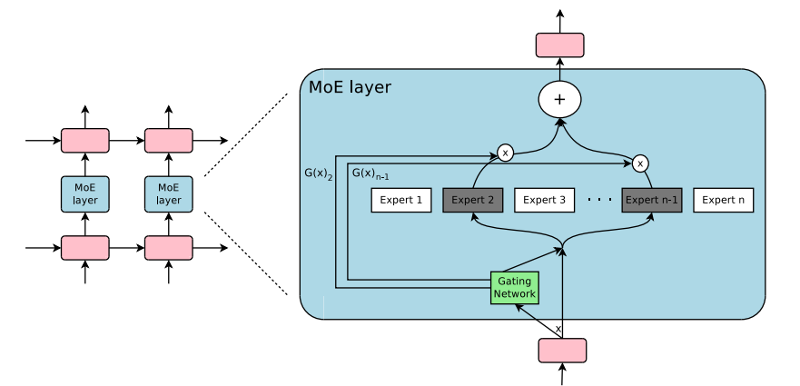

## Table of Contents

## What is Moe in the context of machine learning?

In machine learning, Moe stands for Mixture of Experts. It's a technique used to improve the performance of a model by combining the predictions of several smaller models, called experts. Each expert is trained to be good at handling a specific part of the data. A gating network then decides which expert's prediction to use for a new piece of data. This way, the overall model can make better predictions by using the strengths of different experts.

Think of it like a team of doctors. Instead of having one doctor who knows a little about everything, you have a team where each doctor specializes in a different area, like heart problems, skin issues, or brain health. When a patient comes in, a receptionist (the gating network) decides which doctor (expert) should see the patient based on their symptoms. This way, the patient gets the best care from the doctor who knows the most about their specific problem.

## How does Moe differ from traditional machine learning models?

Moe, or Mixture of Experts, is different from traditional machine learning models because it uses a team of smaller models, called experts, instead of one big model. Each expert is good at handling a specific part of the data. For example, if you're trying to predict the weather, one expert might be good at predicting rain, another might be good at predicting sunshine, and another might be good at predicting wind. A gating network then decides which expert's prediction to use for new data. This is like having a team of doctors where each doctor specializes in a different area of medicine, and a receptionist decides which doctor should see a patient based on their symptoms.

Traditional machine learning models, on the other hand, usually have one model that tries to handle all the data at once. For instance, a single [neural network](/wiki/neural-network) might try to predict the weather by learning patterns from all the data it sees. This can be less effective because the model has to be good at everything, which can be hard. In contrast, Moe can be more effective because it can use the strengths of different experts. This means that Moe can make better predictions by focusing on what each expert is good at, rather than trying to make one model good at everything.

## What are the basic components of a Moe model?

A Moe model, or Mixture of Experts, has two main parts: experts and a gating network. The experts are smaller models that each focus on a specific part of the data. For example, if you're trying to predict the weather, one expert might be good at predicting rain, another might be good at predicting sunshine, and another might be good at predicting wind. Each expert learns from the data it's good at, so it can make better predictions for that specific type of data.

The gating network is like a receptionist that decides which expert should handle a new piece of data. It looks at the new data and figures out which expert is the best fit. For example, if the new data is about a cloudy day, the gating network might send it to the expert that's good at predicting rain. The gating network makes this decision based on what it has learned from the data, so it can send the new data to the right expert.

Together, the experts and the gating network work as a team to make better predictions. The gating network helps by choosing the right expert for each piece of data, and the experts help by being good at their specific tasks. This way, the Moe model can make more accurate predictions than a single model that tries to handle all the data at once.

## Can you explain the concept of expert networks in Moe?

Expert networks in a Mixture of Experts (Moe) model are smaller models that focus on specific parts of the data. Imagine you're trying to predict the weather. Instead of having one big model that tries to predict everything, you have several smaller models, or experts. One expert might be really good at predicting rain, another might be good at predicting sunshine, and another might be good at predicting wind. Each expert learns from the data it's good at, so it can make better predictions for that specific type of data.

The gating network in a Moe model decides which expert should handle a new piece of data. It's like a receptionist at a doctor's office. If a patient comes in with a skin problem, the receptionist sends them to the dermatologist. Similarly, if the new data is about a cloudy day, the gating network might send it to the expert that's good at predicting rain. The gating network makes this decision based on what it has learned from the data, so it can send the new data to the right expert. This way, the Moe model can make more accurate predictions by using the strengths of different experts.

## How is the gating network used in Moe?

The gating network in a Mixture of Experts (Moe) model is like a smart receptionist that decides which expert should handle a new piece of data. Imagine you're at a doctor's office with different specialists. If you have a skin problem, the receptionist sends you to the dermatologist. Similarly, the gating network looks at the new data and decides which expert is the best fit. For example, if the new data is about a cloudy day, the gating network might send it to the expert that's good at predicting rain.

The gating network makes its decision based on what it has learned from the data. It uses this knowledge to figure out which expert will give the best prediction for the new data. This way, the Moe model can make more accurate predictions by using the strengths of different experts. The gating network helps the model focus on what each expert is good at, rather than trying to make one model good at everything.

## What are the advantages of using Moe over other machine learning techniques?

Using a Mixture of Experts (Moe) model can be better than other [machine learning](/wiki/machine-learning) techniques because it breaks down a big problem into smaller, easier parts. Instead of having one big model that tries to do everything, Moe uses several smaller models called experts. Each expert is good at handling a specific part of the data. For example, if you're trying to predict the weather, one expert might be good at predicting rain, another might be good at predicting sunshine, and another might be good at predicting wind. This way, the overall model can make better predictions by using the strengths of different experts.

Another advantage of Moe is that it can adapt to new data more easily. The gating network in a Moe model decides which expert should handle a new piece of data. It's like a smart receptionist that sends you to the right doctor based on your symptoms. If the new data is about a cloudy day, the gating network might send it to the expert that's good at predicting rain. This means that the Moe model can make more accurate predictions by focusing on what each expert is good at, rather than trying to make one model good at everything.

## What types of problems are best suited for Moe?

Moe, or Mixture of Experts, works best for problems where the data can be split into different parts, and each part can be handled by a smaller model. Imagine you're trying to predict the weather. Instead of having one big model that tries to predict everything, you can have several smaller models. One model might be good at predicting rain, another might be good at predicting sunshine, and another might be good at predicting wind. This way, each model can focus on what it's good at, and the overall prediction can be better.

Moe is also good for problems where the data is changing a lot, and you need a model that can adapt quickly. The gating network in a Moe model is like a smart receptionist that sends new data to the right expert. If the new data is about a cloudy day, the gating network might send it to the expert that's good at predicting rain. This means that the Moe model can make more accurate predictions by focusing on what each expert is good at, rather than trying to make one model good at everything.

## How do you train a Moe model effectively?

Training a Moe model effectively involves training both the experts and the gating network. Start by dividing your data into different parts, so each expert can focus on a specific type of data. For example, if you're predicting the weather, one expert might learn from data about rain, another from data about sunshine, and another from data about wind. You train each expert on its specific part of the data, so it can make good predictions for that type of data. At the same time, you train the gating network to recognize which expert should handle new data. The gating network looks at the new data and decides which expert is the best fit, like a smart receptionist sending you to the right doctor.

Once you have trained the experts and the gating network separately, you can fine-tune the whole Moe model together. This means you let the gating network and the experts work together on the data, adjusting their predictions to make them more accurate. You can use a loss function to measure how well the Moe model is doing and adjust the model to minimize this loss. For example, if the Moe model is predicting the weather, the loss function might measure how far off the predictions are from the actual weather. By fine-tuning the model, you can make the experts and the gating network work better together, leading to more accurate predictions overall.

## What are common challenges faced when implementing Moe?

One common challenge when implementing a Mixture of Experts (Moe) model is figuring out how to split the data correctly among the experts. If the data is not split well, the experts might not be able to learn their specific parts effectively, which can make the whole model less accurate. For example, if you're predicting the weather and you don't give the rain expert enough data about rainy days, it won't be able to make good predictions about rain. Another challenge is training the gating network to make good decisions about which expert should handle new data. If the gating network doesn't learn well, it might send new data to the wrong expert, which can also hurt the model's accuracy.

Another challenge is the complexity of training a Moe model. Since you have to train multiple experts and a gating network at the same time, it can take a lot of computational power and time. You need to make sure each expert is learning from its part of the data, while also making sure the gating network is learning to send new data to the right expert. This can be tricky to manage, especially if you have a lot of data or a lot of experts. Fine-tuning the whole Moe model to work well together can also be challenging, as you need to balance the learning of all the parts to minimize the overall loss.

## How can Moe be scaled for large datasets?

Scaling a Mixture of Experts (Moe) model for large datasets can be done by using more powerful computers and smart ways to split the data. If you have a lot of data, you need a computer that can handle it all at once. You can also use special techniques to split the data into smaller parts, so each expert can learn from its part without taking too long. For example, if you're predicting the weather, you can split the data into different regions or time periods, so each expert can focus on a smaller piece of the puzzle.

Another way to scale Moe for large datasets is to use a technique called distributed training. This means you use many computers at the same time to train different parts of the model. Each computer can work on training one expert or a part of the gating network, and then they can share their results to make the whole model better. This way, you can train a Moe model on a large dataset faster and more efficiently, without needing one super powerful computer.

## What are some advanced techniques to optimize Moe performance?

One advanced technique to optimize Moe performance is to use a method called "sparse gating." This means the gating network only chooses a few experts to handle each piece of data, instead of using all of them. By doing this, you can make the model faster and use less computer power. For example, if you're predicting the weather, the gating network might only send the data to the rain and wind experts, instead of all the experts. This can help the model focus on the most important parts of the data and make better predictions.

Another technique is to use "dynamic expert allocation." This means the model can change which experts it uses based on the data it sees. For example, if the model starts seeing a lot of data about rain, it might decide to use more experts that are good at predicting rain. This way, the model can adapt to new data and make more accurate predictions. By using these advanced techniques, you can make your Moe model work better and handle more complex problems.

## Can you discuss recent research developments in Moe and their impact on the field?

Recent research in Mixture of Experts (Moe) has focused on making these models more efficient and effective. One big development is the use of sparse gating, which means the gating network only picks a few experts to work on each piece of data. This makes the model faster and uses less computer power. For example, researchers at Google used sparse gating in their Switch Transformers, which helped the model handle big datasets better. Another development is dynamic expert allocation, where the model can change which experts it uses based on the data it sees. This helps the model adapt to new data and make better predictions.

These developments have had a big impact on the field of machine learning. Sparse gating has made it possible to use Moe models on very large datasets, like those used in natural language processing and image recognition. This has led to better performance in these areas, as the models can focus on the most important parts of the data. Dynamic expert allocation has also helped Moe models be more flexible and adapt to changing data, which is important for real-world applications where data can change a lot over time. Overall, these research developments have made Moe models more practical and useful for a wide range of problems.