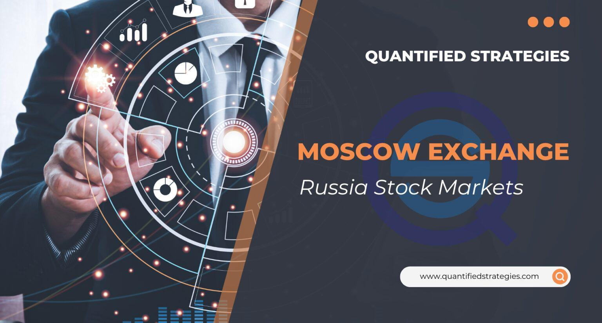

## Table of Contents

## What is the MOEX and what does it stand for?

The MOEX is a stock exchange in Russia. It stands for Moscow Exchange. It is the main place where people in Russia buy and sell stocks, bonds, and other financial products.

The Moscow Exchange was created in 2011 when two older exchanges, the MICEX and the RTS, joined together. This made it easier for people to trade and helped the Russian economy grow. Today, the MOEX is important for both Russian and international investors.

## How was the Moscow Exchange established and what is its history?

The Moscow Exchange, or MOEX, was created in 2011 when two older exchanges, the MICEX and the RTS, came together. Before this, the MICEX was started in 1992 right after the Soviet Union ended. It helped Russia move to a market economy where people could buy and sell things more freely. The RTS started a bit later in 1995 and was the first exchange in Russia to trade stocks in US dollars. Both exchanges grew over the years and helped Russia's financial markets grow too.

In 2011, the MICEX and RTS decided to merge to make trading easier and to make the Russian market stronger. They called the new exchange the Moscow Exchange, or MOEX. This new exchange helped more people invest in Russia and made it easier for companies to raise money. Today, the MOEX is a big part of Russia's economy and is important for both people in Russia and investors from other countries.

## What types of financial instruments are traded on the MOEX?

The Moscow Exchange, or MOEX, trades many types of financial instruments. You can find stocks there, which are shares in companies. People buy and sell these shares to own a part of the company. Bonds are another type of instrument traded on the MOEX. Bonds are like loans that people give to the government or companies, and they get paid back with interest over time.

Besides stocks and bonds, the MOEX also trades things like currencies and futures. Currencies are different kinds of money, like dollars or euros, and people trade them to make money from changes in their value. Futures are agreements to buy or sell something at a set price in the future. They can be used to guess how prices might change or to protect against price changes. All these instruments help people invest and manage their money on the MOEX.

## How does one start trading on the Moscow Exchange?

To start trading on the Moscow Exchange, you first need to open a brokerage account. A brokerage account is like a special bank account that lets you buy and sell stocks, bonds, and other financial products. You can choose a broker that works with the MOEX. Some popular brokers in Russia are Sberbank, Tinkoff, and VTB. You'll need to fill out some forms and maybe show some ID to open your account. Once your account is open, you can put money into it to start trading.

After you have your brokerage account set up and funded, you can start trading. You can use the broker's website or app to see what's available on the MOEX and to make your trades. You can buy stocks, bonds, currencies, or futures, depending on what you want to invest in. It's a good idea to learn about the different financial instruments and maybe even practice with a demo account before you start trading with real money. This can help you feel more confident and make better decisions.

## What are the trading hours of the MOEX?

The Moscow Exchange, or MOEX, has different trading hours for different types of financial products. For stocks and bonds, the main trading hours are from 10:00 AM to 6:45 PM Moscow time, Monday through Friday. This is when most people buy and sell these products.

For currencies and futures, the trading hours are a bit different. They start at 7:00 AM and go until 11:50 PM Moscow time, from Monday to Friday. This longer time helps people trade these products at different times of the day.

## What are the main indices of the Moscow Exchange and what do they represent?

The Moscow Exchange has two main indices: the MOEX Russia Index and the RTS Index. The MOEX Russia Index is the most important one. It tracks the performance of the 50 biggest and most liquid stocks traded on the MOEX. These stocks come from different industries like energy, finance, and consumer goods. The index is measured in Russian rubles, which means it shows how well these companies are doing in terms of the local currency.

The RTS Index is similar, but it is measured in US dollars instead of rubles. This index also tracks the performance of the biggest Russian companies but shows their value in a way that's easier for international investors to understand. Both indices help investors see how the Russian stock market is doing overall. They give a quick snapshot of whether the market is going up or down and can help people decide where to invest their money.

## How does the MOEX contribute to the Russian economy?

The Moscow Exchange, or MOEX, plays a big role in helping the Russian economy grow. It does this by giving companies a place to raise money. When a company wants to grow, it can sell shares on the MOEX. People buy these shares and give the company money to use for new projects or to expand. This helps the company get bigger and create more jobs, which is good for the economy.

The MOEX also helps investors by giving them a safe place to buy and sell different financial products like stocks, bonds, and currencies. When people invest their money on the MOEX, it helps move money around the economy. This can help businesses grow and the economy to stay strong. Plus, because the MOEX is open to international investors, it brings money into Russia from other countries, which can also help the economy.

## What are the regulatory bodies overseeing the Moscow Exchange?

The Moscow Exchange is watched over by a few important groups to make sure everything is fair and safe. The main group is the Central Bank of Russia. They check that the MOEX follows all the rules and keeps the market safe for everyone. The Central Bank can make new rules or change old ones to help the MOEX work better.

Another group that helps watch the MOEX is the Federal Financial Markets Service, or FFMS. Even though the FFMS was closed in 2013, its job was taken over by the Central Bank. The Central Bank now does everything the FFMS used to do, like making sure companies tell the truth about their money and that people trading on the MOEX are treated fairly.

## How does the MOEX compare to other major global exchanges?

The Moscow Exchange, or MOEX, is a big player in the world of stock markets, but it's smaller than some of the biggest ones like the New York Stock Exchange (NYSE) and the NASDAQ. The NYSE and NASDAQ are in the United States and have more companies listed and more money traded every day than the MOEX. The MOEX is important for Russia, but it doesn't have as much impact on the world's economy as the NYSE or NASDAQ.

Compared to other European exchanges like the London Stock Exchange (LSE) or the Frankfurt Stock Exchange, the MOEX is also smaller. The LSE and Frankfurt have more international companies listed and attract more money from around the world. But the MOEX is growing and trying to make it easier for foreign investors to trade there. This could help it become more important in the future, but right now, it's still behind these other big exchanges.

## What technological infrastructure supports the operations of the MOEX?

The Moscow Exchange uses a lot of technology to make sure trading goes smoothly and safely. It has a main computer system called the Trading and Clearing System (TCS). This system helps people buy and sell stocks, bonds, and other things quickly and correctly. The TCS is connected to many different places so that everyone can trade at the same time. It also has strong security to stop people from cheating or making mistakes.

The MOEX also uses something called the Astana International Exchange (AIX) platform for some of its trading. This helps the MOEX work with other countries and makes it easier for people from around the world to trade. The MOEX keeps updating its technology to make it faster and safer. It also uses the internet and special software so that people can trade from their computers or phones.

## What are some recent developments or innovations introduced by the Moscow Exchange?

The Moscow Exchange has been working hard to make trading easier and safer for everyone. One big change they made is adding more ways to trade using new technology. They started using a new trading platform called the Astana International Exchange (AIX) platform. This helps people from different countries trade on the MOEX more easily. They also made it possible for people to trade using their computers or phones, which makes it more convenient.

Another important thing the MOEX did was to make their systems faster and safer. They updated their main computer system, the Trading and Clearing System (TCS), to handle more trades quickly and correctly. They also added better security to stop cheating and mistakes. These changes help make sure that when people trade on the MOEX, they can trust that everything is working well and their money is safe.

## What are the future prospects and challenges for the MOEX in the global financial market?

The Moscow Exchange, or MOEX, has a lot of potential to grow in the future. It is working on making it easier for people from other countries to trade there. By using new technology and working with other exchanges, like the Astana International Exchange, the MOEX can attract more international investors. This could make it a bigger player in the global financial market. The MOEX is also trying to make its trading systems faster and safer, which will help it keep up with other big exchanges around the world.

However, the MOEX faces some big challenges too. One of the main problems is that it is smaller than big exchanges like the New York Stock Exchange or the London Stock Exchange. This means it has less money traded every day and fewer big companies listed. Also, Russia's economy and politics can affect how much people want to invest there. If there are problems in Russia, it might make investors nervous about trading on the MOEX. But if the MOEX can keep improving and stay stable, it could still become more important in the global market.

## What is the MOEX Russia Index?

The MOEX Russia Index is a key indicator of market performance for the 50 largest and most liquid stocks on the Moscow Exchange. This index serves as a benchmark for assessing the overall health and trends of the Russian equity market. Being a capitalization-weighted composite index, it considers the market capitalization of its constituents, which means that companies with larger market values have a greater impact on the index’s performance.

The construction of the MOEX Russia Index involves selecting stocks based on their [liquidity](/wiki/liquidity-risk-premium) and market capitalization, ensuring that the index accurately reflects the underlying dynamics of the Russian economy. The sectors represented within the index are diverse, spanning industries such as energy, finance, manufacturing, telecommunications, and consumer goods. This diversity is crucial as it mirrors the broad spectrum of the Russian economic landscape, providing investors with a comprehensive snapshot of market performance.

The capitalization-weighted approach used in constructing the MOEX Russia Index can be mathematically represented as follows:

$$

\text{Index level} = \frac{\sum_{i=1}^{n} P_i \times Q_i \times F_i}{\text{Divisor}} 
$$

Where:
- $P_i$ is the price of stock $i$
- $Q_i$ is the number of outstanding shares of stock $i$
- $F_i$ is the free float factor, reflecting the proportion of the shares that are readily available for trading
- $n$ is the total number of stocks in the index
- The Divisor is an adjustment factor maintained by the index provider to ensure that external events (e.g., stock splits, dividends) do not distort the index's value.

This structured approach ensures that the index remains an accurate reflection of the market's movements, accounting for changes in stock prices and corporate actions. Regular reviews and adjustments keep the MOEX Russia Index aligned with market developments, making it an essential tool for investors and analysts monitoring the Russian stock market. In this manner, the index not only offers a proxy for the performance of major Russian companies but also acts as a barometer for the economic sentiment within the country.

## References & Further Reading

[1]: Troika Dialog. (2011). ["The Merger of MICEX - RTS: Creating a Unified Exchange for Russia."](https://sputnikglobe.com/20110629/164904906.html)

[2]: Lopez de Prado, M. (2018). ["Advances in Financial Machine Learning."](https://www.amazon.com/Advances-Financial-Machine-Learning-Marcos/dp/1119482089) Wiley.

[3]: Jansen, S. (2020). ["Machine Learning for Algorithmic Trading."](https://github.com/stefan-jansen/machine-learning-for-trading) Packt Publishing.

[4]: Aronson, D. R. (2007). ["Evidence-Based Technical Analysis: Applying the Scientific Method and Statistical Inference to Trading Signals."](https://onlinelibrary.wiley.com/doi/book/10.1002/9781118268315) Wiley.

[5]: Chan, E. P. (2009). ["Quantitative Trading: How to Build Your Own Algorithmic Trading Business."](https://github.com/ftvision/quant_trading_echan_book) Wiley Trading.

[6]: Hargrave, M. (2021). ["Moscow Exchange (MOEX)."](https://fs.moex.com/files/22938) Investopedia. 

[7]: Bank of Russia (2021). ["The Monetary Policy Guidelines for 2021-2023."](https://cbr.ru/Content/Document/File/112393/on_2021_eng.pdf) Central Bank of the Russian Federation.

[8]: Jones, C. M. (2013). ["What Do We Know About High-Frequency Trading?"](https://papers.ssrn.com/sol3/papers.cfm?abstract_id=2236201) Journal of Financial Markets.