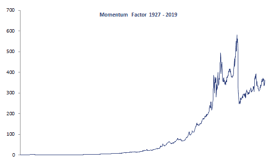

Momentum in financial markets refers to the tendency of securities to continue moving in the same direction—be it upward or downward—for a sustained period. It is the principle that assets which have performed well in the past, relative to their market, are likely to continue outperforming, and vice versa for poorly performing assets. This phenomenon has been observed in various markets and asset classes, leading to the development of momentum-based trading strategies and investment models.

The concept of momentum has its roots in the Newtonian physics principle that objects in motion tend to stay in motion unless acted upon by an external force. Translated into market terms, once a market trend is established, it is more likely to continue than to reverse. This idea was largely ignored by the academic community until the early 1990s when it gained traction through empirical research that validated its existence and potential profitability.

One of the seminal works in momentum investing is Jegadeesh and Titman's 1993 study, which found that stocks that performed well over the past three to twelve months continued to do so in the following period, generating significant abnormal returns. This groundbreaking research not only gave credence to momentum strategies but also challenged the Efficient Market Hypothesis, which argues that asset prices fully reflect all available information and thus, consistently outperforming the market through any strategy, including momentum, should be impossible.

Since then, the momentum factor has become an integral part of financial analysis and strategy development, with further studies and models, such as the Carhart Four-Factor Model, incorporating it alongside other established factors such as market risk, size, and value.

For those looking to deep dive deeper into the academic perspective on momentum, Carhart's 1997 paper, "On Persistence in Mutual Fund Performance," and the works of Fama and French, particularly their research on common risk factors in the returns on stocks and bonds, are essential reading. These studies are available through academic databases and provide a quantitative backing to the concept of momentum, making it a mainstay in both theoretical finance and practical investment strategy.

## Table of Contents

## What is Momentum?

Momentum, within investing, refers to the phenomenon where securities that have performed well in one period continue to perform well in the subsequent period, and conversely, securities that have performed poorly continue to perform poorly. This persistence in performance can be observed in various time frames, ranging from months to years, and is a widely recognized [factor](/wiki/factor-investing) influencing stock prices.

Price [momentum](/wiki/momentum) and [earning](/wiki/earning-announcement)s momentum, while related, are distinct concepts. Price momentum focuses on the movement of stock prices. It is based on the idea that stocks with rising prices tend to continue their ascent, while those with falling prices tend to continue to decline. This type of momentum is purely technical and does not necessarily consider the underlying reasons for the price movements.

Earnings momentum, on the other hand, is based on the financial performance of a company. It occurs when a company’s earnings growth is accelerating or decelerating, and this change in earnings growth rate can lead to a corresponding change in stock price. The underlying belief is that if a company’s earnings are increasing at an increasing rate, the stock’s price will follow suit due to increased investor confidence and the prospect of future growth.

Both price and earnings momentum are underpinned by investor psychology and behavioral finance. Studies, such as those by Jegadeesh and Titman (1993), have provided empirical evidence supporting the existence of momentum as an anomaly that contradicts the efficient market hypothesis, which posits that stock prices fully reflect all available information[1].

Investors can measure momentum using various statistical methods, such as the rate of change in price or earnings over a specific period, or through technical indicators that compare the current closing price to previous closing prices. The relative strength index (RSI) and moving average convergence divergence (MACD) are two such tools commonly used to identify price momentum. For earnings momentum, analysts often look at changes in earnings estimates or the rate of earnings surprises.

While momentum is a powerful factor that can offer substantial returns, it is also subject to sudden reversals, which can lead to significant losses. As a result, understanding both the technical and fundamental drivers of momentum is crucial for investors aiming to capitalize on this phenomenon[2].

## The Theoretical Underpinnings of Momentum

Momentum, as an investing factor, is underpinned by a wealth of academic research that seeks to understand and quantify its impact on asset prices. The seminal work by Jegadeesh and Titman in 1993, which found that stocks that performed well over the past three to twelve months continued to do so in the following period, laid the foundation for momentum as a crucial aspect of modern financial theory. Their findings challenged the efficient market hypothesis by demonstrating that past price information could predict future returns to some degree.

This momentum anomaly is often attributed to behavioral finance principles, specifically the slow reaction of investors to new information and the subsequent overreaction. Behavioral economists argue that cognitive biases and emotional responses cause investors to underreact to news initially, leading to trends that continue until the market eventually overreacts, causing a reversal.

Further research into momentum includes the work of Daniel Kahneman and Amos Tversky, whose prospect theory suggests that people value gains and losses differently, leading to decision-making processes that can drive momentum. Additionally, the concept of herding, where investors follow the actions of others rather than their own analysis, can also amplify trends and create momentum.

From a psychological standpoint, the disposition effect, where investors are reluctant to sell losers but quick to sell winners, can contribute to momentum. This is because the reluctance to realize losses can prevent the market from correcting overvalued losers, while the eagerness to lock in gains on winners can lead to undervalued winners being sold too early.

In more recent years, researchers like Barberis, Shleifer, and Vishny have explored models of investor sentiment and its influence on momentum, suggesting that the initial underreaction and subsequent overreaction by investors to news are key drivers of momentum[3].

The academic dis[course](/wiki/best-algorithmic-trading-courses) on momentum is vast, with contributions from researchers like Kent Daniel, Sheridan Titman, and Tobias Moskowitz further expanding the understanding of momentum and its causes. These studies often involve complex mathematical models and statistical analysis, leveraging extensive datasets to validate the persistence of momentum over time and across markets[4].

## Measuring Momentum: The Momentum Factor

Quantifying the momentum factor involves measuring the rate of acceleration in a stock's price or earnings. Typically, this is done by looking at past returns over a specific period, often three to twelve months, excluding the most recent month to avoid short-term reversal effects. This period of past performance serves as the momentum indicator, with the assumption being that stocks that have performed well during this time are likely to continue their performance into the future.

The momentum score can be calculated using various methods, but a common approach is to rank stocks based on their past returns and then assign a momentum score accordingly. For instance, a decile approach might be used, where the top 10% of stocks with the highest past returns are given a score of 1 (highest momentum), and the bottom 10% are scored as 10 (lowest momentum).

Momentum is then used as a factor in a multi-factor model to predict future returns, with higher momentum scores indicating a higher expected return. This factor can be tested both on a standalone basis and in conjunction with other factors such as value, size (market capitalization), and quality (profitability and safety) to understand its unique contribution to a stock's performance.

Unlike value, which is based on the intrinsic worth of a stock compared to its current price, or size, which considers the company's market capitalization, momentum is purely based on price behavior. Quality, on the other hand, looks at the company’s financial health and often includes metrics like return on equity, debt to equity, and earnings variability. Momentum is unique in that it is predicated on the continuation of trends in price or performance.

Studies have shown that the momentum factor often has a low or negative correlation with these other factors, suggesting that it provides a distinct source of potential alpha in a diversified portfolio. For example, while value investing might focus on stocks that are currently undervalued by the market, momentum investing would focus on stocks that are already on an upward trajectory, regardless of their intrinsic value.

Fama and French added momentum to their famous three-factor model, which previously included size and value, to improve the model’s explanatory power. The resulting four-factor model, including the Carhart momentum factor, demonstrated that momentum indeed carries its own weight in explaining stock returns.

## The Carhart Four-Factor Model

The Carhart Four-Factor Model is an extension of the Fama and French Three-Factor Model, with momentum as the additional factor. This model was introduced by Mark Carhart in 1997 to assess the excess returns of mutual funds, accounting for the stock's market risk, its size, its book-to-market value, and finally, its momentum.

The momentum factor, often denoted as $MOM$, is calculated based on the past twelve months' return, excluding the most recent month. This exclusion helps to mitigate the short-term reversal effect that can affect the momentum factor's predictive power. The formula to calculate the momentum factor for a stock i at time t is often represented as:

$MOM_{i,t} = R_{i,t-2} - R_{i,t-12}$

where $R_{i,t-2}$ is the stock's return two months prior, and $R_{i,t-12}$ is the stock's return twelve months prior.

In the Carhart model, the momentum factor is used alongside the market excess return ($Rm - Rf$, where $Rm$ is the market return and $Rf$ is the risk-free rate), the size factor ($SMB$, small minus big), and the value factor ($HML$, high minus low book-to-market ratio) to explain the returns of a portfolio or fund. The model's regression equation is:

$R_{i,t} - R_{f,t} = \alpha + \beta_m (R_{m,t} - R_{f,t}) + \beta_s SMB_t + \beta_v HML_t + \beta_{mom} MOM_t + \epsilon_{i,t}$

Here, $R_{i,t} - R_{f,t}$ is the excess return of the asset over the risk-free rate, $\alpha$ is the asset's alpha or abnormal return, $\beta$ coefficients represent the sensitivities to the respective factors, and $\epsilon_{i,t}$ is the error term of the asset's return not explained by the model.

The Carhart Four-Factor Model is pivotal for investors and portfolio managers because it helps in understanding the different dimensions that can influence a stock's returns, beyond the market risk. The inclusion of momentum as a factor recognizes the tendency of securities to continue performing in line with their current trend over the medium term.

## Momentum in Various Asset Classes

Momentum is a pervasive force in financial markets, influencing not just stocks, but a spectrum of asset classes, including bonds, commodities, and even currencies. The principle underlying momentum is that assets which have performed well in the past tend to continue their performance in the future, at least in the short to medium term.

**Equities**

In equities, momentum is often captured through the performance of indices or individual stocks. For instance, studies have shown that stocks hitting 52-week highs have a tendency to continue outperforming. This trend is not just confined to the U.S. market but has been observed in markets globally, indicating a universal behavioral aspect to investing that transcends regional and asset boundaries.

**Fixed income**

When it comes to fixed income, momentum can be observed in yield movements. Bonds experiencing a declining yield trend (indicating rising prices) tend to continue that trend more than would be expected by chance. This can be particularly noted in government bonds, which are heavily influenced by macroeconomic trends and policy decisions.

**Commodities**

Commodity markets also exhibit momentum effects. A classic example is the oil market, where supply-demand imbalances, geopolitical tensions, and economic cycles can create strong trends. Traders often monitor moving averages and [breakout](/wiki/breakout-trading) points to gauge momentum in these markets.

**Currencies**

Currency markets, driven by vast economic forces and trade flows, also follow momentum. Carry trades, where investors borrow in a low-yielding currency to invest in a higher-yielding one, can ride momentum waves driven by [interest rate](/wiki/interest-rate-trading-strategies) differentials between countries.

## Momentum Trading Strategies

Momentum trading strategies capitalize on the continuation of existing market trends. They involve buying assets that have shown an upward price trend and selling those with a downward trend. The core belief behind these strategies is that assets moving strongly in a particular direction will continue to do so until the trend loses strength.

**Strategy 1**

One common approach to momentum trading is to focus on a specific look-back period, such as six to twelve months, excluding the most recent month. Traders rank assets based on their returns over this period and go long (buy) on the top percentiles while going short (sell) on the bottom percentiles. This strategy, rooted in historical data analysis, has been widely documented in academic literature, such as in Jegadeesh and Titman's landmark study, "Returns to Buying Winners and Selling Losers."

**Strategy 2**

Another strategy is to use moving averages, like the 50-day or 200-day moving average, as a signal for momentum. A cross above these levels may signal a buy, while a drop below could indicate a sell. This method is often combined with other technical indicators to filter out false signals and confirm the strength of the trend.

**Strategy 3**

A more sophisticated momentum strategy involves sector rotation, where traders move capital to the strongest sectors in the market and away from the weakest ones, based on momentum signals. This requires a more nuanced understanding of market dynamics and sector-specific drivers.

In recent years, with the advancement of technology, momentum trading has also embraced algorithmic methods. For instance, Python's `[backtrader](/wiki/backtrader)` library allows traders to test and implement complex momentum trading strategies with historical data. It enables the automation of trade execution based on momentum signals, which can be particularly useful in fast-moving markets.

However, momentum trading is not without risks. Strategies must be backtested and adjusted for different market environments to manage potential drawdowns. The implementation of momentum strategies requires strict discipline and a clear risk management framework to ensure that losses are contained when the market conditions change and momentum reverses.

## Momentum Tools and Indicators

Traders and investors utilize a variety of technical tools and indicators to identify momentum in financial markets. Momentum indicators are used to understand the speed of price movements and help predict future market movements based on current and past price trends.

The **Moving Average Convergence Divergence (MACD)** is a trend-following momentum indicator that shows the relationship between two moving averages of a security’s price. The MACD is calculated by subtracting the 26-period Exponential Moving Average (EMA) from the 12-period EMA. The result of that calculation is the MACD line. A nine-day EMA of the MACD called the "signal line," is then plotted on top of the MACD line, which can function as a trigger for buy and sell signals.

The **Relative Strength Index (RSI)** is another popular momentum indicator used to measure the speed and change of price movements. RSI oscillates between zero and 100. Traditionally, and according to Wilder, RSI is considered overbought when above 70 and oversold when below 30. Signals can be generated by looking for divergences and failure swings. RSI can also be used to identify the general trend.

The **Stochastic Oscillator** is a momentum indicator comparing a particular closing price of a security to a range of its prices over a certain period of time. The sensitivity of the oscillator to market movements is reducible by adjusting that time period or by taking a moving average of the result.

Each of these indicators has its pros and cons. The MACD, for instance, may be more effective in wide-swinging trading markets. The RSI works best when a stock is moving in a consistent trend, and the Stochastic Oscillator can provide clearer signals in a ranging market.

In addition to these classic indicators, Python modules like `ta` (Technical Analysis Library in Python) provide powerful tools to compute these indicators easily and incorporate them into more sophisticated trading models. For instance, Python’s `pandas` library can be used to manipulate historical price data, upon which technical indicators like MACD, RSI, and Stochastic can be calculated using the `ta` library.

The use of these indicators can be subjective and often requires personal customization to improve accuracy. For example, some traders may use a combination of these indicators to confirm momentum signals or adjust the time period settings to match their trading style and the specific asset they are trading.

However, it's crucial to note that no indicator is foolproof. They should be used in conjunction with other forms of analysis and specific trading strategies. Moreover, momentum indicators tend to be most effective when used as part of a broader trading system that also considers factors such as [volume](/wiki/volume-trading-strategy), price action, and the broader market trends.

## Building a Momentum-Based Portfolio

Building a momentum-based portfolio involves a strategic selection of assets that have demonstrated strong recent performance, under the expectation that they will continue to perform well in the near term. The key to incorporating momentum into portfolio construction lies in identifying assets that exhibit this characteristic and combining them in a way that aligns with the investor’s risk tolerance and investment goals.

To start, investors should define criteria for what constitutes momentum for their specific strategy. This often involves looking at a certain past performance window, such as the previous six to twelve months, and identifying assets that have outperformed a benchmark or their peers. It's important to consider both absolute momentum, which is the asset's own historical performance, and relative momentum, which compares the asset's performance to that of other assets.

Once assets have been identified based on momentum criteria, diversification becomes a crucial aspect. Momentum strategies can inherently lead to concentration in certain sectors or asset classes that have been recently outperforming, which might increase the portfolio’s [volatility](/wiki/volatility-trading-strategies) and risk. Therefore, it's essential to diversify across different sectors, asset classes, and even geographies, to mitigate risks and avoid overexposure to any single area of the market.

Additionally, rebalancing the portfolio at regular intervals is fundamental to maintaining its momentum orientation. Given that momentum is based on recent performance, the composition of a momentum portfolio may need to be adjusted more frequently than a traditional buy-and-hold portfolio to ensure it continues to reflect the current momentum leaders.

Incorporating alternative assets or strategies can also enhance a momentum portfolio. For example, using leverage through options or other derivatives can amplify gains from momentum positions but must be managed carefully to control potential losses. Similarly, inverse [ETF](/wiki/etf-trading-strategies)s or other short-selling strategies can be used to take advantage of negative momentum during market downturns.

Investors should also be aware of the tax implications of a momentum strategy. Since it often involves frequent trading, it can lead to higher capital gains taxes, which must be factored into the strategy's net returns.

The use of quantitative models can aid in the portfolio construction process. These models can analyze vast datasets to identify momentum patterns and can be particularly useful for managing risk and optimizing the portfolio’s performance.

Ultimately, building a momentum-based portfolio is about combining the right mix of assets to harness the power of momentum while managing the inherent risks. Investors need to stay informed, adapt to market changes, and consider the broader economic indicators that may affect the momentum of their chosen assets.

## Risks and Critiques of Momentum Investing

Momentum investing, despite its potential for impressive returns, is not without its risks and critiques. One of the primary disadvantages of momentum trading is the risk of a **sharp reversal**. Assets that have experienced high momentum can, and often do, reverse direction abruptly, especially after the catalysts for their initial growth dissipate or market conditions change. This can lead to significant losses if the position is not managed properly or if the reversal is not anticipated.

Additionally, momentum strategies are often associated with **higher transaction costs** due to the frequent trading required to capitalize on short-term movements. These costs can eat into the profits and lower the net returns of momentum strategies. There's also the risk of overtrading, where the costs and taxes associated with the high volume of trades can outweigh the benefits of the strategy.

Another risk is the possibility of **overcrowding**. As a momentum trend matures and more traders pile into the same trade, the risk of a bubble forming increases. When the trend eventually reverses, the "crowd" may rush to [exit](/wiki/exit-strategy) at once, exacerbating the downside movement and potentially leading to significant losses for those not exiting in time.

Moreover, momentum strategies are highly sensitive to **market volatility**. During periods of high market turbulence, momentum signals can be misleading, as noise can be mistaken for a genuine momentum shift. This can result in poorly timed entries and exits.

From the perspective of the efficient market hypothesis (EMH), momentum investing is often seen as a contradiction. EMH proponents argue that current asset prices fully reflect all available information, and thus, it's impossible to achieve consistently higher returns than the overall market through any strategy, including momentum trading. They suggest that the returns from momentum investing are simply a compensation for assuming additional risk, rather than evidence of market inefficiency.

Critics of momentum investing also point out that momentum **may not be a sustainable factor** over the long term. They argue that as the strategy becomes more popular and widely adopted, the opportunity for abnormal returns diminishes. This argument is supported by the adaptive market hypothesis, which suggests that as [arbitrage](/wiki/arbitrage) opportunities are discovered, they tend to disappear.

## Momentum Factor and Market Anomalies

The momentum factor, a persistent force in financial markets, has long intrigued both academics and practitioners, leading to its classification as a market anomaly — a deviation from the efficient market hypothesis (EMH), which posits that market prices reflect all available information. Momentum, by definition, implies a continuation of asset price movement in the same direction, defying the random walk theory and suggesting a predictability in price movements that EMH would deem impossible.

This anomaly is manifest when securities that have performed well in the past continue to perform well in the short to medium term, and conversely, those that have performed poorly continue to underperform. The existence of momentum contradicts the EMH assumption that past prices should not influence future prices, thus challenging traditional financial theories.

The consistency of momentum as a factor has been a topic of debate. On one hand, empirical studies such as Jegadeesh and Titman’s seminal 1993 paper, "Returns to Buying Winners and Selling Losers: Implications for Stock Market Efficiency," provide evidence that momentum strategies can yield significant abnormal returns over 3 to 12-month holding periods, even after adjusting for risk. On the other hand, the momentum factor’s performance can be sporadic over time and among different markets, with occasional momentum crashes — sharp and sudden reversals — causing significant strategy drawdowns.

One explanation for the momentum anomaly lies in behavioral economics. Behavioral biases, such as the herd behavior, investors' over- and under-reactions, and the disposition effect — the tendency to sell winners too early and hold onto losers for too long — can contribute to momentum. These behaviors cause systematic mispricings that momentum traders can exploit.

Furthermore, momentum’s predictability is often cyclical and can be sensitive to macroeconomic factors. During expansive economic periods with low market volatility, momentum strategies tend to perform well. However, during market corrections or high volatility periods, these strategies can suffer heavy losses, as seen during the 2008 financial crisis.

There's also the issue of capacity and crowding. As more investors pile into momentum-based strategies, the efficacy of the factor can diminish. The increased trading activity might erode the very inefficiencies momentum traders seek to exploit, potentially leading to overcrowded trades and increased correlation between securities that traditionally wouldn't move in tandem.

Despite its classification as an anomaly, the momentum factor has been incorporated into mainstream finance, with many investment products and funds specifically designed to capture momentum returns. The factor’s inclusion in multifactor models further acknowledges its role in explaining the cross-section of expected returns.

In conclusion, while momentum may be an anomaly from the perspective of traditional financial theories, it remains an enduring factor with significant empirical support. Its predictability and consistency, while not without occasional lapses, continue to offer opportunities for investors. However, the debate over the exact mechanisms driving momentum — whether they are rational risk premiums or behavioral biases — persists, making momentum one of the most fascinating and studied phenomena in modern finance.

## Momentum and Behavioral Economics

Momentum investing capitalizes on the continuance of existing market trends, and behavioral economics provides a lens to understand why momentum occurs. Cognitive biases influence investor decisions, creating an environment where price trends can continue beyond what traditional market theories would predict.

The central tenet of behavioral economics is that investors are not always rational, and psychological factors can drive financial decisions. One such bias, the '**herd behavior**', plays a significant role in momentum. Investors may follow the actions of others, buying stocks that are rising and selling those that are falling, on the assumption that the crowd is informed and right. This collective movement can push prices away from their intrinsic values, leading to sustained trends—either upward or downward.

**Overreaction** is another behavioral bias linked to momentum. Investors may overreact to good news by overly bidding up stock prices, creating a momentum effect as prices continue to rise. Conversely, an overreaction to bad news can result in excessive selling and a downward trend. The initial overreaction and subsequent correction often contribute to momentum, as prices may continue to move in the trend direction before they correct.

**Confirmation bias**, the tendency to favor information that confirms one's preconceptions, can also contribute to momentum. Once an investor takes a position in a trending market, they may ignore signals that the trend is reversing, choosing instead to focus on information that supports their initial decision. This can prolong the momentum effect as investors collectively enter or stay in positions that align with the prevailing trend.

Another example is the '**disposition effect**', where investors are prone to sell assets that have increased in value, while holding assets that have decreased in value. This can reinforce momentum as the reluctance to sell losing assets prevents supply from increasing and slowing down a downward trend, while the eagerness to lock in gains on winning assets does the opposite for upward trends.

Momentum and behavioral economics are interwoven, as momentum is both a product of and a contributor to investor behavior. Understanding these psychological drivers is crucial for investors looking to harness or hedge against momentum in the markets. Recognizing these biases can help investors critically assess momentum-driven opportunities and potentially avoid the pitfalls of following the herd blindly.

In essence, momentum investing illustrates the gap between ideal rationality and actual investor behavior. By acknowledging the influence of cognitive biases, investors can better understand the undercurrents of market momentum and make more informed decisions. Behavioral economics doesn't just explain momentum; it underscores the importance of psychological factors in the broader investment landscape.

## The Future of Momentum Investing

The future of momentum investing is being shaped by the advent and proliferation of algorithmic and high-frequency trading ([HFT](/wiki/high-frequency-trading-strategies)). These advanced trading technologies have fundamentally changed the dynamics of financial markets, making them more efficient but also more complex. Algorithmic strategies, which include computer models that are programmed to execute trades based on predefined criteria, often look for momentum signals to capitalize on market trends.

The increasing speed of information processing and execution of trades by HFT can amplify momentum effects. When HFT systems identify a momentum trend, they can execute large volumes of trades in fractions of a second, potentially driving prices up or down more rapidly and creating steeper trends. This can lead to greater profits for those who are early in recognizing and acting on these trends but also increases the risk of sudden and sharp reversals as algorithms may simultaneously identify a trend reversal and act on it en masse.

On the flip side, the very efficiency of these systems can also lead to the quick dissipation of momentum effects. As HFTs can rapidly process new market information and adjust their positions, they can reduce the duration of trends that momentum investors traditionally rely on. This leads to a marketplace where momentum can still exist but might be present for shorter periods, requiring investors to be more agile and vigilant in their trading strategies.

Predictions on the longevity of the momentum factor's efficacy take into account these technological advancements. Some scholars argue that as markets become more efficient with technology, the opportunities for momentum profits may diminish. However, others believe that as long as human behavior and biases remain a factor in market dynamics, there will always be a place for momentum investing. After all, algorithms are created by humans and may also reflect the biases of their creators.

The impact of global economic factors also plays a role in the future of momentum investing. As markets become increasingly interconnected, global events can trigger rapid momentum shifts across asset classes and geographies. Investors looking to capitalize on momentum must now consider not only company-specific news or national economic indicators but also international developments that could affect market sentiment.

Finally, research into adapting momentum strategies with quantitative models continues to advance. New methodologies are being developed that aim to isolate momentum factors more effectively and to apply them across diverse market conditions. These quantitative approaches often incorporate complex mathematical formulas and [machine learning](/wiki/machine-learning) techniques to predict and react to market movements more efficiently.

Technological advancements and global economic factors will continue to shape how momentum is captured and profited from, but the underlying human behaviors that drive momentum are likely to persist, ensuring its place in trading strategies for the foreseeable future.

## Real-world Application: From Theory to Practice

In the real world, the momentum factor transcends theoretical models to become a cornerstone of many investment firms' and individual traders' strategies. The practical implementation of momentum strategies involves identifying securities that have outperformed relative to their peers over a period and constructing portfolios that capitalize on the continuation of this performance. This approach is grounded in the belief that securities which have performed well in the past will continue to do so in the near future, while those that have performed poorly will continue their downtrend.

Investment firms often use sophisticated quantitative models to detect momentum. These models sort securities based on past returns over various time frames—typically from three to twelve months—and then adjust for risk factors such as volatility. The output is a dynamic portfolio that periodically rebalances to maintain a focus on high-momentum securities. This systematic approach requires rigorous [backtesting](/wiki/backtesting) to refine the parameters and risk controls of the model, ensuring that it can withstand different market environments.

Individual traders may apply momentum strategies by using technical analysis and trend-following indicators. They might not have access to the complex algorithms used by institutional investors but can still effectively exploit momentum through tools available on trading platforms. These traders often look for breakout patterns, moving average crossovers, or high relative strength index (RSI) readings to find entry points for momentum trades.

Examples of well-known [hedge fund](/wiki/hedge-fund-trading-strategies)s that have harnessed the power of momentum include AQR Capital Management and Renaissance Technologies. AQR implements a systematic momentum strategy across global markets, focusing on the persistence of relative performance. Renaissance Technologies, though more secretive about its methods, is known to use quantitative models that, among other factors, incorporate momentum signals to drive their trading decisions.

In essence, real-world application of momentum strategies demonstrates a spectrum of use cases, from highly quantitative, model-driven approaches by institutional investors to more discretionary, chart-based methods by individual traders. Despite the differences in sophistication and scale, the core principle remains the same: capitalize on the tendency of securities to continue their existing trends over time.

## Adapting Momentum Strategies in Changing Markets

Momentum strategies, while robust, are not immune to the changing dynamics of financial markets. Adapting these strategies to varying market conditions is crucial for sustaining performance over time. Investors and fund managers frequently revisit their momentum models to ensure they reflect current market realities, including economic cycles, geopolitical events, and shifts in market sentiment.

Adjusting momentum strategies often involves altering look-back periods, the weight assigned to different time frames, and the sensitivity to market volatility. During periods of high market turbulence, for instance, shorter-term momentum may be more prevalent as investors react quickly to news and events, leading to swift changes in asset prices. Conversely, in more stable or trending markets, longer-term momentum might be more pronounced, with trends persisting over extended periods.

Global economic factors, such as changes in interest rates, inflation, and economic growth rates, also significantly influence momentum. For example, an environment of rising interest rates may impact the momentum of [growth stocks](/wiki/growth-stocks) differently compared to value stocks, necessitating a reevaluation of the sectors and assets targeted by momentum strategies.

Research papers that deep dive into the adaptation of momentum strategies under different market conditions include "The Time-Series Momentum Effect" by Moskowitz, Ooi, and Pedersen, which examines momentum across assets and over time, and "Momentum Strategies in Futures Markets and Trend-following Funds" by Hurst, Ooi, and Pedersen, which explores trend-following in futures markets.

Moreover, mathematical models and formulas are integral to refining momentum strategies. For instance, the application of exponential moving averages (EMAs) allows for more weight to be placed on recent prices, potentially making the strategy more responsive to recent momentum. Alternatively, risk-adjusted measures like the Sharpe ratio can be employed to assess the performance of a momentum strategy relative to its risk, guiding adjustments to the strategy's risk profile.

In summary, the successful adaptation of momentum strategies requires a nuanced understanding of market indicators, economic factors, and the inherent risks of momentum investing. Continuous research and backtesting help in developing resilient strategies that can weather different market climates.

## Conclusion

The concept of momentum in investing encapsulates a phenomenon that is both empirically evident and theoretically grounded. It represents the propensity of assets to continue moving in the same direction – a dynamic that has persisted through various market cycles and across numerous asset classes. This persistence of performance, attributable to both behavioral biases and rational responses to new information, has made momentum a cornerstone of modern investment strategies.

Incorporating momentum into a diversified portfolio requires a keen eye for when to adhere to the factor's signals and when to be cautious, recognizing that momentum, like any other factor, can experience periods of underperformance. It requires a balance of confidence in the factor's historical robustness and the humility to adapt when market conditions dictate.

In conclusion, momentum is a powerful phenomenon that, when understood and applied judiciously within a broader investment framework, can significantly contribute to portfolio performance. The definitive guide to momentum is not a static document but an evolving narrative, reflecting the dynamic nature of the markets it seeks to navigate.

## References & Further Reading

[1]: ["Returns to Buying Winners and Selling Losers: Implications for Stock Market Efficiency"](https://www.jstor.org/stable/2328882) by Jegadeesh and Titman

[2]: ["Quantitative Momentum"](https://www.amazon.fr/Quantitative-Momentum-Practitioners-Momentum-Based-Selection/dp/111923719X) by Wesley R. Gray and Jack R. Vogel

[3]: ["A Model of Investor Sentiment"](https://www.sciencedirect.com/science/article/abs/pii/S0304405X98000270) by Barberis, Shleifer & Vishny, 1998

[4]: ["Momentum Crashes"](https://www.sciencedirect.com/science/article/pii/S0304405X16301490) by Daniel and Moskowitz, 2016

[5]: ["On Persistence in Mutual Fund Performance"](https://www.jstor.org/stable/2329556), Carhart's original paper (Journal of Finance, 1997)