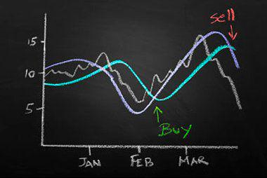

Investment strategies have evolved significantly over the years, leading to innovative approaches like momentum funds and algorithmic trading. These two elements have become integral in maximizing returns and managing risks in dynamic market environments. Momentum funds focus on companies demonstrating upward trends in their financial metrics, allowing investors to seize opportunities as prices move favorably. This strategy is based on the principle that assets exhibiting strong past performance will likely continue on a positive trajectory.

Algorithmic trading enhances the sophistication of momentum strategies by employing computer algorithms for automated decision-making. This approach leverages big data and advanced computational models to process large volumes of market data, identify trends, and execute trades at speeds impossible for human traders. The integration of algorithmic trading in momentum funds not only streamlines operations but also optimizes investment decisions through real-time analysis and precise execution.



This article offers a comprehensive examination of how momentum funds operate and the pivotal role of algorithmic trading in their success. It investigates into the mechanics of momentum fund investments, explores how algorithmic systems refine these strategies, and provides insights on leveraging these tools to improve investment outcomes. By the end, readers will better understand the potential advantages and challenges of employing these sophisticated investment strategies.

## Table of Contents

## What is a Momentum Fund?

A momentum fund is an investment vehicle that seeks to capitalize on the persistent trends observed in the financial performance metrics of companies, such as earnings and stock prices. Fund managers operating these funds carefully analyze and identify stocks that exhibit positive momentum indicators. These indicators may include consistent upward movements in stock prices, improved earnings reports, or other financial markers that suggest a continuing upward trajectory. 

Once identified, these stocks become investment targets for the momentum fund, as the underlying strategy assumes that assets with rising prices will continue to ascend, at least in the short term. Conversely, stocks displaying negative trends might be shorted, betting on the assumption that their prices will continue to fall. This dual approach allows fund managers to harness both upward and downward trends to generate returns, often by employing a long/short equity strategy.

The potential for high returns associated with momentum funds makes them attractive to investors. However, the strategy is not without risks. Momentum factors can be volatile, influenced by shifts in market sentiment, economic news, or unexpected financial disclosures from the companies involved. This volatility necessitates rigorous monitoring and frequent reassessment of the fund's holdings to optimize performance. Consequently, momentum funds often exhibit high turnover rates as positions are adjusted to align with the latest market data and predictive analytics.

The dynamic nature of [momentum](/wiki/momentum) investing requires that fund managers remain vigilant and responsive to changes in the market environment, continuously reevaluating the selected stocks to ensure alignment with the underlying trend strategy. This proactive approach is critical in managing the inherent risks and capitalizing on the transient opportunities that momentum investing presents.

## Mechanics of Momentum Fund Investment

Momentum fund investment relies heavily on the systematic evaluation of stock characteristics to generate a momentum score. This score serves as a critical decision-making tool for fund managers, allowing them to identify securities experiencing upward trends that are likely to continue in the near term. Momentum analysis often involves examining various stock attributes, including price movement, revenue growth, and earnings performance. By analyzing historical price patterns and these financial metrics, fund managers attempt to capitalize on stocks that have shown a propensity for trending upwards.

The formulation of momentum scores typically integrates both performance metrics and [fundamental analysis](/wiki/fundamental-analysis). Performance metrics focus on quantitative data readily available in financial markets, such as historical price movements and trading volumes. On the other hand, fundamental analysis attempts to assess a company's intrinsic value by evaluating financial statements, earnings reports, and macroeconomic indicators. By combining these two analytical approaches, fund managers can refine their investment decisions, attempting to discern stocks that will sustain their current momentum.

The rapid turnover rate in momentum funds is an operational necessity driven by the transient nature of market trends. Momentum-driven investment strategies are inherently dynamic, with stock positions frequently changing to mirror the latest market developments. This necessitates constant portfolio rebalancing to ensure alignment with prevailing trends, which in turn requires robust data analysis and quick execution capabilities. The frequent rebalancing process involves assessing momentum scores at regular intervals and adjusting the portfolio composition accordingly. By doing so, momentum funds aim to continually capture new market opportunities while mitigating exposure to stagnating or reversing trends.

In programming terms, constructing and readjusting a momentum-based portfolio can be managed using algorithmic strategies. Such an approach not only enhances the speed of execution but also allows for the processing of vast datasets to identify potential momentum shifts. Below is a simplistic Python example demonstrating how momentum scores might be calculated using historical price data:

```python
import pandas as pd

# Sample price data
prices = {'Stock': ['A', 'B', 'C', 'D'], 
          'Price_1': [100, 110, 120, 95], 
          'Price_2': [105, 108, 125, 90], 
          'Price_3': [110, 107, 130, 85]}

df = pd.DataFrame(prices)

# Calculate momentum score as percentage change from first to last price
df['Momentum_Score'] = (df['Price_3'] - df['Price_1']) / df['Price_1'] * 100

print(df[['Stock', 'Momentum_Score']])
```

This snippet calculates a basic momentum score measured as a percentage change over three pricing intervals. While simplistic, this calculation forms the foundational concept which, when expanded with more sophisticated metrics and data inputs, can powerfully inform momentum fund investment strategies.

Maintaining a balance between algorithmic precision and market adaptability, momentum fund mechanics require a thorough understanding of both quantitative analyses and the ever-evolving landscape of market trends.

## Algorithmic Trading and Its Integration with Momentum Funds

Algorithmic trading has revolutionized the investment landscape by utilizing big data and [machine learning](/wiki/machine-learning) to automate complex decision-making processes, thus enhancing profitability. It plays a pivotal role in momentum funds, which are known for their focus on market trends and [volatility](/wiki/volatility-trading-strategies). The integration of [algorithmic trading](/wiki/algorithmic-trading) within these funds not only improves efficiency but also allows fund managers to respond to market changes with unprecedented speed and precision.

Technical indicators such as the Relative Strength Index (RSI), Moving Average Convergence Divergence (MACD), and Rate of Change (ROC) are integral to algorithmic trading strategies within momentum funds. These indicators help in identifying the overbought or oversold conditions of assets, generating signals for buying or selling. Algorithms evaluate these indicators continuously in real-time, enabling the automatic execution of trades based on predefined criteria. This greatly reduces the time lag in transaction execution and minimizes human error.

For instance, RSI is used to evaluate the momentum of a stock by measuring the speed and change of price movements. It is formulated as:

$$
RSI = 100 - \left( \frac{100}{1 + RS} \right)
$$

where $RS$ is the average of $n$ days' up closes divided by the average of $n$ days' down closes. A typical threshold for trading strategies might involve buying an asset when the RSI falls below 30 (signaling oversold conditions) and selling when the RSI exceeds 70 (indicating overbought conditions).

In a similar manner, MACD, which tracks the relationship between two moving averages of asset prices, is another valuable tool. The MACD is calculated as follows:

$$
MACD = EMA_{12} - EMA_{26}
$$

where $EMA_{12}$ and $EMA_{26}$ represent the 12-day and 26-day exponential moving averages, respectively. A signal line, typically the 9-day EMA of the MACD, is used for trading signals involving crossovers. When the MACD crosses above the signal line, it may denote a buying opportunity, while a crossover below the signal line could suggest a selling point.

Algorithmic momentum trading strategies capitalize on these indicators by swiftly analyzing broad market trends and executing trades to exploit temporary price movements. Such strategies use high-frequency trading techniques to process large volumes of historical and real-time data, identifying profitable opportunities that are not easily detectable by human traders.

Here is a simple Python example illustrating how to implement an algorithmic strategy using the RSI indicator:

```python
import pandas as pd
import numpy as np

def calculate_RSI(data, window=14):
    delta = data['Close'].diff()
    gain = (delta.where(delta > 0, 0)).rolling(window=window).mean()
    loss = (-delta.where(delta < 0, 0)).rolling(window=window).mean()
    RS = gain / loss
    RSI = 100 - (100 / (1 + RS))
    return RSI

# Simulated data
data = pd.DataFrame({'Close': np.random.normal(loc=100, scale=10, size=100)})
data['RSI'] = calculate_RSI(data)

# Define trading signals
data['Buy_Signal'] = np.where(data['RSI'] < 30, 1, 0)
data['Sell_Signal'] = np.where(data['RSI'] > 70, -1, 0)
```

This code calculates the RSI for a given dataset and identifies buy and sell signals based on the threshold levels. By seamlessly executing trades based on these signals, algorithmic trading enhances the potential profitability of momentum funds, allowing them to capitalize on fleeting market opportunities while maintaining a disciplined and systematic approach.

## Executing Momentum Trading Strategies

Momentum trading strategies frequently rely on technical indicators like the Relative Strength Index (RSI), Moving Average Convergence Divergence (MACD), and stochastic oscillators to establish precise entry and [exit](/wiki/exit-strategy) points for trades. These indicators provide quantifiable metrics that guide both the timing and nature of trades in a momentum-based investment strategy.

RSI is a momentum oscillator that measures the speed and change of price movements. The formula for RSI is as follows:

$$
RSI = 100 - \frac{100}{1 + RS}
$$

where $RS$ (Relative Strength) is the average of $n$ days' up closes divided by the average of $n$ days' down closes. RSI values above 70 typically indicate an overbought condition, while values below 30 suggest an oversold condition, serving as potential signals for executing trades.

MACD is another critical tool used in momentum strategies. It calculates the difference between a security's 26-day and 12-day exponential moving averages (EMA), helping traders identify trends and generate buy or sell signals. The MACD line crossing above the signal line (9-day EMA of MACD) suggests a bullish trend, whereas crossing below indicates a bearish trend.

Stochastic oscillators measure market momentum by comparing a security's closing price to its price range over a certain period. The formula for the stochastic oscillator is:

$$
\%K = \frac{\text{(Current Close - Lowest Low)}}{\text{(Highest High - Lowest Low)}} \times 100
$$

where $\%K$ indicates the current level relative to the range, while $\%D$, a moving average of $\%K$, serves as the signal line. Values above 80 typically indicate overbought conditions, while values below 20 suggest oversold conditions.

Algorithmic trading platforms utilize these indicators by automatically executing trades when certain predefined conditions are met, such as the crossing of key thresholds. Here is an example in Python demonstrating how a simple algorithmic trading strategy can be executed based on the RSI and MACD indicator:

```python
import pandas as pd
import numpy as np
import talib

# Sample data containing 'close' prices
data = pd.DataFrame({'close': np.random.rand(100) * 100})

# Calculate RSI and MACD values
data['RSI'] = talib.RSI(data['close'], timeperiod=14)
macd, macdsignal, macdhist = talib.MACD(data['close'], fastperiod=12, slowperiod=26, signalperiod=9)

# Strategy Execution
buy_signals = (data['RSI'] < 30) & (macd > macdsignal)
sell_signals = (data['RSI'] > 70) & (macd < macdsignal)

# Output the buy/sell signals
data['Buy'] = buy_signals
data['Sell'] = sell_signals

print(data[['close', 'RSI', 'Buy', 'Sell']])
```

This script exemplifies a rudimentary approach in which buy signals are generated when RSI is below 30 and the MACD crosses above the signal line. Conversely, sell signals occur when RSI exceeds 70 and the MACD falls below the signal line. Investors can refine these thresholds and incorporate additional indicators to meet specific strategy requirements.

By setting specific parameters on algorithmic platforms, investors can leverage such strategies to optimize performance, maintaining a disciplined approach to momentum trading. This automation facilitates rapid execution, ensuring that trades are aligned with the dynamic nature of market trends, thus improving the potential for capturing profitable opportunities while minimizing emotional biases.

## Advantages and Disadvantages of Momentum and Algo Trading Strategies

Momentum and algorithmic trading strategies offer several advantages and disadvantages that investors should carefully consider when integrating them into their investment approaches.

**Advantages**:
1. **Automated Decision-Making**: One of the primary benefits of algorithmic trading in momentum strategies is automation. Algorithms can swiftly analyze market data and execute trades based on predefined criteria without human intervention. This allows for faster response times to market changes, potentially capturing favorable price movements more quickly than manual trading approaches.

2. **Reduced Emotional Bias**: Human emotions can adversely affect investment decisions, often leading to impulsive actions that deviate from a rational strategy. Automated systems help mitigate emotional biases by executing trades strictly according to predetermined rules. This can enhance consistency in trading performance.

3. **Scalability**: Algorithmic strategies can handle larger volumes of trades efficiently. This scalability enables even small-scale investors to engage in high-frequency trading or manage multiple assets simultaneously, implementing complex strategies that would be difficult to manage manually.

4. **Utilizing Real-Time Data**: Algorithms can continuously process vast amounts of real-time market data, allowing them to capitalize on transient market conditions. This immediacy is vital in fast-paced markets, where delays in decision-making can mean missed opportunities.

**Disadvantages**:
1. **Market Volatility**: While momentum strategies aim to exploit market trends, they can be susceptible to increased volatility. Momentum indicators might signal trades during short-term fluctuations rather than sustained trends, which can lead to losses if not managed properly.

2. **Transaction Costs**: High-frequency trading inherent in many algorithmic momentum strategies may incur significant transaction costs, including commissions and fees. These costs can erode profit margins, especially if the volume of trades is high and the strategy requires frequent rebalancing.

3. **Potential Algorithm Overfitting**: Algorithms are typically trained on historical data. While backtesting can reveal how a strategy might perform, there's a risk of overfitting—a scenario where the algorithm is too closely tailored to past data patterns that may not repeat in the future. This can lead to poor real-world performance.

4. **Lagging Indicators**: Momentum strategies often rely on technical indicators that are based on historical data, which by nature, are lagging. These indicators might not always accurately predict future market movements, posing a risk that trades are made based on outdated or non-predictive signals.

In conclusion, momentum and algorithmic trading strategies, when optimized correctly, can offer notable benefits including efficiency, precision, and reduced emotional interference. However, to harness these advantages while mitigating risks such as market volatility and algorithm overfitting, investors must commit to continuous strategy evaluation and adaptation.

## Case Studies and Real-World Applications

Analyzing the performance of successful momentum funds and the integration of algorithmic trading provides valuable insights into investment strategy fund mechanics. Multiple case studies and real-world examples demonstrate the effectiveness and potential of these strategies when properly implemented.

One notable example is the AQR Momentum Funds, which have consistently demonstrated strong returns by capitalizing on stocks with positive momentum indicators. AQR utilizes quantitative methods and extensive data analysis to identify potential investment opportunities. The fund's approach combines traditional momentum strategies with sophisticated algorithmic models, allowing for real-time data processing and execution of trades. This integration has provided the fund with the capability to react swiftly to market changes and capture profits from short-term price movements[1].

Exchange-Traded Funds (ETFs) focusing on momentum-driven strategies also illustrate the effectiveness of these methods. The iShares MSCI USA Momentum Factor [ETF](/wiki/etf-trading-strategies) (MTUM) is an example where algorithmic trading plays a key role in fund performance. MTUM selects stocks based on risk-adjusted momentum scores, continuously rebalancing its portfolio to align with prevailing market trends. This strategy has enabled the ETF to outperform broader indices in certain market conditions, illustrating the potential for growth in algorithm-driven momentum investing[2].

Similarly, many mutual funds have adopted momentum strategies, with varying degrees of success. The T. Rowe Price New Horizons Fund utilizes a blend of fundamental and technical analysis to identify [growth stocks](/wiki/growth-stocks), integrating momentum factors to enhance decision-making processes. By employing algorithmic models, the fund maintains a dynamic portfolio, adjusting its holdings to exploit favorable market conditions efficiently[3].

These examples highlight the strategic interplay between momentum investing and algorithmic trading. By leveraging data analytics and automated decision-making, funds can enhance their ability to identify emerging trends and allocate resources accordingly. This approach not only improves the potential for higher returns but also enables funds to manage risk more effectively.

While the integration of algorithmic trading in momentum funds presents significant opportunities, it also poses challenges, such as the risk of model overfitting and increased competition. To address these issues, continuous [backtesting](/wiki/backtesting) and strategy optimization are crucial. Additionally, maintaining adaptability to market changes allows investors to harness the advantages of momentum strategies in a rapidly evolving financial landscape.

Overall, these case studies and real-world applications affirm that when executed thoughtfully, momentum fund strategies augmented by algorithmic trading can offer substantial benefits. As technology continues to advance, further opportunities and refinements in these strategies are expected, promising dynamic growth and improved investment outcomes.

**References:**

[1] Asness, C. S., Frazzini, A., Israel, R., & Moskowitz, T. J. (2015). Fact, Fiction, and Momentum Investing. The Journal of Portfolio Management, 40(5), 75-92.

[2] ETF.com. (n.d.). iShares MSCI USA Momentum Factor ETF. Retrieved from [ETF.com](https://www.etf.com/MTUM)

[3] T. Rowe Price. (n.d.). New Horizons Fund. Retrieved from [T. Rowe Price](https://www.troweprice.com/personal-investing/plans-solutions/mutual-funds/new-horizons-fund.html)

## Conclusion

In conclusion, leveraging momentum fund strategies combined with algorithmic trading can significantly enhance investment outcomes, primarily through the efficient capture of market trends and the strategic allocation of resources. A proper understanding of these mechanisms allows investors to maximize gains by systematically identifying and exploiting prevailing trends in financial markets.

Momentum funds capitalize on persisting trends in stock prices, earnings, or other financial metrics. The core principle is that securities that have performed well in the past are likely to continue performing well in the near future. Implementing algorithmic trading within this framework facilitates automated decision-making, reducing the potential for emotional bias and ensuring adherence to predetermined strategies. Algorithms can quickly analyze large datasets to identify momentum trends, enhancing the speed and accuracy of investment decisions.

Nonetheless, successful implementation requires continuous vigilance and adaptability from investors. Market conditions fluctuate, and what works as a momentum signal in one context may not be as effective in another. Therefore, regular backtesting of strategies is crucial. Backtesting involves simulating an investment strategy using historical data to evaluate its performance. This process helps refine strategies by allowing investors to identify weaknesses and optimize parameters.

Python code can be particularly useful for backtesting momentum strategies. Here is a simple example of a backtest using a momentum strategy:

```python
import pandas as pd
import numpy as np

def moving_average(data, window_size):
    return data.rolling(window=window_size).mean()

# Load historical price data
data = pd.read_csv('historical_prices.csv')  # Assuming the CSV contains a 'Close' column for closing prices

# Calculate momentum indicator (e.g., 10-day moving average)
data['Momentum'] = moving_average(data['Close'], 10)

# Define strategy conditions
buy_signal = data['Close'] > data['Momentum']
sell_signal = data['Close'] < data['Momentum']

# Calculate daily returns
data['Return'] = data['Close'].pct_change()

# Strategy returns
data['Strategy_Return'] = np.where(buy_signal, data['Return'], -data['Return'])

# Calculate cumulative returns
data['Cumulative_Strategy_Return'] = (1 + data['Strategy_Return']).cumprod()

# Evaluate strategy
final_return = data['Cumulative_Strategy_Return'].iloc[-1]
print(f'Final return for momentum strategy: {final_return:.2f}')
```

This code illustrates a basic moving average crossover strategy, where buy and sell signals are generated based on the closing price crossing the 10-day moving average. Conducting such analysis helps investors optimize their strategies and adapt to changing market conditions, thus effectively managing risk and enhancing potential returns. 

Ultimately, disciplined execution and ongoing optimization of momentum fund strategies bolstered by algorithmic trading can lead to substantial investment successes, provided that investors consistently monitor and adjust their approaches to navigate the dynamic landscape of financial markets.

## References & Further Reading

[1]: Asness, C. S., Frazzini, A., Israel, R., & Moskowitz, T. J. (2015). ["Fact, Fiction, and Momentum Investing."](https://papers.ssrn.com/sol3/Papers.cfm?abstract_id=2435323) The Journal of Portfolio Management, 40(5), 75-92.

[2]: ETF.com. ["iShares MSCI USA Momentum Factor ETF."](https://www.blackrock.com/us/individual/products/251614/ishares-msci-usa-momentum-factor-etf)

[3]: T. Rowe Price. ["New Horizons Fund."](https://www.troweprice.com/financial-intermediary/us/en/investments/mutual-funds/us-products/new-horizons-fund.html)

[4]: Lo, A. W. (2002). ["The Statistics of Sharpe Ratios."](https://www.researchgate.net/publication/228139699_The_Statistics_of_Sharpe_Ratios) Financial Analysts Journal, 58(4), 36-52.

[5]: Jegadeesh, N., & Titman, S. (1993). ["Returns to Buying Winners and Selling Losers: Implications for Stock Market Efficiency."](https://www.jstor.org/stable/2328882) The Journal of Finance, 48(1), 65-91.