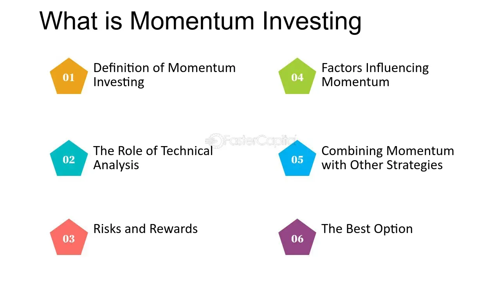

## Table of Contents

## What is a momentum fund?

A momentum fund is a type of investment fund that focuses on buying stocks or other assets that have been doing well recently. The idea is that if a stock's price has been going up, it is likely to keep going up for a while. This is called the momentum strategy. People who manage these funds believe that they can make money by following trends and jumping on them before they end.

These funds can be exciting because they try to catch big moves in the market. But they can also be risky. If the trend suddenly changes, the fund might lose money quickly. That's why it's important for investors to understand that momentum funds can be more volatile than other types of funds. They might offer the chance for big gains, but they also come with the risk of big losses.

## How does a momentum fund work?

A momentum fund works by picking stocks or other investments that have been going up in price recently. The people who run the fund believe that if a stock has been doing well, it will probably keep doing well for a while longer. So, they buy these stocks hoping to ride the wave of the price going up even more. They keep these stocks in the fund until they see signs that the price might start to go down. Then, they sell the stocks and look for new ones that are starting to go up.

This strategy can be exciting because it tries to catch big moves in the market. But it can also be risky. If the price of a stock suddenly starts to go down after the fund buys it, the fund can lose money quickly. That's why people who invest in [momentum](/wiki/momentum) funds need to be okay with the chance that they might lose money as well as make money. It's like trying to catch a fast-moving train – if you time it right, you can go far, but if you miss, you could get left behind.

## What are the key characteristics of a momentum fund?

A momentum fund is all about [picking](/wiki/asset-class-picking) stocks that have been going up in price lately. The people who run the fund think that if a stock has been doing well, it will keep doing well for a bit longer. So, they buy these stocks and keep them in the fund until they see signs that the price might start to go down. Then, they sell those stocks and look for new ones that are starting to go up.

These funds can be exciting because they try to catch big moves in the market. But they can also be risky. If the price of a stock suddenly starts to go down after the fund buys it, the fund can lose money quickly. That's why people who invest in momentum funds need to be okay with the chance that they might lose money as well as make money. It's like trying to catch a fast-moving train – if you time it right, you can go far, but if you miss, you could get left behind.

## What is the investment strategy behind momentum funds?

The investment strategy behind momentum funds is all about picking stocks that have been going up in price recently. The people who manage these funds believe that if a stock has been doing well, it will probably keep doing well for a little while longer. So, they buy these stocks and keep them in the fund. They watch the stocks closely and sell them when they think the price might start to go down. Then, they look for new stocks that are starting to go up.

This strategy can be exciting because it tries to catch big moves in the market. But it can also be risky. If the price of a stock suddenly starts to go down after the fund buys it, the fund can lose money quickly. That's why people who invest in momentum funds need to be okay with the chance that they might lose money as well as make money. It's like trying to catch a fast-moving train – if you time it right, you can go far, but if you miss, you could get left behind.

## How do momentum funds identify stocks to invest in?

Momentum funds identify stocks to invest in by looking at which ones have been going up in price over the last few months. They use special tools and numbers to figure out which stocks are moving up the fastest. These tools help them see trends and patterns in the market. If a stock has been going up a lot and seems like it might keep going up, the fund will buy it.

Once they pick a stock, they keep watching it closely. They want to sell it before the price starts to go down. To do this, they look for signs that the stock's momentum might be slowing down. If they see these signs, they sell the stock and start looking for new ones that are starting to go up. This way, they try to keep riding the wave of stocks that are doing well.

## What are the risks associated with investing in momentum funds?

Investing in momentum funds can be risky because they try to catch stocks that are going up fast. If the price of a stock suddenly starts to go down after the fund buys it, the fund can lose money quickly. This is called market risk. Momentum funds can also be more volatile than other types of funds, which means their value can go up and down a lot in a short time. This can be scary for people who don't like big changes in their investments.

Another risk is that momentum funds might not always pick the right stocks. Sometimes, a stock might look like it's going up, but then it stops or goes down. This is called selection risk. Also, these funds often buy and sell stocks a lot, which can lead to higher costs like trading fees. These costs can eat into the money the fund makes, making it harder for investors to earn a good return. So, while momentum funds can be exciting and offer the chance for big gains, they come with the risk of big losses too.

## How do momentum funds perform compared to other types of funds?

Momentum funds can do really well when the market is going up fast. They try to catch stocks that are moving up quickly, so if they pick the right ones, they can make a lot of money. But, they can also lose a lot of money if the market suddenly goes down or if they pick the wrong stocks. This makes them different from other types of funds, like value funds or index funds, which might not go up as fast but can be less risky.

Compared to value funds, which look for stocks that are cheap and might go up over time, momentum funds focus on stocks that are already going up. Value funds might not make as much money in a short time, but they can be safer over the long run. Index funds, which try to match the performance of a whole market, usually don't go up or down as much as momentum funds. They offer a more steady but slower growth. So, while momentum funds can be exciting and offer big gains, they can also be much riskier than other types of funds.

## What are the historical returns of momentum funds?

Momentum funds have had times when they did really well, especially when the market was going up fast. Over the years, studies have shown that momentum investing can beat the market for a while. For example, in the late 1990s, during the tech boom, momentum funds made a lot of money because they were able to catch the big moves in tech stocks. But, these good times don't last forever. When the market changes, like during the dot-com crash in the early 2000s, momentum funds can lose a lot of money quickly.

Looking at longer periods, like 10 or 20 years, momentum funds can still do better than the market sometimes. But they can also be much more up and down than other types of funds. This means they can have really good years and really bad years. For example, a study by Eugene Fama and Kenneth French found that over many years, momentum strategies could give higher returns than just following the market. But, these returns come with a lot more risk, and not every momentum fund will do well all the time.

## How can an investor evaluate the performance of a momentum fund?

An investor can evaluate the performance of a momentum fund by looking at how much money it has made over time. They can check the fund's returns over different periods, like one year, three years, or five years. It's important to compare these returns to a benchmark, like the S&P 500, to see if the fund is doing better or worse than the overall market. Investors should also look at the fund's volatility, which shows how much the fund's value goes up and down. A fund with high volatility might have big gains but also big losses.

Another way to evaluate a momentum fund is by looking at its risk-adjusted returns. This means checking if the fund's returns are worth the risk it takes. A common measure for this is the Sharpe ratio, which compares the fund's returns to its volatility. A higher Sharpe ratio means the fund is doing a good job of making money without taking too much risk. Investors should also read the fund's prospectus to understand its strategy and fees, as high fees can eat into the returns. By looking at all these things, an investor can get a good idea of how well a momentum fund is performing and if it fits their investment goals.

## What are the fees typically associated with momentum funds?

Momentum funds usually have higher fees than other types of funds. This is because they trade a lot, buying and selling stocks often to try and catch the best moves in the market. The more they trade, the more they have to pay in trading costs, and these costs get passed on to investors. On top of that, momentum funds often charge a management fee, which is a percentage of the money in the fund that goes to the people who run it. These fees can add up and make it harder for the fund to make money for investors.

The fees for momentum funds can vary a lot, but they might charge around 1% to 2% or even more as a management fee each year. Plus, there can be other costs like transaction fees and performance fees if the fund does really well. All these fees can eat into the returns that investors get, so it's important for anyone thinking about investing in a momentum fund to look closely at the fees and understand how they might affect their money.

## How do momentum funds fit into a diversified investment portfolio?

Momentum funds can add some excitement to a diversified investment portfolio because they try to catch stocks that are going up fast. If you already have a mix of different types of investments, like stocks, bonds, and maybe some real estate, adding a momentum fund can give you a chance to make more money when the market is doing well. But, because momentum funds can be risky and go up and down a lot, it's smart to only put a small part of your money in them. This way, you can still enjoy the potential for big gains without putting too much at risk.

It's important to think about how momentum funds fit with the rest of your investments. If you have a lot of other risky investments, adding a momentum fund might make your whole portfolio too risky. But if most of your investments are safer, like bonds or index funds, a little bit in a momentum fund can balance things out. Just remember to keep an eye on the fees, because momentum funds can be more expensive than other types of funds. By carefully choosing how much to invest in a momentum fund, you can use it to help grow your money while still keeping your overall portfolio balanced.

## What advanced techniques are used in managing momentum funds?

People who manage momentum funds use special ways to pick the best stocks. They look at how much a stock's price has gone up over the last few months. They use computers and math to find patterns in the market. This helps them see which stocks are moving up the fastest. They also use something called "technical analysis," which means looking at charts and graphs to guess where a stock's price might go next. By using these tools, they try to buy stocks that will keep going up and sell them before they start to go down.

Another way they manage these funds is by watching the market all the time. They keep track of news and events that might change how a stock is doing. If they see something that might make a stock's price go down, they sell it quickly. They also use something called "risk management" to try and not lose too much money. This means they might use other investments, like options, to protect the fund if the market suddenly goes down. By staying alert and using these advanced techniques, they try to make the most money for the people who invest in their fund.

## What is the integration of algorithmic trading with momentum funds?

Algorithmic trading has revolutionized the investment landscape by utilizing big data and [machine learning](/wiki/machine-learning) to automate complex decision-making processes, thus enhancing profitability. It plays a pivotal role in momentum funds, which are known for their focus on market trends and [volatility](/wiki/volatility-trading-strategies). The integration of [algorithmic trading](/wiki/algorithmic-trading) within these funds not only improves efficiency but also allows fund managers to respond to market changes with unprecedented speed and precision.

Technical indicators such as the Relative Strength Index (RSI), Moving Average Convergence Divergence (MACD), and Rate of Change (ROC) are integral to algorithmic trading strategies within momentum funds. These indicators help in identifying the overbought or oversold conditions of assets, generating signals for buying or selling. Algorithms evaluate these indicators continuously in real-time, enabling the automatic execution of trades based on predefined criteria. This greatly reduces the time lag in transaction execution and minimizes human error.

For instance, RSI is used to evaluate the momentum of a stock by measuring the speed and change of price movements. It is formulated as:

$$
RSI = 100 - \left( \frac{100}{1 + RS} \right)
$$

where $RS$ is the average of $n$ days' up closes divided by the average of $n$ days' down closes. A typical threshold for trading strategies might involve buying an asset when the RSI falls below 30 (signaling oversold conditions) and selling when the RSI exceeds 70 (indicating overbought conditions).

In a similar manner, MACD, which tracks the relationship between two moving averages of asset prices, is another valuable tool. The MACD is calculated as follows:

$$
MACD = EMA_{12} - EMA_{26}
$$

where $EMA_{12}$ and $EMA_{26}$ represent the 12-day and 26-day exponential moving averages, respectively. A signal line, typically the 9-day EMA of the MACD, is used for trading signals involving crossovers. When the MACD crosses above the signal line, it may denote a buying opportunity, while a crossover below the signal line could suggest a selling point.

Algorithmic momentum trading strategies capitalize on these indicators by swiftly analyzing broad market trends and executing trades to exploit temporary price movements. Such strategies use high-frequency trading techniques to process large volumes of historical and real-time data, identifying profitable opportunities that are not easily detectable by human traders.

Here is a simple Python example illustrating how to implement an algorithmic strategy using the RSI indicator:

```python
import pandas as pd
import numpy as np

def calculate_RSI(data, window=14):
    delta = data['Close'].diff()
    gain = (delta.where(delta > 0, 0)).rolling(window=window).mean()
    loss = (-delta.where(delta < 0, 0)).rolling(window=window).mean()
    RS = gain / loss
    RSI = 100 - (100 / (1 + RS))
    return RSI

# Simulated data
data = pd.DataFrame({'Close': np.random.normal(loc=100, scale=10, size=100)})
data['RSI'] = calculate_RSI(data)

# Define trading signals
data['Buy_Signal'] = np.where(data['RSI'] < 30, 1, 0)
data['Sell_Signal'] = np.where(data['RSI'] > 70, -1, 0)
```

This code calculates the RSI for a given dataset and identifies buy and sell signals based on the threshold levels. By seamlessly executing trades based on these signals, algorithmic trading enhances the potential profitability of momentum funds, allowing them to capitalize on fleeting market opportunities while maintaining a disciplined and systematic approach.

## How can one execute momentum trading strategies?

Momentum trading strategies frequently rely on technical indicators like the Relative Strength Index (RSI), Moving Average Convergence Divergence (MACD), and stochastic oscillators to establish precise entry and [exit](/wiki/exit-strategy) points for trades. These indicators provide quantifiable metrics that guide both the timing and nature of trades in a momentum-based investment strategy.

RSI is a momentum oscillator that measures the speed and change of price movements. The formula for RSI is as follows:

$$
RSI = 100 - \frac{100}{1 + RS}
$$

where $RS$ (Relative Strength) is the average of $n$ days' up closes divided by the average of $n$ days' down closes. RSI values above 70 typically indicate an overbought condition, while values below 30 suggest an oversold condition, serving as potential signals for executing trades.

MACD is another critical tool used in momentum strategies. It calculates the difference between a security's 26-day and 12-day exponential moving averages (EMA), helping traders identify trends and generate buy or sell signals. The MACD line crossing above the signal line (9-day EMA of MACD) suggests a bullish trend, whereas crossing below indicates a bearish trend.

Stochastic oscillators measure market momentum by comparing a security's closing price to its price range over a certain period. The formula for the stochastic oscillator is:

$$
\%K = \frac{\text{(Current Close - Lowest Low)}}{\text{(Highest High - Lowest Low)}} \times 100
$$

where $\%K$ indicates the current level relative to the range, while $\%D$, a moving average of $\%K$, serves as the signal line. Values above 80 typically indicate overbought conditions, while values below 20 suggest oversold conditions.

Algorithmic trading platforms utilize these indicators by automatically executing trades when certain predefined conditions are met, such as the crossing of key thresholds. Here is an example in Python demonstrating how a simple algorithmic trading strategy can be executed based on the RSI and MACD indicator:

```python
import pandas as pd
import numpy as np
import talib

# Sample data containing 'close' prices
data = pd.DataFrame({'close': np.random.rand(100) * 100})

# Calculate RSI and MACD values
data['RSI'] = talib.RSI(data['close'], timeperiod=14)
macd, macdsignal, macdhist = talib.MACD(data['close'], fastperiod=12, slowperiod=26, signalperiod=9)

# Strategy Execution
buy_signals = (data['RSI'] < 30) & (macd > macdsignal)
sell_signals = (data['RSI'] > 70) & (macd < macdsignal)

# Output the buy/sell signals
data['Buy'] = buy_signals
data['Sell'] = sell_signals

print(data[['close', 'RSI', 'Buy', 'Sell']])
```

This script exemplifies a rudimentary approach in which buy signals are generated when RSI is below 30 and the MACD crosses above the signal line. Conversely, sell signals occur when RSI exceeds 70 and the MACD falls below the signal line. Investors can refine these thresholds and incorporate additional indicators to meet specific strategy requirements.

By setting specific parameters on algorithmic platforms, investors can leverage such strategies to optimize performance, maintaining a disciplined approach to momentum trading. This automation facilitates rapid execution, ensuring that trades are aligned with the dynamic nature of market trends, thus improving the potential for capturing profitable opportunities while minimizing emotional biases.

## References & Further Reading

[1]: Asness, C. S., Frazzini, A., Israel, R., & Moskowitz, T. J. (2015). ["Fact, Fiction, and Momentum Investing."](https://papers.ssrn.com/sol3/Papers.cfm?abstract_id=2435323) The Journal of Portfolio Management, 40(5), 75-92.

[2]: ETF.com. ["iShares MSCI USA Momentum Factor ETF."](https://www.blackrock.com/us/individual/products/251614/ishares-msci-usa-momentum-factor-etf)

[3]: T. Rowe Price. ["New Horizons Fund."](https://www.troweprice.com/financial-intermediary/us/en/investments/mutual-funds/us-products/new-horizons-fund.html)

[4]: Lo, A. W. (2002). ["The Statistics of Sharpe Ratios."](https://www.researchgate.net/publication/228139699_The_Statistics_of_Sharpe_Ratios) Financial Analysts Journal, 58(4), 36-52.

[5]: Jegadeesh, N., & Titman, S. (1993). ["Returns to Buying Winners and Selling Losers: Implications for Stock Market Efficiency."](https://www.jstor.org/stable/2328882) The Journal of Finance, 48(1), 65-91.