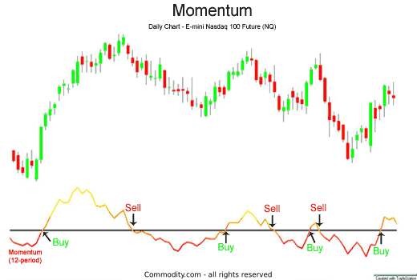

## Table of Contents

## What are momentum indicators and why are they used in financial analysis?

Momentum indicators are tools used in financial analysis to measure the speed or strength of a price movement in a financial asset, like stocks or currencies. They help traders and investors understand whether a price trend is likely to continue or if it might be about to reverse. By looking at how fast prices are changing, these indicators can show if an asset is overbought, meaning its price might be too high and could fall soon, or oversold, meaning its price might be too low and could rise soon.

These indicators are popular because they can help make better trading decisions. For example, if a momentum indicator shows that a stock's price is rising quickly, a trader might decide to buy it, hoping the price will keep going up. On the other hand, if the indicator suggests the price is falling fast, the trader might sell the stock to avoid further losses. By using momentum indicators, traders can try to enter and exit the market at the best times, aiming to increase their chances of making profitable trades.

## Can you explain the basic concept of momentum in the context of stock prices?

Momentum in the context of stock prices is like the idea of a moving object in physics. Imagine pushing a ball - if you keep pushing, it will keep moving faster and faster. In the stock market, if a stock's price keeps going up or down, it has momentum. This means that the price is likely to keep moving in the same direction for a while because many people are buying or selling the stock at the same time.

Traders and investors use this idea to make decisions. If a stock's price has been going up for a while, they might think it will keep going up, so they buy it. On the other hand, if the price has been going down, they might think it will keep falling, so they sell it or avoid buying it. By watching the momentum, people try to guess where the price might go next and make their moves based on that.

## What are some common momentum indicators used by traders and analysts?

Some common momentum indicators that traders and analysts use are the Relative Strength Index (RSI), the Moving Average Convergence Divergence (MACD), and the Stochastic Oscillator. The RSI measures how fast and how much a stock's price changes to see if it's overbought or oversold. The MACD looks at the difference between two moving averages of a stock's price to spot changes in the strength, direction, momentum, and duration of a trend. The Stochastic Oscillator compares a stock's closing price to its price range over a certain period to predict price turnarounds.

These indicators help traders make decisions by showing if a stock's price is moving too fast in one direction. For example, if the RSI shows a stock is overbought, a trader might think the price will soon go down, so they might sell the stock. If the MACD shows a crossover where the lines move apart, it might mean the stock's price trend is getting stronger, and a trader might decide to buy more of the stock. By using these tools, traders try to guess where the stock price might go next and act accordingly.

## How does the Relative Strength Index (RSI) work as a momentum indicator?

The Relative Strength Index, or RSI, is a tool that helps traders see if a stock's price is moving too fast. It does this by looking at how much the price has changed over a certain time, usually 14 days. The RSI gives a number between 0 and 100. If the number is above 70, it means the stock might be overbought, which means its price might be too high and could go down soon. If the number is below 30, it means the stock might be oversold, which means its price might be too low and could go up soon.

Traders use the RSI to make decisions about buying or selling stocks. For example, if the RSI is over 70, a trader might decide to sell the stock because they think the price will drop. If the RSI is under 30, they might buy the stock because they think the price will rise. The RSI can also show when the price might change direction. If the RSI starts to go down after being high, or up after being low, it might mean the stock's price trend is about to change. This helps traders try to buy low and sell high.

## What is the Moving Average Convergence Divergence (MACD) and how is it calculated?

The Moving Average Convergence Divergence, or MACD, is a tool that helps traders see if a stock's price is gaining or losing momentum. It does this by looking at the difference between two moving averages of the stock's price. A moving average is just the average price of a stock over a certain number of days. The MACD uses two lines: the MACD line and the signal line. The MACD line is the difference between a 12-day moving average and a 26-day moving average. The signal line is a 9-day moving average of the MACD line. Traders watch these lines to see if they cross each other or move apart, which can tell them about changes in the stock's price trend.

To calculate the MACD, you first find the 12-day and 26-day moving averages of the stock's price. Then, you subtract the 26-day moving average from the 12-day moving average to get the MACD line. Next, you calculate the 9-day moving average of the MACD line, which gives you the signal line. Traders then look at how these two lines interact. If the MACD line crosses above the signal line, it might mean the stock's price is starting to rise, and traders might decide to buy. If the MACD line crosses below the signal line, it might mean the price is starting to fall, and traders might decide to sell. By watching these lines, traders try to guess where the stock's price might go next and make their trading decisions based on that.

## How can the Stochastic Oscillator help identify overbought or oversold conditions?

The Stochastic Oscillator is a tool that helps traders see if a stock's price is too high or too low. It does this by comparing the stock's closing price to its price range over a certain time, usually 14 days. The Stochastic Oscillator gives a number between 0 and 100. If the number is above 80, it means the stock might be overbought, which means its price might be too high and could go down soon. If the number is below 20, it means the stock might be oversold, which means its price might be too low and could go up soon.

Traders use the Stochastic Oscillator to make decisions about buying or selling stocks. For example, if the Stochastic Oscillator is over 80, a trader might decide to sell the stock because they think the price will drop. If it's under 20, they might buy the stock because they think the price will rise. The Stochastic Oscillator can also show when the price might change direction. If the Stochastic Oscillator starts to go down after being high, or up after being low, it might mean the stock's price trend is about to change. This helps traders try to buy low and sell high.

## What are the key differences between leading and lagging momentum indicators?

Leading and lagging momentum indicators are tools traders use to understand where a stock's price might go next, but they work in different ways. Leading indicators try to predict what will happen before it actually happens. They look at how fast the price is moving right now to guess where it might go soon. For example, the Stochastic Oscillator is a leading indicator because it compares the current closing price to the price range over a recent period, trying to spot when the price might turn around before it actually does.

On the other hand, lagging indicators look at what has already happened to confirm if a trend is really there. They are slower to react because they need more data to be sure. Moving averages, like those used in the MACD, are lagging indicators. They show the average price over a certain number of days, so they only tell you about the trend after it's been going on for a while. Traders use lagging indicators to make sure the trend they see is real before making a move.

Both types of indicators are useful, but they serve different purposes. Leading indicators can help traders get in and out of trades faster, trying to catch the beginning of a trend. Lagging indicators help traders stay in a trend longer, making sure they don't jump in too early or too late. By using both types together, traders can get a fuller picture of what's happening with a stock's price and make better decisions.

## How can momentum indicators be used to confirm trends or predict potential reversals?

Momentum indicators help traders see if a stock's price trend is strong or if it might be about to change. When a stock's price is going up or down quickly, the momentum indicator can show that the trend is strong and likely to keep going. For example, if the MACD line crosses above the signal line, it might mean the stock's price is starting to rise faster, confirming that the upward trend is getting stronger. Traders might decide to buy more of the stock, thinking the price will keep going up. On the other hand, if the price is moving slowly or the momentum indicator is flat, it might mean the trend is weak and could change soon.

Momentum indicators can also help traders guess when a stock's price might reverse. If a stock's price has been going up but the momentum indicator starts to go down, it might mean the upward trend is losing strength and could turn around soon. For example, if the RSI goes above 70 and then starts to fall, it might mean the stock is overbought and its price could drop soon. Traders might decide to sell the stock to avoid losing money if the price goes down. By watching these indicators, traders try to catch the best times to buy or sell, hoping to make profitable trades.

## What are the limitations and potential pitfalls of using momentum indicators in trading?

Momentum indicators are helpful, but they have some problems. One big issue is that they can give false signals. This means they might say a stock's price is going to go up or down, but then the price does the opposite. This can happen because these indicators are based on past prices and can't always predict the future correctly. Another problem is that momentum indicators can be slow to react. For example, a lagging indicator like the MACD might take a while to show that a trend has changed, which can make traders miss out on good chances to buy or sell.

Another limitation is that momentum indicators don't work well on their own. They are best used with other tools and information, like looking at the news or other types of charts. If traders only use momentum indicators, they might make bad decisions because they're missing out on important information. Also, these indicators can be hard to use in markets that are moving a lot or not moving at all. In a very fast-moving market, the indicators might change too quickly to be useful. In a market that's not moving, the indicators might not show any clear trends, making it hard to decide what to do.

## How can one optimize the settings of momentum indicators for different market conditions?

To make the best use of momentum indicators in different market situations, you need to change their settings. For example, in a fast-moving market, you might want to use shorter time periods for your indicators. This means using fewer days for the moving averages in the MACD or a shorter look-back period for the RSI. Shorter settings help the indicators react quicker to price changes, which is good when the market is moving a lot. On the other hand, in a slow-moving or stable market, you might want to use longer time periods. This helps smooth out small price changes and gives you a clearer picture of the overall trend.

It's also important to test different settings to see what works best for the stocks or markets you are trading. You can do this by looking at past data and seeing how well different settings would have worked. This is called backtesting. By trying out different settings, you can find the ones that give you the most accurate signals for your specific trading style and the market conditions you are dealing with. Remember, what works well in one market might not work as well in another, so always keep an eye on how your indicators are performing and be ready to adjust them as needed.

## Can you discuss advanced techniques for combining multiple momentum indicators for better analysis?

Using more than one momentum indicator can help traders get a clearer picture of what's happening with a stock's price. By looking at different indicators, traders can see if they all agree on the same trend or if they're showing different things. For example, if the RSI says a stock is overbought and the MACD also shows a bearish signal, it might mean the stock's price is really going to go down soon. But if the RSI and MACD are showing different things, like the RSI says overbought but the MACD says the trend is still strong, it might be a good idea to wait and see what happens next before making a trade.

One advanced technique is to use a combination of leading and lagging indicators. Leading indicators, like the Stochastic Oscillator, can help you catch the start of a trend, while lagging indicators, like moving averages in the MACD, can help you stay in the trend longer. By watching both types of indicators, you can get in on a trend early and stay in it until the lagging indicators tell you it's time to get out. Another technique is to look for what's called a "divergence" between indicators. This happens when one indicator is going up while another is going down. It can be a strong sign that the stock's price might be about to change direction, giving you a chance to make a smart trade.

## What role do momentum indicators play in algorithmic trading and how are they integrated into trading systems?

Momentum indicators are important tools in algorithmic trading because they help computers make decisions about when to buy or sell stocks. In algorithmic trading, computers use math and data to trade automatically. Momentum indicators, like the RSI or MACD, tell the computer if a stock's price is moving fast or slow. If the indicator says the price is moving up quickly, the computer might decide to buy the stock, hoping it will keep going up. If the indicator says the price is moving down quickly, the computer might decide to sell the stock to avoid losing money. By using these indicators, the computer can try to make smart trades without a human needing to watch the market all the time.

To use momentum indicators in trading systems, programmers write code that tells the computer how to read and react to the indicators. They set up rules that say things like, "If the RSI is over 70, sell the stock," or "If the MACD line crosses above the signal line, buy the stock." The computer then watches the indicators all the time and makes trades based on these rules. It's important to test these rules a lot to make sure they work well. Programmers can use past data to see how the rules would have worked before, which helps them make the rules better. By using momentum indicators in this way, algorithmic trading systems can try to make profitable trades automatically.

## What are momentum indicators?

Momentum indicators are pivotal tools in technical analysis that gauge the rate of change in a security's price. By assessing momentum, traders can discern potential trends and make informed decisions about entry or exit points. Among the array of momentum indicators employed by traders, the Relative Strength Index (RSI) and the Moving Average Convergence Divergence (MACD) stand out for their widespread use and efficacy.

**Relative Strength Index (RSI):** The RSI is an oscillator that quantifies price movement by producing values between 0 and 100. Traditionally, an RSI value above 70 suggests that the asset might be overbought, indicating a potential price reversal or pullback. Conversely, an RSI below 30 suggests that the asset could be oversold, pointing to a possible upward price correction. The formula for RSI is as follows:

$$
\text{RSI} = 100 - \left(\frac{100}{1 + \frac{\text{Average Gain}}{\text{Average Loss}}}\right)
$$

This calculation involves comparing the average price gains and losses over a specified period.

**Moving Average Convergence Divergence (MACD):** The MACD is a momentum oscillator, yet it functions as a trend-following indicator. The MACD is derived from the difference between two exponential moving averages (EMAs) of different lengths, typically a 26-day EMA and a 12-day EMA. The MACD line is complemented by a signal line, often a 9-day EMA of the MACD line itself. Traders look for intersections between the MACD line and the signal line to identify bullish or bearish signals:

- A bullish signal occurs when the MACD line crosses above the signal line.
- A bearish signal is generated when the MACD line crosses below the signal line.

Both the RSI and MACD provide critical insights into whether a security is being overbought or oversold, aiding traders in predicting possible price reversals. These indicators, often used in conjunction with other analytical tools, form the backbone of trading strategies that aim to capitalize on market trends efficiently.

## What are Key Momentum Indicators and How Can We Understand Them?

Momentum indicators serve as pivotal tools for traders aiming to assess price movements with higher accuracy. Two primary [momentum](/wiki/momentum) indicators widely used are the Relative Strength Index (RSI) and the Moving Average Convergence Divergence (MACD). These indicators assist traders in identifying periods where securities are potentially overbought or oversold, making them invaluable for informed decision-making.

The Relative Strength Index (RSI) is a momentum oscillator that measures the speed and change of price movements. Developed by J. Welles Wilder, RSI provides its values on a scale from 0 to 100. Traditionally, RSI values above 70 are considered overbought, indicating that a security might be ripe for a downward correction. Conversely, values below 30 suggest oversold conditions, wherein a reversal to the upside might occur. The RSI is calculated using the formula:

$$
\text{RSI} = 100 - \frac{100}{1 + \text{RS}}
$$

where RS (Relative Strength) is the average of 'n' days' up closes divided by the average of 'n' days' down closes. Standard practice often employs a 14-day period for 'n', but this can be customized based on trading strategies and preferences.

In tandem, the Moving Average Convergence Divergence (MACD), developed by Gerald Appel, is a trend-following momentum indicator that shows the relationship between two moving averages of a security's price. The MACD is calculated by subtracting the 26-period exponential moving average (EMA) from the 12-period EMA. A nine-day EMA of the MACD, called the "signal line," is then plotted on top of the MACD line, functioning as a trigger for buy and sell signals. The MACD is expressed as:

```python
def calculate_macd(prices, n_slow=26, n_fast=12, n_signal=9):
    ema_slow = prices.ewm(span=n_slow, adjust=False).mean()
    ema_fast = prices.ewm(span=n_fast, adjust=False).mean()
    macd_line = ema_fast - ema_slow
    signal_line = macd_line.ewm(span=n_signal, adjust=False).mean()
    macd_histogram = macd_line - signal_line
    return macd_line, signal_line, macd_histogram
```

The MACD provides insights into changes in a security's strength, direction, momentum, and duration. When the MACD crosses above the signal line, it is considered a bullish signal, suggesting that it might be a suitable time to buy. Conversely, a MACD crossing below the signal line is often interpreted as bearish, implying a potential sell opportunity.

These indicators, RSI and MACD, are especially effective when combined with other forms of technical analysis. By incorporating them with [volume](/wiki/volume-trading-strategy) analysis, candlestick patterns, or support and resistance levels, traders can develop comprehensive strategies to increase their success rate. When used together, RSI and MACD can corroborate signals provided by other tools, thereby enhancing overall trading decision accuracy.

## References & Further Reading

[1]: Wilder, J. W. (1978). ["New Concepts in Technical Trading Systems."](https://archive.org/details/newconceptsintec00wild) Trend Research.

[2]: Appel, G. (2005). ["Technical Analysis: Power Tools for Active Investors."](https://www.amazon.com/Technical-Analysis-Power-Active-Investors/dp/0132930048) Financial Times Prentice Hall.

[3]: Chan, E. P. (2013). ["Algorithmic Trading: Winning Strategies and Their Rationale."](https://github.com/ftvision/quant_trading_echan_book) John Wiley & Sons.

[4]: De Prado, M. L. (2018). ["Advances in Financial Machine Learning."](https://www.amazon.com/Advances-Financial-Machine-Learning-Marcos/dp/1119482089) John Wiley & Sons.

[5]: Aronson, D. R. (2007). ["Evidence-Based Technical Analysis: Applying the Scientific Method and Statistical Inference to Trading Signals."](https://onlinelibrary.wiley.com/doi/book/10.1002/9781118268315) Wiley Trading.

[6]: Jansen, S. (2018). ["Machine Learning for Algorithmic Trading: Predictive models to extract signals from market and alternative data for systematic trading strategies with Python."](https://www.amazon.com/Machine-Learning-Algorithmic-Trading-alternative/dp/1839217715) Packt Publishing.