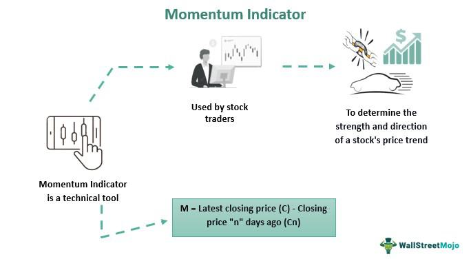

In the fast-paced world of financial trading, understanding market indicators is crucial for both novice and seasoned traders. Market indicators serve as essential tools, providing insights into the direction and strength of price movements within various securities. Among these, momentum indicators stand out due to their ability to provide a clear view of the intensity and sustainability of price trends. These tools analyze past price data to help traders identify potential turning points in the market, enhancing decision-making processes.

Momentum indicators are particularly valued in technical analysis, a discipline that utilizes historical market data to predict future price movements. By measuring the speed and magnitude of price shifts, these indicators offer traders information on whether an asset might be overbought or oversold. This is critical in spotting potential reversals in trends, allowing traders to optimize their entry and exit points effectively.



As trading has evolved with technology, the integration of momentum indicators into algorithmic trading has become increasingly significant. Algorithmic trading relies on computer systems to execute trades based on predefined criteria, allowing for rapid response to market changes. The incorporation of momentum indicators into algorithms not only enhances the ability to exploit market inefficiencies but also increases the precision and speed of trades, a necessity in today's competitive trading environments. With the power to process vast amounts of data in real-time, these systems improve the odds of successful trades by swiftly identifying lucrative opportunities and minimizing human error.

Thus, this article addresses how momentum indicators function, their critical role in financial analysis, and their application within algorithmic trading strategies. The growing influence of these indicators in modern trading underscores their importance as traders and analysts seek more sophisticated tools to maintain an edge in the financial markets.

## Table of Contents

## What Are Momentum Indicators?

Momentum indicators are pivotal tools in technical analysis that gauge the rate of change in a security's price. By assessing momentum, traders can discern potential trends and make informed decisions about entry or exit points. Among the array of momentum indicators employed by traders, the Relative Strength Index (RSI) and the Moving Average Convergence Divergence (MACD) stand out for their widespread use and efficacy.

**Relative Strength Index (RSI):** The RSI is an oscillator that quantifies price movement by producing values between 0 and 100. Traditionally, an RSI value above 70 suggests that the asset might be overbought, indicating a potential price reversal or pullback. Conversely, an RSI below 30 suggests that the asset could be oversold, pointing to a possible upward price correction. The formula for RSI is as follows:

$$
\text{RSI} = 100 - \left(\frac{100}{1 + \frac{\text{Average Gain}}{\text{Average Loss}}}\right)
$$

This calculation involves comparing the average price gains and losses over a specified period.

**Moving Average Convergence Divergence (MACD):** The MACD is a momentum oscillator, yet it functions as a trend-following indicator. The MACD is derived from the difference between two exponential moving averages (EMAs) of different lengths, typically a 26-day EMA and a 12-day EMA. The MACD line is complemented by a signal line, often a 9-day EMA of the MACD line itself. Traders look for intersections between the MACD line and the signal line to identify bullish or bearish signals:

- A bullish signal occurs when the MACD line crosses above the signal line.
- A bearish signal is generated when the MACD line crosses below the signal line.

Both the RSI and MACD provide critical insights into whether a security is being overbought or oversold, aiding traders in predicting possible price reversals. These indicators, often used in conjunction with other analytical tools, form the backbone of trading strategies that aim to capitalize on market trends efficiently.

## Understanding Key Momentum Indicators

Momentum indicators serve as pivotal tools for traders aiming to assess price movements with higher accuracy. Two primary [momentum](/wiki/momentum) indicators widely used are the Relative Strength Index (RSI) and the Moving Average Convergence Divergence (MACD). These indicators assist traders in identifying periods where securities are potentially overbought or oversold, making them invaluable for informed decision-making.

The Relative Strength Index (RSI) is a momentum oscillator that measures the speed and change of price movements. Developed by J. Welles Wilder, RSI provides its values on a scale from 0 to 100. Traditionally, RSI values above 70 are considered overbought, indicating that a security might be ripe for a downward correction. Conversely, values below 30 suggest oversold conditions, wherein a reversal to the upside might occur. The RSI is calculated using the formula:

$$
\text{RSI} = 100 - \frac{100}{1 + \text{RS}}
$$

where RS (Relative Strength) is the average of 'n' days' up closes divided by the average of 'n' days' down closes. Standard practice often employs a 14-day period for 'n', but this can be customized based on trading strategies and preferences.

In tandem, the Moving Average Convergence Divergence (MACD), developed by Gerald Appel, is a trend-following momentum indicator that shows the relationship between two moving averages of a security's price. The MACD is calculated by subtracting the 26-period exponential moving average (EMA) from the 12-period EMA. A nine-day EMA of the MACD, called the "signal line," is then plotted on top of the MACD line, functioning as a trigger for buy and sell signals. The MACD is expressed as:

```python
def calculate_macd(prices, n_slow=26, n_fast=12, n_signal=9):
    ema_slow = prices.ewm(span=n_slow, adjust=False).mean()
    ema_fast = prices.ewm(span=n_fast, adjust=False).mean()
    macd_line = ema_fast - ema_slow
    signal_line = macd_line.ewm(span=n_signal, adjust=False).mean()
    macd_histogram = macd_line - signal_line
    return macd_line, signal_line, macd_histogram
```

The MACD provides insights into changes in a security's strength, direction, momentum, and duration. When the MACD crosses above the signal line, it is considered a bullish signal, suggesting that it might be a suitable time to buy. Conversely, a MACD crossing below the signal line is often interpreted as bearish, implying a potential sell opportunity.

These indicators, RSI and MACD, are especially effective when combined with other forms of technical analysis. By incorporating them with [volume](/wiki/volume-trading-strategy) analysis, candlestick patterns, or support and resistance levels, traders can develop comprehensive strategies to increase their success rate. When used together, RSI and MACD can corroborate signals provided by other tools, thereby enhancing overall trading decision accuracy.

## Algorithmic Trading and Momentum Indicators

Algorithmic trading deploys pre-programmed instructions, known as algorithms, to execute trades at speeds and frequencies that are impossible for a human trader. The algorithms utilize a variety of inputs, often including momentum indicators, to make trading decisions. These momentum indicators are crucial in [algorithmic trading](/wiki/algorithmic-trading) for quantifying the speed and magnitude of market movements, thus aiding in predicting potential price trends.

One primary advantage of algorithmic trading is its capacity to analyze vast datasets swiftly. Advanced computational capabilities enable algorithms to sift through historical price data, news feeds, and even social media sentiment to identify potential trading opportunities. The speed and efficiency of these processes allow traders to capitalize on short-lived trends and market inefficiencies that would otherwise be missed through manual trading methods.

Momentum indicators, such as the Relative Strength Index (RSI) and the Moving Average Convergence Divergence (MACD), provide essential insights for algorithmic strategies. These tools help in identifying trend reversals and are particularly effective in optimizing entry and [exit](/wiki/exit-strategy) points. The precision afforded by momentum indicators reduces the lag in decision-making, allowing algorithms to react promptly to market changes.

For instance, consider an algorithmic strategy that utilizes the RSI to determine market entry points. The algorithm might be set to execute a buy order when the RSI indicates an oversold condition (RSI below 30) and sell when it shows an overbought condition (RSI above 70). By doing so, the algorithm can systematically exploit predictable price fluctuations.

Here's a simple Python example demonstrating how an algorithm might use RSI for decision-making:

```python
import pandas as pd
import numpy as np

# RSI Calculation
def calculate_RSI(data, window=14):
    delta = data['Close'].diff(1)
    gain = (delta.where(delta > 0, 0)).rolling(window=window).mean()
    loss = (-delta.where(delta < 0, 0)).rolling(window=window).mean()
    RS = gain / loss
    RSI = 100 - (100 / (1 + RS))
    return RSI

# Sample data
data = pd.DataFrame({'Close': [130, 132, 133, 128, 127, 130, 135, 140]})

# Integrating RSI into trading logic
data['RSI'] = calculate_RSI(data)
buy_signal = data['RSI'] < 30
sell_signal = data['RSI'] > 70

print("Buy signals triggered at indices:", np.where(buy_signal)[0])
print("Sell signals triggered at indices:", np.where(sell_signal)[0])
```

In summary, the integration of momentum indicators in algorithmic trading provides substantial benefits in identifying profitable trading opportunities. These indicators enhance the ability to detect trend reversals and optimize trading actions, ultimately contributing to more efficient and profitable strategies. As algorithms continually evolve, their reliance on momentum indicators is likely to remain a pivotal aspect of trading strategy development.

## Integrating Momentum Indicators into Trading Strategies

Integrating momentum indicators into trading strategies necessitates a systematic approach involving careful analysis and robust [backtesting](/wiki/backtesting). These indicators, such as the Relative Strength Index (RSI) and Moving Average Convergence Divergence (MACD), serve as integral components that can complement broader trading strategies. The effectiveness of these tools is maximized when they are used in conjunction with other signals, such as trading volume, support and resistance levels, or price patterns. By synthesizing these different streams of data, traders gain a comprehensive view of market conditions, enabling more precise decision-making.

In practice, traders often apply momentum indicators to identify likely entry and exit points in conjunction with volume analysis. When a momentum indicator like the RSI signals that an asset is overbought, corroborating this with decreasing trading volumes can strengthen the decision to sell or short the asset. Conversely, an oversold signal coupled with increasing volume may indicate a strong buying opportunity.

To further refine their trading strategies, traders engage in rigorous backtesting, using historical data to simulate trades and assess the reliability of momentum indicators under various market scenarios. Backtesting helps in understanding the sensitivity and false signal rates of these indicators, curating strategies that are statistically likely to produce profitable outcomes. Here is a simple Python snippet demonstrating the backtesting of a basic momentum strategy:

```python
import pandas as pd

# Assuming we have a DataFrame 'data' with datetime index and 'close' price
data['returns'] = data['close'].pct_change()
data['moving_avg'] = data['close'].rolling(window=14).mean()
data['momentum'] = data['close'] - data['moving_avg']

# Define strategy signals
data['signal'] = 0
data.loc[data['momentum'] > 0, 'signal'] = 1  # Buy signal
data.loc[data['momentum'] < 0, 'signal'] = -1 # Sell signal

# Calculate strategy returns
data['strategy_returns'] = data['returns'] * data['signal'].shift(1)

# Evaluating strategy performance
cumulative_strategy_returns = (1 + data['strategy_returns']).cumprod()

print("Cumulative Returns:", cumulative_strategy_returns.iloc[-1])
```

This code snippet evaluates a simple momentum strategy by calculating buy/sell signals based on the difference between current prices and their moving averages, further highlighting the necessity of historical simulation.

Adapting these strategies to prevailing market conditions is crucial. Market [volatility](/wiki/volatility-trading-strategies), [liquidity](/wiki/liquidity-risk-premium), and broader economic indicators can significantly impact the performance of momentum indicators. Therefore, traders must maintain agility and adaptability in their strategies. Flexibility enables them to adjust their approach based on performance metrics and evolving market dynamics, thereby mitigating the risk of losses due to sudden market shifts.

By strategically integrating momentum indicators with other analytical tools and adaptive techniques, traders can develop a high level of precision and efficiency in executing trades, which is essential in both volatile and stable market environments.

## Case Studies and Examples

Several studies demonstrate the effectiveness of applying the Relative Strength Index (RSI) and Moving Average Convergence Divergence (MACD) tools in algorithmic trading, significantly enhancing the predictive accuracy of future market trends. Incorporating these momentum indicators into trading algorithms allows for a dynamic approach that can better adapt to market volatility.

In scenarios involving volatile market conditions, momentum-based strategies have frequently outperformed traditional buy-and-hold strategies. For instance, research has shown that using RSI and MACD can provide traders with timely insights to exploit short-term price fluctuations. This is particularly advantageous because volatility often leads to rapid price changes that can be profitably anticipated using momentum indicators.

A practical example can be seen in a backtested trading strategy where the RSI and MACD indicators were implemented to generate buy and sell signals. This algorithm could be structured in Python as follows:

```python
import pandas as pd
import numpy as np

def MACD(data, short_window=12, long_window=26, signal_window=9):
    data['ShortEMA'] = data['Close'].ewm(span=short_window, adjust=False).mean()
    data['LongEMA'] = data['Close'].ewm(span=long_window, adjust=False).mean()
    data['MACD'] = data['ShortEMA'] - data['LongEMA']
    data['Signal Line'] = data['MACD'].ewm(span=signal_window, adjust=False).mean()
    return data

def RSI(data, window=14):
    delta = data['Close'].diff(1)
    gain = delta.where(delta > 0, 0.0)
    loss = -delta.where(delta < 0, 0.0)
    avg_gain = gain.rolling(window=window).mean()
    avg_loss = loss.rolling(window=window).mean()
    rs = avg_gain / avg_loss
    data['RSI'] = 100 - (100 / (1 + rs))
    return data

# Example of using these functions
data = pd.DataFrame({
    # This should be filled with historical stock data
    'Close': np.random.random(100) * 100
})

data = MACD(data)
data = RSI(data)

# Identify buy and sell signals
data['Buy Signal'] = ((data['MACD'] > data['Signal Line']) & (data['RSI'] < 30))
data['Sell Signal'] = ((data['MACD'] < data['Signal Line']) & (data['RSI'] > 70))
```

In this example, the algorithm calculates the MACD and RSI values for a given dataset of historical closing prices. Buy signals are generated when the MACD crosses above the signal line, paired with the RSI indicating oversold conditions (below 30). Conversely, sell signals are triggered when the MACD crosses below the signal line and the RSI indicates overbought conditions (above 70).

The performance of these signals can be further evaluated through backtesting, comparing the returns generated by the algorithm with those of a simple buy-and-hold strategy. Studies often show that momentum-based strategies tend to capitalize on price momentum during volatile markets, thereby improving the return-risk profile compared to more passive investment strategies. 

By methodically examining and iterating on these systematic approaches, traders can refine their strategies, tailoring them to specific market conditions and time frames, ultimately achieving better outcomes in trading.

## Challenges and Best Practices

Despite their advantages, momentum indicators are not without limitations. One of the primary challenges traders face is the potential for false signals, particularly in a choppy or sideways market. This occurs when momentum indicators, such as the Relative Strength Index (RSI) or Moving Average Convergence Divergence (MACD), suggest a trend reversal or continuation that does not materialize, leading to inaccurate trading signals. In fluctuating markets with frequent price oscillations, the probability of encountering such false signals increases, potentially resulting in significant trading losses if not managed properly.

To mitigate the risk of false signals, traders need to be cautious about over-relying on any single momentum indicator. Instead, it is advisable to use a combination of indicators or strategies to confirm trading signals. For instance, corroborating momentum readings with volume data or using trend lines can provide a more comprehensive view of market conditions. This multi-layered approach helps filter out noise and enhances the reliability of the trading decisions.

Moreover, the dynamic nature of financial markets necessitates regular evaluation and adjustment of trading strategies. Traders should continuously monitor the performance metrics and adapt their use of momentum indicators in response to evolving market dynamics. Algorithmic trading systems can benefit from backtesting different scenarios and maintaining a diverse strategy portfolio to enhance robustness against various market conditions.

For practical implementation, traders can leverage Python to automate the evaluation and adjustment of trading strategies. Consider the following Python snippet that evaluates the RSI and MACD signals, integrating a volume confirmation approach:

```python
import pandas as pd
import talib

# Assuming 'data' is a DataFrame with 'close' and 'volume' columns for the asset
rsi = talib.RSI(data['close'], timeperiod=14)
macd, macdsignal, macdhist = talib.MACD(data['close'], fastperiod=12, slowperiod=26, signalperiod=9)

# Example condition for trade signals
trade_signal = ((rsi < 30) & (macd > macdsignal) & (data['volume'] > data['volume'].rolling(window=20).mean()))

# Print potential trade opportunities
print(data[trade_signal])
```

This code uses the TA-Lib library to calculate RSI and MACD and checks for a potential buy signal when RSI is oversold, MACD crosses above its signal line, and the trading volume is above its 20-day average. Such systematic evaluation helps traders maintain an adaptive approach, ensuring that trading strategies are aligned with current market dynamics.

## Conclusion

Momentum indicators are invaluable tools for traders seeking to understand market trends and make informed trading decisions. These indicators assess the speed and magnitude of price movements, providing insights into the strength of trends and potential reversal points. When momentum indicators such as the Relative Strength Index (RSI) and Moving Average Convergence Divergence (MACD) are effectively integrated into algorithmic trading strategies, they can significantly enhance both the efficiency and profitability of trades. By enabling algorithms to swiftly analyze large datasets and identify lucrative opportunities, these indicators help minimize human error and emotional biases, streamlining the decision-making process.

As trading platforms continue to evolve, offering more sophisticated data analytics and processing capabilities, the role of momentum indicators in financial analysis is set to expand. Modern trading environments provide traders with an array of advanced tools and features that facilitate the integration of momentum indicators into comprehensive trading strategies. This evolution not only improves the robustness of existing trading systems but also opens new avenues for innovation in strategy development.

The increasing accessibility of technological resources ensures that momentum indicators will remain a critical element in the toolkit of traders, aiding them in adapting to dynamic market conditions and maintaining a competitive edge. With ongoing advancements in algorithmic trading and data science, traders are empowered to develop and refine strategies that leverage momentum indicators to predict market behaviors more accurately, ultimately driving success in the ever-changing financial markets.

## References & Further Reading

[1]: Wilder, J. W. (1978). ["New Concepts in Technical Trading Systems."](https://archive.org/details/newconceptsintec00wild) Trend Research.

[2]: Appel, G. (2005). ["Technical Analysis: Power Tools for Active Investors."](https://www.amazon.com/Technical-Analysis-Power-Active-Investors/dp/0132930048) Financial Times Prentice Hall.

[3]: Chan, E. P. (2013). ["Algorithmic Trading: Winning Strategies and Their Rationale."](https://github.com/ftvision/quant_trading_echan_book) John Wiley & Sons.

[4]: De Prado, M. L. (2018). ["Advances in Financial Machine Learning."](https://www.amazon.com/Advances-Financial-Machine-Learning-Marcos/dp/1119482089) John Wiley & Sons.

[5]: Aronson, D. R. (2007). ["Evidence-Based Technical Analysis: Applying the Scientific Method and Statistical Inference to Trading Signals."](https://onlinelibrary.wiley.com/doi/book/10.1002/9781118268315) Wiley Trading.

[6]: Jansen, S. (2018). ["Machine Learning for Algorithmic Trading: Predictive models to extract signals from market and alternative data for systematic trading strategies with Python."](https://www.amazon.com/Machine-Learning-Algorithmic-Trading-alternative/dp/1839217715) Packt Publishing.