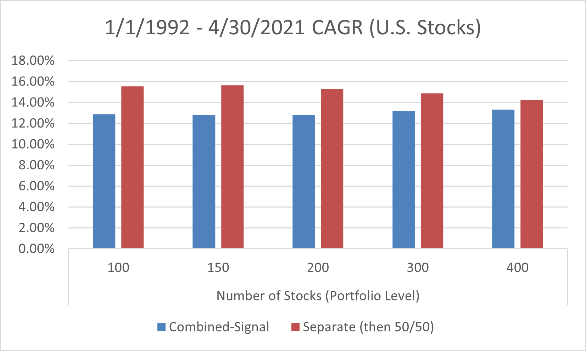

## Table of Contents

## What is momentum investing?

Momentum investing is a strategy where investors buy stocks that have been going up in price and sell stocks that have been going down. The idea is to ride the wave of a stock's movement, hoping that the trend will continue for a while. This approach is based on the belief that stocks that have performed well in the recent past will keep performing well in the near future, and vice versa for poorly performing stocks.

People who use momentum investing often look at how a stock has done over the last few months to a year. They might use different tools and indicators to spot these trends. While momentum investing can lead to big gains if the trends continue, it can also be risky. If the trend suddenly changes direction, investors could lose money quickly. So, it's important for anyone trying this strategy to keep a close eye on their investments and be ready to make quick decisions.

## How does momentum investing differ from other investment strategies?

Momentum investing is different from other investment strategies because it focuses on a stock's recent performance rather than its fundamental value. For example, value investing looks for stocks that are priced lower than their true worth, based on things like earnings and assets. Momentum investors, on the other hand, don't care so much about a company's financials. They just want to see if the stock's price is going up or down and jump on that trend.

Another way [momentum](/wiki/momentum) investing differs is in its approach to timing. Strategies like buy-and-hold encourage investors to keep their stocks for a long time, believing that good companies will do well over the years. Momentum investing is more about short-term gains. It's about getting in and out of stocks quickly to make money from their price movements. This makes it more active and potentially riskier than strategies that take a longer view.

Overall, momentum investing is about riding the wave of a stock's price movement, while other strategies might focus on a company's long-term potential or its current undervaluation. This difference in focus and time horizon can lead to very different investment decisions and outcomes.

## What are the basic principles behind momentum investing?

Momentum investing is based on the idea that stocks that have gone up in price recently will keep going up for a while, and stocks that have gone down will keep going down. It's like catching a wave and riding it as long as you can. People who use this strategy look at how a stock has done over the last few months to a year. If a stock has been doing well, they buy it, hoping it will keep doing well. If a stock has been doing badly, they might sell it or avoid buying it, expecting it to keep doing badly.

The key to momentum investing is timing. You need to get into a stock when it's starting to go up and get out before it starts to go down. This means you have to watch the market closely and be ready to act fast. It's different from other ways of investing where you might hold onto a stock for years. Momentum investing can be exciting because you might make quick profits, but it can also be risky. If the trend changes suddenly, you could lose money just as fast.

## How do you identify stocks with momentum?

To identify stocks with momentum, you look at how their prices have been moving over the last few months to a year. You want to find stocks that have been going up steadily. One way to do this is by checking the stock's price chart. If the price line is going up and up, that's a good sign of momentum. Another way is to look at the stock's returns over different time periods. If a stock has been doing better than the market or other stocks in its group, it might have momentum.

You can also use some tools to help spot these stocks. One popular tool is the Relative Strength Index (RSI). This tool tells you if a stock is overbought or oversold, which can help you see if the momentum is strong or if it might be about to change. Another tool is the moving average, which smooths out price data to show you the trend more clearly. If a stock's price is above its moving average, that's another sign of momentum. The key is to keep an eye on these signs and be ready to act when you see a stock with strong momentum.

## What are common metrics used to calculate momentum in stocks?

Common metrics used to calculate momentum in stocks include price changes over time and the Relative Strength Index (RSI). To measure momentum using price changes, you look at how much a stock's price has gone up or down over the last few months to a year. If a stock's price has been going up steadily, it shows strong momentum. This can be done by simply comparing the current price to the price a few months ago or by looking at the stock's returns over different time periods.

The Relative Strength Index (RSI) is another popular tool for measuring momentum. It's a number between 0 and 100 that shows if a stock is overbought or oversold. If the RSI is above 70, it means the stock might be overbought and could be due for a price drop. If it's below 30, it might be oversold and ready for a price increase. Investors use the RSI to see if the momentum is strong or if it might be about to change direction.

Moving averages are also used to spot momentum in stocks. A moving average smooths out price data to show the trend more clearly. If a stock's price is above its moving average, it's a sign of upward momentum. Investors often look at different time periods for moving averages, like 50-day or 200-day, to get a better idea of the stock's momentum. By using these metrics together, investors can get a good picture of a stock's momentum and make better decisions.

## Can you explain the momentum investing formula?

Momentum investing is all about finding stocks that are going up and buying them, or selling stocks that are going down. The main formula for momentum investing looks at how much a stock's price has changed over time. Usually, you look at the stock's returns over the last few months to a year. If a stock has gone up a lot during that time, it's seen as having good momentum. You can calculate this by comparing the stock's price now to its price a few months ago, or by looking at its percentage return over that time.

Another part of the momentum investing formula involves using tools like the Relative Strength Index (RSI). The RSI is a number between 0 and 100 that helps you see if a stock is overbought or oversold. If the RSI is over 70, it means the stock might be overbought and could go down soon. If it's under 30, it might be oversold and could go up. By using the RSI along with price changes, you get a better idea of a stock's momentum and whether it's a good time to buy or sell.

## What are the historical performance results of momentum investing?

Momentum investing has shown good results over time. Many studies have looked at how momentum investing does compared to other ways of [picking](/wiki/asset-class-picking) stocks. They found that stocks with strong momentum often do better than the overall market. For example, a study by Jegadeesh and Titman in the 1990s showed that stocks that did well in the past three to twelve months kept doing well for a while after. This means that if you bought stocks that were going up and sold stocks that were going down, you could make more money than just buying the whole market.

But momentum investing can be risky too. The same studies that showed good results also found that sometimes momentum stocks can lose a lot of value very quickly. This happens when the trend changes suddenly, and what was going up starts going down fast. So while momentum investing can lead to big gains, it can also lead to big losses if you're not careful. It's important to keep an eye on your investments and be ready to make quick decisions if things start to change.

## What are the risks associated with momentum investing?

Momentum investing can be risky because it depends a lot on trends that can change quickly. If you buy a stock because it's been going up, and then it suddenly starts going down, you could lose money fast. This is called a reversal, and it's one of the biggest risks in momentum investing. You have to watch the market closely and be ready to sell your stocks if the trend changes. If you're not quick enough, you might end up holding onto a stock that keeps losing value.

Another risk is that momentum investing can lead to buying stocks that are overvalued. When a stock's price goes up a lot, it might be because people are excited about it, not because the company is doing better. If the excitement fades, the stock price can drop, even if the company is still doing okay. This means you could be buying at a high price and then see the value go down when the hype goes away. So, it's important to be careful and not just follow the crowd without thinking about why a stock is going up.

## How can momentum investing be integrated into a diversified portfolio?

Momentum investing can be a part of a diversified portfolio by balancing it with other types of investments. You can use momentum investing for part of your money, while the rest is in safer or different kinds of investments like value stocks, bonds, or index funds. This way, if the momentum stocks suddenly go down, the other parts of your portfolio might not go down as much or might even go up. It's like spreading your money around so that you're not putting all your eggs in one basket.

When you add momentum investing to your portfolio, you need to keep an eye on how much risk you're taking. Momentum stocks can be exciting because they might go up a lot, but they can also go down a lot if the trend changes. So, you might want to limit how much of your money is in momentum stocks. Maybe you decide to put 10% or 20% of your portfolio in momentum stocks, and the rest in other investments. This helps you enjoy the possible big gains from momentum investing while also protecting yourself from big losses.

## What are the psychological factors that drive momentum in the market?

Momentum in the market is driven by people's feelings and how they act because of those feelings. When people see a stock going up, they often want to buy it too, hoping to make money. This is called the fear of missing out, or FOMO. If everyone starts buying the same stock, its price goes up even more. On the other hand, if a stock starts going down, people might get scared and sell it quickly, making the price drop even faster. This can create a cycle where the stock keeps going up or down because of what people are feeling, not just because of the company's actual value.

Another psychological [factor](/wiki/factor-investing) is called confirmation bias. This is when people look for information that supports what they already believe. If someone thinks a stock is going to keep going up, they'll pay more attention to news or signs that say it will, and ignore things that say it might go down. This can make the trend stronger because more people keep buying or selling based on what they believe. So, momentum in the market is a lot about how people feel and what they choose to believe, which can make stock prices move in big ways.

## How do market anomalies affect the effectiveness of momentum investing?

Market anomalies can really change how well momentum investing works. An anomaly is when something happens in the market that doesn't fit with what usually happens. For example, sometimes a stock that's been going up suddenly goes down a lot, even though it had strong momentum. This can happen because of unexpected news or because a lot of people decide to sell at the same time. When these anomalies happen, they can make momentum investing less effective because the trends that investors were counting on can change quickly.

But market anomalies can also help momentum investing sometimes. If a stock that's been going down suddenly gets good news and starts going up, people who use momentum investing might jump in and buy it, helping to push the price up even more. This can make the momentum stronger and lead to bigger gains for investors. So, while anomalies can make momentum investing riskier, they can also create new opportunities if you're quick to spot them and act on them.

## What are the ongoing debates and criticisms regarding momentum investing?

Some people think momentum investing is too risky because it's all about following trends that can change quickly. They say it's like trying to catch a falling knife - if you're not careful, you could get hurt. Critics argue that momentum investing doesn't look at the real value of a company, just at how its stock price is moving. They worry that this can lead to buying stocks that are too expensive and might crash later. Another big criticism is that momentum investing can make the market less stable because a lot of people buying and selling based on short-term trends can cause big swings in stock prices.

On the other hand, some people defend momentum investing by saying it can work well if you're careful and quick. They point out that studies have shown that stocks with strong momentum often do better than the overall market for a while. Supporters argue that the key is to keep a close eye on your investments and be ready to sell if the trend changes. They also say that while it's true momentum investing can be risky, it can also lead to big gains if you get it right. The debate continues, with some seeing momentum investing as a smart way to make money and others seeing it as a risky gamble.

## References & Further Reading

[1]: Jegadeesh, N., & Titman, S. (1993). ["Returns to Buying Winners and Selling Losers: Implications for Stock Market Efficiency."](https://www.jstor.org/stable/2328882) The Journal of Finance, 48(1), 65-91.

[2]: [Lopez de Prado, M.](https://www.quantresearch.org/Vita.htm) (2018). "Advances in Financial Machine Learning." Wiley.

[3]: Aronson, D. R. (2007). ["Evidence-Based Technical Analysis: Applying the Scientific Method and Statistical Inference to Trading Signals."](https://www.amazon.com/Evidence-Based-Technical-Analysis-Scientific-Statistical/dp/0470008741) Wiley.

[4]: Jansen, S. (2018). ["Machine Learning for Algorithmic Trading: Predictive models to extract signals from market and alternative data for systematic trading strategies with Python."](https://github.com/stefan-jansen/machine-learning-for-trading) Packt Publishing.

[5]: Chan, E. P. (2009). ["Quantitative Trading: How to Build Your Own Algorithmic Trading Business."](https://github.com/ftvision/quant_trading_echan_book) Wiley.

[6]: Patel, D. D. (2016). ["Algorithmic Trading: Winning Strategies and Their Rationale."](https://books.google.com/books/about/Algorithmic_Trading.html?id=WAlFDwAAQBAJ) Wiley.

[7]: Gürkaynak, R. S., & Wolfers, J. (2006). ["Macroeconomic Derivatives: An Initial Analysis of Market-Based Macro Forecasts, Uncertainty, and Risk."](https://www.nber.org/papers/w11929) NBER International Seminar on Macroeconomics, 11(1), 11-50.