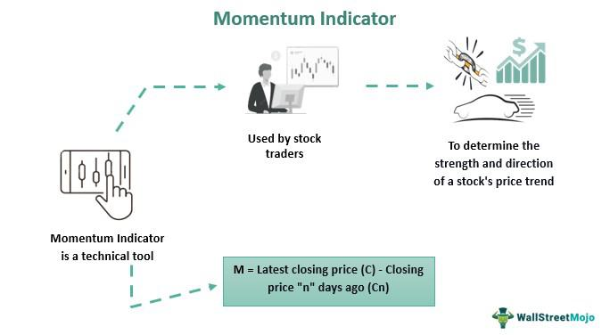

Financial markets are platforms where financial instruments—such as stocks, bonds, currencies, and derivatives—are traded. These markets are fundamental to the functioning of any economy as they provide capital by matching investors with entities that need funds. Investment strategies play a pivotal role in these markets, helping investors make informed decisions to optimize their returns relative to their risk preferences. These strategies can range from conservative approaches focusing on long-term gains to aggressive tactics aiming to capitalize on short-term market fluctuations.

Momentum investing is one such strategy that has gained considerable attention for its effectiveness in navigating financial markets. The core principle of momentum investing is to capitalize on existing market trends by buying securities that have shown an upward price momentum or selling those with downward trends. By leveraging the tendency of winning stocks to continue performing well and underperforming stocks to continue declining, momentum investors can potentially generate significant returns.



In recent years, algorithmic trading has emerged as a critical advancement that can enhance momentum investing. Utilizing computer algorithms to automate trading decisions, algorithmic trading allows strategies to be executed at speeds and frequencies far beyond human capability. This automation is particularly beneficial for momentum investing, where timing and rapid response to market changes are crucial.

This article aims to explore the synergy between momentum investing and algorithmic trading strategies in financial markets. By examining the integration of these two powerful strategies, the article seeks to provide insights into how investors can optimize their approaches to achieve improved outcomes in increasingly complex financial markets.

## Table of Contents

## What is Momentum Investing?

Momentum investing is a financial strategy that seeks to capitalize on the continuation of existing market trends. It is based on the principle that assets that have performed well in the past are likely to continue performing well, while those that have performed poorly are likely to continue their underperformance. This investment style contrasts with those based on [fundamental analysis](/wiki/fundamental-analysis), as it prioritizes recent price movements over intrinsic value assessments.

Historically, the momentum investing strategy gained recognition in the academic and financial communities through the work of researchers such as Jegadeesh and Titman in their 1993 study, which provided empirical evidence supporting the profitability of momentum strategies in stock markets. Their research demonstrated that stocks that performed well during the previous three to twelve months tended to outperform in the subsequent period, while underperforming stocks continued to lag. This phenomenon, known as the momentum effect, has since been substantiated by numerous studies across various asset classes and international markets.

The core principle of [momentum](/wiki/momentum) investing is to make investment decisions based on the direction of past price trends, with the assumption that these trends will persist. This strategy exploits investors' behavioral biases, such as herd behavior and the tendency to overreact or underreact to information, which can cause asset prices to deviate from their fundamental values for extended periods.

Momentum investors typically use a variety of metrics and indicators to assess the strength and sustainability of price trends. Some common indicators include:

1. **Relative Strength Index (RSI)**: This momentum oscillator measures the speed and change of price movements. It is often used to identify overbought or oversold conditions by evaluating the magnitude of recent price changes.

2. **Rate of Change (ROC)**: This measures the percentage change in price between the current price and a specified period in the past. A rising ROC can indicate increasing momentum.

3. **Moving Average Convergence Divergence (MACD)**: This trend-following momentum indicator compares short-term and long-term moving averages to identify possible buy or sell signals.

4. **Price Volume Trend (PVT)**: This indicator combines price and volume data to identify trends. The basic idea is to accumulate a running total of volume multiplied by the percentage increase or decrease in price relative to the previous close.

The development of momentum investing as a strategy has evolved over the decades, with improvements in data analytics and the proliferation of financial markets enhancing its applicability. Despite its popularity, momentum investing is not without its challenges. Critics point out that momentum strategies can be vulnerable during market reversals and periods of high [volatility](/wiki/volatility-trading-strategies). However, its historical performance and robustness across various markets have made it a core component of many sophisticated investment strategies.

## Understanding Algorithmic Trading

Algorithmic trading refers to the use of computer programs and systems to execute trades in financial markets based on pre-defined criteria and techniques. Its relevance in modern financial markets is underscored by the speed, precision, and ability to process large volumes of data that computers provide, which greatly surpass human capabilities. Algorithmic trading accounts for a significant portion of the trading [volume](/wiki/volume-trading-strategy) in major financial markets due to its efficiency and capability to minimize human error and emotional biases.

Algorithms automate trading strategies by executing trades based on predefined conditions such as price, timing, and volume. This automation is particularly beneficial for implementing momentum investing, a strategy that seeks to capitalize on market trends by buying securities with strong recent performance and selling those with weak performance. By using algorithms, traders can systematically and swiftly identify and exploit these trends, ensuring that trades are executed at the optimal times without delay.

Various types of algorithms are utilized in trading, each serving distinct functions. Some common algorithms include:

1. **Statistical Arbitrage Algorithms**: These use statistical models to identify price inefficiencies while seeking to profit from arbitrage opportunities.

2. **Market Making Algorithms**: These provide liquidity by continuously quoting buy and sell prices, earning the spread between bid and ask prices.

3. **Trend Following Algorithms**: These analyze market data to detect trends, aligning with momentum investing principles by buying assets in upward trends and selling those in downward trends.

4. **Mean Reversion Algorithms**: These assume that asset prices will revert to their historical means, thus buying underpriced and selling overpriced securities relative to their historical averages.

Using [algorithmic trading](/wiki/algorithmic-trading) for momentum strategies offers notable advantages. Algorithms can process vast datasets to identify momentum indicators such as the Relative Strength Index (RSI) or Moving Average Convergence Divergence (MACD) quickly and accurately. Automated systems allow for real-time analysis and decision-making, crucial for capitalizing on short-lived market trends. Moreover, algorithmic trading facilitates [backtesting](/wiki/backtesting) of strategies over historical data, helping to refine and improve strategy effectiveness before deployment in live markets.

Overall, algorithmic trading enhances the execution of momentum strategies, delivering speed, efficiency, and precision, essential for thriving in fast-paced financial markets.

## Synergy Between Momentum Investing and Algorithmic Trading

Automated systems play a crucial role in enhancing the effectiveness of momentum investing by providing speed, precision, and scalability in executing trades. By utilizing algorithmic trading, investors can systematically implement momentum strategies based on predefined criteria, thereby eliminating emotional biases and human errors that can affect decision-making. Algorithms can quickly analyze vast amounts of market data to identify securities that exhibit favorable momentum characteristics, allowing for timely execution of trades which is essential in capturing short-term market trends.

One notable example of algorithmic trading improving momentum investing outcomes is the application of trend-following algorithms by hedge funds and [quantitative trading](/wiki/quantitative-trading) firms. These algorithms are designed to exploit market momentum by buying securities that are trending upward and selling those that are declining. Firms like Renaissance Technologies and Two Sigma have successfully incorporated such strategies into their trading models, leveraging algorithmic efficiency to achieve significant returns. These cases highlight the potential profitability of combining algorithmic trading with momentum investing.

Data analysis and [machine learning](/wiki/machine-learning) are integral to refining momentum-based algorithms. Machine learning algorithms can analyze historical price data to identify patterns and adjust trading models based on predictive analytics. Additionally, these algorithms can continuously learn from market data, improving their ability to forecast momentum shifts more accurately. Techniques such as [reinforcement learning](/wiki/reinforcement-learning), where algorithms optimize strategies through trial and error, further enhance the adaptability of momentum-based trading systems.

Despite the benefits, there are challenges and risks in combining momentum investing with algorithmic trading. One significant challenge is the risk of overfitting, where a model performs well on historical data but fails to generalize to new, unseen data. To mitigate this, rigorous backtesting and cross-validation are essential to ensure algorithm robustness. Furthermore, market conditions such as high volatility can reduce the effectiveness of momentum strategies, potentially leading to substantial losses if not managed properly. Algorithmic models must therefore incorporate risk management techniques like stop-loss orders and position sizing to protect against adverse market moves.

In conclusion, while the synergy between momentum investing and algorithmic trading offers enhanced efficiency and potential for increased returns, it requires a cautious approach to navigate the complexities and inherent risks. By leveraging advanced data analysis and machine learning, investors can refine their strategies to adapt to evolving market conditions and maintain a competitive edge.

## Implementing Momentum Investing Strategies in Algorithmic Trading

Incorporating momentum investing strategies into algorithmic trading involves using specific technical indicators, implementing robust risk management techniques, and ensuring thorough backtesting and optimization processes.

### Integration of Momentum Indicators into Trading Algorithms

Momentum indicators are essential tools for capturing the price trends in financial markets. They can be automated using algorithms to inform trading decisions. Common indicators employed in algorithmic momentum strategies include:

1. **Relative Strength Index (RSI)**: The RSI is a momentum oscillator that measures the speed and change of price movements, oscillating between 0 and 100. It is often used to identify overbought or oversold conditions, aiding in deciding entry and exit points.

   **Python Example**:
   ```python
   import pandas as pd

   def calculate_rsi(data, periods=14):
       delta = data['close'].diff()
       gain = (delta.where(delta > 0, 0)).rolling(window=periods).mean()
       loss = (-delta.where(delta < 0, 0)).rolling(window=periods).mean()
       rs = gain / loss
       rsi = 100 - (100 / (1 + rs))
       return rsi
   ```

2. **Rate of Change (ROC)**: The ROC calculates the percentage change between the current price and the price a certain number of periods ago. It is used to identify the strength of a trend.

3. **Moving Average Convergence Divergence (MACD)**: MACD is a trend-following momentum indicator that illustrates the relationship between two moving averages of a security’s price.

   **Python Example**:
   ```python
   def calculate_macd(data, short_period=12, long_period=26, signal_period=9):
       short_ema = data['close'].ewm(span=short_period, adjust=False).mean()
       long_ema = data['close'].ewm(span=long_period, adjust=False).mean()
       macd = short_ema - long_ema
       signal = macd.ewm(span=signal_period, adjust=False).mean()
       return macd, signal
   ```

### Risk Management Techniques

Effective risk management ensures the viability of momentum-based algorithmic trading:

- **Position Sizing**: Determine the 'right' amount to invest in each trade to balance potential risks and profits.
- **Stop-Loss Orders**: Automatically trigger a sell order when a security reaches a certain price, thereby limiting potential losses.
- **Diversification**: Spread investments across different assets or markets to reduce exposure to any single market movement.

### Backtesting and Optimization

Backtesting involves testing a trading strategy on historical data to evaluate its viability before risking real capital. For momentum-based algorithmic trading, this involves:

- **Historical Data Analysis**: Use historical price data to simulate trades using the momentum indicators embedded within the algorithm.

- **Optimization**: Adjust and optimize parameters of the indicators and the trading strategy to improve performance metrics, such as returns, Sharpe ratio, and drawdowns.

**Python Example for Backtesting**:
```python
import backtrader as bt

# Define a custom strategy
class MomentumStrategy(bt.Strategy):
    def __init__(self):
        self.rsi = bt.indicators.RSI_SMA(self.data.close, period=14)

    def next(self):
        if self.rsi < 30:
            self.buy()
        elif self.rsi > 70:
            self.sell()

# Create an instance of cerebro and add data
cerebro = bt.Cerebro()
# data = your_data_feed
# cerebro.adddata(data)
cerebro.addstrategy(MomentumStrategy)
cerebro.run()
```

Backtesting ensures the strategy is not overfitted to historical data, and optimizations should avoid excessive complexities that may not generalize well to unseen data. This balanced approach underscores the importance of integrating momentum indicators, risk management techniques, and comprehensive backtesting to successfully execute momentum investing strategies algorithmically.

## Challenges and Criticisms

Momentum investing and algorithmic trading, though popular, face critical challenges and criticisms, particularly from market efficiency perspectives. Critics argue that momentum investing contradicts the Efficient Market Hypothesis (EMH), which posits that financial markets are "informationally efficient," meaning that prices always reflect all available information. Since momentum strategies aim to exploit past price trends to forecast future movements, they suggest an inconsistency with EMH. Skeptics point out that identifying and consistently profiting from momentum signals could imply that markets are not fully efficient, raising questions about the long-term viability of such strategies.

In algorithmic trading, potential pitfalls like overfitting and execution issues pose significant challenges. Overfitting occurs when a trading algorithm is excessively tailored to historical data, capturing noise rather than the underlying patterns, leading to poor performance in live trading. This issue often arises when models are complex, utilizing numerous parameters without sufficient validation. To counter this, practitioners can undertake rigorous cross-validation techniques and ensure the algorithm's robustness by testing it on out-of-sample data.

Execution issues present another challenge. Slippage, latency, and high-frequency trading dynamics can affect the realization of predicted pricing advantages. Slippage refers to the difference between the expected price of a trade and the actual price upon execution, which can erode expected profits from momentum trades. Mitigation strategies include implementing limit orders rather than market orders and utilizing advanced algorithms designed to minimize execution costs and delay.

Momentum strategies tend to underperform in highly volatile market conditions. During such periods, price reversals are common, disrupting the continuation of trends on which these strategies depend. High volatility can lead to increased transaction costs due to frequent trading and potential drawdowns. To manage this risk, investors might incorporate volatility filters into their algorithms, pausing or adjusting trading activities when the volatility exceeds certain thresholds.

To effectively navigate these challenges, thoughtful strategy design is essential. Investors should embrace comprehensive backtesting procedures, incorporating diverse market scenarios to evaluate the resilience of momentum strategies. Risk management techniques, such as position sizing and stop-loss settings, can provide additional safeguards. Ongoing monitoring and adjustment of strategies in response to market changes are crucial for maintaining their effectiveness. Leveraging machine learning tools can help evolve algorithms dynamically, allowing them to adjust to new information and market conditions without succumbing to rigidity. Additionally, maintaining an awareness of regulatory environments is vital, as changes can impact algorithmic trading operations.

In conclusion, while momentum investing and algorithmic trading can offer significant opportunities, they are not without their challenges. By acknowledging criticisms and potential pitfalls, and by employing thoughtful strategy design, investors can better position themselves to mitigate risks and harness the potential benefits these strategies offer.

## Future of Momentum Investing and Algorithmic Trading

Momentum investing and algorithmic trading continue to evolve as technological advancements reshape financial markets. These strategies are poised for significant innovation, driven by emerging technologies and changing market dynamics.

Artificial intelligence (AI) and big data are expected to substantially enhance momentum investing and algorithmic trading. AI algorithms can identify complex patterns and trends within massive datasets, offering deeper insights into market behaviors. This capability allows for more precise momentum indicators, enabling traders to make informed decisions. Natural language processing (NLP), a subfield of AI, can analyze news and social media sentiment to gauge public mood, a [factor](/wiki/factor-investing) increasingly influencing market movements.

Big data enables the processing of voluminous and rapid data streams from various sources, such as financial markets, corporate announcements, and macroeconomic indicators. With the integration of machine learning techniques, traders can develop predictive models that adjust to market shifts, improving the accuracy of momentum strategies. For instance, sophisticated algorithms can dynamically recalibrate strategy parameters based on real-time data analysis, thus maintaining an edge in fast-moving markets.

Market trends, including the rise of digital assets like cryptocurrencies, present new opportunities and challenges for momentum investing. The volatility and 24/7 trading characteristic of digital assets align well with momentum strategies, albeit with added risk. Furthermore, decentralized finance (DeFi) platforms are creating novel financial instruments that require algorithmic adaptation.

Regulatory changes also play a crucial role in shaping the future of algorithmic trading. As regulatory bodies worldwide seek to ensure market stability and prevent manipulation, new frameworks for algorithmic transparency and risk management are emerging. Compliance with these regulations will necessitate continuous updates to trading algorithms, emphasizing the importance of flexibility and adaptability.

Continuous learning and adaptation are essential for financial market strategies. The integration of adaptive machine learning models allows traders to evolve their strategies in response to changing market conditions. This adaptability is crucial, as strategies that perform well in one market environment may falter in another. Moreover, ongoing education in emerging technologies and regulatory landscapes is vital for maintaining a competitive advantage.

In conclusion, while the future of momentum investing and algorithmic trading is promising, it demands an embrace of technological advancements, awareness of market and regulatory trends, and a commitment to continuous adaptation. These factors collectively hold the potential to enhance strategy effectiveness and deliver greater returns to informed investors.

## Conclusion

Momentum investing and algorithmic trading represent a powerful synergy in financial markets, each enhancing the other's capabilities. Momentum investing focuses on capitalizing on existing market trends by buying securities that have shown an upward price movement or selling those with a downward trajectory. This approach is based on the principle that assets with strong performance are likely to continue their trajectory in the short-term. Algorithmic trading, on the other hand, leverages computer programs to execute trades at speeds and frequencies beyond human capability, automating strategies and improving efficiency.

The integration of these two strategies offers several advantages. By employing algorithmic trading to implement momentum strategies, investors can react to market trends more swiftly and accurately. Algorithms can execute trades at optimal times, minimizing human error and emotional decision-making. Additionally, they can analyze vast amounts of data more quickly than a human, enabling the swift identification of momentum opportunities.

However, while the benefits are significant, it is crucial for investors to recognize both the opportunities and challenges involved in merging momentum investing with algorithmic trading. While algorithms can enhance decision-making, they are not foolproof and may require regular adjustment and oversight to account for changing market conditions or unexpected market disruptions. Investors must also ensure risk management strategies are robustly integrated into their algorithms to mitigate potential downsides.

For those interested in harnessing this powerful combination, a practical starting point is education and experimentation. Investors should familiarize themselves with popular momentum indicators such as the Relative Strength Index (RSI), Moving Average Convergence Divergence (MACD), and Rate of Change (ROC). Utilizing platforms with backtesting capabilities can allow investors to refine and optimize their strategies in a simulated environment before applying them to real markets. Additionally, understanding coding basics or working closely with skilled algorithm developers can aid in the successful implementation of algorithmic momentum strategies.

In conclusion, the fusion of momentum investing with algorithmic trading holds tremendous potential for informed investors seeking to leverage the speed and precision of technology with the insights of trend-based strategies. As the financial landscape continues to evolve, embracing this synthesis can offer competitive advantages and the ability to generate superior returns.

## FAQs

### FAQs

**What is momentum investing and how does it differ from other investment strategies?**

Momentum investing is a financial strategy that involves buying securities that have shown an upward trend in price or selling those with a downward trend. It leverages the inertia in the market where stocks that have performed well in the past will continue to do so in the short-term future. Unlike contrarian investing, which seeks to buy low and sell high based on undervaluation or overvaluation signals, momentum investing bets on the persistence of existing trends. While value investing focuses on deriving intrinsic value based on fundamentals, momentum investing relies heavily on technical analysis.

**How can algorithmic trading benefit momentum investors specifically?**

Algorithmic trading can significantly enhance momentum investing by automating the trading process, removing human emotion, and executing trades at optimal speeds. Algorithms can be programmed to scan numerous securities, identify momentum patterns quickly, and place trades when certain predefined criteria are met. This ensures consistency and helps in capturing short-lived opportunities that manual trading might miss. Furthermore, with the incorporation of machine learning and advanced data analytics, algorithms can adapt to changing market conditions and refine strategies continuously.

**What are the key risks involved in momentum-based algorithmic trading?**

There are several risks associated with momentum-based algorithmic trading, primarily related to overfitting, execution, and market conditions. Overfitting occurs when an algorithm is too closely tailored to historical data and fails to perform in real time. Execution risks involve delays or errors in trade execution that can arise from technical glitches or latency issues. Additionally, momentum strategies can suffer in volatile or highly liquid markets where trends may reverse abruptly, leading to significant losses. 

**Are there specific market conditions where momentum investing is most effective?**

Momentum investing tends to be most effective in trending markets where clear, sustained price movements occur. Such conditions are often present in bull markets or sectors experiencing strong growth trends. Conversely, in markets characterized by volatility or lack of direction, momentum strategies may underperform, as the absence of clear trends can lead to frequent false signals. Therefore, monitoring broader market conditions and adjusting strategies appropriately is crucial for momentum investors.

## References & Further Reading

[1]: Jegadeesh, N., & Titman, S. (1993). ["Returns to Buying Winners and Selling Losers: Implications for Stock Market Efficiency."](https://www.jstor.org/stable/2328882) The Journal of Finance, 48(1), 65-91.

[2]: [Lopez de Prado, M.](https://www.quantresearch.org/Vita.htm) (2018). "Advances in Financial Machine Learning." Wiley.

[3]: Aronson, D. R. (2007). ["Evidence-Based Technical Analysis: Applying the Scientific Method and Statistical Inference to Trading Signals."](https://www.amazon.com/Evidence-Based-Technical-Analysis-Scientific-Statistical/dp/0470008741) Wiley.

[4]: Jansen, S. (2018). ["Machine Learning for Algorithmic Trading: Predictive models to extract signals from market and alternative data for systematic trading strategies with Python."](https://github.com/stefan-jansen/machine-learning-for-trading) Packt Publishing.

[5]: Chan, E. P. (2009). ["Quantitative Trading: How to Build Your Own Algorithmic Trading Business."](https://github.com/ftvision/quant_trading_echan_book) Wiley.

[6]: Patel, D. D. (2016). ["Algorithmic Trading: Winning Strategies and Their Rationale."](https://books.google.com/books/about/Algorithmic_Trading.html?id=WAlFDwAAQBAJ) Wiley.

[7]: Gürkaynak, R. S., & Wolfers, J. (2006). ["Macroeconomic Derivatives: An Initial Analysis of Market-Based Macro Forecasts, Uncertainty, and Risk."](https://www.nber.org/papers/w11929) NBER International Seminar on Macroeconomics, 11(1), 11-50.