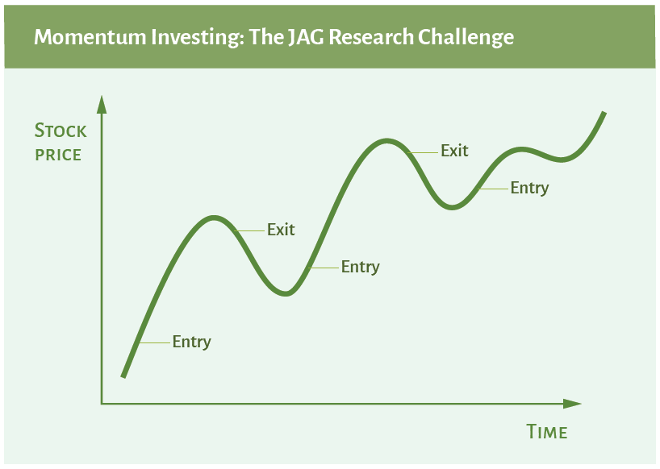

## Table of Contents

## What is momentum investing?

Momentum investing is a strategy where investors buy stocks that have been going up in price and sell stocks that have been going down. The idea is that stocks that are doing well will keep doing well for a while, and stocks that are doing badly will keep doing badly. This is different from other strategies where people might look at a company's value or earnings to decide whether to buy or sell.

People who use momentum investing believe that they can make money by following trends. They look at how a stock has performed over the last few months or a year, and if it's been going up, they buy it. They hope to sell it later at a higher price. This strategy can work, but it can also be risky because trends can change quickly, and if the trend reverses, investors could lose money.

## How does momentum investing differ from other investment strategies?

Momentum investing is different from other investment strategies because it focuses on the recent performance of a stock rather than its underlying value or financial health. In contrast, value investing involves looking for stocks that are priced lower than their intrinsic value, betting that the market will eventually recognize their true worth. Growth investing, on the other hand, targets companies expected to grow at an above-average rate compared to other companies in the market, often focusing on future earnings potential rather than current trends.

Another key difference is the time horizon and risk profile associated with [momentum](/wiki/momentum) investing. While value and growth investors might hold onto their stocks for years, waiting for their investment thesis to play out, momentum investors typically have a shorter time frame. They aim to capitalize on short-term trends and may buy and sell stocks more frequently. This can lead to higher transaction costs and potentially higher risks, as momentum investing relies heavily on the continuation of existing trends, which can reverse suddenly.

Overall, momentum investing is more about following the market's current direction rather than making judgments based on a company's fundamentals. It can be profitable in the short term but requires careful monitoring and quick decision-making. In contrast, value and growth investing often require a deeper analysis of a company's financial statements and a longer-term commitment to the investment.

## What are the key principles behind momentum investing?

Momentum investing is based on the idea that stocks that have been going up will keep going up for a while, and stocks that have been going down will keep going down. This means that investors who follow this strategy look at how a stock has been doing over the last few months or a year. If a stock has been going up, they buy it, hoping to sell it later at a higher price. They believe that they can make money by following these trends.

The key to momentum investing is to act quickly. Investors need to jump on a trend as soon as they see it and be ready to sell if the trend starts to change. This can be risky because trends can reverse suddenly, and if that happens, investors could lose money. But if they get it right, they can make good profits in a short time. Momentum investing is all about timing and being ready to move fast.

## Can you explain the concept of 'momentum' in the context of investing?

In investing, 'momentum' refers to the idea that stocks that have been going up in price will keep going up for a while, and stocks that have been going down will keep going down. It's like when you're pushing a ball down a hill. Once it starts rolling, it keeps going because it has momentum. In the stock market, if a stock has been doing well, more people might want to buy it because they see it's going up. This makes the price go up even more.

The key to using momentum in investing is to watch the trends closely. Investors look at how a stock has been doing over the last few months or a year. If it's been going up, they might buy it, hoping to sell it later at a higher price. But it's risky because trends can change quickly. If the trend starts to go the other way, the stock price can drop fast, and investors could lose money. So, people who use momentum investing need to be ready to act fast and make quick decisions.

## What are some common indicators used to identify momentum stocks?

To find momentum stocks, investors often look at how much a stock's price has gone up or down over the last few months or a year. They might use something called the Relative Strength Index (RSI), which shows if a stock is overbought or oversold. If the RSI is high, it means the stock has been going up a lot and might be due for a break. If it's low, the stock has been going down and might be ready to go back up.

Another common indicator is the stock's price trend. Investors look at charts to see if the stock has been making higher highs and higher lows, which is a sign of a strong upward trend. They also pay attention to the stock's trading [volume](/wiki/volume-trading-strategy). If a stock is going up and the volume is high, it means a lot of people are buying it, which can add to the momentum. By watching these indicators, investors try to jump on stocks that are likely to keep going up for a while.

## How can an investor start applying momentum investing in their portfolio?

To start using momentum investing, an investor should first look at how stocks have been doing lately. They can check the stock's price over the last few months or a year to see if it's been going up. Tools like the Relative Strength Index (RSI) can help. If the RSI is high, it means the stock has been going up a lot and might be due for a break. But if the RSI is low, it could mean the stock has been going down and might be ready to go back up. Also, looking at the stock's chart to see if it's making higher highs and higher lows can show if it's in a strong upward trend. And watching the trading volume can help too. If a stock is going up and a lot of people are buying it, that can add to the momentum.

Once an investor has found stocks with good momentum, they need to act quickly. Momentum investing is all about timing, so when they see a stock that's been going up, they should buy it, hoping to sell it later at a higher price. But they also need to keep an eye on the stock because trends can change fast. If the stock starts to go down, they should be ready to sell it before they lose money. This means they might need to check their stocks often and be ready to make quick decisions. Momentum investing can be exciting and profitable, but it's also risky, so it's important to be careful and stay on top of things.

## What are the potential risks associated with momentum investing?

Momentum investing can be risky because it relies on trends that can change quickly. If a stock has been going up and you buy it, hoping it will keep going up, you could lose money if the trend reverses suddenly. This can happen because of many reasons, like bad news about the company or changes in the market. If you're not watching your stocks closely, you might not sell them in time and end up losing money.

Another risk is that momentum investing can lead to buying stocks that are overvalued. When a stock has been going up a lot, its price might be higher than what the company is really worth. If the price gets too high, it might come crashing down, and you could lose a lot of money. Also, because momentum investors often buy and sell stocks quickly, they might have to pay more in trading fees and taxes, which can eat into their profits. So, while momentum investing can be exciting and profitable, it's important to be careful and understand these risks.

## How does one manage and mitigate risks in a momentum investing strategy?

To manage and mitigate risks in a momentum investing strategy, it's important to keep a close eye on your stocks. You need to watch them every day to see if the trend is still going up. If you see the trend starting to change, you should be ready to sell quickly. This means you might need to check your stocks often and be ready to make fast decisions. By staying on top of things, you can sell before a stock goes down too much and lose less money.

Another way to manage risk is to not put all your money into one stock. Instead, spread your money across different stocks. This way, if one stock goes down, you won't lose all your money. It's also a good idea to set stop-loss orders. A stop-loss order is like a safety net that automatically sells your stock if it goes down to a certain price. This can help you limit your losses. By using these strategies, you can make momentum investing less risky and protect your money better.

## What historical evidence supports the effectiveness of momentum investing?

Momentum investing has been shown to work well over time. Researchers have looked at how stocks did over many years and found that stocks that went up in the past kept going up for a while. A famous study by Jegadeesh and Titman in 1993 showed that if you bought stocks that did well over the last 3 to 12 months and held them for another 3 to 12 months, you could make more money than just [picking](/wiki/asset-class-picking) stocks at random. This study and others like it have given strong evidence that momentum investing can be a good way to make money in the stock market.

But it's not just old studies that support momentum investing. Even today, many investors and funds use this strategy and see good results. For example, some big investment firms have special funds that focus on momentum investing, and these funds often do better than the overall market. This shows that the idea of buying stocks that have been going up and selling those that have been going down can still work well in today's market.

## How can momentum investing be combined with other investment strategies?

Momentum investing can be combined with other strategies to make a stronger plan. For example, you might use momentum investing to pick stocks that are going up, but also look at how much those stocks are really worth, which is called value investing. If a stock is going up and it's also undervalued, it could be a good choice. This way, you're not just following the trend, but also making sure the stock has a good price compared to what the company is worth. Another way to mix strategies is to use growth investing along with momentum. You could pick stocks that are growing fast and also have good momentum. This can help you find companies that are doing well and likely to keep doing well.

Combining momentum investing with other strategies can help lower the risks. For example, if you use momentum investing but also set stop-loss orders, which automatically sell your stock if it goes down to a certain price, you can protect your money better. You could also use a mix of short-term momentum investing and long-term value or growth investing. This means you might buy stocks that are going up now, but also keep some stocks that you think will do well over many years. By mixing these strategies, you can try to make money from short-term trends and also from long-term growth, which can make your overall investment plan more balanced and less risky.

## What are advanced techniques used by expert momentum investors?

Expert momentum investors often use something called sector rotation to find the best stocks. This means they look at different parts of the market, like technology or healthcare, to see which ones are doing well. If they see that one sector is going up a lot, they might buy stocks from that sector. They also use something called relative strength to compare how well a stock is doing compared to others. If a stock is doing better than most others, it might be a good one to buy. By looking at sectors and comparing stocks, these investors can find the best opportunities and make more money.

Another advanced technique is using technical analysis to find the right time to buy and sell. This means they look at charts and patterns to see when a stock might go up or down. They might use tools like moving averages, which show the average price of a stock over time, to help them decide. If a stock's price goes above its moving average, it might be a good time to buy. If it goes below, it might be time to sell. By using these tools, expert momentum investors can make better decisions and try to get the best results from their investments.

## How does market psychology influence the success of momentum investing?

Market psychology plays a big role in how well momentum investing works. When a stock starts going up, more people see it and want to buy it too. They think, "If it's going up now, it will keep going up." This makes more people buy the stock, which pushes the price up even more. It's like a snowball rolling down a hill, getting bigger and faster. This is called the "herd mentality," where people follow what others are doing without thinking too much about it. Momentum investors use this to their advantage by jumping on these trends early and hoping to sell before the trend changes.

But market psychology can also make momentum investing risky. If everyone is buying a stock because it's going up, it can create a bubble. A bubble happens when the price of a stock gets too high and doesn't match what the company is really worth. When people start to realize this, they might all want to sell at the same time. This can make the stock price drop fast, and momentum investors could lose money if they don't sell in time. So, while following the crowd can work for a while, it's important to watch the market closely and be ready to act quickly if things start to change.

## References & Further Reading

[1]: Jegadeesh, N., & Titman, S. (1993). ["Returns to Buying Winners and Selling Losers: Implications for Stock Market Efficiency."](https://www.jstor.org/stable/2328882) The Journal of Finance, 48(1), 65-91.

[2]: Asness, C. S., Moskowitz, T. J., & Pedersen, L. H. (2013). ["Value and Momentum Everywhere."](https://pages.stern.nyu.edu/~lpederse/papers/ValMomEverywhere.pdf) The Journal of Finance, 68(3), 929-985.

[3]: [Quantitative Momentum: A Practitioner's Guide to Building a Momentum-Based Stock Selection System](https://books.google.com/books/about/Quantitative_Momentum.html?id=K2npCgAAQBAJ) by Wesley R. Gray and Jack R. Vogel

[4]: ["Algorithmic Trading and DMA: An Introduction to Direct Access Trading Strategies"](https://www.amazon.com/Algorithmic-Trading-DMA-introduction-strategies/dp/0956399207) by Barry Johnson

[5]: ["High-Frequency Trading: A Practical Guide to Algorithmic Strategies and Trading Systems"](https://www.wiley.com/en-us/High+Frequency+Trading%3A+A+Practical+Guide+to+Algorithmic+Strategies+and+Trading+Systems-p-9780470579770) by Irene Aldridge