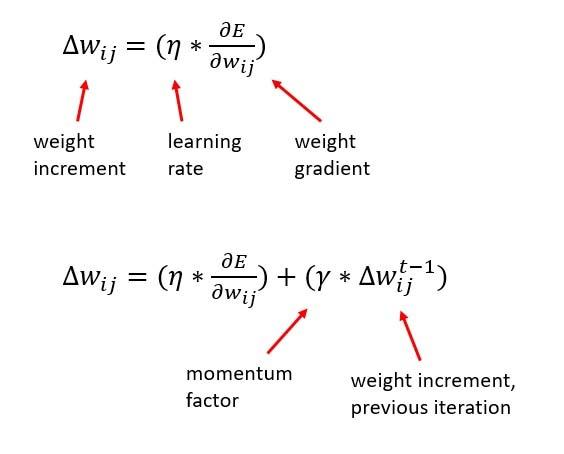

## Table of Contents

## What is Momentum in the context of Machine Learning?

Momentum in machine learning is a technique used to speed up the training of neural networks. It helps the optimization process by adding a fraction of the previous update vector to the current update vector. This means that the gradient descent algorithm not only moves in the direction of the current gradient but also keeps moving in the direction it was previously heading. This helps to overcome small local minima and to continue moving in the right direction, even if the gradient becomes very small.

Think of momentum like pushing a heavy ball down a hill. If you give the ball a good push, it will keep rolling even if the slope becomes gentler. In the same way, momentum in machine learning helps the optimization algorithm to keep moving even when the gradient is small. This can make the training process faster and more stable, especially for problems where the error surface has long, narrow valleys. By using momentum, the algorithm can move more quickly along these valleys, reaching the minimum more efficiently.

## How does Momentum help in optimizing neural networks?

Momentum helps in optimizing neural networks by making the learning process faster and more stable. Imagine you're rolling a ball down a hill. If you push the ball, it keeps moving even when the slope gets less steep. Momentum in neural networks works the same way. It adds a bit of the previous update to the current update, helping the network keep moving in the right direction even when the gradient, or the slope of the error, gets smaller. This means the network can learn faster and avoid getting stuck in small dips along the way.

In more technical terms, momentum adds a fraction of the previous update vector to the current update vector. If $$v_t$$ is the update vector at time $$t$$ and $$\nabla J(\theta_t)$$ is the gradient of the cost function at the current parameters $$\theta_t$$, the update rule with momentum can be described as:

$$v_t = \gamma v_{t-1} + \eta \nabla J(\theta_t)$$

$$\theta_{t+1} = \theta_t - v_t$$

Here, $$\gamma$$ is the momentum coefficient, usually set between 0 and 1, and $$\eta$$ is the learning rate. This formula shows how momentum helps the network keep moving in the direction it was going, making the learning process smoother and more efficient.

## What is the basic formula for Momentum in gradient descent?

Momentum in gradient descent is like giving your learning process a helpful push. Imagine you're rolling a ball down a hill. If you give it a good push, it keeps rolling even when the slope gets less steep. In the same way, momentum helps your neural network keep moving in the right direction even when the gradient, or the slope of the error, gets smaller. This makes the learning faster and helps avoid getting stuck in small dips along the way.

The basic formula for momentum in gradient descent adds a fraction of the previous update to the current update. If $$v_t$$ is the update vector at time $$t$$ and $$\nabla J(\theta_t)$$ is the gradient of the cost function at the current parameters $$\theta_t$$, the update rule with momentum can be written as:

$$v_t = \gamma v_{t-1} + \eta \nabla J(\theta_t)$$

$$\theta_{t+1} = \theta_t - v_t$$

Here, $$\gamma$$ is the momentum coefficient, usually set between 0 and 1, and $$\eta$$ is the learning rate. This formula helps the network keep moving smoothly towards the best solution.

## Can you explain the difference between standard gradient descent and Momentum-based gradient descent?

Standard gradient descent is like taking steps down a hill to find the lowest point. You look at the slope of the hill where you are standing, and then you take a step in the direction that goes downhill the most. The size of the step depends on the learning rate, which you decide at the start. If the learning rate is too small, it might take a long time to reach the bottom. If it's too big, you might jump over the bottom and start going uphill again. The formula for standard gradient descent is simple: $$\theta_{t+1} = \theta_t - \eta \nabla J(\theta_t)$$, where $$\theta_t$$ is the current parameter, $$\eta$$ is the learning rate, and $$\nabla J(\theta_t)$$ is the gradient of the cost function at the current point.

Momentum-based gradient descent is like rolling a ball down the same hill, but now you give the ball a push. This push helps the ball keep rolling even when the slope gets less steep. In terms of the math, momentum adds a bit of the previous step to the current step. The formula for momentum-based gradient descent is: $$v_t = \gamma v_{t-1} + \eta \nabla J(\theta_t)$$ and $$\theta_{t+1} = \theta_t - v_t$$, where $$v_t$$ is the update vector at time $$t$$, $$\gamma$$ is the momentum coefficient (usually between 0 and 1), and the other symbols are the same as in standard gradient descent. This method helps the ball (or the learning process) move faster and more smoothly, especially when the hill has long, gentle slopes. It can also help avoid getting stuck in small dips along the way.

## How does the Momentum parameter affect the learning process?

The momentum parameter, often called $$\gamma$$ (gamma), plays a big role in how fast and smoothly a neural network learns. When you set $$\gamma$$ to a value between 0 and 1, it decides how much of the previous update you want to keep for the next step. If $$\gamma$$ is close to 1, the network remembers a lot of the past, making it move faster and smoother down the hill. But if it's too close to 1, the network might overshoot and miss the best solution. If $$\gamma$$ is close to 0, the network forgets the past quickly, acting more like standard gradient descent, which can be slower but more cautious.

Choosing the right value for $$\gamma$$ is important. A good balance helps the network learn quickly without jumping over the best solution. For example, setting $$\gamma$$ to around 0.9 often works well because it gives the network enough memory of past steps to keep moving smoothly, but not so much that it overshoots. By tweaking $$\gamma$$, you can make the learning process more efficient and help the network find the best solution faster.

## What are the advantages of using Momentum in training deep learning models?

Momentum helps deep learning models learn faster and smoother. Imagine you're rolling a ball down a hill. If you give the ball a good push, it keeps rolling even when the slope gets less steep. Momentum in deep learning works the same way. It adds a bit of the previous step to the current step, helping the model keep moving in the right direction even when the gradient, or the slope of the error, gets smaller. This means the model can learn quicker and avoid getting stuck in small dips along the way.

The momentum parameter, often called $$\gamma$$ (gamma), controls how much of the past steps the model remembers. If $$\gamma$$ is close to 1, the model remembers a lot, making it move faster and smoother. But if it's too close to 1, the model might overshoot and miss the best solution. If $$\gamma$$ is close to 0, the model forgets the past quickly, acting more like regular learning, which can be slower but more careful. By choosing the right value for $$\gamma$$, usually around 0.9, you can make the learning process more efficient and help the model find the best solution faster.

## Can you describe a scenario where Momentum would significantly improve model training?

Imagine you're training a deep learning model to recognize different types of fruits from images. The error surface, which is like a landscape the model has to navigate, has long, narrow valleys. Without momentum, the model might move very slowly down these valleys because the gradient, or the slope of the error, can be very small. But with momentum, the model can keep moving smoothly and quickly along these valleys, like a ball rolling down a hill with a good push. This helps the model learn faster and reach the best solution more efficiently.

In this scenario, using momentum with a parameter $$\gamma$$ set to around 0.9 would be very helpful. This value of $$\gamma$$ means the model remembers a good amount of its past steps, which helps it keep moving in the right direction even when the gradient is small. By adding a bit of the previous update to the current update, the model can avoid getting stuck in small dips and reach the bottom of the valley faster. This makes the training process much smoother and more efficient, leading to better performance in recognizing fruits from images.

## What are the potential drawbacks or limitations of using Momentum?

While momentum can make training deep learning models faster and smoother, it also has some potential drawbacks. One big problem is that if the momentum parameter, called $$\gamma$$, is set too high, the model might overshoot the best solution. Imagine you're rolling a ball down a hill and you give it too big of a push. The ball might roll past the bottom and start going uphill again. In the same way, if $$\gamma$$ is too close to 1, the model might miss the best solution and take longer to find it.

Another limitation is that momentum can make the model less stable. If the error surface has a lot of ups and downs, the model might start swinging back and forth instead of moving smoothly to the best solution. This can make the training process slower and harder to control. Choosing the right value for $$\gamma$$ is important, but it can be tricky. If it's too low, the model might not get the benefits of momentum and learn slowly. If it's too high, the model might become unstable and overshoot the best solution.

## How do you choose the right Momentum value for a specific problem?

Choosing the right momentum value, or $$\gamma$$, for a specific problem can be a bit tricky but important. You want to find a balance where the model remembers enough of its past steps to move smoothly but not so much that it overshoots the best solution. A common starting point is to set $$\gamma$$ to around 0.9. This value often works well because it gives the model enough memory of past steps to keep moving smoothly down the error surface without going too fast and missing the best solution.

To find the best $$\gamma$$ for your problem, you can try different values and see how the model performs. You might start with 0.9 and then try values like 0.8 or 0.95 to see if the model learns faster or more smoothly. Watching how the model's performance changes with different $$\gamma$$ values can help you find the sweet spot that makes your model learn the best.

## What is Nesterov Accelerated Gradient (NAG) and how does it relate to Momentum?

Nesterov Accelerated Gradient (NAG) is a tweak to the regular momentum method that makes the learning process even faster and smoother. Imagine you're rolling a ball down a hill again. With regular momentum, you give the ball a push and then check where it is. But with NAG, you look ahead to where the ball will be after the push and then adjust your direction based on that. This helps the ball move more directly towards the bottom of the hill, avoiding overshooting or getting stuck in small dips along the way.

In technical terms, NAG adjusts the update rule by first taking a step in the direction of the previous momentum and then calculating the gradient at that new point. The update rules for NAG are $$v_t = \gamma v_{t-1} + \eta \nabla J(\theta_t - \gamma v_{t-1})$$ and $$\theta_{t+1} = \theta_t - v_t$$. Here, $$\gamma$$ is the momentum coefficient, $$\eta$$ is the learning rate, and $$\nabla J(\theta_t - \gamma v_{t-1})$$ is the gradient calculated at the point where the model would be if it took a step based on the previous momentum. By looking ahead, NAG can correct its course more effectively, leading to faster and more stable learning.

## How can Momentum be combined with other optimization techniques like Adam or RMSprop?

Momentum can be combined with other optimization techniques like Adam or RMSprop to make the learning process even better. Imagine you're rolling a ball down a hill. Momentum gives the ball a good push, helping it move smoothly. Adam and RMSprop are like special shoes that help the ball adjust its steps based on how steep the hill is. By combining momentum with Adam or RMSprop, you get the smooth movement of momentum and the smart step adjustments of Adam or RMSprop. This can make the model learn faster and find the best solution more efficiently.

For example, Adam uses both momentum and a way to adjust the learning rate based on past gradients. The formula for Adam's update rule with momentum is $$m_t = \beta_1 m_{t-1} + (1 - \beta_1) g_t$$ and $$v_t = \beta_2 v_{t-1} + (1 - \beta_2) g_t^2$$, where $$m_t$$ is the first moment estimate, $$v_t$$ is the second moment estimate, $$g_t$$ is the gradient at time $$t$$, and $$\beta_1$$ and $$\beta_2$$ are hyperparameters. The parameter update is then $$\theta_{t+1} = \theta_t - \eta \frac{\hat{m}_t}{\sqrt{\hat{v}_t} + \epsilon}$$, where $$\hat{m}_t$$ and $$\hat{v}_t$$ are bias-corrected estimates, and $$\eta$$ and $$\epsilon$$ are additional hyperparameters. This combination helps the model learn quickly and smoothly, making it a popular choice for many deep learning tasks.

## What advanced strategies can be employed to adapt Momentum during training?

One advanced strategy to adapt momentum during training is to use a technique called "learning rate scheduling." This means changing the momentum value, or $$\gamma$$, as the training goes on. At the start, you might set $$\gamma$$ to a lower value like 0.5 to be cautious and avoid overshooting. As the training progresses and the model gets closer to the best solution, you can increase $$\gamma$$ to a higher value like 0.95. This helps the model keep moving smoothly and quickly towards the best solution. You can use a simple formula like $$\gamma_t = \gamma_0 + (1 - \gamma_0) \cdot \frac{t}{T}$$ to increase $$\gamma$$ over time, where $$\gamma_t$$ is the momentum at time $$t$$, $$\gamma_0$$ is the initial momentum, and $$T$$ is the total number of training steps.

Another strategy is to use adaptive momentum methods, like the one used in the Adam optimizer. Adam combines momentum with a way to adjust the learning rate based on past gradients. It uses two parameters, $$\beta_1$$ and $$\beta_2$$, to control how much the model remembers the past. By setting $$\beta_1$$ to a value like 0.9, Adam can keep moving smoothly like regular momentum. But it also uses $$\beta_2$$ to adjust the learning rate based on the size of past gradients, which helps the model learn faster and more efficiently. This combination makes Adam very good at finding the best solution quickly and smoothly.

You can also try using techniques like "momentum restart." This means resetting the momentum to zero at certain points during training. Imagine you're rolling a ball down a hill, and it starts going in the wrong direction. By stopping the ball and giving it a new push, you can help it find the right path again. You can use a formula like $$v_t = 0$$ every $$k$$ steps to reset the momentum, where $$v_t$$ is the momentum at time $$t$$ and $$k$$ is a chosen interval. This can help the model avoid getting stuck and find the best solution more efficiently.