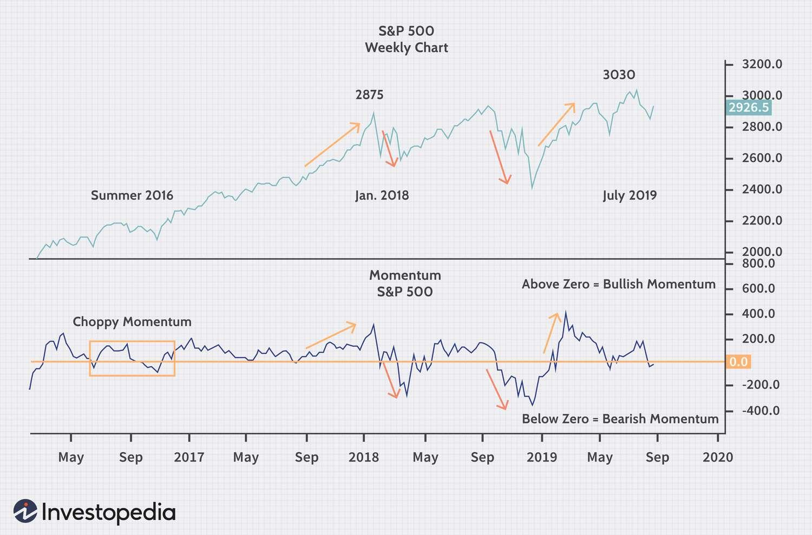

In the fast-paced world of financial markets, a thorough understanding of market strength, stock price momentum, and algorithmic trading is crucial for gaining a competitive edge. By focusing on these core concepts, traders and investors can transform complex market dynamics into actionable insights. Momentum, as a trading strategy, effectively taps into the market's pulse by identifying the speed and direction of price movements, enabling traders to capitalize on market trends as they unfold. This strategy has become increasingly essential in contemporary algorithmic trading, where automated systems are designed to execute trades with precision based on predefined rules.

Momentum indicators, such as the Relative Strength Index (RSI) and the Moving Average Convergence Divergence (MACD), play a vital role in signaling market shifts. These tools analyze past price data to predict future movements, allowing traders to anticipate market trends and make informed decisions. The integration of these indicators into algorithmic trading systems enhances the ability to react swiftly to market changes, reducing reliance on human intervention and minimizing error.



Moreover, there exists a powerful synergy between market strength and stock price momentum. Market strength, often reflected through economic indicators and investor sentiment, provides the foundational environment in which momentum strategies thrive. Understanding this relationship is crucial as it underpins the evolution of trading strategies that adapt to the ever-changing market landscape.

In conclusion, market strength, stock price momentum, and algorithmic trading collectively shape the modern trading ecosystem. Continuous adaptation and learning are essential for traders and investors to fully harness the potential of momentum-based strategies, ensuring successful outcomes in today's dynamic financial markets.

## Table of Contents

## Understanding Market Strength

Market strength is a concept that encompasses the collective influence of buyers and sellers in determining price movements across financial markets. Its importance is underscored by several key factors that contribute to market dynamics, chiefly economic indicators, corporate earnings, and macroeconomic trends.

**Factors Influencing Market Strength:**

1. **Economic Indicators:** Economic indicators such as GDP growth rates, employment figures, and inflation data serve as barometers of economic health. These indicators impact investor expectations and behavior, which in turn affect market strength. For instance, a robust GDP growth rate often enhances investor confidence, prompting increased buying, which contributes to stronger market movements.

2. **Corporate Earnings:** The financial performance of companies, reflected through their earnings reports, is a crucial determinant of market strength. When companies report higher-than-expected earnings, it often boosts investor confidence, leading to increased stock purchases and higher market strength. Conversely, disappointing earnings can weaken market sentiment and reduce buying interest.

3. **Macroeconomic Trends:** Broader economic trends such as interest rate changes, fiscal policies, and international trade agreements play vital roles. For example, an interest rate cut by a central bank usually lowers borrowing costs, encouraging investments and spending, thereby strengthening markets.

**Market Sentiment and Investor Confidence:**

Market sentiment, an aggregate of the attitudes and expectations of market participants, exerts a significant influence on market strength. Investor confidence, often shaped by psychological factors, relies on perceptions of risk, potential returns, and broader economic conditions. Bullish sentiment can amplify market strength as optimistic investors engage more buying activities, while bearish sentiment might lead to selling pressures and diminished market strength.

**Technical Tools for Measuring Market Strength:**

1. **Volume Analysis:** Volume analysis involves examining the number of shares or contracts traded over a specified period. Higher trading volumes often indicate strong market interest, suggesting robust market strength. Conversely, lower volumes might signal weak market strength due to tepid buying or selling interest.

2. **Trend Indicators:** Indicators such as Moving Averages, the Average Directional Index (ADX), and Bollinger Bands assist traders in assessing market trends and strength. For instance, a rising ADX can indicate a strengthening trend, while converging Bollinger Bands might suggest a potential rise in market strength due to impending volatility.

Understanding market strength is essential for anticipating market patterns and trends. By gauging the forces of supply and demand through the lens of economic indicators, corporate performance, and macroeconomic conditions, traders and investors can better formulate strategies to exploit opportunities and mitigate risks in ever-changing markets.

## Momentum in Stock Prices

Momentum in stock prices refers to the speed or velocity of price changes and plays a crucial role in technical analysis. It serves as a key indicator of the underlying strength of a price trend. Traders and investors monitor this to make informed decisions on market entry and [exit](/wiki/exit-strategy) points. A strong [momentum](/wiki/momentum) may signal the continuation of a trend, whereas weak momentum might indicate an impending reversal.

The psychological foundations of momentum trading encapsulate the behavior of market participants. The premise is that securities which have performed well in the past will continue to do so, while those with poor performance will remain under pressure. This belief often becomes a self-fulfilling prophecy as traders collectively drive prices in one direction. Momentum trading has historically shown robust performance in both bull and bear markets. During bull markets, positive momentum amplifies upward trends, while in bear markets, negative momentum accelerates declines. 

Two popular momentum indicators utilized in technical analysis are the Relative Strength Index (RSI) and the Moving Average Convergence Divergence (MACD). The RSI measures the magnitude of recent price changes to evaluate overbought or oversold conditions. It is calculated as follows:

$$

RSI = 100 - \left( \frac{100}{1 + \text{RS}} \right)
$$

where RS (Relative Strength) is the average of 'n' days' up closes divided by the average of 'n' days' down closes. The RSI scale ranges from 0 to 100, with levels above 70 indicating overbought conditions and levels below 30 suggesting oversold conditions. 

The MACD, on the other hand, is a trend-following momentum indicator that shows the relationship between two moving averages of a security's price. It is calculated by subtracting the 26-period Exponential Moving Average (EMA) from the 12-period EMA. The formula is:

$$

\text{MACD} = \text{EMA}_{12} - \text{EMA}_{26}
$$

A nine-day EMA of the MACD, called the "signal line," is then plotted on top of the MACD line to function as a trigger for buy and sell signals.

Momentum serves a dual role: it acts as a diagnostic tool to assess trend strength and as a predictive tool for future price movements. As a diagnostic tool, momentum aids in confirming trend directions and gauging the intensity of buyer or seller interest. As a predictive tool, momentum helps in forecasting potential price shifts, providing early warning signals of trend reversals. The significance of momentum analysis lies in its ability to provide timely insights into market dynamics, helping traders capitalize on price movements effectively.

## Algorithmic Trading: Leveraging Momentum

Algorithmic trading employs a systematic, rules-based approach to optimize the execution of trades by leveraging computational power. Momentum strategies are integral to this design, facilitating rapid response to stock price movements with minimal human error. Algorithms harness momentum to detect trends, initiating buy or sell orders when specific conditions are met, such as price movements exceeding a predefined threshold. This automation reduces the latency involved in decision-making, allowing traders to capitalize on market opportunities swiftly.

The integration of big data and [machine learning](/wiki/machine-learning) has significantly enhanced the precision and efficiency of momentum-based strategies. Algorithms analyze vast datasets from various sources, including news articles, financial reports, and social media, to identify patterns that human traders might overlook. Machine learning models, particularly neural networks, can be trained on historical data to predict price movements, continuously refining their algorithms to adapt to changing market conditions. This iterative learning process enables more accurate identification of momentum signals, thereby optimizing trade performance.

To construct an [algorithmic trading](/wiki/algorithmic-trading) model incorporating momentum analysis, one begins by selecting appropriate momentum indicators, such as the Relative Strength Index (RSI) or the Moving Average Convergence Divergence (MACD). These indicators help quantify market momentum and serve as input parameters for the algorithm. The next step involves developing a strategy, which includes setting entry and exit rules based on momentum signals. For example, an algorithm might be programmed to buy a stock when the RSI crosses above 70, indicating overbought conditions, and sell when it falls below 30, indicating oversold conditions.

The algorithm's effectiveness is evaluated through [backtesting](/wiki/backtesting), which involves running the strategy on historical price data to assess its potential profitability and risk exposure. The backtesting phase is crucial for identifying any adjustments needed before deploying the algorithm in live trading environments. Here's a simple Python example illustrating a momentum-based strategy using the RSI indicator:

```python
import pandas as pd
import numpy as np

def calculate_rsi(data, window=14):
    delta = data['Close'].diff()
    gain = (delta.where(delta > 0, 0)).rolling(window=window).mean()
    loss = (-delta.where(delta < 0, 0)).rolling(window=window).mean()
    rs = gain / loss
    return 100 - (100 / (1 + rs))

def momentum_strategy(data):
    data['RSI'] = calculate_rsi(data)
    data['Signal'] = 0
    data.loc[data['RSI'] > 70, 'Signal'] = -1 
    data.loc[data['RSI'] < 30, 'Signal'] = 1 
    return data

# Assuming 'market_data' is a DataFrame with a 'Close' column representing stock prices
# market_data = pd.read_csv('market_data.csv')
# with applied momentum strategy
# market_data = momentum_strategy(market_data)
```

Real-world applications of algorithmic trading using momentum strategies reveal their strength in volatile markets. For instance, during high market [volatility](/wiki/volatility-trading-strategies), momentum strategies can pivot swiftly between long and short positions, exploiting rapid price movements. Case studies, such as their use in the foreign exchange market or [cryptocurrency](/wiki/cryptocurrency) trading, demonstrate their capacity to yield significant returns by harnessing volatility-induced trends.

In conclusion, the integration of momentum strategies with algorithmic trading empowers traders to execute orders with precision and speed. The melding of computational algorithms, big data analytics, and machine learning paves the way for sophisticated, adaptive trading systems, marking a new era in financial markets where momentum-driven decisions surge ahead of manual trading processes.

## Building an Effective Momentum Strategy

Building an effective momentum trading strategy requires a systematic approach, beginning with the selection of appropriate indicators and thorough backtesting. Momentum indicators are essential for identifying the strength and speed of price movements. Popular tools like the Relative Strength Index (RSI), Moving Average Convergence Divergence (MACD), and Average Directional Index (ADX) provide insights into price trends and potential reversals. The selection of these indicators depends on the specific market conditions and asset class being analyzed.

Backtesting, a critical component of strategy validation, involves testing the momentum strategy on historical data to assess its performance and robustness. This process helps identify potential pitfalls and refine the strategy before live implementation. Commonly used software for backtesting, such as Python’s Backtrader or R’s quantstrat, allows traders to simulate trading performance under various conditions, ensuring that the strategy is sound and effective over diverse market scenarios.

Diversification and risk management are cornerstones of a resilient momentum strategy. By diversifying across different asset classes such as stocks, commodities, and cryptocurrencies, traders can mitigate the risks associated with any single market. This approach reduces the impact of market-specific volatility and ensures more stable returns. Risk management techniques, such as setting stop-loss orders and position sizing, help in controlling potential losses and maintaining a favorable risk-reward ratio.

Implementing momentum strategies across various asset classes involves recognizing the unique characteristics of each market. Stocks, for instance, often exhibit trends driven by earnings reports and economic indicators, while commodities may respond more to changes in supply and demand dynamics. Cryptocurrencies, with their high volatility and speculative nature, require adaptable momentum strategies that account for rapid price changes.

Technical analysis, focused on interpreting market data like price charts and [volume](/wiki/volume-trading-strategy), complements momentum strategies by providing additional context to price movements. Combined with [fundamental analysis](/wiki/fundamental-analysis), which considers factors such as economic indicators, industry trends, and company financials, traders can develop a more holistic view of market behavior. This integration aids in decision-making and enhances the accuracy of momentum-based strategies.

Adaptation to changing market conditions is paramount. Markets are inherently dynamic, and a strategy successful in one environment may falter in another. Continuous monitoring and strategy adjustment ensure that the trading approach remains effective. This adaptability extends to optimizing strategies for different timeframes. Short-term traders might focus on minute-by-minute price changes, whereas longer-term investors could apply momentum strategies over weeks or months, each requiring different calibrations based on volatility and trend sustainability.

In conclusion, creating a robust momentum trading strategy involves a blend of technical and fundamental analysis, rigorous testing, diversification, and proactive risk management. By continuously adapting to market conditions and refining approaches based on performance and market feedback, traders can effectively navigate complex markets and capitalize on momentum-driven opportunities.

## The Future of Momentum-Based Algorithmic Trading

The future of momentum-based algorithmic trading is increasingly intertwined with the rapid advancements in [artificial intelligence](/wiki/ai-artificial-intelligence) (AI) and machine learning (ML). These technologies are poised to redefine the efficiency and capabilities of trading systems by providing more accurate momentum detection and prediction models. The availability of large datasets and sophisticated analytics tools allows for deeper insights into market behaviors, enabling the fine-tuning of momentum strategies.

As AI and ML continue to evolve, they offer significant advantages in modeling market dynamics. Algorithms can now process vast amounts of historical and real-time data to uncover patterns and signals that could be indicative of momentum trends. Machine learning techniques, including [reinforcement learning](/wiki/reinforcement-learning) and [deep learning](/wiki/deep-learning), are particularly promising for adaptive systems that can adjust strategies based on live market conditions.

Despite the promise these technologies hold, momentum-based trading strategies face challenges from both technological and regulatory perspectives. The increasing complexity of algorithms poses a risk of creating opaque systems whose decisions are not easily interpretable by humans. Moreover, the potential for overfitting in models could lead to a degradation of performance in live trading environments.

Regulatory changes also present a notable challenge. As financial markets become more dependent on algorithmic trading, regulators are implementing stricter controls to ensure market stability. These include mandates for algorithm transparency, audit trails, and the mitigation of systemic risks posed by high-frequency trading. Consequently, traders and institutions must be proactive in complying with evolving regulations without compromising the agility and innovation that characterize algorithmic strategies.

To maintain a competitive edge, traders and institutions need to embrace continual learning and adaptation. This involves staying informed about technological advances and regulatory updates, while also investing in research and development to refine algorithmic strategies. Building interdisciplinary teams that combine quantitative expertise with market intuition can help in creating more robust trading systems that leverage both AI-driven insights and human experience.

The balance between technology and human intuition remains crucial as we progress towards more technology-driven markets. While AI can optimize and enhance decision-making processes, human oversight is essential to interpret model outputs, manage risks, and make judgment calls in volatile market situations. As such, traders and investors must strive for a symbiotic relationship between statistical models and strategic human inputs to maximize the potential of momentum-based algorithmic trading in the future.

## Conclusion

The intricate connection between market strength, stock price momentum, and algorithmic trading forms a cornerstone of modern trading strategies. Market strength provides the foundational metrics that illustrate the collective behavior of buyers and sellers, while stock price momentum captures the prevailing trends that can indicate future price directions. Together, they offer a comprehensive view that enhances the efficacy of algorithmic trading strategies. Algorithmic trading leverages these insights by automating decision-making processes, thus facilitating more consistent and timely execution of trades.

Continuous learning and adaptation are essential for traders and investors aiming to leverage momentum strategies effectively. As financial markets evolve, so too must the strategies employed; this involves staying informed about the latest technological advancements and understanding their implications on momentum analysis. Incorporating technical innovation alongside time-tested trading principles ensures a well-rounded approach that can adjust to market fluidity.

Key takeaways from this exploration emphasize that momentum analysis serves as a crucial tool in predicting market dynamics, providing traders with actionable intelligence to optimize their trading decisions. Employing momentum concepts not only helps in diagnosing trends but also in anticipating potential shifts, allowing for more informed and strategic positioning in the market. 

Readers are encouraged to further investigate these concepts to enhance their trading techniques. Engaging with ongoing research, exploring diverse datasets, and applying state-of-the-art algorithms can empower traders to navigate the volatile landscape of financial markets. By doing so, they can better align their strategies with market developments and maintain a competitive edge.

## References & Further Reading

[1]: Bergstra, J., Bardenet, R., Bengio, Y., & Kégl, B. (2011). ["Algorithms for Hyper-Parameter Optimization."](https://papers.nips.cc/paper/4443-algorithms-for-hyper-parameter-optimization) Advances in Neural Information Processing Systems 24.

[2]: ["Advances in Financial Machine Learning"](https://www.amazon.com/Advances-Financial-Machine-Learning-Marcos/dp/1119482089) by Marcos Lopez de Prado

[3]: ["Evidence-Based Technical Analysis: Applying the Scientific Method and Statistical Inference to Trading Signals"](https://www.amazon.com/Evidence-Based-Technical-Analysis-Scientific-Statistical/dp/0470008741) by David Aronson

[4]: ["Machine Learning for Algorithmic Trading"](https://github.com/stefan-jansen/machine-learning-for-trading) by Stefan Jansen

[5]: ["Quantitative Trading: How to Build Your Own Algorithmic Trading Business"](https://www.amazon.com/Quantitative-Trading-Build-Algorithmic-Business/dp/1119800064) by Ernest P. Chan