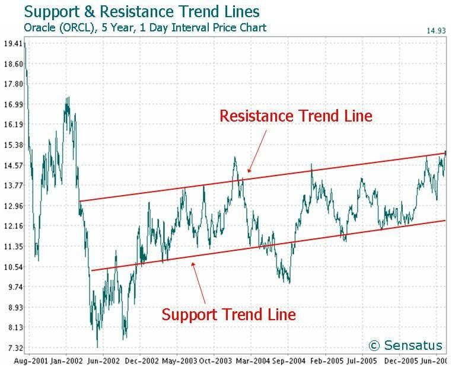

## Table of Contents

## What is a momentum strategy in investing?

A momentum strategy in investing is when you buy stocks that have been going up in price and sell stocks that have been going down. The idea is that stocks that have been doing well will keep doing well for a while, and stocks that have been doing badly will keep doing badly. This strategy is based on the belief that trends in stock prices can last for some time.

People who use momentum strategies look at how stocks have performed over the last few months to decide which ones to buy or sell. They think that if a stock has been going up, it might keep going up because more people will want to buy it. On the other hand, if a stock has been going down, they might sell it because they think it will keep going down as more people sell it. This approach tries to take advantage of these trends before they change.

## How does momentum investing differ from other investment strategies?

Momentum investing is different from other strategies because it focuses on the recent performance of stocks rather than their long-term value or fundamentals. While value investing looks for stocks that are underpriced based on their earnings or assets, momentum investing ignores these factors and simply follows the trend. For example, a value investor might buy a stock that is cheap compared to its earnings, hoping it will eventually rise in price. In contrast, a momentum investor would buy a stock that has already been going up, expecting it to keep rising.

Another key difference is how momentum investing compares to growth investing. Growth investing involves picking stocks of companies expected to grow faster than others, often based on future earnings potential. Momentum investors, however, are less concerned with a company's growth prospects and more focused on its stock price movement over the past few months. They believe that stocks that have been rising will continue to do so due to investor psychology and market trends, rather than the company's actual growth.

Overall, momentum investing stands out because it's all about riding the wave of recent price movements, rather than digging into a company's financial health or future potential. It's a strategy that tries to make money from short-term trends, which can be risky but can also lead to quick gains if the trends continue as expected.

## What are the basic principles behind momentum strategies?

Momentum strategies in investing are based on the idea that stocks that have been going up will keep going up for a while, and stocks that have been going down will keep going down. This is because more people want to buy stocks that are already doing well, which can push the price up even more. On the other hand, if a stock is going down, more people might want to sell it, which can make the price drop even more. Momentum investors look at how stocks have been doing over the last few months to decide which ones to buy or sell. They think that by following these trends, they can make money before the trend changes.

The main principle behind momentum strategies is the belief in trends. Investors using this approach believe that trends can last for some time, so they try to jump on them early and get out before they end. This means they are not so much interested in why a stock is going up or down, but just that it is moving in one direction. They use simple rules to decide when to buy or sell, like buying stocks that have gone up a lot in the last six months and selling stocks that have gone down a lot in that time. This way, they try to make money from the momentum of the stock's price movement, without worrying about the company's long-term value or growth.

## Can you explain the concept of price momentum in stocks?

Price momentum in stocks is when a stock's price keeps moving in the same direction for a while. If a stock's price has been going up over the last few months, it might keep going up because more people want to buy it. This is because people see the price going up and think it will keep going up, so they buy it too. On the other hand, if a stock's price has been going down, it might keep going down because more people want to sell it. They see the price dropping and think it will keep dropping, so they sell it before it goes down even more.

Momentum investors use this idea to make money. They look at how a stock has been doing over the last few months and decide to buy it if it's been going up. They think that if a lot of people are buying the stock and pushing the price up, it will keep going up for a while. If a stock has been going down, they might sell it or not buy it, expecting it to keep going down. This way, they try to ride the wave of the stock's price movement, hoping to buy low and sell high before the trend changes.

## What historical evidence supports the effectiveness of momentum strategies?

Historical evidence shows that momentum strategies can work well in the stock market. Studies have found that stocks that have been going up in the past few months tend to keep going up for a while. One famous study from 1993 by Jegadeesh and Titman looked at U.S. stocks from 1965 to 1989. They found that stocks that did well in the last 3 to 12 months often kept doing well in the next few months. This means that if you bought stocks that were going up and sold stocks that were going down, you could make more money than just picking stocks randomly.

Other research has backed up these findings. For example, a study by Carhart in 1997 showed that momentum was a strong factor in explaining stock returns, even when you consider other things like size and value. Momentum strategies have been found to work not just in the U.S. but in other countries too. This suggests that the idea of buying stocks that are already going up and selling stocks that are going down can be a good way to make money in the stock market, at least for a while.

## How do you identify stocks with strong momentum?

To identify stocks with strong momentum, you look at how their prices have changed over the last few months. A common way is to check if a stock has gone up a lot compared to other stocks in the same time. You can do this by looking at the stock's price returns over the last 3 to 12 months. If a stock has been going up more than most other stocks, it might have strong momentum. You can also use tools like moving averages, which show the average price of a stock over a certain time, to see if the price is trending up.

Another way to spot stocks with strong momentum is by looking at trading volume. If a stock's price is going up and more people are trading it than usual, that can be a sign of strong momentum. High trading volume means more people are interested in the stock, which can push the price up even more. You can use stock screeners or financial websites to find stocks that meet these criteria. By combining price performance and trading volume, you can get a good idea of which stocks have strong momentum and might keep going up for a while.

## What are the common metrics used to measure momentum in stocks?

To measure momentum in stocks, one common metric is the stock's price performance over the last few months. Investors often look at the returns of a stock over periods like 3, 6, or 12 months. If a stock has gone up a lot more than other stocks during this time, it's seen as having strong momentum. This means it might keep going up because more people want to buy it.

Another metric used is the stock's trading volume. When a stock's price is going up and more people are trading it than usual, this can show strong momentum. High trading volume means more people are interested in the stock, which can push the price up even more. By looking at both the price performance and trading volume, investors can get a good idea of which stocks have strong momentum and might keep going up for a while.

## What are the risks associated with momentum investing?

Momentum investing can be risky because it relies on trends that can change quickly. If a stock has been going up and you buy it, hoping it will keep going up, it might suddenly start going down instead. This can happen if something unexpected happens with the company or the market, and then you might lose money. Momentum investing doesn't look at why a stock is going up or down, just that it is moving in one direction. This means you might be buying a stock that is actually not doing well in the long run, but its price is going up for other reasons.

Another risk is that momentum investing can lead to buying stocks at high prices. If everyone is buying a stock because it's going up, the price can get very high. If the trend changes and the price starts to drop, you might have to sell at a loss. Also, momentum investing can make the market more volatile because everyone is buying and selling based on short-term trends. This can make prices go up and down a lot, which can be risky for your investments.

## How can an investor implement a momentum strategy in their portfolio?

To implement a momentum strategy in your portfolio, you first need to find stocks that have been going up a lot over the last few months. You can do this by looking at how much a stock's price has gone up compared to other stocks in the same time. Websites and tools like stock screeners can help you find these stocks. Once you find stocks with strong momentum, you buy them, hoping they will keep going up for a while. It's also a good idea to check how many people are trading these stocks, because if a lot of people are buying, it might push the price up even more.

After you buy these stocks, you need to keep an eye on them. If the stock keeps going up, you might want to hold onto it. But if it starts to go down, you might want to sell it before it loses too much value. Momentum investing is about jumping on trends early and getting out before they change. It's important to have a plan for when to sell, like if the stock goes down by a certain amount or after a certain time. This way, you can try to make money from the stock's price movement without holding onto it for too long.

## What are some advanced techniques for optimizing momentum strategies?

To optimize momentum strategies, you can use something called relative strength. This means you compare how well a stock is doing compared to other stocks or to the whole market. If a stock is doing much better than everything else, it might be a good one to buy. You can also use a thing called moving averages to help you. Moving averages show the average price of a stock over a certain time, like 50 days or 200 days. If the short-term moving average (like 50 days) goes above the long-term moving average (like 200 days), it can be a sign that the stock's price is starting to go up fast, which is good for momentum investing.

Another way to make your momentum strategy better is by using stop-loss orders. A stop-loss order is when you tell your broker to sell a stock if it goes down by a certain amount. This can help you not lose too much money if the stock's price suddenly starts to drop. You can also look at how much people are trading a stock, which is called volume. If a stock's price is going up and a lot of people are trading it, that can be a strong sign of momentum. By combining these techniques, you can make your momentum strategy work better and maybe make more money.

## How do market conditions affect the performance of momentum strategies?

Market conditions can really change how well momentum strategies work. When the market is going up and everyone is feeling good about investing, momentum strategies can do very well. This is because more people want to buy stocks that are already going up, which can make their prices go up even more. But if the market starts to go down, momentum strategies can have a hard time. When everyone is worried and selling their stocks, even the ones that were going up can start to go down. So, momentum investors need to be careful and watch the market to see if it's a good time for their strategy.

Sometimes, big events like economic news or changes in interest rates can shake up the market and affect momentum strategies. If something unexpected happens, like a big company doing badly or a new law being passed, it can make stock prices move a lot. This can either help or hurt momentum investors, depending on which way the prices move. Momentum strategies work best when trends last for a while, so if the market is very up and down, it can be harder to make money with this approach.

## What role does behavioral finance play in the success of momentum strategies?

Behavioral finance helps explain why momentum strategies can work. It looks at how people's feelings and actions affect the stock market. When people see a stock going up, they often want to buy it too, thinking it will keep going up. This is called the fear of missing out, or FOMO. Because of FOMO, more people buy the stock, which pushes the price up even more. On the other hand, if a stock is going down, people might sell it quickly to avoid losing more money. This can make the price drop even more. Momentum investors try to take advantage of these behaviors by buying stocks that are already going up and selling stocks that are going down.

But behavioral finance also shows that these trends can change. Sometimes, people's feelings about a stock can shift suddenly. If bad news comes out about a company, people might start selling the stock, even if it was going up before. This can make the momentum strategy fail if the investor doesn't sell in time. So, while behavioral finance can help explain why momentum strategies work, it also shows that these strategies can be risky. Investors need to watch the market closely and be ready to change their plans if the trends start to go the other way.

## How can momentum strategies be implemented in algo trading?

In [algorithmic trading](/wiki/algorithmic-trading), momentum strategies are effectively brought to life through the use of sophisticated algorithms that automate trading decisions. These algorithms are designed to identify and respond to signals derived from momentum indicators, which are critical in determining the timing and direction of trades. By leveraging these predefined signals, algorithms can react with precision and speed, thereby enhancing the efficiency of trade execution and potentially increasing profitability.

The implementation process typically starts by selecting appropriate momentum indicators, such as Moving Averages or Relative Strength Index (RSI), that define the conditions for trade execution. For example, a simple moving average (SMA) crossover strategy might involve buying a security when a short-term SMA crosses above a long-term SMA, and selling when the reverse occurs. This can be expressed mathematically as:

$$
\text{Signal} = \text{SMA}_{\text{short-term}} - \text{SMA}_{\text{long-term}}
$$

Where a positive signal indicates a buying opportunity and a negative signal suggests a sell-off.

Once the indicators are chosen, the next step is to translate these trading rules into a computer algorithm. This requires a robust software environment capable of executing trades swiftly. Platforms such as MetaTrader and programming languages like Python are popular choices for developing trading algorithms. Python, in particular, offers libraries like NumPy and Pandas for data manipulation, making it well-suited for [backtesting](/wiki/backtesting) strategies.

Backtesting is a crucial element of implementing momentum strategies in algorithmic trading. It involves running the algorithm on historical data to evaluate its performance. This process helps traders determine the viability of their strategy and make necessary adjustments before deploying it in real market conditions. The goal of backtesting is to optimize the parameters of the algorithm to maximize returns while minimizing risk.

Here's a simple Python example that illustrates backtesting a momentum strategy using historical price data:

```python
import pandas as pd
import numpy as np

# Load historical data
data = pd.read_csv('historical_data.csv')
data['SMA50'] = data['Close'].rolling(window=50).mean()
data['SMA200'] = data['Close'].rolling(window=200).mean()

# Generate signals
data['Signal'] = 0
data['Signal'][50:] = np.where(data['SMA50'][50:] > data['SMA200'][50:], 1, -1)

# Backtesting the strategy
data['Returns'] = data['Close'].pct_change()
data['Strategy_Returns'] = data['Returns'] * data['Signal'].shift(1)

# Calculate cumulative returns
data['Cumulative_Strategy_Returns'] = (1 + data['Strategy_Returns']).cumprod()

print(data['Cumulative_Strategy_Returns'])
```

The results from backtesting provide insight into the potential risks and rewards of the strategy, allowing traders to refine their algorithms further. This iterative process is necessary to adapt to changing market conditions and ensure that the momentum trading strategies remain effective over time.

## What technical indicators are used in momentum strategies?

Technical indicators are essential tools in momentum trading strategies, each offering unique insights into market behavior and aiding in the identification of trends. Moving Averages, Relative Strength Index (RSI), and Stochastic Oscillators are commonly employed indicators that have distinct methodologies and applications.

**Moving Averages** are used to smooth out price data, creating a continuously updated average price. They help in identifying the direction of a trend. The two most common types are the Simple Moving Average (SMA) and the Exponential Moving Average (EMA). The SMA is the arithmetic mean of a given number of prices over a specific timeframe and is defined as:

$$
\text{SMA} = \frac{P_1 + P_2 + \cdots + P_n}{n}
$$

where $P$ represents the price points in the period $n$. The EMA, on the other hand, gives more weight to recent prices, making it more responsive to new information. This is achieved using the formula:

$$
\text{EMA} = \alpha \times P_{\text{today}} + (1 - \alpha) \times \text{EMA}_{\text{yesterday}}
$$

where $\alpha$ is the smoothing factor, calculated as $2/(n+1)$.

**Relative Strength Index (RSI)** is a momentum oscillator that measures the speed and change of price movements. It is used to identify overbought or oversold conditions of a stock or other asset. The RSI ranges from 0 to 100 and is calculated using the formula:

$$
\text{RSI} = 100 - \frac{100}{1 + RS}
$$

where $RS$ (Relative Strength) is the average gain of up periods during the specified time frame divided by the average loss of down periods. Common use of the RSI involves looking for values above 70 for overbought conditions and below 30 for oversold conditions.

**Stochastic Oscillators** compare a particular closing price of a security to a range of its prices over a certain period. It assumes that momentum precedes price, so it can theoretically be used to predict turning points in a price structure by following the formula:

$$
\%K = 100 \times \frac{(C - L_{14})}{(H_{14} - L_{14})}
$$

where $C$ is the most recent closing price, $L_{14}$ is the lowest price traded during the previous 14 sessions, and $H_{14}$ is the highest price traded during the same period. The %D line is the 3-day moving average of the %K line, providing a signal line to identify entry and exit points.

These indicators are integral to constructing effective momentum trading strategies, as they signal potential trade opportunities when certain thresholds or patterns occur. By systematically applying these tools, traders can develop strategies that dynamically respond to market movements and aim for optimal performance.

## References & Further Reading

[1]: Bergstra, J., Bardenet, R., Bengio, Y., & Kégl, B. (2011). ["Algorithms for Hyper-Parameter Optimization."](https://papers.nips.cc/paper/4443-algorithms-for-hyper-parameter-optimization) Advances in Neural Information Processing Systems 24.

[2]: ["Advances in Financial Machine Learning"](https://www.amazon.com/Advances-Financial-Machine-Learning-Marcos/dp/1119482089) by Marcos Lopez de Prado

[3]: ["Evidence-Based Technical Analysis: Applying the Scientific Method and Statistical Inference to Trading Signals"](https://www.amazon.com/Evidence-Based-Technical-Analysis-Scientific-Statistical/dp/0470008741) by David Aronson

[4]: ["Machine Learning for Algorithmic Trading"](https://github.com/PacktPublishing/Machine-Learning-for-Algorithmic-Trading-Second-Edition) by Stefan Jansen

[5]: ["Quantitative Trading: How to Build Your Own Algorithmic Trading Business"](https://books.google.com/books/about/Quantitative_Trading.html?id=j70yEAAAQBAJ) by Ernest P. Chan