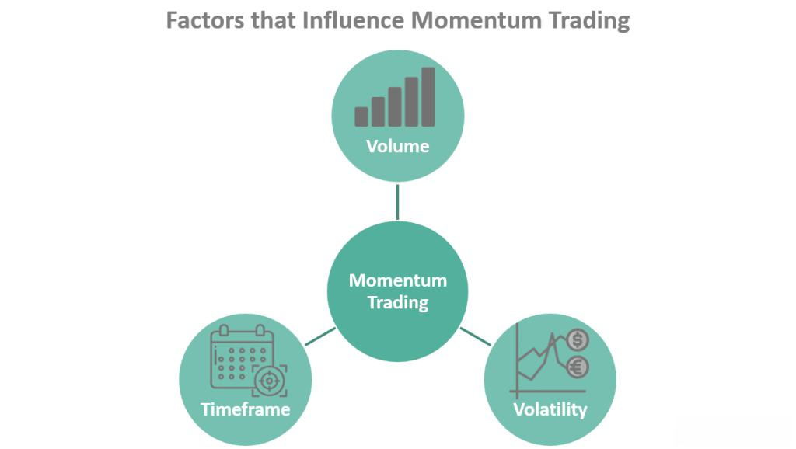

In the ever-evolving world of financial markets, trading has become significantly more sophisticated. This sophistication can largely be attributed to technological advancements that have transformed how trading is conducted and decisions are made. Modern trading tools, powered by cutting-edge technology, have opened new frontiers for traders, offering a suite of possibilities that were unimaginable a few decades ago. These tools enable traders to analyze markets with precision, execute trades with remarkable speed, and manage portfolios with unprecedented efficiency.

However, alongside these opportunities come unique challenges. The array of available trading tools is vast, and each tool is designed for specific purposes and trading styles. Choosing and mastering the right set of tools is a crucial step for any trader aiming to succeed in today's competitive markets.

This article will explore various trading tools available today, examine trading risks, analyze the trends of momentum trading, and discuss algorithmic trading's role. By understanding these components, traders can better navigate the complexities of modern markets and craft strategies that align with their goals and risk tolerance levels. Balancing the opportunities and challenges presented by technological advancements is key to achieving sustainable success in trading.

## Table of Contents

## Understanding Trading Tools

Trading tools are a crucial component for modern traders, providing them with the ability to efficiently analyze financial markets, execute trades, and manage portfolios. These tools have evolved significantly with technological advancements, enabling traders to access a wider array of functionalities that enhance their trading activities.

The spectrum of trading tools ranges from basic charting software to sophisticated algorithmic platforms that facilitate the implementation of complex trading strategies. Basic charting tools are the foundation for technical analysis, offering visual representations of price movements over time. They allow traders to identify patterns, trends, and key levels of support and resistance, which are essential in making informed trading decisions. Popular charting software such as MetaTrader and TradingView provide interactive charting capabilities, customized indicators, and scripting languages for strategy development and automation.

MetaTrader, for instance, is widely utilized for its robust charting capabilities and support for automated trading through the use of Expert Advisors (EAs). These EAs are scripts coded in the platform's proprietary language, MQL, that can execute trades based on predefined criteria. Similarly, TradingView offers a web-based interface with real-time data, allowing traders to create custom indicators and backtest their strategies using Pine Script, a dedicated programming language.

For those seeking comprehensive market analysis, the Bloomberg Terminal stands out as a powerful tool. It provides access to an extensive range of financial data, news, and analytics, supporting traders in making data-driven decisions. The terminal features advanced analytics capabilities, which include financial modeling, risk analysis, and portfolio management tools.

Advanced algorithmic platforms are characterized by their ability to execute large volumes of trades with high speed and precision. These algorithms are programmed to follow specific trading strategies, such as [arbitrage](/wiki/arbitrage), [trend following](/wiki/trend-following), or [market making](/wiki/market-making). The implementation of [algorithmic trading](/wiki/algorithmic-trading) requires a solid understanding of both market mechanics and programming skills, often employing languages like Python or C++ for code development.

The selection of appropriate trading tools depends on the trader's specific needs and trading style. Whether engaging in discretionary trading or systematic strategies, the right tools can significantly reduce errors, enhance efficiency, and refine the decision-making process. By leveraging these modern instruments, traders can adjust to dynamic market conditions and maximize their potential for success.

In conclusion, a comprehensive understanding of available trading tools and their capabilities is essential for any trader aiming to excel in today's complex financial markets. These tools not only facilitate the execution of trades but also provide the analytical support necessary to navigate the intricacies of modern trading environments.

## Navigating Trading Risks

Trading involves inherent risks, and understanding these is crucial for achieving success and longevity in financial markets. Among the primary risks are market risk, [liquidity](/wiki/liquidity-risk-premium) risk, and leverage risk.

**Market Risk** is the potential for an investor to experience losses due to factors that affect the overall performance of the financial markets. These can be caused by macroeconomic factors such as interest rate changes, economic downturns, or geopolitical events. An example of managing market risk is using portfolio diversification, which spreads investments across different asset classes and sectors to mitigate the impact of adverse market movements.

**Liquidity Risk** is associated with the difficulty of buying or selling an asset quickly without affecting its price. This risk becomes evident during market volatility or when trading in assets with low market demand. For instance, in thinly traded stocks, selling a large volume quickly can significantly impact the market price. To manage liquidity risk, traders might consider maintaining a mix of liquid and illiquid assets and ensuring that they have adequate cash reserves to cover sudden expenses.

**Leverage Risk** arises from the use of borrowed capital to increase the potential return of an investment. While leverage can enhance profits, it equally magnifies losses. The mathematical representation of leverage can be simple: if `L` is leverage, `R` is return on investment, and `C` is capital, then the amplified return is given by:

$$
\text{Amplified Return} = L \times R
$$

where $L > 1$. Traders should manage leverage risk by carefully sizing positions and using tools such as stop-loss orders to limit potential losses.

In addition to traditional risks, modern trading also faces emergent risks stemming from technological advancements. System failures, such as hardware malfunctions or software errors, can disrupt trading operations. Moreover, cybersecurity threats pose significant risks, with potential unauthorized access to trading systems or data breaches leading to financial loss and reputational damage. Therefore, traders should implement robust IT infrastructure and cybersecurity measures, such as firewalls and encryption, and regularly update their systems to address vulnerabilities.

Overall, effective risk management techniques such as diversification, position sizing, and using stop-loss orders are essential. They protect traders against adverse market conditions and give them better control over their investments. By recognizing and preparing for the various risks associated with trading, traders can better position themselves to achieve consistent and favorable outcomes in their trading endeavors.

## Momentum Trading: Riding the Trend

Momentum trading is a widely-adopted trading strategy that focuses on taking advantage of upward or downward trends in the financial markets. The methodology is grounded in the belief that stocks or other financial instruments that have performed well in the past will continue to do so in the near future, and vice versa for those that have performed poorly. This strategy often benefits from the concept that once enough [momentum](/wiki/momentum) is established, trends are likely to persist rather than reverse.

The foundation of momentum trading resides in the interpretation and analysis of various technical indicators. Two significant indicators often utilized include Moving Averages and the Relative Strength Index (RSI).

### Moving Averages
Moving Averages are essential tools in momentum trading. They help traders identify the overall direction of the market trend over a specific period. There are several types of moving averages, with the Simple Moving Average (SMA) and the Exponential Moving Average (EMA) being the most commonly used.

The SMA calculates the average closing prices over a specific time frame, offering a smoothed line that indicates the general direction of price movements. The EMA, on the other hand, gives more weight to the most recent prices, making it more responsive to new information.

For example, a common strategy involves observing the crossover of short-term and long-term moving averages. If a short-term moving average (e.g., 20-day EMA) crosses above a long-term moving average (e.g., 50-day EMA), it signals a potential upward momentum, suggesting a buying opportunity.

### Relative Strength Index (RSI)
The Relative Strength Index (RSI) is another pivotal indicator in momentum trading. It is a momentum oscillator that measures the speed and change of price movements and oscillates between zero and 100. Traditionally, an RSI above 70 indicates an overbought condition, signaling potential payback or trend reversal, while an RSI below 30 is considered oversold, indicating a potential uptick.

Momentum traders often use RSI to confirm trend strength and make informed trading positions. A rising RSI that remains under 70 during an uptrend is seen as a signal of strong momentum, encouraging traders to keep the position open. Conversely, if the RSI approaches overbought levels and begins to decline, it might be prudent to consider exiting the trade.

### Challenges and Considerations
While momentum trading can yield substantial profits, it also contains inherent risks requiring careful consideration. Market timing is crucial, as entering or exiting a trade too early or too late can lead to significant losses. Given the dynamic nature of markets, prices influenced by news events, economic data releases, or market sentiment shifts necessitate quick and informed decision-making.

Additionally, understanding market sentiment is a vital part of successful momentum trading. News events can create rapid price movements, often amplifying existing trends. Traders utilizing momentum strategies must stay informed and adapt quickly to changes in sentiment to effectively capitalize on opportunities.

In conclusion, momentum trading, with the aid of technical indicators like moving averages and RSI, offers traders opportunities to profit from market trends. However, the strategy demands a deep understanding of market dynamics, risk management, and the ability to respond swiftly to shifts in sentiment and news. By balancing these elements, traders can enhance their capability to ride the market trend successfully.

## Algorithmic Trading: Automation and Efficiency

Algorithmic trading, commonly referred to as algo trading, employs computer algorithms to execute trades autonomously, adhering to predetermined criteria. These algorithms are capable of handling substantial trading volumes with remarkable precision and speed, addressing the demands of fast-paced markets. The primary advantage of algorithmic trading is its ability to minimize human intervention, thereby reducing emotional biases and human errors in trading decisions.

An algorithm in this context is essentially a set of instructions to be followed in a specific order to achieve a trading goal. Algorithms can be simple, based solely on market data signals, or complex, incorporating multiple data sources and advanced mathematical models.

One prevalent type of algorithm is market making, aimed at profiting from bid-ask spreads. Market-making algorithms continuously offer buy and sell quotes, enabling them to profit from the difference between the buying and selling prices. This strategy contributes significantly to market liquidity.

Arbitrage is another prominent algorithmic strategy that capitalizes on price discrepancies of the same asset across different markets or in various forms. For example, if a stock is trading at different prices on two exchanges, an arbitrage algorithm can simultaneously buy the stock on the lower-priced exchange and sell on the higher-priced one, securing a risk-free profit. Statistical arbitrage, a more complex form of arbitrage, uses mathematical models to identify trading opportunities by analyzing the statistical relationships between different financial instruments.

However, despite its many advantages, algorithmic trading carries inherent risks. Programming errors can lead to errant trades, potentially resulting in substantial financial losses. For instance, a logical flaw in a trading algorithm might trigger unintended large-scale trades, impacting not only the user's portfolio but potentially the broader market. Moreover, market anomalies, such as flash crashes, pose significant challenges, as algorithms are designed to respond to predefined market conditions that might not account for sudden, extreme events.

To mitigate these risks, robust testing and validation of algorithms—often referred to as [backtesting](/wiki/backtesting)—are critical. This process involves running the algorithm through historical market data to assess its performance and reliability. Furthermore, traders employ real-time monitoring to quickly detect and rectify any issues as they arise.

In conclusion, while algorithmic trading offers substantial benefits through enhanced efficiency and precision, it requires diligent management and oversight to navigate the sophisticated technological landscape effectively.

## Conclusions

The integration of trading tools, the understanding of trading risks, and the application of strategies such as momentum and algorithmic trading play a critical role in today's financial markets. One of the key aspects for traders aiming to achieve consistent success is the continuous adaptation to and understanding of new technologies and market research. In an environment where market conditions and technologies are constantly evolving, traders who prioritize staying informed about the latest advancements and trends are better positioned to make strategic and informed decisions.

Balancing the benefits of technological advancements with effective risk management strategies can significantly improve trading outcomes. Traders can harness the power of sophisticated tools and strategies while minimizing the inherent risks by implementing practices such as diversification, position sizing, and the use of automated stop-loss orders. Furthermore, acknowledging potential technological risks, such as system failures or cybersecurity threats, is crucial to safeguarding against unexpected losses.

Continual learning is a vital component of success in trading. The dynamic nature of financial markets necessitates an ongoing commitment to education and adaptation, whether through formal training or self-directed research. As markets evolve, so too must the strategies and tools employed by traders. By embracing an attitude of perpetual learning and flexibility, traders can cultivate the resilience and acumen needed to navigate the complexities of modern trading landscapes effectively.

## References & Further Reading

[1]: Bergstra, J., Bardenet, R., Bengio, Y., & Kégl, B. (2011). ["Algorithms for Hyper-Parameter Optimization."](https://proceedings.neurips.cc/paper/2011/file/86e8f7ab32cfd12577bc2619bc635690-Paper.pdf) Advances in Neural Information Processing Systems 24.

[2]: ["Advances in Financial Machine Learning"](https://www.amazon.com/Advances-Financial-Machine-Learning-Marcos/dp/1119482089) by Marcos Lopez de Prado

[3]: ["Evidence-Based Technical Analysis: Applying the Scientific Method and Statistical Inference to Trading Signals"](https://www.amazon.com/Evidence-Based-Technical-Analysis-Scientific-Statistical/dp/0470008741) by David Aronson

[4]: ["Machine Learning for Algorithmic Trading"](https://github.com/stefan-jansen/machine-learning-for-trading) by Stefan Jansen

[5]: ["Quantitative Trading: How to Build Your Own Algorithmic Trading Business"](https://books.google.com/books/about/Quantitative_Trading.html?id=j70yEAAAQBAJ) by Ernest P. Chan

[6]: Chincarini, L. B., & Kim, D. (2006). ["Quantitative Equity Portfolio Management: An Active Approach to Portfolio Construction and Management"](https://archive.org/details/quantitativeequi0000chin_c9d6). McGraw-Hill. 

[7]: Carver, R. (2015). ["Systematic Trading: A Unique New Method for Designing Trading and Investing Systems"](https://www.amazon.com/Systematic-Trading-designing-trading-investing/dp/0857194453). Harriman House. 

[8]: Aldridge, I. (2013). ["High-Frequency Trading: A Practical Guide to Algorithmic Strategies and Trading Systems,"](https://onlinelibrary.wiley.com/doi/pdf/10.1002/9781119203803.fmatter) 2nd Edition. Wiley Trading.