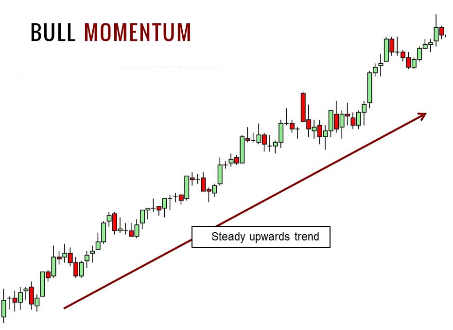

## Table of Contents

## What is momentum trading?

Momentum trading is a strategy where traders buy and sell assets based on the recent performance of those assets. The idea is to follow the trend: if an asset's price is going up, traders will buy it, expecting the price to keep rising. If the price is going down, they will sell it, expecting the price to keep falling. This approach relies on the belief that assets that have performed well in the recent past will continue to do so in the near future.

Momentum traders use various tools and indicators to identify these trends. They might look at moving averages, relative strength index (RSI), or other technical indicators to decide when to enter or exit a trade. The key is to act quickly and decisively, as momentum trading often involves short-term trades that can last from a few minutes to a few weeks. This strategy can be profitable, but it also comes with risks, as trends can reverse suddenly, leading to potential losses.

## How does momentum trading differ from other trading strategies?

Momentum trading is different from other trading strategies because it focuses on following the trend of an asset's price. Instead of trying to predict where the price will go next based on lots of analysis, momentum traders simply look at whether the price is going up or down recently. If the price is going up, they buy the asset, hoping it will keep going up. If it's going down, they sell it, hoping to avoid more losses. This is different from strategies like value investing, where investors look for undervalued assets and hold them for a long time, or day trading, where traders buy and sell within the same day based on very short-term movements.

Another key difference is the time frame that [momentum](/wiki/momentum) traders use. While some strategies, like swing trading, might hold positions for days or weeks, and others, like long-term investing, might hold for years, momentum trading can be very short-term. Momentum traders might hold an asset for just a few minutes or a few days, trying to catch the wave of a trend before it changes. This makes momentum trading more fast-paced and potentially more risky than other strategies, but it can also be exciting and rewarding if done right.

## What are the key principles behind momentum trading?

Momentum trading is all about following the trend. The main idea is that if a stock or any asset is going up in price, it will probably keep going up for a while. So, momentum traders buy when they see the price going up. They believe that the price will keep rising because other people are also buying it. On the other hand, if the price is going down, they sell it quickly. They think the price will keep falling because others are selling too. This strategy is based on the idea that trends in the market can last for some time, and traders can make money by jumping on these trends early.

To do momentum trading well, traders need to watch the market closely and act fast. They use tools like moving averages and the relative strength index to see if a trend is strong or if it might be ending soon. These tools help them decide when to buy and when to sell. Momentum trading is not about holding onto stocks for a long time. Instead, it's about making quick trades that can last from a few minutes to a few days. This makes it different from other ways of investing, where people might hold onto stocks for months or years.

## What are some common indicators used in momentum trading?

Momentum traders use several common indicators to help them decide when to buy and sell. One popular indicator is the moving average. This is a line on a chart that shows the average price of an asset over a certain period of time, like 50 days or 200 days. When the price of the asset goes above the moving average, it's a sign that the price might keep going up, so traders buy. When the price goes below the moving average, it might be time to sell because the price could keep going down.

Another important indicator is the Relative Strength Index (RSI). The RSI measures how fast and how much the price of an asset is changing. It gives a number between 0 and 100. If the RSI is over 70, it means the asset might be overbought, and the price could go down soon. If the RSI is under 30, it means the asset might be oversold, and the price could go up. Momentum traders use these signals to decide when to jump into or out of a trade.

Some traders also use the Moving Average Convergence Divergence (MACD). The MACD shows the relationship between two moving averages of an asset's price. When the MACD line crosses above the signal line, it's a sign to buy because it suggests the price might keep going up. When the MACD line crosses below the signal line, it's a sign to sell because it suggests the price might keep going down. These indicators help momentum traders catch trends early and make quick decisions.

## How can a beginner start implementing a basic momentum trading strategy?

To start momentum trading as a beginner, you first need to understand the basics of how it works. Momentum trading is all about following the trend of an asset's price. If the price is going up, you buy it, hoping it will keep going up. If the price is going down, you sell it, hoping to avoid more losses. You'll need to watch the market closely and use some simple tools to help you decide when to buy and sell. A good place to start is by looking at moving averages. These are lines on a chart that show the average price of an asset over a certain time, like 50 days or 200 days. If the price goes above the moving average, it might be time to buy. If it goes below, it might be time to sell.

Once you understand the basics, you can start practicing with a demo account. Many trading platforms offer demo accounts where you can trade with fake money to learn the ropes without risking real cash. This is a great way to get a feel for how momentum trading works without any financial risk. As you practice, pay attention to the Relative Strength Index (RSI) too. The RSI is a number between 0 and 100 that shows if an asset is overbought (over 70) or oversold (under 30). If the RSI is over 70, it might be time to sell because the price could go down soon. If it's under 30, it might be time to buy because the price could go up. By using these simple tools and practicing with a demo account, you can start to build your skills in momentum trading.

## What are the risks associated with momentum trading?

Momentum trading can be risky because it's all about following trends, and trends can change quickly. If you buy an asset because its price is going up, but then the trend suddenly reverses, you could lose money fast. This is called a "reversal," and it's one of the biggest risks in momentum trading. Also, because momentum traders often make quick trades, they might not have time to do a lot of research. This can lead to decisions based on short-term movements rather than a deep understanding of the asset, which adds to the risk.

Another risk is that momentum trading can lead to big losses if the market becomes very volatile. When prices move a lot in a short time, it can be hard to predict where they will go next. Momentum traders might get caught in a sudden drop or rise and lose money. Plus, because they often use borrowed money (called "leverage") to make bigger trades, any losses can be even bigger. So, while momentum trading can be exciting and potentially profitable, it's important to understand these risks and be ready for them.

## How can one manage risk in momentum trading?

Managing risk in momentum trading is really important because things can change fast in the market. One way to do this is by setting stop-loss orders. A stop-loss order is like a safety net that automatically sells your asset if the price drops to a certain level. This helps you limit how much money you can lose on a trade. Another way is to not use too much borrowed money, or leverage. When you use leverage, you can make bigger trades, but your losses can also be bigger if things go wrong. So, it's smart to keep leverage low and only risk what you can afford to lose.

Another thing you can do is to always keep an eye on the market and be ready to act quickly. Momentum trading is all about catching trends early, but you also need to be ready to get out if the trend changes. Using tools like moving averages and the Relative Strength Index (RSI) can help you make better decisions. These tools can tell you when a trend might be getting weak, so you can sell before you lose too much money. By staying alert and using these tools, you can manage the risks of momentum trading better and protect your money.

## What are some advanced techniques used in momentum trading?

In momentum trading, one advanced technique is using multiple time frames to spot trends. Instead of just looking at one chart, traders look at different time frames, like daily, hourly, and even minute-by-minute charts. This helps them see if a trend is strong across different periods. If the trend looks good on all time frames, it might be a safer bet. Another technique is using [volume](/wiki/volume-trading-strategy) analysis. Volume shows how many shares of an asset are being traded. If the price is going up and the volume is high, it means a lot of people are buying, which can make the trend stronger. But if the volume is low, the trend might not last long.

Another advanced technique is using [algorithmic trading](/wiki/algorithmic-trading). This means using computer programs to make trades automatically based on certain rules. These programs can analyze lots of data very quickly and make trades faster than a human could. This can help catch trends early and make more trades in a short time. But it's important to set up these programs carefully because they can also make big mistakes if the rules are not right. By using these advanced techniques, momentum traders can try to make better decisions and manage their risks more effectively.

## How does market volatility affect momentum trading strategies?

Market [volatility](/wiki/volatility-trading-strategies) can make momentum trading more exciting but also more risky. When the market is volatile, prices move up and down a lot in a short time. This can create strong trends that momentum traders can jump on to make quick profits. If a stock's price is going up fast, momentum traders might buy it, hoping the price will keep rising. But the same volatility that creates these opportunities can also make things dangerous. If the trend suddenly changes because of the wild price swings, traders can lose money fast. So, while volatility can be good for finding trends, it also makes momentum trading riskier.

To handle this, momentum traders need to be extra careful and use tools to manage their risks. They might use stop-loss orders to limit their losses if the price drops suddenly. They also need to keep a close eye on the market and be ready to act quickly if things change. Using multiple time frames and volume analysis can help them understand if a trend is strong or if it might be about to reverse. By being prepared and using these tools, momentum traders can try to make the most of volatile markets while keeping their risks under control.

## Can momentum trading be effectively combined with other trading strategies?

Momentum trading can be combined with other trading strategies to make a stronger trading plan. For example, you can use momentum trading to catch short-term trends and then use a value investing approach to hold onto stocks that are undervalued for the long term. This way, you can make quick profits from the trends and also benefit from the growth of good companies over time. Another way to combine strategies is by using technical analysis along with momentum trading. Technical analysis looks at chart patterns and other data to predict where prices might go next. By using both, you can make better decisions about when to buy and sell based on both the trend and the technical signals.

Combining momentum trading with other strategies can help you manage risk better too. For instance, if you use a trend-following approach like momentum trading, you can also use a mean reversion strategy, which bets on prices going back to their average after moving too far in one direction. This can help you make money when trends change. Also, using [fundamental analysis](/wiki/fundamental-analysis), which looks at a company's financial health and growth potential, can give you a deeper understanding of what you're buying. By mixing these strategies, you can make more informed trades and potentially reduce the risks that come with momentum trading alone.

## What are the psychological challenges faced by momentum traders?

Momentum trading can be really hard on your mind because it's all about making quick decisions and dealing with a lot of ups and downs. When you see prices going up, it's exciting, and you want to jump in and buy. But if the price suddenly drops, it can make you feel scared and worried. This fear can make you sell too soon, even if the trend might still be going strong. It's tough to stay calm and stick to your plan when the market is moving fast and you're feeling all these strong emotions.

Another challenge is the pressure to always be watching the market. Momentum traders need to act fast, so they might feel like they can't take a break. This can lead to feeling stressed out and tired. It's also easy to get caught up in the excitement of making quick profits and start taking bigger risks than you should. Keeping a clear head and not letting your emotions control your trades is really important, but it's not easy when you're in the middle of all the action.

## How can one evaluate the performance of a momentum trading strategy over time?

To evaluate how well a momentum trading strategy is doing over time, you need to look at how much money you're making or losing. You can do this by keeping track of your trades and calculating your total returns. This means adding up all the profits and subtracting all the losses. It's also good to compare your returns to a benchmark, like a stock market index. If your strategy is doing better than the benchmark, it's a sign that you're on the right track. Another thing to look at is how much risk you're taking. You can measure this by looking at how much your returns go up and down, which is called volatility. If your strategy is making good returns but with a lot of ups and downs, you might be taking too much risk.

Another way to see if your momentum trading strategy is working is by looking at how often you're making money on your trades. This is called the win rate. If you're winning more trades than you're losing, that's a good sign. But it's also important to look at how big your wins and losses are. If you're winning a lot but your losses are bigger than your wins, you might still end up losing money overall. Keeping a trading journal can help you see these patterns and make better decisions in the future. By looking at all these things—total returns, risk, win rate, and the size of your wins and losses—you can get a good idea of how well your momentum trading strategy is doing over time.

## References & Further Reading

[1]: Driehaus, Richard. ["Buy High, Sell Higher: Why Buy-and-Hold is Dead and Other Investing Lessons from CNBC's 'The Liquidator'"](https://www.amazon.com/High-Sell-Higher-Buy-Hold/dp/1455500674). John Wiley & Sons, 2012.

[2]: Jegadeesh, Narasimhan, and Sheridan Titman. "[Returns to buying winners and selling losers: Implications for stock market efficiency](https://www.jstor.org/stable/2328882)." The Journal of Finance 48.1 (1993): 65-91.

[3]: Shiller, R.J. (2015). [Irrational Exuberance](https://www.amazon.com/Irrational-Exuberance-Revised-Expanded-Third/dp/0691173125). Princeton University Press.

[4]: Wilder, J. W. (1978). [New concepts in technical trading systems](https://www.amazon.com/New-Concepts-Technical-Trading-Systems/dp/0894590278). Trend Research.

[5]: Brown, C. (2011). [Technical Analysis for the Trading Professional](https://vdthangmeomeo.files.wordpress.com/2017/08/technical-analysis-for-the-trading-professional.pdf). McGraw Hill Professional.

[6]: Douglas, M. (1990). [Trading in the Zone](https://www.amazon.com/Trading-Zone-Confidence-Discipline-Attitude/dp/0735201447). Prentice Hall Press.

[7]: Murphy, J. J. (1999). [Technical Analysis of the Financial Markets](https://www.amazon.com/Technical-Analysis-Financial-Markets-Comprehensive/dp/0735200661). New York Institute of Finance.

[8]: O'Neil, W. J. (2009). [How to Make Money in Stocks](https://www.amazon.com/How-Make-Money-Stocks-Winning/dp/0071614133). McGraw Hill Professional.

[9]: Narayanan, A., Bonneau, J., Felten, E., Miller, A., & Goldfeder, S. (2016). [Bitcoin and Cryptocurrency Technologies](https://bitcoinbook.cs.princeton.edu/). Princeton University Press.

[10]: Taylor, M. P., & Allen, H. (1992). [The use of technical analysis in the foreign exchange market](https://www.sciencedirect.com/science/article/abs/pii/0261560692900483). Journal of International Money and Finance, 11(3), 304-314.

[11]: Covel, M. W. (2009). [Trend following: How to make a fortune in bull, bear, and black swan markets](https://www.amazon.com/Trend-Following-5th-Fortune-Markets/dp/1119371872). John Wiley & Sons.

[12]: Crabel, T. (1990). [Day trading with short term price patterns and opening range breakout](https://www.amazon.com/Trading-Short-Patterns-Opening-Breakout/dp/0934380171). Greenville: Traders Press.

[13]: Brown, C., & Moles, P. (2003). [Swing Trading Simplified](https://www.amazon.com/Swing-Trading-Simplified-Larry-Spears/dp/1592800637). Marketplace Books.

[14]: The Balance. (2021). [Gold Price History from 30 B.C. to Today](https://www.thebalancemoney.com/gold-price-history-3305646).

[15]: Gary Antonacci. (2012). [Risk Premia Harvesting Through Dual Momentum](https://papers.ssrn.com/sol3/papers.cfm?abstract_id=2042750).

[16]: Mebane T. Faber. (2007). [A Quantitative Approach to Tactical Asset Allocation](https://papers.ssrn.com/sol3/papers.cfm?abstract_id=962461).

[17]: Chaboud, A., et al. (2014). [Rise of the Machines: Algorithmic Trading in the Foreign Exchange Market](https://onlinelibrary.wiley.com/doi/abs/10.1111/jofi.12186). The Journal of Finance, 69(5), 2045-2084.

[18]: Bailey, D. H., & Lopez de Prado, M. (2018). [The Deflated Sharpe Ratio: Correcting for Selection Bias, Backtest Overfitting and Non-Normality](https://www.pm-research.com/content/iijpormgmt/40/5/94). Journal of Portfolio Management, 40(5), 94-107.

[19]: Elder, A. (2014). [The New Trading for a Living: Psychology, Discipline, Trading Tools and Systems, Risk Control, Trade Management](https://www.amazon.com/New-Trading-Living-Psychology-Discipline/dp/1118443926). Wiley.

[20]: Murphy, John J. [Technical Analysis of the Financial Markets](https://www.amazon.com/Technical-Analysis-Financial-Markets-Comprehensive/dp/0735200661). New York Institute of Finance, 1999.