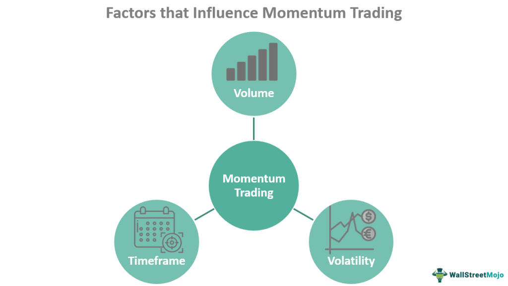

Momentum trading strategies have emerged as a favored approach among algorithmic traders, who utilize the persistence of existing price trends in financial markets to achieve profitable outcomes. This article offers an in-depth examination of momentum trading within the expansive field of algorithmic trading, focusing on its inherent advantages, methodologies, and practical implementation. Algorithmic trading, often referred to as 'algo' trading, employs sophisticated computer programs to conduct trades based on established criteria, thereby enhancing both the speed and efficiency of trading activities.

Momentum trading strategies are particularly significant within this framework, as they exploit prevailing market trends and momentum—indicators of considerable price movements. By identifying and capitalizing on these trends, traders can optimize their entry and exit points, leading to potentially higher profits. This form of trading operates on the fundamental assumption that assets experiencing an upward trend are likely to continue on that trajectory, at least in the short term, thus presenting lucrative trading opportunities.



The implementation of momentum trading strategies in an algorithmic context involves a series of well-structured steps that traders must meticulously follow. These include selecting the appropriate technical indicators, backtesting strategies using historical data, and continuously refining algorithms to adapt to ever-changing market conditions. The effective utilization of these strategies can set the stage for remarkable market gains and provide traders with a robust framework to navigate the complexities of financial markets.

For traders and investors aspiring to harness technology for enhanced trading efficiency, a thorough understanding of momentum trading strategies is crucial. With the advance of data analytics and machine learning, the sophistication and effectiveness of these strategies continue to improve, promising further evolution in the landscape of algorithmic trading.

## Table of Contents

## What is Momentum Trading?

Momentum trading involves buying securities that are experiencing upward trends and selling those that are performing poorly. This strategy is predicated on the belief that assets or securities which have shown an upward price movement will continue to rise, whereas those declining will continue on that trajectory. This phenomenon contradicts the efficient market hypothesis, which suggests that price movements are random and influenced by new information, making it impossible to outperform the market consistently.

A key component of momentum trading is the reliance on technical indicators to forecast future price movements. These indicators assist traders in recognizing patterns and trends in market data, enabling them to make informed trading decisions. Commonly used indicators in this context include moving averages, the Relative Strength Index (RSI), and stochastic oscillators, which provide quantitative measures to assess market momentum.

In [algorithmic trading](/wiki/algorithmic-trading), [momentum](/wiki/momentum) strategies are automated to capitalize on short-term, robust movements across markets. Algorithms are programmed with rules and conditions based on technical indicators, allowing rapid and precise execution of trades without human intervention. This automation enhances the speed and efficiency of trading operations, providing traders with a tactical advantage in fast-moving markets.

Discipline and risk management form the cornerstone of successful momentum trading. Original strategies are rigorously tested and validated using historical data through [backtesting](/wiki/backtesting) methodologies to ascertain their viability. Additionally, traders often employ measures such as stop-loss orders to minimize potential losses and preserve capital. This methodical and disciplined approach is crucial in momentum trading, as it enables traders to navigate the inherent risks associated with market reversals and [volatility](/wiki/volatility-trading-strategies), effectively maximizing gains while safeguarding against substantial losses.

## Technical Indicators Used in Momentum Trading

Momentum trading strategies rely heavily on technical indicators to determine entry and [exit](/wiki/exit-strategy) points in the market. These indicators are crucial for identifying the strength and direction of price trends, allowing algorithms to make informed trading decisions. The following are key technical indicators commonly used in momentum trading strategies:

1. **Relative Strength Index (RSI):**  
   The RSI is a momentum oscillator that measures the speed and change of price movements. The RSI ranges from 0 to 100 and is typically used to identify overbought or oversold conditions in a market. An RSI above 70 suggests that a stock may be overbought, while an RSI below 30 indicates that it may be oversold. This can signal potential reversal points, making RSI a valuable tool for momentum traders.

   Python code example for calculating RSI:
   ```python
   import pandas as pd

   def calculate_rsi(data, period=14):
       delta = data['Close'].diff(1)
       gain = (delta.where(delta > 0, 0)).rolling(window=period).mean()
       loss = (-delta.where(delta < 0, 0)).rolling(window=period).mean()
       rs = gain / loss
       rsi = 100 - (100 / (1 + rs))
       return rsi

   data['RSI'] = calculate_rsi(data)
   ```

2. **Moving Averages:**  
   Moving averages (MA) are used to smooth out price data, creating a single flowing line that allows traders to identify the direction of the trend. The two most common types are the Simple Moving Average (SMA) and the Exponential Moving Average (EMA). SMAs calculate the mean of prices over a specified period, while EMAs give more weight to recent prices, making them more responsive to price changes.

   Python code example for calculating SMA:
   ```python
   def calculate_sma(data, period):
       return data['Close'].rolling(window=period).mean()

   data['SMA'] = calculate_sma(data, period=20)
   ```

3. **Stochastic Oscillators:**  
   Stochastic oscillators compare a particular closing price to a range of its prices over a certain period. The idea is that during an upward trend, prices tend to close near their high, and during a downward trend, prices tend to close near their low. The oscillator ranges between 0 and 100, and a reading above 80 indicates the asset is overbought, while below 20 suggests it may be oversold.

   Python code example for calculating the Stochastic Oscillator:
   ```python
   def calculate_stochastic(data, k_period=14, d_period=3):
       low_min = data['Low'].rolling(window=k_period).min()
       high_max = data['High'].rolling(window=k_period).max()
       data['%K'] = 100 * ((data['Close'] - low_min) / (high_max - low_min))
       data['%D'] = data['%K'].rolling(window=d_period).mean()
       return data

   data = calculate_stochastic(data)
   ```

These indicators form the backbone of momentum trading strategies within algorithmic trading, and they can be integrated into algorithms to automatically execute trades based on predefined criteria. This automation not only enhances efficiency but also reduces the impact of human emotions and errors in trading decisions.

## Developing Momentum Trading Algorithms

Building an effective momentum trading algorithm involves establishing a framework to capitalize on stock price movements. These algorithms are typically designed to process vast amounts of data efficiently, executing trades based on signals derived from technical indicators such as moving averages, relative strength index (RSI), and stochastic oscillators.

### Algorithm Design and Data Processing

The core of a momentum trading algorithm is its ability to handle and analyze large datasets swiftly. This is crucial for identifying trends and making informed trading decisions. Python, with its robust libraries like NumPy and pandas, is often used for data manipulation due to its efficiency and scalability. For instance, historical data can be loaded and manipulated using pandas, allowing for the calculation of critical indicators required for momentum trading:

```python
import pandas as pd

# Load historical data
data = pd.read_csv('historical_prices.csv')

# Calculate moving average
data['Moving_Average'] = data['Close_Price'].rolling(window=50).mean()

# Calculate RSI
def calculate_rsi(data, window=14):
    delta = data.diff()
    gain = delta.where(delta > 0, 0)
    loss = -delta.where(delta < 0, 0)
    avg_gain = gain.rolling(window=window).mean()
    avg_loss = loss.rolling(window=window).mean()
    rs = avg_gain / avg_loss
    rsi = 100 - (100 / (1 + rs))
    return rsi

data['RSI'] = calculate_rsi(data['Close_Price'])
```

### Backtesting and Strategy Verification

Before deploying any algorithm in live markets, rigorous backtesting with historical data is essential. This process validates the strategy’s performance, allowing traders to simulate trades and assess potential profitability under various market conditions. Backtesting frameworks like Backtrader or QuantConnect facilitate this by providing platforms to model, optimize, and refine trading strategies using historical market data.

### Machine Learning Integration

Incorporating [machine learning](/wiki/machine-learning) techniques can significantly enhance momentum trading algorithms by enabling them to learn from new data continuously. Techniques like supervised learning can be used to predict price movements based on historical patterns. Models such as decision trees, random forests, or even neural networks can be trained on historical price data to improve prediction accuracy.

```python
from sklearn.ensemble import RandomForestClassifier
from sklearn.model_selection import train_test_split

# Prepare feature matrix and target variable
X = data[['Moving_Average', 'RSI']]
y = data['Target']  # Target can be a binary indicator signifying buy/sell

# Split data into training and testing
X_train, X_test, y_train, y_test = train_test_split(X, y, test_size=0.2, random_state=42)

# Train the model
model = RandomForestClassifier()
model.fit(X_train, y_train)

# Predict
predictions = model.predict(X_test)
```

### Automation and Emotion Mitigation

Automation is a significant advantage of algorithmic trading, as it allows for the execution of trades based on predefined criteria without human intervention, mitigating the impact of emotional decision-making. Automated systems ensure that trades are executed promptly and consistently, aligning with the algorithm's risk management and strategic goals.

By leveraging automation, algo traders can react instantaneously to market changes, reducing response times and potentially capturing fleeting market opportunities that might be missed by manual traders. Additionally, automated strategies can operate around the clock, continuously scanning and trading in various global markets.

In conclusion, developing robust momentum trading algorithms involves a combination of data processing, strategic backtesting, machine learning integration, and full automation. These components collectively ensure that the algorithm can adapt to and capitalize on dynamic market conditions efficiently.

## Advantages and Disadvantages of Momentum Trading in Algo Trading

Momentum trading in the context of algorithmic trading offers distinct advantages, promising potential for high returns by leveraging market efficiency to execute trades promptly. Automating momentum strategies enables traders to eliminate emotional biases, allowing for objective decision-making based on the predefined criteria embedded in the trading algorithms. This automation ensures that trades are executed at optimal times, driven solely by data-derived insights rather than subjective judgment.

Despite these benefits, momentum trading strategies are not without their challenges. One significant risk lies in the inherent volatility of financial markets; momentum strategies require rigorous and continuous monitoring to mitigate potential losses that can occur during abrupt market reversals. This necessity for vigilance underscores the critical importance of robust risk management protocols to protect against unfavorable market movements.

Moreover, high turnover rates characterize momentum trading, as this strategy involves frequent buying and selling to capitalize on trends. This can incur substantial transaction costs, which can erode profits if not carefully managed. Consequently, traders must employ advanced risk management techniques and ensure that their algorithms are optimized to balance trade frequency with cost efficiency.

Adaptability is another vital consideration; as market conditions evolve, algorithms must be updated to reflect new data patterns and market behaviors. The dynamic nature of markets means that strategies effective in one period may not necessarily yield the same results in another. Regular revisions to the algorithms ensure that they remain relevant and capable of sustaining profitability amidst changing conditions.

The quest to maintain a competitive edge in algorithmic momentum trading thus necessitates a fine balance between seizing rapid market opportunities and managing the accompanying risks. Through careful planning and continuous improvement, traders can harness the power of momentum strategies to navigate the complexities of financial markets effectively.

## Case Studies and Applications

Several real-world applications illustrate the effectiveness of momentum trading strategies, particularly within high-frequency trading environments where speed and precision are paramount. Algorithmic momentum strategies have found success across a range of asset classes, including stocks, [forex](/wiki/forex-system), and commodities. These strategies capitalize on the continuation of existing market trends, executing trades with little to no human intervention, thereby ensuring timely market entries and exits.

One prominent example is high-profile hedge funds that employ advanced algorithms to discern and act on significant market movements. These institutional traders leverage momentum trading strategies to enhance their portfolios by capturing short-term market gains. For instance, Renaissance Technologies, a well-known [hedge fund](/wiki/hedge-fund-trading-strategies), applies sophisticated algorithms, employing momentum among other strategies, successfully navigating the complexities of financial markets to generate substantial returns. Such hedge funds typically incorporate large datasets and leverage machine learning models to refine their momentum signals, allowing them to adapt to dynamic market conditions swiftly. 

Furthermore, algorithmic momentum strategies have been successfully implemented by institutional traders dealing in commodities, where price trends can be influenced by factors like supply disruptions or changes in demand. By employing algorithms that react to momentum indicators, these traders can exploit short-term price movements, capitalizing on waves of market momentum that might be missed by manual trading strategies due to human limitations.

Case studies further highlight the technological prowess needed to identify profitable momentum trades, even amid complex and volatile market conditions. For example, during periods of high volatility such as economic data releases or geopolitical events, momentum algorithms can process and react to data within milliseconds, maintaining a competitive edge. This rapid execution capability enables traders to capture price advantages that would be unattainable through traditional trading methods.

These applications underscore the crucial role of technological expertise in the development of trading strategies. The ability to integrate advanced data analysis tools, such as Python-based libraries for statistical analysis and machine learning like NumPy, pandas, and Scikit-learn, empowers traders to optimize their momentum strategies. By employing such technologies, traders can better analyze price patterns, backtest their strategies on historical data, and refine their algorithms for improved accuracy and execution speed.

In conclusion, these examples of momentum trading applications illustrate the blend of financial acumen and technological innovation necessary for exploiting market trends effectively. As the financial landscape evolves, the potential for momentum strategies in algorithmic trading continues to expand, driven by advances in computational power and data science techniques.

## Conclusion

Momentum trading strategies present traders with a powerful method to leverage market trends through the capabilities of algorithmic trading. For traders and investors aiming to enhance efficiency using technology, grasping the principles and implementation of momentum trading is crucial. These strategies enable traders to capitalize on short-term price movements and trends, often driven by the psychological momentum that characterizes financial markets.

To successfully adopt momentum trading strategies, careful planning and robust backtesting are imperative. Planning involves identifying the right financial instruments and defining clear entry and exit points, often through historical data analysis. Backtesting these strategies with historical market data helps in validating the viability and robustness of the trading model before real-time deployment. Continuous improvement is also essential to adapt to the ever-evolving market dynamics, which can impact the effectiveness of a predefined trading strategy.

Implementing momentum trading within an algorithmic framework provides traders with a significant competitive advantage in the fast-paced financial markets. Algorithmic trading allows for the swift execution of trades at optimal times, minimizing the delay that often accompanies manual trading. By automating the decision-making process, traders can reduce emotional biases, a critical [factor](/wiki/factor-investing) in maintaining trading discipline and consistency.

Looking forward, future advancements in data analysis and machine learning hold substantial promise for further enhancing the effectiveness of momentum strategies in algorithmic trading. Techniques such as [deep learning](/wiki/deep-learning), natural language processing, and advanced pattern recognition can potentially uncover deeper insights into market trends and sentiment, enabling the development of more sophisticated and adaptive trading algorithms. This continuous integration of technological advancements will likely redefine the landscape of momentum trading strategies, making them even more potent tools for achieving trading success.

## References & Further Reading

[1]: ["Momentum"](https://sciencenotes.org/momentum-in-physics-definition-formula-examples/) - CFA Institute.

[2]: Jegadeesh, N., & Titman, S. (1993). ["Returns to Buying Winners and Selling Losers: Implications for Stock Market Efficiency."](https://onlinelibrary.wiley.com/doi/abs/10.1111/j.1540-6261.1993.tb04702.x) The Journal of Finance, 48(1), 65-91.

[3]: J. H. Cochrane, (1999). ["New Facts in Finance."](https://www.nber.org/papers/w7169) Economic Perspectives, Federal Reserve Bank of Chicago.

[4]: ["Advances in Financial Machine Learning"](https://www.wiley.com/en-us/Advances+in+Financial+Machine+Learning-p-9781119482086) by Marcos Lopez de Prado

[5]: ["Quantitative Momentum: A Practitioner's Guide to Building a Momentum-Based Stock Selection System"](https://books.google.com/books/about/Quantitative_Momentum.html?id=K2npCgAAQBAJ) by Wesley R. Gray and Jack R. Vogel

[6]: ["Algorithmic Trading: Winning Strategies and Their Rationale"](https://www.wiley.com/en-us/Algorithmic+Trading%3A+Winning+Strategies+and+Their+Rationale-p-9781118460146) by Ernest P. Chan

[7]: ["Machine Learning for Asset Managers"](https://www.cambridge.org/core/elements/machine-learning-for-asset-managers/6D9211305EA2E425D33A9F38D0AE3545) by Marcos López de Prado