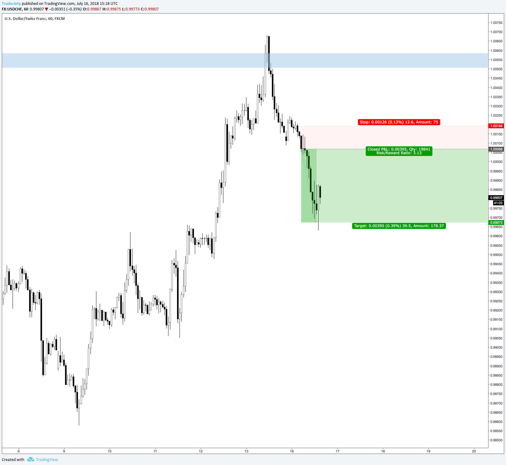

## Table of Contents

## What is momentum trading?

Momentum trading is a strategy where traders buy and sell assets based on the recent performance of those assets. The idea is to follow the trend: if an asset's price is going up, traders will buy it, expecting the price to keep rising. If the price is going down, they will sell it, expecting the price to keep falling. This approach relies on the belief that assets that have performed well in the recent past will continue to do so in the near future.

Traders using this strategy often look at short-term price movements and use technical analysis to make their decisions. They might use charts and indicators to spot trends and decide when to enter or exit a trade. Momentum trading can be exciting and potentially profitable, but it also comes with risks. Prices can change quickly, and if the trend reverses, traders can lose money. It's important for traders to have a clear plan and to manage their risks carefully.

## How does momentum trading differ from other trading strategies?

Momentum trading is different from other trading strategies because it focuses on following the current trend of an asset's price. Instead of trying to predict where the price will go in the future based on a lot of different information, momentum traders just look at what the price has been doing recently. If the price has been going up, they buy, hoping it will keep going up. If it has been going down, they sell, hoping it will keep going down. This is simpler than strategies that look at a company's financial health or the overall economy.

Other trading strategies might use different kinds of information. For example, value investing looks at whether a company's stock is priced lower than it should be based on its earnings or other financial measures. This is more about finding bargains than following trends. Another strategy, called fundamental analysis, involves looking at a lot of data about a company, like its profits, debts, and growth potential, to decide if its stock is a good buy. These strategies take more time and research compared to momentum trading, which is more about quick decisions based on recent price movements.

## What are the key indicators used in momentum trading?

Momentum traders use different indicators to help them decide when to buy or sell. One common indicator is the Relative Strength Index (RSI). The RSI measures how fast and strong a price is moving up or down. If the RSI is above 70, it might mean the price has gone up too fast and could soon go down. If it's below 30, it might mean the price has gone down too fast and could soon go up. Another useful indicator is the Moving Average Convergence Divergence (MACD). This indicator shows the difference between two moving averages of a price. When the MACD line crosses above the signal line, it might be a good time to buy because the price is starting to go up. When it crosses below, it might be a good time to sell because the price is starting to go down.

Another important indicator is the Average Directional Index (ADX). The ADX helps traders see how strong a trend is. If the ADX is above 25, it means the trend is strong, and it might be a good time to follow the trend. If it's below 20, the trend is weak, and it might not be a good time to trade based on momentum. Momentum traders also often look at price charts and use tools like trendlines and support and resistance levels to see where prices might go next. These indicators help traders make quick decisions based on recent price movements, which is what momentum trading is all about.

## Can you explain the concept of relative strength in momentum trading?

Relative strength in momentum trading is about comparing the performance of one asset to another. Traders look at how well a stock is doing compared to the overall market or other stocks. If a stock is going up faster than the market, it has strong relative strength. This means traders might want to buy it because it's doing better than other investments.

Using relative strength helps traders find the best opportunities. They look for stocks that are leading the market, which means these stocks are likely to keep going up. By focusing on these strong performers, traders hope to make more money than if they just followed the overall market. It's like picking the fastest horse in a race – you want to bet on the one that's ahead of the others.

## What are some common momentum trading strategies?

One common momentum trading strategy is called trend following. In this strategy, traders look at the price charts to see if there's a clear trend. If the price is going up, they buy the asset, hoping it will keep going up. If the price is going down, they sell it, hoping it will keep going down. They use indicators like moving averages to help them see the trend and decide when to enter or exit a trade. The key is to follow the trend until it shows signs of reversing.

Another strategy is breakout trading. This is when traders look for times when the price breaks out of a certain range. If the price moves above a resistance level, traders buy the asset because they think it will keep going up. If the price moves below a support level, they sell it because they think it will keep going down. Breakout traders often use volume as a signal. If the breakout happens with a lot of trading volume, it's seen as a stronger sign that the price will continue in that direction.

A third strategy is momentum reversal, which is a bit different. Instead of following the trend, traders look for times when a strong trend might be about to reverse. They use indicators like the RSI to spot when an asset might be overbought or oversold. If the RSI shows that the price has gone up too fast and might soon go down, traders might sell the asset. If it shows the price has gone down too fast and might soon go up, they might buy it. This strategy tries to catch the turn in the trend before it happens.

## How do traders identify stocks with momentum?

Traders identify stocks with momentum by looking at how the stock's price has been moving recently. They use charts and tools to see if the price has been going up or down over the last few weeks or months. If a stock's price has been going up faster than the overall market or other stocks, it's said to have strong momentum. Traders might use indicators like the Relative Strength Index (RSI) to see if the stock's price is moving quickly. If the RSI is high, it means the stock has been going up fast, and if it's low, it means it's been going down fast.

Another way to find stocks with momentum is by looking at the stock's performance compared to others. Traders use something called relative strength to see if a stock is doing better than the market or other stocks. If a stock is going up while others are staying the same or going down, it has strong relative strength. Traders might also look at news and events that could affect the stock's price. If there's good news about a company, its stock might start to go up, showing momentum. By keeping an eye on these things, traders can spot stocks that are likely to keep moving in the same direction.

## What are the risks associated with momentum trading?

Momentum trading can be exciting, but it comes with risks. One big risk is that prices can change quickly. If a stock's price has been going up, traders might buy it hoping it will keep going up. But if the price suddenly goes down, they could lose money. This is called a reversal, and it can happen fast. Momentum traders need to be ready to get out of a trade if the trend changes.

Another risk is that momentum trading can lead to big losses if traders don't manage their money well. They might be tempted to buy more of a stock that's going up, thinking it will keep going up forever. But if the price drops, they could lose a lot. It's important for traders to set limits on how much they're willing to lose and stick to those limits. Momentum trading is not for everyone because it can be stressful and risky.

## How can one manage risk when engaging in momentum trading?

Managing risk in momentum trading is important to avoid big losses. One way to do this is by setting stop-loss orders. A stop-loss order is like a safety net that automatically sells your stock if the price drops to a certain level. This helps you limit how much money you could lose on a trade. Another way to manage risk is by not putting all your money into one stock. Instead, spread your money across different stocks. This way, if one stock goes down, you won't lose everything.

It's also a good idea to keep an eye on how much you're risking on each trade. A common rule is to not risk more than a small percentage of your total money on any single trade, like 1% or 2%. This means if you have $10,000, you wouldn't risk more than $100 or $200 on one trade. By following these rules, you can enjoy the excitement of momentum trading while keeping your losses under control.

## What time frames are typically used in momentum trading?

Momentum traders usually look at short time frames, like minutes, hours, or days. They want to catch quick moves in stock prices, so they often trade within the same day. This is called day trading. By focusing on short time frames, they can jump in and out of trades fast, trying to make money from small changes in the price.

Some momentum traders also look at longer time frames, like weeks or months. They might hold onto a stock for a bit longer if they see a strong trend that they think will keep going. This can be less stressful than day trading, but they still need to watch the market closely to know when to sell. Using different time frames helps traders find the best opportunities for making money from momentum.

## How does one set entry and exit points in momentum trading?

To set entry points in momentum trading, traders look for signs that a stock's price is starting to move strongly in one direction. They might use indicators like the Relative Strength Index (RSI) or Moving Average Convergence Divergence (MACD). If the RSI shows a stock is moving up fast, or if the MACD line crosses above the signal line, it might be a good time to buy. Traders also look at the stock's price compared to others. If a stock is going up while others are staying the same or going down, it could be a good entry point. The idea is to jump in when the price starts to move and keep going in that direction.

For exit points, traders need to know when to sell a stock to lock in profits or cut losses. They often use stop-loss orders to sell automatically if the price drops to a certain level, which helps limit losses. Another way to set an exit point is by watching for signs that the trend might be ending. If the RSI shows the stock is moving too fast and might go down soon, or if the MACD line crosses below the signal line, it could be time to sell. Traders also keep an eye on the stock's price compared to others. If the stock starts to fall behind other stocks, it might be a good time to get out. By setting clear entry and exit points, traders can manage their trades better and try to make the most of momentum.

## What role does market psychology play in momentum trading?

Market psychology plays a big role in momentum trading because it's all about what people think and feel about a stock. When a lot of people start to think a stock will go up, they buy it, which makes the price go up even more. This creates a kind of excitement or "hype" around the stock. Momentum traders try to jump on this bandwagon early, hoping to make money as more and more people buy in. They know that if everyone is feeling positive about a stock, it's likely to keep going up for a while.

But market psychology can also lead to quick changes. If people start to think the stock has gone up too much or if there's bad news, they might start selling. This can cause the price to drop fast, and momentum traders need to be ready to get out before it falls too far. Understanding how people feel about a stock helps momentum traders decide when to buy and when to sell, making market psychology a key part of their strategy.

## How can advanced traders use algorithmic trading to enhance momentum strategies?

Advanced traders can use algorithmic trading to make their momentum strategies better by using computers to find and trade on momentum faster than they could by hand. They can write special programs that look at lots of data very quickly. These programs can spot when a stock's price is starting to move up or down and then buy or sell the stock right away. This is faster than a person could do it, so the trader can get into and out of trades before the price changes too much. The computer can also keep an eye on many stocks at the same time, which is hard for a person to do.

Another way algorithmic trading helps is by taking away some of the emotion that can mess up momentum trading. When traders see a stock going up, they might feel excited and want to buy more, even if it's risky. But a computer doesn't feel emotions, so it sticks to the plan. The program can be set to sell a stock if it goes down to a certain price, which helps the trader avoid big losses. By using algorithms, traders can follow their momentum strategy more closely and make decisions based on data, not feelings.

## What is Understanding Momentum Trading?

Momentum trading is a stock market strategy where traders aim to capitalize on the continuance of existing market trends. By purchasing stocks that are currently on an upward trajectory and selling them when they begin to lose momentum, traders seek to exploit short-term price movements for profit. This strategy is primarily grounded in the belief that stocks that have performed well in the past will continue to do so in the near future, while those that have performed poorly will continue to fall.

Key indicators used in momentum trading help traders identify these trends and assess the potential continuation of stock price movements. Among the most widely used indicators are the Relative Strength Index (RSI), moving averages, and momentum oscillators.

The Relative Strength Index (RSI) is a [momentum](/wiki/momentum) oscillator that measures the speed and change of price movements. It is typically used to identify overbought or oversold conditions in the trading of an asset. The formula for RSI is:

$$
\text{RSI} = 100 - \frac{100}{1 + \text{RS}}
$$

where RS is the average of \text{n} days' up closes divided by the average of \text{n} days' down closes. Momentum traders often interpret an RSI above 70 as overbought and below 30 as oversold.

Moving averages, another key indicator, help smooth out price data by creating a constantly updated average price. The most common types are the simple moving average (SMA) and the exponential moving average (EMA). These averages are crucial for identifying support and resistance levels, as well as potential entry and [exit](/wiki/exit-strategy) points for trades.

Momentum oscillators, such as the Moving Average Convergence Divergence (MACD), measure the momentum of price changes to determine bullish or bearish signals. The MACD is calculated by subtracting the 26-period EMA from the 12-period EMA, and a signal line, a 9-day EMA of the MACD, is plotted on top of the MACD to function as a trigger for buy and sell signals.

Richard Driehaus, a notable figure in momentum trading, popularized the concept with his philosophy of "buying high and selling higher." Driehaus believed that by investing in high-performing stocks, investors could ride their upward momentum and maximize their returns.

While the potential rewards of momentum trading can be substantial, this strategy is not without risks. Timing errors, where traders enter or exit positions too early or too late, can significantly impact profitability. Additionally, market reversals—where a stock's price trend abruptly changes direction—pose a considerable risk to momentum traders. Therefore, a thorough understanding of market conditions and careful risk management is essential for those employing this strategy.

## References & Further Reading

[1]: Bergstra, J., Bardenet, R., Bengio, Y., & Kégl, B. (2011). ["Algorithms for Hyper-Parameter Optimization."](https://proceedings.neurips.cc/paper/2011/file/86e8f7ab32cfd12577bc2619bc635690-Paper.pdf) Advances in Neural Information Processing Systems 24.

[2]: ["Advances in Financial Machine Learning"](https://www.amazon.com/Advances-Financial-Machine-Learning-Marcos/dp/1119482089) by Marcos Lopez de Prado

[3]: ["Evidence-Based Technical Analysis: Applying the Scientific Method and Statistical Inference to Trading Signals"](https://www.amazon.com/Evidence-Based-Technical-Analysis-Scientific-Statistical/dp/0470008741) by David Aronson

[4]: ["Machine Learning for Algorithmic Trading"](https://github.com/stefan-jansen/machine-learning-for-trading) by Stefan Jansen

[5]: ["Quantitative Trading: How to Build Your Own Algorithmic Trading Business"](https://books.google.com/books/about/Quantitative_Trading.html?id=j70yEAAAQBAJ) by Ernest P. Chan