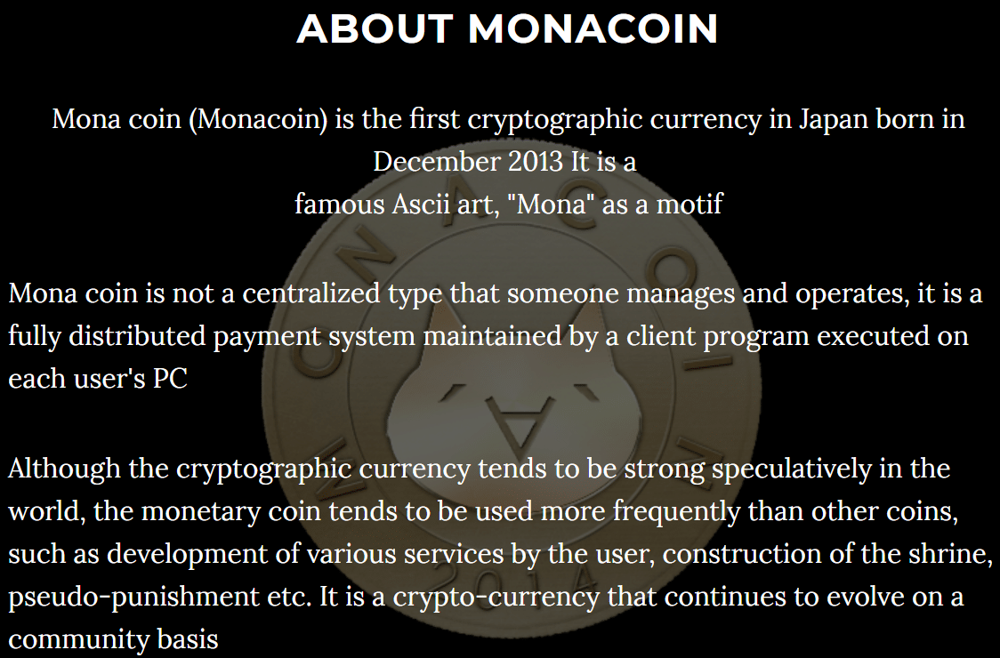

## Table of Contents

## What is MonaCoin?

MonaCoin is a type of digital money, or cryptocurrency, that was created in Japan. It started in 2014 and is named after the famous Mona Lisa painting. People use MonaCoin to buy things online or to trade with others. It works on a special system called a blockchain, which keeps track of all the transactions securely.

Just like other cryptocurrencies, MonaCoin can be stored in digital wallets and sent to others over the internet. It uses a method called mining, where people use their computers to solve puzzles and earn new MonaCoins. This helps keep the network running smoothly. MonaCoin is popular in Japan, but it is also used by people around the world who are interested in cryptocurrencies.

## Who created MonaCoin and when was it launched?

MonaCoin was created by a person or group using the name "Mr. Wantanabe." It was launched on January 1, 2014. Mr. Wantanabe wanted to make a cryptocurrency that was easy to use and popular in Japan.

The idea was to create a digital money that people in Japan could use easily. Since it started, MonaCoin has become well-known in Japan and is used by many people there. It's also used by people in other countries who like cryptocurrencies.

## What is the purpose of MonaCoin?

The main purpose of MonaCoin is to act as a digital money that people can use to buy things or trade with others. It was made to be easy to use, especially for people in Japan. MonaCoin works on a system called blockchain, which keeps all transactions safe and clear. People can use MonaCoin to pay for things online or to send money to friends and family.

MonaCoin also aims to be a fun and popular cryptocurrency. It's named after the famous Mona Lisa painting, which makes it unique and interesting. People can earn new MonaCoins by mining, which means using their computers to solve puzzles. This helps keep the MonaCoin network running well. Overall, MonaCoin wants to be a useful and enjoyable digital money for everyone, especially in Japan.

## How does MonaCoin work as a cryptocurrency?

MonaCoin works like other cryptocurrencies, but it's made to be easy for people in Japan to use. It uses something called a blockchain, which is like a big digital notebook that keeps track of all the money moving around. When someone sends MonaCoin to another person, the transaction gets written into this notebook. This makes sure that everyone can see where the money is going and that no one can cheat. People can keep their MonaCoins in special digital wallets, which are like online bank accounts, and they can send MonaCoins to others over the internet.

To get new MonaCoins, people can do something called mining. This means they use their computers to solve hard puzzles. When they solve a puzzle, they get new MonaCoins as a reward. This helps keep the MonaCoin system running smoothly because it adds new coins and checks all the transactions. MonaCoin is popular in Japan, but people all over the world use it too. It's a fun and easy way to use digital money, and it's named after the famous Mona Lisa painting, which makes it special.

## What makes MonaCoin different from other cryptocurrencies?

MonaCoin is special because it was made for people in Japan. It started in 2014 and is named after the famous Mona Lisa painting, which makes it fun and unique. Unlike some other cryptocurrencies, MonaCoin focuses on being easy to use and popular in Japan. People in Japan can use it to buy things online or to send money to friends and family easily.

Another thing that makes MonaCoin different is how it works. It uses a system called blockchain, just like other cryptocurrencies, but it's set up to be simple and quick. People can earn new MonaCoins by mining, which means using their computers to solve puzzles. This helps keep the MonaCoin network running well. Overall, MonaCoin is a digital money that's easy to use, especially in Japan, and it's a fun and popular choice for people who like cryptocurrencies.

## How can someone acquire MonaCoin?

Someone can get MonaCoin in a few ways. One way is by buying it from a place that sells cryptocurrencies, like an exchange. These places let you use regular money, like dollars or yen, to buy MonaCoin. You just need to sign up for an account, put in some money, and then you can trade it for MonaCoin.

Another way to get MonaCoin is by mining. This means using your computer to solve special puzzles. When you solve a puzzle, you get new MonaCoins as a reward. It's like a game that helps keep the MonaCoin system working well. People who like computers and puzzles might enjoy mining MonaCoin.

## What are the uses of MonaCoin in Japan, where it is popular?

In Japan, people use MonaCoin to buy things online. It's like using digital money instead of regular money. Shops and websites that accept MonaCoin let people pay with it easily. This makes shopping quick and simple. Some people even use MonaCoin to buy special things, like games or digital art, that you can only get with cryptocurrencies.

MonaCoin is also popular for sending money to friends and family. If you want to give someone money, you can send them MonaCoin over the internet. It's fast and doesn't cost much. This is helpful for people who need to send money quickly or to someone far away. MonaCoin makes it easy to share money with others in Japan.

## What is the mining process for MonaCoin and what algorithm does it use?

Mining MonaCoin means using your computer to solve puzzles. When you solve a puzzle, you get new MonaCoins as a reward. This helps keep the MonaCoin system running smoothly. People who like computers and puzzles might enjoy mining MonaCoin. They use special software that lets their computer work on these puzzles.

MonaCoin uses an algorithm called Lyra2REv2 for mining. This is a special way of solving the puzzles that makes mining MonaCoin different from mining other cryptocurrencies. Lyra2REv2 is designed to be fair and to work well with different types of computers. This means more people can join in and help keep the MonaCoin network strong.

## How does the MonaCoin network ensure security and transaction integrity?

The MonaCoin network keeps everything safe and honest by using a blockchain. A blockchain is like a big digital notebook where every MonaCoin transaction gets written down. When someone sends MonaCoin to another person, this transaction goes into the notebook for everyone to see. This makes it hard for anyone to cheat because all the transactions are clear and checked by lots of people.

MonaCoin also uses mining to keep the network secure. Miners use their computers to solve puzzles, and when they do, they add new transactions to the blockchain. This means that the miners help make sure all the transactions are real and correct. By doing this, the MonaCoin network stays strong and safe, and people can trust that their transactions are honest.

## What are the transaction fees associated with MonaCoin?

When you use MonaCoin to send money, you might have to pay a small fee. This fee helps keep the MonaCoin network running smoothly. The fee is usually very small, and it goes to the people who mine MonaCoin. Miners are the ones who use their computers to solve puzzles and add new transactions to the blockchain.

The amount of the fee can change depending on how busy the network is. If lots of people are using MonaCoin at the same time, the fee might be a bit higher. But even then, it's still usually pretty low. This makes MonaCoin a good choice for sending money quickly and cheaply.

## How has the value of MonaCoin fluctuated over time?

The value of MonaCoin has gone up and down a lot since it started in 2014. At first, it didn't cost much, but as more people learned about it and started using it, the price went up. There have been times when MonaCoin was worth a lot more than when it began. But it's also had times when the price went down, sometimes a lot. This is normal for cryptocurrencies because their value can change based on what people think and how many people want to buy or sell them.

Over the years, big events in the world of cryptocurrencies have affected MonaCoin's price too. For example, when Bitcoin or other big cryptocurrencies do well, MonaCoin often does better too. But if there's bad news or if people start to worry about cryptocurrencies, the price can drop. Even with all these ups and downs, MonaCoin keeps being popular, especially in Japan, where many people use it to buy things and send money to each other.

## What are the future prospects and developments planned for MonaCoin?

MonaCoin wants to keep growing and becoming more popular, especially in Japan. The people who work on MonaCoin are always thinking about new ways to make it easier for people to use. They want to add more places where you can spend MonaCoin and make it work even better with other digital money. They also want to keep the system safe and fast, so people can trust it more.

One big plan for MonaCoin is to make it easier for new people to start using it. They want to make the whole process of buying, selling, and using MonaCoin simpler. This could mean better apps and websites that help people learn about MonaCoin and use it without any trouble. By doing this, they hope more people will start using MonaCoin and it will become a bigger part of everyday life in Japan and maybe even around the world.

## What are the special considerations?

The MonaCoin network, like many cryptocurrency ecosystems, is susceptible to security concerns such as hacking and fraudulent activities. There have been notable security incidents in the past that have highlighted vulnerabilities within the MonaCoin infrastructure. For instance, in 2018, MonaCoin experienced a major hack where attackers exploited vulnerabilities to perform a double-spending attack, resulting in the loss of substantial funds. This incident underscored the importance of robust security protocols and vigilant network monitoring to protect against potential threats.

In addition to security concerns, future halvings in the MonaCoin network present significant considerations for both miners and investors. Halving events reduce the mining rewards by half, which directly impacts the rate at which new MonaCoins are introduced into the circulation. This reduction in mining rewards can influence the supply dynamics and market valuation of the cryptocurrency. For mo miners, halving events can mean reduced profitability unless the market price of MonaCoin appreciates to offset the diminished rewards. The equation for mining profitability can be impacted as:

$$
\text{Profitability} = (\text{Block Reward} \times \text{Market Price}) - (\text{Electricity Cost} + \text{Hardware Cost})
$$

As the block reward decreases, the dependency on market price increases to maintain mining incentives. Consequently, these halvings also affect market dynamics, possibly inducing price volatility as market participants adjust to the new supply constraints. Understanding these factors is crucial for anyone involved in trading or investing in MonaCoin, as both security threats and supply changes can significantly influence the network's stability and value.

## References & Further Reading

[1]: Nakamoto, S. (2008). ["Bitcoin: A Peer-to-Peer Electronic Cash System."](https://nakamotoinstitute.org/library/bitcoin/)

[2]: Antonopoulos, A. M. (2017). ["Mastering Bitcoin: Unlocking Digital Cryptocurrencies."](https://books.google.com/books/about/Mastering_Bitcoin.html?id=IXmrBQAAQBAJ) O'Reilly Media.

[3]: Narayanan, A., Bonneau, J., Felten, E., Miller, A., & Goldfeder, S. (2016). ["Bitcoin and Cryptocurrency Technologies: A Comprehensive Introduction."](https://press.princeton.edu/books/hardcover/9780691171692/bitcoin-and-cryptocurrency-technologies) Princeton University Press.

[4]: Antonopoulos, A. M., & Wood, G. (2018). ["Mastering Ethereum: Building Smart Contracts and DApps."](https://www.amazon.com/Mastering-Ethereum-Building-Smart-Contracts/dp/1491971940) O'Reilly Media.

[5]: Nakamoto, S. (2008). ["Bitcoin: A Peer-to-Peer Electronic Cash System"](https://nakamotoinstitute.org/library/bitcoin/) - A foundational paper for understanding decentralized cryptocurrencies, explaining the underlying blockchain technology that powers MonaCoin and others.

[6]: Iwamura, M., Kitamura, Y., & Matsumoto, T. (2014). ["Is Bitcoin the Only Cryptocurrency in the Town? Economics Behind the Uproar Around Alternative Cryptocurrencies."](https://journals.sagepub.com/doi/10.1111/poms.13950?icid=int.sj-full-text.citing-articles.261) Springer.

[7]: Farell, R. (2015). ["An Analysis of the Cryptocurrency Industry."](https://www.researchgate.net/publication/304089371_An_Analysis_of_the_Cryptocurrency_Industry) - Provides insights into alternative cryptocurrencies like MonaCoin within the broader industry.

[8]: Mougayar, W. (2016). ["The Business Blockchain: Promise, Practice, and Application of the Next Internet Technology."](https://books.google.com/books/about/The_Business_Blockchain.html?id=CEsPDAAAQBAJ) Wiley.

[9]: Ober, M., Katzenbeisser, S., & Hamacher, K. (2013). ["Structure and Anonymity of the Bitcoin Transaction Graph."](https://www.mdpi.com/1999-5903/5/2/237) Future Internet.

[10]: Antonopoulos, A. M. (2014). ["Mastering Bitcoin: Unlocking Digital Cryptocurrencies."](https://books.google.com/books/about/Mastering_Bitcoin.html?id=IXmrBQAAQBAJ) O'Reilly Media. 

[11]: Swammy, S. (2018). ["Bitcoin and Cryptocurrency Technologies: A Comprehensive Introduction"](https://press.princeton.edu/books/hardcover/9780691171692/bitcoin-and-cryptocurrency-technologies) - Offers foundational knowledge pertinent to understanding MonaCoin’s position in the digital currency spectrum.

