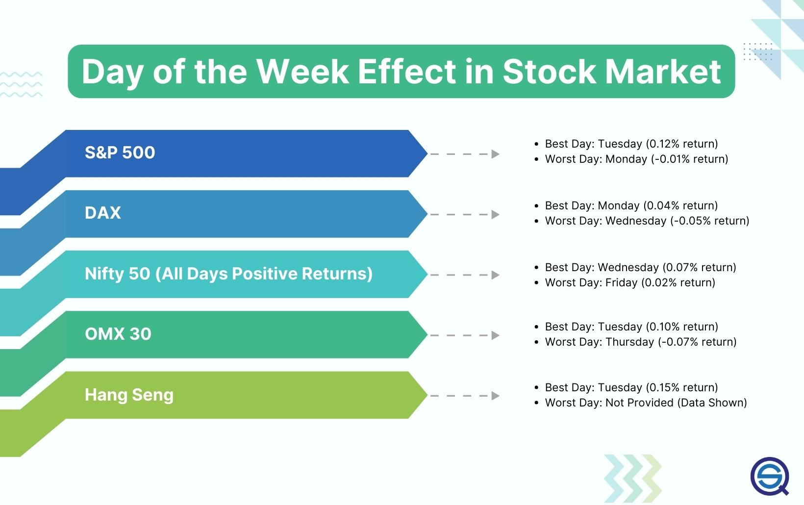

The Monday Effect is an intriguing phenomenon in the stock market that investors and traders often examine closely. This financial theory suggests that Monday stock returns tend to follow the trends seen on the previous Friday. In practice, if a stock market closes on a high note on Friday, it is likely that it will open stronger on the following Monday, and similarly, if the market closes low on Friday, a weaker opening is anticipated on Monday. This effect is drawn from observed patterns in trading behaviors that occur over weekends when the market is closed. 

Despite being widely studied, the Monday Effect continues to spark debate among analysts and investors alike. The ongoing discourse revolves around its consistency as a predictive tool and its practical implications in modern trading environments, particularly with the advent of algorithmic trading strategies. The allure of potentially exploiting these trends contributes to its persistent scrutiny. 



This article explores the concept in detail, providing insights into its historical background, its impact on market trends, and its relevance to algorithmic trading. By analyzing empirical data and theoretical interpretations, we aim to shed light on its validity and utility for contemporary traders.

## Table of Contents

## What is the Monday Effect?

The Monday Effect is a theory in stock market trading that suggests a correlation between the performance of the stock market on Fridays and its behavior the following Monday. Specifically, if the market closes on a high note on Friday, it is more likely to open stronger on Monday, and conversely, a weak close on Friday may lead to a weaker opening on Monday.

This phenomenon is particularly significant for day traders who aim to capitalize on short-term market movements. By understanding the patterns associated with the Monday Effect, traders can make informed decisions at the start of the trading week, potentially maximizing their returns.

The concept was first identified by researcher Frank Cross in 1973, whose analysis led to its alternative name, the 'Weekend Effect.' Cross's study indicated that stock returns tend to be systematically lower on Mondays compared to other days of the week, which suggested a recurring pattern that could be exploited for trading advantages.

While the Monday Effect has been recognized as a trend in the stock market, its exact causes remain speculative. Several hypotheses attempt to explain the phenomenon. One possibility involves short selling, where traders might place short positions on Fridays and cover those positions on Mondays, influencing market trends. Additionally, the timing of news releases may contribute to this effect. Companies sometimes release news late on Fridays, which can impact investor sentiment and decisions, thereby affecting stock prices once the market reopens on Monday.

Despite various attempts to quantify and predict the Monday Effect, the inconsistency of its occurrence and the presence of other market variables make it a complex and debated topic among analysts. Nevertheless, understanding this concept provides traders with another tool to navigate the intricacies of stock market behavior.

## Historical Context and Discovery

Frank Cross's pioneering research in 1973 laid the groundwork for our understanding of the Monday Effect, a phenomenon observed in stock market patterns. His analysis examined stock returns between 1953 and 1970, revealing significant day-to-day disparities. This study identified a consistent trend where stock returns on Fridays were typically higher than those on Mondays. This pattern suggested a lull in trading activity and [momentum](/wiki/momentum) over the weekend, commonly referred to as the weekend effect. The findings highlighted investors' behavior, where optimism and trading activity peaked towards the end of the trading week, only to diminish by Monday.

Cross's work was further substantiated by statistical analyses conducted by entities such as the Federal Reserve, which noted the periodic disappearance and resurgence of this anomaly. The resurgence may be attributed to changes in market conditions, investor behavior, or regulatory modifications, highlighting the intricate dynamics influencing the Monday Effect. Over time, these observations have become a focal point for discussions on market efficiency and behavioral finance, with periodic evidence of the effect resurfacing despite advancements in trading technology and algorithmic strategies.

## Factors Contributing to the Monday Effect

Various theories attempt to explain the Monday Effect, focusing on both psychological and structural dynamics within the stock market. One potential [factor](/wiki/factor-investing) is the collective sentiment of investors as the trading week closes on Friday. If markets experience gains by the week’s end, the optimistic sentiment tends to [carry](/wiki/carry-trading) over, theoretically resulting in higher opening prices on Monday. This behavioral inclination aligns with the concept of investor psychology, where traders’ mood influences decision-making.

Furthermore, the timing of corporate news releases may significantly impact this effect. Companies often strategically release news late on Fridays—potentially to minimize immediate market impact given the two-[day trading](/wiki/day-trading-spy) pause. Such news, particularly if negative, can lead to price adjustments the following Monday, as investors process new information and adjust their portfolios accordingly.

Short selling, the practice of selling borrowed stocks with the aim of buying them back at a lower price, further complicates this phenomenon. As the trading week draws to a close, short sellers might opt to cover positions to lock in profits, potentially influencing a stock’s closing price on Friday. This activity can create upward pressure on stock prices, contributing to the pricing discrepancies observed between the close of trading on Friday and the opening on Monday.

These contributory factors feed into the broader [algorithmic trading](/wiki/algorithmic-trading) ecosystem. Traders often utilize historical behavioral patterns in developing strategies that capitalize on recurring market anomalies, including the Monday Effect. The interpretations and applications of these theories continue to evolve as additional data becomes available and trading technologies advance.

## The Monday Effect in Algorithmic Trading

Algorithmic trading strategies leverage patterns such as the Monday Effect to enhance investment decisions and optimize stock trading outcomes. Central to these AI-driven models is the utilization of historical data, which is meticulously analyzed to forecast market trends and execute rapid trade decisions. Such processes allow trading systems to capitalize on recurring patterns like the Monday Effect.

Examining market movements over the weekend is a crucial part of this strategy. Since much of the trading halt during Saturdays and Sundays, the anticipation of stock behavior upon the reopening of markets is vital. Algorithms scrutinize data from the prior week and weekend, seeking subtle indicators that might influence Monday's market dynamics. By doing so, these systems aim to establish a profitable stance by Monday morning, thus maximizing the potential for gains based on trend predictions formed over the weekend.

The integration of the Monday Effect into algorithmic models requires careful consideration of trading volumes, news cycles, and investor sentiment surrounding weekends. Coders and quants might implement strategies programmed to detect and react to patterns observed in historical data associated with Monday market behavior. Here's a basic example of what such an algorithm might look like in Python:

```python
import numpy as np
import pandas as pd
from sklearn.linear_model import LinearRegression

# Load historical stock data
data = pd.read_csv('stock_data.csv')

# Feature engineering: Create lag features for analysis
data['Friday_Return'] = data['Close'].pct_change().shift(1)
data['Monday_Return'] = data['Close'].pct_change().shift(-3)

# Define features and target
X = data[['Friday_Return']][:-3]
y = data['Monday_Return'][:-3]

# Fit a linear regression model
model = LinearRegression()
model.fit(X, y)

# Predict Monday's return
last_friday_return = data['Friday_Return'].iloc[-1]
predicted_monday_return = model.predict(np.array([[last_friday_return]]))

print("Predicted Monday Return:", predicted_monday_return)
```

This algorithm models the relationship between Friday and Monday returns using linear regression. It uses past data to estimate potential stock movement on Monday, aiming to get ahead of the trend suggested by the Monday Effect. By processing extensive datasets, algorithmic systems can refine these predictions, resulting in improved accuracy and profitability within trading strategies.

## Debate and Criticism

Despite the Monday Effect's prominence, critics argue that its predictive power is inconsistent and may have diminished since the 1990s. This skepticism is partly due to the evolving complexities and efficiencies in financial markets that have arisen with technological advancements and increased regulatory oversight.

Some experts suggest that the Monday Effect may be a mere artifact of random market fluctuations rather than a predictable pattern. Statistical analysis often raises questions about data fitting and the reliability of observed patterns. For instance, the Efficient Market Hypothesis (EMH) posits that stock prices fully reflect all available information, which theoretically eliminates any consistent opportunity for [arbitrage](/wiki/arbitrage), such as that suggested by the Monday Effect. If markets are efficient, patterns like these would likely be exploited quickly by market participants, leading to their eventual disappearance.

The debate extends to whether anomalies like the Monday Effect truly exist in a statistically significant manner or are simply results of data mining. Critics often cite issues like "p-hacking" or cherry-[picking](/wiki/asset-class-picking) data to support a hypothesis, suggesting that many identified market patterns may not hold up under rigorous scrutiny or across broader datasets. In this view, the Monday Effect could be one example of patterns that emerge due to chance when examining numerous datasets or timeframes.

Furthermore, the onset of high-frequency trading and algorithmic strategies since the late 20th century has added layers of complexity to market dynamics. These technologies could potentially neutralize recurring anomalies through rapid arbitrage, making the Monday Effect less observable or impactful.

Ongoing debates also address the broader issue of market efficiency and the nature of such anomalies. The persisting inquiry questions whether the Monday Effect, alongside other supposed market anomalies, invalidates the core principles of EMH. The discussion remains dynamic, fueled by continual changes in trading technology, methodologies, and global market landscapes, as researchers and practitioners alike strive to discern patterns that can reliably inform trading strategies.

## Conclusion

The Monday Effect remains a captivating concept with implications for various trading strategies. Its periodic appearance in historical data has intrigued traders who seek to leverage any potential edge it offers. While the consistency of the Monday Effect may oscillate, with certain periods exhibiting stronger correlations and others less so, appreciating such patterns can aid investors in refining their trading tactics. The unpredictability inherent in financial markets demands that traders remain adaptable, yet recognizing recurring phenomena like the Monday Effect provides an opportunity to enhance trading outcomes. 

As algorithmic trading further matures, its capacity to integrate historical trends has significant promise. By incorporating datasets that consider phenomena like the Monday Effect, AI-driven models and algorithms can be fine-tuned to exploit known market tendencies. This approach not only addresses traditional stock market behaviors but also bolsters decision-making frameworks with data-driven insights. Overall, while the Monday Effect is not a guaranteed predictor of market behavior, it represents a valuable component in a trader’s toolkit, especially when combined with broader strategies and cutting-edge technology.

## Extra Tips for Traders

Traders aiming to utilize the Monday Effect while navigating the complexities of the stock market are advised to diversify their strategies. This diversification can help manage the inherent unpredictability associated with relying exclusively on the Monday Effect, as stock market trends can often deviate from historical patterns.

Algorithmic traders, in particular, should prioritize regularly updating and refining their trading algorithms to incorporate the most recent market data. The dynamic nature of financial markets means that algorithms based on outdated or incomplete data are less likely to yield accurate predictions or optimal trading outcomes. Continuous [backtesting](/wiki/backtesting) with fresh datasets allows traders to adapt to evolving market conditions, thus increasing the robustness and precision of their strategies.

A simple example of updating an algorithm could be the integration of recent price data into a predictive model. Below is a basic Python snippet that demonstrates updating an algorithmic model with new data for enhanced prediction accuracy:

```python
import pandas as pd
from sklearn.model_selection import train_test_split
from sklearn.linear_model import LinearRegression

# Load new market data
new_data = pd.read_csv('latest_market_data.csv')

# Preparing features and target variable
X = new_data[['feature1', 'feature2', 'feature3']]  # replace with actual features
y = new_data['target']  # replace with actual target variable, e.g., next day's price

# Split the data into training and testing sets
X_train, X_test, y_train, y_test = train_test_split(X, y, test_size=0.2, random_state=42)

# Initialize and train the model
model = LinearRegression()
model.fit(X_train, y_train)

# Test the model on the test set
accuracy = model.score(X_test, y_test)
print(f'Model Accuracy: {accuracy:.2f}')
```

This script demonstrates how traders can update their analytical models with new data, which is essential for maintaining the efficacy of trading algorithms in the face of market [volatility](/wiki/volatility-trading-strategies). By leveraging recent information, traders can better anticipate market movements, including those related to the Monday Effect, ultimately leading to more informed and potentially profitable trading decisions.

## References & Further Reading

[1]: Cross, F. (1973). "The Behavior of Stock Prices on Fridays and Mondays." Financial Analysts Journal, 29(6), 67-69.

[2]: French, K. R. (1980). "Stock Returns and the Weekend Effect." Journal of Financial Economics, 8(1), 55-69.

[3]: Kamara, A. (1997). "The Weekend Effect: A Trading Enigma." Journal of Financial Intermediation, 6(3), 173-194.

[4]: Jaffe, J., & Westerfield, R. (1985). "The Week-End Effect in Common Stock Returns: The International Evidence." The Journal of Finance, 40(2), 433-454.

[5]: ["Quantitative Trading: How to Build Your Own Algorithmic Trading Business"](https://www.amazon.com/Quantitative-Trading-Build-Algorithmic-Business/dp/1119800064) by Ernest P. Chan

[6]: ["Evidence-Based Technical Analysis: Applying the Scientific Method and Statistical Inference to Trading Signals"](https://www.amazon.com/Evidence-Based-Technical-Analysis-Scientific-Statistical/dp/0470008741) by David Aronson

[7]: Zhang, J., & Jacobsen, B. (2012). "Are Monthly and Weekly Trading Patterns of Individual Investors Related to the Weekend Effect?" Journal of Economic Dynamics and Control, 36(3), 510-528.