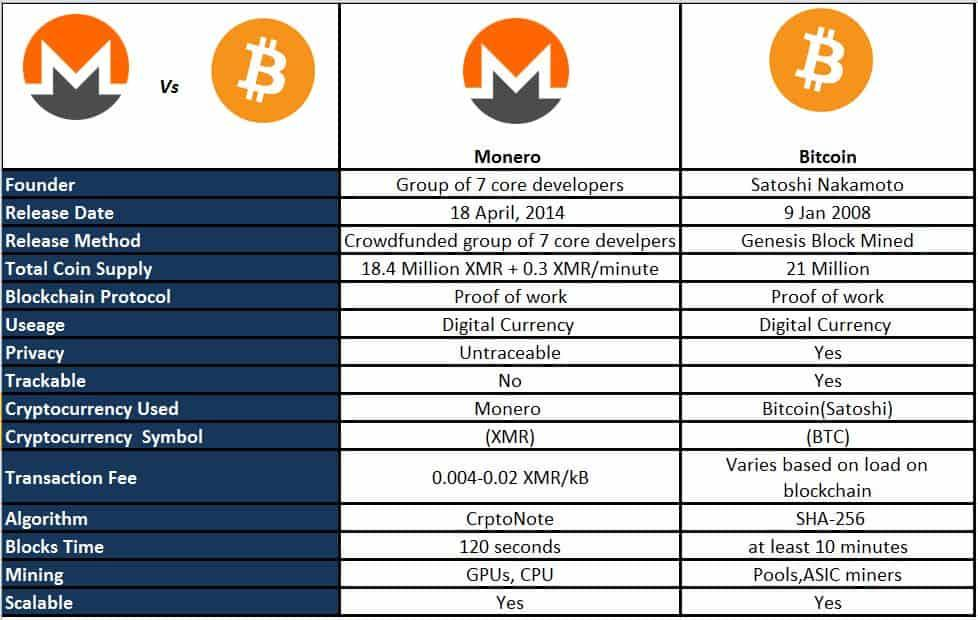

Cryptocurrencies have emerged as a transformative force in the global economy, reshaping the financial landscape by offering decentralized, secure, and efficient means of transaction. Among the multitude of digital currencies, Bitcoin and Monero stand out due to their widespread adoption and distinctive features. Bitcoin, introduced in 2009 by the pseudonymous Satoshi Nakamoto, is heralded as the first decentralized cryptocurrency and is renowned for popularizing blockchain technology. Its finite supply and decentralized consensus mechanism, known as Proof of Work (PoW), set the foundation for modern cryptocurrencies.

Monero, on the other hand, distinguishes itself by prioritizing privacy and anonymity. Launched in 2014, Monero uses advanced cryptographic techniques to obscure transaction details, ensuring that neither amounts, sources, nor destinations can be traced. This focus on confidentiality attracts users who seek enhanced privacy compared to Bitcoin's relatively transparent ledger.



As cryptocurrencies have grown in significance, so too has algorithmic trading — the process of using computer algorithms to execute trades at speeds and volumes humans cannot match. In cryptocurrency markets, algorithmic trading is becoming increasingly prevalent due to the market's 24/7 availability, high volatility, and potential for rapid arbitrage. These algorithms can analyze vast datasets and execute orders in milliseconds, making trading more efficient and potentially more profitable.

The purpose of this article is to explore the intricacies of mining Bitcoin and Monero, alongside examining the expanding role of algorithmic trading within the cryptocurrency sector. Mining, integral to the maintenance and security of cryptocurrency networks, involves solving complex mathematical puzzles to validate transactions and generate new coins. Both Bitcoin and Monero mining have unique characteristics and challenges, dependent on the specific algorithms and hardware used.

This piece will systematically cover several aspects, beginning with an explanation of cryptocurrency mining, followed by detailed insights into Monero and Bitcoin mining practices. Subsequently, the article shifts focus to the rise of algorithmic trading in cryptocurrency, illuminating its impact and potential. The integration of mining and trading strategies will be explored for potential optimization of profitability and risk management. Finally, prospective future trends and developments in these domains will be discussed to provide a comprehensive outlook. This structured approach aims to equip readers with a nuanced understanding of mining, trading, and their intersection within the cryptocurrency ecosystem.

## Table of Contents

## Understanding Cryptocurrency Mining

Cryptocurrency mining is a pivotal process within the blockchain ecosystem, playing a dual role in both validating transactions and generating new coins. Mining involves solving complex computational problems using cryptographic algorithms, a process that maintains the integrity and security of the blockchain network. By verifying and recording transactions on the blockchain, miners facilitate the decentralized operation of cryptocurrencies, ensuring that all transactions are accurate and tamper-proof.

Mining operates on the principle of Proof of Work (PoW), a consensus protocol essential for the operational security of many cryptocurrencies, including Bitcoin and Monero. PoW requires miners to compete to solve mathematical puzzles, with the first to solve and validate the block receiving a reward in the form of [cryptocurrency](/wiki/cryptocurrency). This competitive nature of PoW ensures that the blockchain remains a distributed ledger, free from centralized control.

In recent years, cryptocurrency mining has undergone significant developments and technological advancements. Initially, mining Bitcoin and similar cryptocurrencies could be accomplished using standard CPUs found in personal computers. However, as the difficulty of mining challenges increased, more specialized hardware was necessary, leading to the development of Graphics Processing Units (GPUs) and Field Programmable Gate Arrays (FPGAs). Subsequently, Application-Specific Integrated Circuits (ASICs) emerged, offering even greater efficiency and computational power tailored specifically for the mining process.

These advancements have had a considerable impact on the mining landscape. For instance, ASIC miners are optimized for specific algorithms and boast superior performance compared to CPUs and GPUs, but they also contribute to increased centralization risks because of their high cost and power consumption. To address such concerns, some cryptocurrencies, like Monero, have adopted ASIC-resistant algorithms, encouraging decentralized mining practices by ensuring that mining can still be profitably conducted using general-purpose hardware.

Moreover, technological progress in cryptocurrency mining is not solely limited to hardware improvements. The advent of cloud mining services allows individuals to participate in mining without owning physical hardware. Instead, users rent mining power from data centers, effectively democratizing access to mining and lowering entry barriers for individuals interested in the cryptocurrency space.

These developments in cryptocurrency mining technology reflect an ongoing evolution aimed at enhancing efficiency, accessibility, and security within the blockchain ecosystem. As the industry continues to innovate, miners and developers are expected to explore new methodologies, including energy-efficient mining practices, to address environmental concerns and the sustainability of blockchain networks.

## Monero Mining: A Closer Look

Monero is a cryptocurrency that stands out primarily due to its strong focus on privacy and anonymity. Unlike cryptocurrencies such as Bitcoin, which operate on a transparent blockchain, Monero ensures that transaction details such as sender, receiver, and amount are concealed. This is achieved through advanced cryptographic techniques, namely Ring Signatures, Stealth Addresses, and Ring Confidential Transactions (RingCT).

### Monero Mining Specifics

Monero mining involves participants, known as miners, using computational power to solve complex mathematical equations, which in turn validate transactions and facilitate the creation of new Monero coins. The process employed by Monero is based on the Proof of Work (PoW) algorithm, similar to Bitcoin, but with notable differences in its implementation.

The key distinction in Monero's mining process lies in its algorithm, RandomX, which is designed to be resistant to specialized mining hardware known as ASICs (Application-Specific Integrated Circuits). Unlike Bitcoin, which has become dominated by large mining operations using ASICs, Monero's ASIC resistance aims to democratize the mining process, allowing a broader range of participants, from individuals using CPUs to smaller-scale operators, to engage in mining activities.

### ASIC-Resistance and Miner Implications

Monero's ASIC-resistant stance is achieved through the RandomX algorithm, which prioritizes memory-heavy computations and random code execution, making it inefficient for ASIC hardware. This resistance levels the playing field for miners by enabling conventional hardware, such as standard CPUs, to effectively mine Monero. The goal is to enhance decentralization, as mining power remains more distributed without the monopolization seen in other cryptocurrencies that are susceptible to ASIC mining.

However, the implication of this design choice is that Monero miners must rely on optimizing their mining software and hardware configurations to ensure efficiency. Additionally, periodic algorithm updates are necessary to maintain ASIC resistance, requiring miners to adapt to changes in the mining protocol.

### Mining Hardware and Software

Given Monero's emphasis on ASIC resistance, the typical hardware used for mining includes consumer-grade CPUs and GPUs. High-performance CPUs with large L3 caches are particularly suited due to the RandomX algorithm's reliance on memory-intensive calculations. 

Mining Monero effectively requires the use of specialized mining software. Some of the popular options include XMRig, SRBMiner, and XMR-Stak, all of which are open-source and provide flexibility for miners to optimize their settings. These miners enable efficient hashing capabilities while supporting a variety of hardware configurations.

Mining pools are also prevalent in Monero mining, providing miners with the ability to combine resources to collectively solve blocks and earn rewards, which ensures more consistent payouts, especially for individual miners unable to participate in solo mining due to limited resources.

In summary, Monero's focus on privacy and ASIC-resistance defines its mining approach, offering opportunities for individual miners and small-scale operators to participate in a decentralized ecosystem by leveraging standard CPUs and specialized software. This democratization differentiates Monero mining from Bitcoin, fostering a wider participation base and maintaining the cryptocurrency's foundational principles of privacy and decentralization.

## Bitcoin Mining: Key Considerations

Bitcoin mining has undergone significant transformation since its inception. Initially, mining was conducted using central processing units (CPUs), which provided sufficient computational power to solve cryptographic puzzles and secure the Bitcoin network. However, as the popularity of Bitcoin grew, the difficulty level of mining increased, rendering CPU mining inefficient.

The industry soon shifted to using graphics processing units (GPUs), which offered enhanced processing power by harnessing parallel computation. This phase saw an influx of mining enthusiasts who capitalized on the increased hash rate capabilities of GPUs. However, as Bitcoin's valuation soared, the competition intensified, giving rise to the development of even more specialized hardware.

Field-programmable gate arrays (FPGAs) were introduced as a next step, offering superior performance to GPUs due to their ability to be configured for specific tasks. Despite their advantages, FPGAs were soon overshadowed by the advent of application-specific integrated circuits (ASICs). ASICs are tailored specifically for Bitcoin mining, delivering unprecedented hash rates and energy efficiency. Today, ASICs dominate the Bitcoin mining ecosystem, with companies continuously pushing technological boundaries to produce more powerful and energy-efficient models.

To mine Bitcoin profitably, a significant investment in infrastructure is required. This includes costs associated with purchasing ASIC hardware, and establishing a proper setup to ensure efficient operation. Miners need to consider factors such as cooling systems to prevent hardware overheating, as well as physical space to accommodate mining rigs. Electricity costs constitute a major operational expense, as mining consumes substantial energy. The profitability of mining is directly influenced by electricity rates, hash rate, and Bitcoin market price. As such, many mining operations are strategically located in regions with low electricity costs or seek to utilize renewable energy sources.

The environmental impact of Bitcoin mining has been a subject of scrutiny due to its substantial energy consumption. Recent years have witnessed growing efforts to enhance the sustainability of mining operations. Miners are increasingly adopting renewable energy sources, such as hydroelectric, solar, and wind power, to mitigate carbon footprints. Additionally, there is a concerted push towards more energy-efficient technologies and mining practices. For instance, some communities have taken initiatives to repurpose excess heat generated by mining operations for utilities such as heating homes and greenhouses.

Beginners interested in Bitcoin mining should approach the venture with careful planning and realistic expectations. It is advisable to conduct thorough research on mining hardware options, considering both cost and performance metrics. Joining a mining pool can be beneficial, as it allows individuals to combine their computational resources, thus increasing the chances of [earning](/wiki/earning-announcement) consistent rewards. Additionally, beginners should monitor electricity costs and optimize their setup for energy efficiency. Keeping abreast of industry trends and technological advancements will also position newcomers to adapt and succeed in the evolving landscape of Bitcoin mining.

## The Rise of Algorithmic Trading in Cryptocurrency

Algorithmic trading, often referred to as algo trading, is a method of executing orders using automated and pre-programmed trading instructions that account for variables such as timing, price, and [volume](/wiki/volume-trading-strategy). This approach leverages mathematical models and computational resources to make trading decisions, thereby minimizing human intervention. Traditionally, [algorithmic trading](/wiki/algorithmic-trading) has played a pivotal role in enhancing [liquidity](/wiki/liquidity-risk-premium) and efficiency in financial markets, reducing transaction costs, and providing a structured, data-driven approach to trading.

In recent years, algorithmic trading has gained substantial traction within the cryptocurrency space. The decentralized and 24/7 nature of cryptocurrency markets makes them particularly suitable for algorithmic strategies. The adoption of algo trading in cryptocurrencies allows traders to exploit market inefficiencies quickly and leverage high-frequency trading ([HFT](/wiki/high-frequency-trading-strategies)) strategies that are often difficult for human traders to accomplish manually. Python and other programming languages are frequently used to develop these algorithms due to their robust libraries like NumPy and Pandas, which facilitate data analysis and manipulation.

One of the primary advantages of algorithmic trading in cryptocurrencies is the enhanced speed and efficiency it offers. Algorithms can process massive datasets and execute trades in fractions of a second, an essential capability in markets characterized by high [volatility](/wiki/volatility-trading-strategies) and rapid price fluctuations. Furthermore, algorithms can manage a wide array of trading pairs and execute trades simultaneously across different exchanges, thus maximizing potential gains and ensuring best execution practices.

Despite its advantages, algorithmic trading in the volatile crypto markets poses certain challenges and risks. Market conditions such as sudden price swings and flash crashes can exacerbate the risks associated with automated trading. Algorithms lacking robust risk management protocols might execute undesired trades, leading to substantial financial losses. Moreover, the fragmented and unregulated nature of cryptocurrency markets may expose traders to issues such as liquidity constraints and exchange-specific anomalies. These challenges necessitate the implementation of rigorous testing and optimization of algorithms, alongside the continuous monitoring of market conditions.

Additionally, the sophistication required to design and deploy effective algorithms implies a steep learning curve and considerable initial investment in technology and expertise. As such, traders must not only have programming skills but also a deep understanding of both market mechanics and risk management strategies.

Despite these challenges, the integration of [machine learning](/wiki/machine-learning) techniques into algorithmic trading strategies holds promising potential. Machine learning can enhance predictive analytics, allowing algorithms to recognize and adapt to patterns through continuous learning processes, thus improving decision-making and profitability.

In conclusion, while algorithmic trading brings about speed and efficiency to cryptocurrency markets, it is accompanied by unique challenges that necessitate careful consideration and strategic planning.

## Integrating Mining and Algorithmic Trading Strategies

The integration of mining and algorithmic trading strategies offers a compelling opportunity for both cryptocurrency miners and traders. By leveraging algorithmic trading, miners can enhance their decision-making processes regarding when to mine and which cryptocurrencies to focus on, potentially maximizing their returns. Conversely, traders can use mining insights to inform their trading strategies, thereby improving their market predictions and responses.

Data analytics and machine learning play a crucial role in enhancing these integrated strategies. Machine learning algorithms can be employed to predict cryptocurrency price trends by analyzing vast amounts of data, including historical market prices, mining difficulty levels, and macroeconomic indicators. For instance, a predictive model could be designed using Python's widely-used libraries such as TensorFlow or PyTorch, which can aid in forecasting price movements and optimizing mining operations based on these forecasts.

```python
import numpy as np
from sklearn.model_selection import train_test_split
from sklearn.ensemble import RandomForestRegressor

# Example for basic crypto price prediction model using Random Forest
features = np.array([...])  # Historical price, mining difficulty, etc.
labels = np.array([...])    # Future price

X_train, X_test, y_train, y_test = train_test_split(features, labels, test_size=0.2, random_state=0)

model = RandomForestRegressor(n_estimators=100, random_state=42)
model.fit(X_train, y_train)

predictions = model.predict(X_test)
```

Real-world examples of successful strategy integration are emerging, as more firms develop sophisticated platforms to bridge mining operations with algorithmic trading systems. These platforms often employ machine learning models to predict optimal mining schedules and real-time trading actions, which align with the dynamic nature of cryptocurrency markets.

For example, some mining entities have started to employ strategies where they suspend mining operations when the network's mining difficulty is high or electricity costs spike, and focus more on trading activities during these periods. Conversely, they ramp up mining activities when conditions are more favorable. This adaptive strategy helps in risk management by diversifying income streams and reducing reliance on consistently high mining profitability.

Additionally, algorithmic trading can be used to hedge against mining risks by establishing protective trading positions that account for the volatility inherent in cryptocurrency markets. By continuously refining the algorithms through [backtesting](/wiki/backtesting) and real-time adjustments, traders and miners can achieve a balanced and often more profitable approach than relying on either strategy in isolation.

The integration of mining and algorithmic trading enables a comprehensive approach to cryptocurrency investment, balancing operational efficiency with financial sophistication. As technological innovations advance, the synergy between these two strategies is likely to become increasingly prevalent, thereby enhancing both profitability and risk management capabilities in the cryptographic ecosystem.

## Future Trends and Developments

Cryptocurrency mining and algorithmic trading are integral components of the digital finance ecosystem, constantly evolving with technological advancements and market dynamics. The future of this sector promises further innovation, influenced by emerging technologies, regulatory frameworks, and the ongoing quest for efficiency.

### Technological Developments in Cryptocurrency Mining

The future of cryptocurrency mining will likely be shaped by advancements in hardware and energy efficiency. As the demand for cryptocurrencies grows, there is a push towards developing more efficient mining hardware that can deliver higher hash rates while consuming less power. This includes the transition from traditional GPU-based systems to more advanced technologies like Application-Specific Integrated Circuits (ASICs) and possibly quantum computing in the long term. These developments aim to maximize output and minimize ecological footprints.

Energy consumption remains a critical issue in mining. Innovations such as green mining techniques, which utilize renewable energy sources like solar or hydropower, are gaining attention. Companies are also exploring carbon credit systems and partnerships with clean energy projects to offset their environmental impact.

### Emerging Trends in Algorithmic Trading Technologies

Algorithmic trading in cryptocurrency markets is anticipated to evolve with improvements in [artificial intelligence](/wiki/ai-artificial-intelligence) and machine learning. These technologies enhance trading algorithms' predictive accuracy, enabling more effective market analysis and trade execution. Moreover, real-time big data analytics can provide insights into market trends and player behavior, refining the decision-making process.

Technological trends such as high-frequency trading (HFT) algorithms, which execute a large number of orders at extremely fast speeds, are becoming more popular due to their ability to capitalize on short-term market inefficiencies. Techniques like natural language processing (NLP) are also being utilized to analyze news sentiment and its potential impact on market movements.

### Regulatory Considerations

As the cryptocurrency landscape matures, regulatory frameworks worldwide are being developed to ensure market stability and protect investors. This regulatory evolution can significantly impact mining and trading practices. For instance, stringent emissions regulations could drive miners to adopt cleaner energy sources, while compliance requirements in trading might necessitate more transparent and secure algorithmic systems.

Governments may introduce legislation concerning data privacy, impacting how algorithmic traders handle sensitive user information. Additionally, tax policies on crypto transactions could influence both domestic and international trading strategies.

### The Role of Innovation

Innovation is a catalyst for sustaining competitiveness in mining and algorithmic trading. Blockchain scalability solutions, such as sharding or off-chain transactions, might emerge as viable options to enhance network throughput without compromising decentralization.

Furthermore, integrating advanced technologies like blockchain interoperability protocols and decentralized finance (DeFi) platforms can transform traditional models of mining and trading. These innovations aim to create a seamless environment where different blockchain ecosystems can interact, potentially leading to the development of more sophisticated financial instruments and trading strategies.

In conclusion, the future holds promising growth in cryptocurrency mining and algorithmic trading. Through technological advances, sustainable practices, and regulatory adaptations, the industry can achieve greater efficiency, reduced environmental impact, and robust market integrity. Stakeholders must remain aware of these developments to harness opportunities and address challenges effectively.

## Conclusion

Cryptocurrency mining and algorithmic trading have become integral aspects of the dynamic digital economy, with Monero and Bitcoin standing out as key players in the landscape. Monero, distinguished by its commitment to privacy, presents a unique mining approach that resists ASICs, thus allowing a more decentralized mining environment using consumer-grade hardware. In contrast, Bitcoin's evolution has seen it transition from CPU mining to requiring specialized and high-power ASIC units, presenting higher barriers to entry but also driving significant advancements in mining technologies. 

Algorithmic trading has further revolutionized the cryptocurrency markets by introducing heightened speed and efficiency, allowing traders to automate complex strategies and adapt to volatile market conditions swiftly. However, it also presents challenges, particularly regarding the unpredictability of the crypto markets and the need for ongoing strategy refinement.

Staying informed about technological and market developments is crucial as the cryptocurrency sector is characterized by rapid changes and innovations. Whether engaging in mining or trading, being aware of the latest tools, techniques, and regulatory changes can significantly enhance one's ability to navigate the market effectively.

For those interested in crypto mining and trading, understanding the potential benefits and challenges is essential. While there are opportunities for significant gains, the volatility and technical requirements pose risks that necessitate careful consideration and strategy.

As you continue your exploration of cryptocurrencies, consider not only the current methodologies but also the trajectory of emerging technologies and regulatory landscapes. Engaging with this evolving domain requires a commitment to learning and adaptation, essential for leveraging the opportunities that digital currencies present.

## References & Further Reading

[1]: ["Mastering Monero: The future of private transactions"](https://masteringmonero.com/) by SerHack

[2]: ["Digital Gold: Bitcoin and the Inside Story of the Misfits and Millionaires Trying to Reinvent Money"](https://www.amazon.com/Digital-Gold-Bitcoin-Millionaires-Reinvent/dp/006236250X) by Nathaniel Popper

[3]: ["Mastering Bitcoin: Unlocking Digital Cryptocurrencies"](https://books.google.com/books/about/Mastering_Bitcoin.html?id=IXmrBQAAQBAJ) by Andreas M. Antonopoulos

[4]: ["Algorithmic Trading"](https://www.investopedia.com/articles/active-trading/101014/basics-algorithmic-trading-concepts-and-examples.asp) by Ernie Chan

[5]: ["Bitcoin: A Peer-to-Peer Electronic Cash System"](https://nakamotoinstitute.org/library/bitcoin/) by Satoshi Nakamoto

[6]: Narayanan, A., Bonneau, J., Felten, E., Miller, A., & Goldfeder, S. (2016). ["Bitcoin and Cryptocurrency Technologies: A Comprehensive Introduction."](https://press.princeton.edu/books/hardcover/9780691171692/bitcoin-and-cryptocurrency-technologies) Princeton University Press.