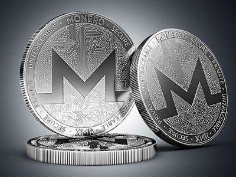

## Table of Contents

## What is Monero?

Monero is a type of digital money that you can use on the internet. It's different from regular money because it's private and secure. When you use Monero to buy something or send it to someone, no one can see who you are or how much you're sending. This makes it good for people who want to keep their money matters private.

Monero uses special technology to keep transactions private. It mixes up the money so it's hard to trace where it came from or where it's going. This is different from other digital money like Bitcoin, where you can see all the transactions. Monero's privacy features make it popular for people who want to keep their financial activities secret.

## How does Monero differ from other cryptocurrencies like Bitcoin?

Monero and Bitcoin are both cryptocurrencies, but they work differently, especially when it comes to privacy. Bitcoin is like a public ledger where anyone can see all the transactions that happen. If you send Bitcoin to someone, people can see how much you sent and where it went, even if they don't know your real name. This is because Bitcoin transactions are recorded on a public blockchain. On the other hand, Monero is designed to be private. When you use Monero, no one can see how much you're sending or who you're sending it to. This makes Monero good for people who want to keep their money matters secret.

Another big difference is how Monero and Bitcoin handle the way transactions are processed. Bitcoin uses a system where each coin has a unique history that can be traced. This means if someone knows where a Bitcoin came from, they can follow it through different transactions. Monero, however, uses a technology called "ring signatures" that mixes your transaction with others, making it hard to tell which coins are being used. Also, Monero hides the amounts being sent by using a special technique. This makes it very hard to track Monero transactions, which is why it's popular for people who value privacy.

In summary, while Bitcoin is more transparent and widely used, Monero focuses on giving users more privacy and security. Bitcoin might be easier to use for everyday purchases because more places accept it, but Monero is better if you want to keep your financial activities private. Both have their own strengths, and the choice between them depends on what you need from a [cryptocurrency](/wiki/cryptocurrency).

## What are the main features of Monero?

Monero's main feature is privacy. When you use Monero, no one can see how much you're sending or who you're sending it to. This is different from other cryptocurrencies like Bitcoin, where transactions are public. Monero uses special technology like ring signatures to mix your transaction with others, making it hard to trace. It also hides the amounts being sent, adding another layer of privacy. This makes Monero popular for people who want to keep their money matters secret.

Another important feature of Monero is its focus on security. Monero uses strong encryption to protect your transactions. This means your money is safe from hackers and other bad actors. Monero also has a system that makes it hard for someone to spend the same coin twice, which is called double-spending. This adds to the overall security of the cryptocurrency. With these features, Monero provides a safe and private way to use digital money.

## How does Monero ensure privacy and anonymity?

Monero keeps your transactions private by using a few smart tricks. One of them is called "ring signatures." When you send Monero, your transaction gets mixed up with other transactions. This makes it hard for anyone to figure out which coins are yours and where they're going. It's like throwing your coin into a big pile of coins and then taking a different one out. Nobody can tell which one you put in or which one you took out.

Another way Monero keeps things secret is by hiding how much money you're sending. Instead of showing the exact amount, Monero uses a special code that only the person receiving the money can understand. This means that even if someone could see your transaction, they wouldn't know how much money was involved. These two features together make it very hard for anyone to track your Monero transactions, keeping your money matters private and secure.

## What is the role of ring signatures in Monero?

Ring signatures are a key part of how Monero keeps your transactions private. When you send Monero, your transaction gets mixed up with other transactions. It's like adding your coin to a big pile of coins and then taking a different one out. This makes it really hard for anyone to figure out which coin is yours and where it's going. Because of ring signatures, no one can track your Monero transactions easily.

This mixing up of transactions is important for privacy. Imagine if you're sending money to a friend, and you don't want anyone to know. With ring signatures, your transaction looks just like everyone else's. It's like hiding in a crowd. This way, your financial activities stay secret, and you can use Monero without worrying about others watching what you're doing.

## How does Monero's stealth addresses work?

Stealth addresses are another way Monero keeps your transactions private. When you send Monero to someone, you don't use their regular address. Instead, Monero creates a new, special address just for that one transaction. This new address is called a stealth address. It's like sending a secret letter to your friend, but the envelope has a different address each time so no one else can figure out who it's for.

This system makes it hard for anyone to link the transaction to the person receiving the money. Even if someone knows your friend's regular Monero address, they won't be able to see that your friend received money from you. It adds another layer of privacy, making sure that your financial activities stay hidden and secure.

## What is the significance of Monero's confidential transactions?

Confidential transactions in Monero are important because they hide how much money is being sent. When you use Monero, the amount you're sending doesn't show up as a clear number. Instead, it's turned into a special code that only the person receiving the money can understand. This means that even if someone could see your transaction, they wouldn't know how much money was involved. It's like sending a secret message that only the right person can read.

This feature adds a lot to Monero's privacy. By keeping the amounts secret, it makes it even harder for anyone to track your money. If someone can't see how much you're sending or receiving, they can't piece together your financial activities. This makes Monero a good choice for people who want to keep their money matters private and secure.

## How is Monero mined and what is its mining algorithm?

Monero is mined using a process called Proof of Work, just like other cryptocurrencies. The special thing about Monero is that it uses a mining algorithm called RandomX. This algorithm is designed to make mining fair for everyone, whether you're using a regular computer or a special mining machine. RandomX works by using the computer's memory in a way that makes it hard for specialized mining hardware to have an advantage. This means that more people can join in and mine Monero, not just those with expensive equipment.

When you mine Monero, you're helping to keep the network secure and adding new transactions to the blockchain. Miners use their computers to solve complex math problems. When they solve these problems, they get to add a new block of transactions to the blockchain and earn some Monero as a reward. This process helps to make sure that Monero stays decentralized and that no single person or group can control it. By using RandomX, Monero tries to keep mining open and fair for everyone.

## What are the use cases for Monero?

Monero is often used by people who want to keep their money matters private. For example, if you're buying something online and you don't want anyone to know what you're buying or how much you're spending, Monero is a good choice. It's also used by people in countries where the government might not like certain kinds of spending. With Monero, they can send and receive money without anyone tracking it.

Another use case for Monero is for businesses that want to keep their financial transactions secret. Some businesses might not want their competitors to know how much money they're making or spending. Monero helps them do that. Also, people who value their privacy might use Monero for everyday purchases, even though it's not as widely accepted as other cryptocurrencies like Bitcoin. It gives them the peace of mind that their spending habits stay private.

## How can someone acquire Monero?

You can get Monero in a few different ways. One way is to buy it from a cryptocurrency exchange. These are websites where you can trade regular money or other cryptocurrencies like Bitcoin for Monero. You'll need to sign up for an account on the exchange, add some money to it, and then you can buy Monero. Some popular exchanges where you can buy Monero include Binance, Kraken, and Poloniex.

Another way to get Monero is by mining it. Mining means using your computer to solve math problems that help keep the Monero network secure. When you solve these problems, you get rewarded with some Monero. To mine Monero, you'll need a computer with good hardware and software designed for mining. It can be a bit tricky to set up, but there are lots of guides online to help you get started.

You can also get Monero by trading with other people directly. This is called a peer-to-peer transaction. There are websites and apps that connect people who want to buy Monero with people who want to sell it. You can agree on a price and then send the money to the seller through a bank transfer or another method, and they'll send you the Monero. This way can be a bit riskier, so it's important to be careful and use trusted platforms.

## What are the potential risks and challenges associated with using Monero?

Using Monero can come with some risks and challenges. One big risk is that because Monero is very private, it can sometimes be used for illegal activities. This can make some people and businesses worried about accepting it. Another challenge is that Monero is not as widely accepted as other cryptocurrencies like Bitcoin. This means you might have a harder time finding places to spend your Monero. Also, because Monero is private, it can be hard to get it back if you lose it or if someone steals it from you.

Another risk is that the value of Monero can go up and down a lot. This is called [volatility](/wiki/volatility-trading-strategies), and it means you could lose money if you buy Monero and its value drops. Mining Monero can also be challenging. It requires special hardware and can use a lot of electricity, which can be expensive. Plus, as more people mine Monero, it can get harder to earn it. These are some things to think about if you're considering using Monero.

## What is the future outlook for Monero in the cryptocurrency market?

The future of Monero in the cryptocurrency market looks promising, especially for people who care about privacy. As more people learn about the importance of keeping their money matters secret, Monero could become more popular. It's already known for being one of the most private cryptocurrencies out there. If more businesses and online stores start accepting Monero, it could become easier to use every day. Also, if governments and big companies keep trying to track people's money, Monero might become even more important for people who want to keep their financial activities private.

However, there are also some challenges that could affect Monero's future. Because it's so private, some people and businesses might be worried about using it because it could be used for illegal things. This could make it hard for Monero to be accepted in more places. Also, the value of Monero can go up and down a lot, which can be risky for people who want to invest in it. If Monero can find ways to deal with these challenges, like working with regulators to show it can be used safely, it might have a strong future in the world of cryptocurrencies.

## References & Further Reading

[1]: Narayanan, A., Bonneau, J., Felten, E., Miller, A., & Goldfeder, S. (2016). ["Bitcoin and Cryptocurrency Technologies: A Comprehensive Introduction."](https://press.princeton.edu/books/hardcover/9780691171692/bitcoin-and-cryptocurrency-technologies) Princeton University Press.

[2]: Kumar, K., & Zhao, J. (2019). ["A Survey on Algorithmic Trading."](https://dl.acm.org/doi/10.1145/3293318) ACM Computing Surveys.

[3]: Ruffing, T., Moreno-Sanchez, P., & Kate, A. (2014). ["CoinShuffle: Practical Decentralized Coin Mixing for Bitcoin."](https://link.springer.com/content/pdf/10.1007/978-3-319-11212-1_20.pdf) IACR Cryptology ePrint Archive.

[4]: Nofer, M., et al. (2017). ["Blockchain."](https://www.researchgate.net/publication/315462390_Blockchain) Business & Information Systems Engineering.

[5]: DuPont, Q. (2019). ["Cryptocurrencies and Blockchains."](https://www.wiley.com/en-us/Cryptocurrencies+and+Blockchains-p-9781509520237) Polity Press.

[6]: Rainer Böhme, Nicolas Christin, Benjamin Edelman, and Tyler Moore. (2015). ["Bitcoin: Economics, Technology, and Governance."](https://papers.ssrn.com/sol3/papers.cfm?abstract_id=2495572) The Journal of Economic Perspectives.

[7]: Tapp, A. (2018). ["On the Use of Cryptography in Cryptocurrency."](https://www.nature.com/articles/s41599-023-02528-7.pdf) Real-World Cryptography.