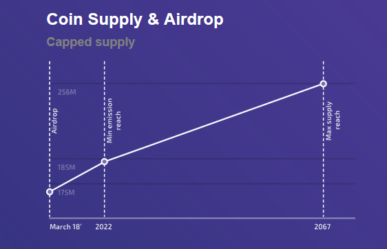

## Table of Contents

## What is MoneroV and how does it differ from other cryptocurrencies?

MoneroV is a type of cryptocurrency that focuses on privacy and security. It is a fork of Monero, which means it started as a copy of Monero but then changed to become its own thing. MoneroV uses special technology to keep transactions private, so people can send and receive money without others knowing who they are or how much they are sending. This is different from many other cryptocurrencies where transactions can be seen by anyone.

One big difference between MoneroV and other cryptocurrencies is its use of a system called "Proof of Stake" instead of "Proof of Work." In Proof of Stake, people who own more of the cryptocurrency have a better chance of adding new transactions to the system and earning rewards. This is different from Proof of Work, where people use powerful computers to solve hard math problems to add transactions. Proof of Stake uses less energy and can be more fair to people who don't have expensive computers.

## How was MoneroV created and what is its origin story?

MoneroV was created in 2018 as a fork of Monero, which means it started as a copy of Monero but then changed to become its own cryptocurrency. The people who made MoneroV wanted to make a new kind of money that was private and secure. They thought that Monero was good but could be better, so they decided to make their own version. They called it MoneroV, with the "V" standing for "velocity," because they wanted the money to move fast and be used easily.

The team behind MoneroV worked hard to make sure that the new [cryptocurrency](/wiki/cryptocurrency) had strong privacy features. They used special technology to hide who was sending and receiving money, and how much was being sent. This was important to them because they believed that people should be able to use money without others knowing their business. They also changed the way the system worked from "Proof of Work" to "Proof of Stake," which they thought was a better and fairer way to run a cryptocurrency. This change made MoneroV different from many other cryptocurrencies and helped it stand out in the world of digital money.

## What are the main features of MoneroV that make it unique?

MoneroV is special because it focuses on keeping your money private. When you send or receive MoneroV, no one can see who you are or how much money you are moving. This is different from many other cryptocurrencies where anyone can look at the transactions. MoneroV uses special technology to hide this information, making it a good choice for people who want to keep their money matters private.

Another thing that makes MoneroV unique is how it works. Instead of using a lot of computer power to add new transactions, like many other cryptocurrencies do, MoneroV uses a system called "Proof of Stake." This means that people who own more MoneroV have a better chance of adding new transactions and [earning](/wiki/earning-announcement) rewards. This way of working uses less energy and can be fairer to people who don't have powerful computers.

## How does MoneroV ensure the privacy and anonymity of its users?

MoneroV keeps your money private by using special technology called ring signatures. When you send MoneroV, it mixes your transaction with other people's transactions. This makes it hard for anyone to figure out who is sending money to whom. It's like putting your letter in a bunch of other letters and sending them all together. No one can tell which letter is yours.

Another way MoneroV keeps you anonymous is by hiding the amount of money being sent. Instead of showing the exact amount, it shows a range that could be the real amount. This adds another layer of privacy because even if someone knows you sent money, they won't know how much. Together, these features make MoneroV a good choice for people who want to keep their money matters secret.

## What is the consensus mechanism used by MoneroV?

MoneroV uses a consensus mechanism called Proof of Stake. This means that instead of using a lot of computer power to add new transactions like other cryptocurrencies do, MoneroV gives the chance to add new transactions to people who own more of the currency. It's like a lottery where owning more MoneroV gives you more tickets. This way, people don't need to have expensive computers to help run the system, making it more fair and using less energy.

In Proof of Stake, the more MoneroV you have, the more likely you are to be chosen to add a new block of transactions to the blockchain. When you are chosen, you get to add the transactions and earn a reward in MoneroV. This encourages people to hold onto their MoneroV instead of selling it, which can help keep the value of the currency stable. Overall, Proof of Stake is a simpler and more energy-efficient way to run a cryptocurrency compared to Proof of Work.

## How does MoneroV handle transaction speeds and scalability?

MoneroV is designed to handle transactions quickly and efficiently. Because it uses Proof of Stake instead of Proof of Work, it doesn't need to wait for lots of computers to solve hard math problems before adding new transactions. This means that MoneroV can process transactions faster than some other cryptocurrencies. When you send MoneroV, you don't have to wait a long time for the transaction to go through, making it good for everyday use.

Scalability is also important for MoneroV. The Proof of Stake system helps the network grow without needing more and more powerful computers. This makes it easier for MoneroV to handle a lot of transactions at the same time. As more people use MoneroV, the system can still work smoothly, which is important for a cryptocurrency to be useful for a large number of people.

## What are the practical uses of MoneroV in everyday transactions?

MoneroV can be used for everyday transactions where privacy is important. For example, if you want to buy something online without the seller knowing who you are or how much you are spending, MoneroV is a good choice. It's like paying with cash but over the internet. You can use it to buy things from websites that accept cryptocurrencies, or even send money to friends and family without anyone else knowing about it.

Another practical use of MoneroV is for people who want to keep their financial information private. If you're buying something that you don't want others to know about, like a gift or a personal item, MoneroV can help you do that. It's also useful for people who live in places where the government watches what people spend their money on. With MoneroV, you can spend your money without worrying about someone tracking your every move.

## How can someone acquire MoneroV and what are the best practices for storage?

To get MoneroV, you can buy it from a cryptocurrency exchange that supports it. You'll need to create an account on the exchange, deposit money, and then trade that money for MoneroV. Another way to get MoneroV is by mining it, but since MoneroV uses Proof of Stake, you'll need to have some MoneroV already to start mining more. You can also get MoneroV by trading other cryptocurrencies for it on exchanges that support these kinds of trades.

For storing MoneroV safely, it's a good idea to use a wallet that supports MoneroV. There are different types of wallets, like software wallets on your computer or phone, and hardware wallets that are like a USB drive. Hardware wallets are the safest because they keep your MoneroV offline, which makes it harder for hackers to steal it. Always make sure to back up your wallet and keep the backup in a safe place. It's also important to use strong passwords and enable two-[factor](/wiki/factor-investing) authentication if your wallet supports it.

## What are the potential risks and challenges associated with using MoneroV?

Using MoneroV can come with some risks and challenges. One big risk is that because MoneroV is focused on privacy, it can sometimes be used for illegal activities. This can make people worried about using it, and some countries might even make it illegal to use MoneroV. Another risk is that MoneroV is not as widely accepted as other cryptocurrencies like Bitcoin. This means you might have a hard time finding places to spend your MoneroV or trade it for other money.

Another challenge with MoneroV is that it's still a new cryptocurrency, so it might not be as stable as older ones. The price of MoneroV can go up and down a lot, which can be risky if you're trying to use it as a way to store your money. Also, since MoneroV is less known, there might not be as much help or support if you run into problems. It's important to be careful and do your research before deciding to use MoneroV.

## How does MoneroV integrate with existing blockchain technologies and ecosystems?

MoneroV is built on the same kind of technology as other cryptocurrencies, so it can work with some existing blockchain systems. It uses the same basic ideas as other blockchains, like keeping a record of transactions and using special math to keep everything safe. This means that MoneroV can be used on some exchanges and wallets that support different cryptocurrencies. However, because MoneroV focuses a lot on privacy, not all systems might be set up to work with it right away. People who want to use MoneroV might need to find special exchanges and wallets that understand how to handle its privacy features.

Even though MoneroV is different from other cryptocurrencies, it can still be part of the bigger blockchain world. For example, it can be traded on some cryptocurrency exchanges that support privacy-focused coins. This helps people who want to switch between MoneroV and other types of money. Also, because MoneroV uses Proof of Stake, it can join in on some blockchain networks that are set up for this kind of system. But because MoneroV is still new and not as well-known, it might take some time for it to be fully welcomed into all parts of the blockchain community.

## What are the future development plans for MoneroV and what enhancements are expected?

The team behind MoneroV has some exciting plans for the future. They want to make MoneroV even faster and easier to use. This means they will work on making transactions happen quicker and making the whole system more scalable so it can handle more people using it at the same time. They also want to add new features that will make MoneroV even more private and secure. These improvements will help MoneroV stay a top choice for people who care about keeping their money matters secret.

Another big plan for MoneroV is to make it more widely accepted. The team wants more stores and websites to start accepting MoneroV as a way to pay. This will make it easier for people to use MoneroV in their everyday lives. They also plan to work on making MoneroV easier to use for people who are new to cryptocurrencies. By adding better tools and guides, they hope to help more people understand and use MoneroV. These changes will help MoneroV grow and become a more popular choice for private money.

## How does MoneroV compare to its predecessor, Monero, in terms of technology and adoption?

MoneroV and Monero are similar because MoneroV started as a copy of Monero. But they are different in some important ways. MoneroV uses a system called Proof of Stake, which is different from Monero's Proof of Work. This means that MoneroV can be more energy-efficient and fair to people who don't have powerful computers. MoneroV also focuses a lot on privacy, using special technology to hide who is sending and receiving money, and how much is being sent. This makes MoneroV a good choice for people who want to keep their money matters private.

In terms of adoption, Monero is more widely used and accepted than MoneroV. Monero has been around longer and is supported by more exchanges and wallets. This makes it easier for people to buy, sell, and use Monero. MoneroV, on the other hand, is newer and not as well-known. It might be harder to find places that accept MoneroV or to trade it for other money. But the team behind MoneroV is working to make it more popular and easier to use, so it might catch up in the future.

## References & Further Reading

[1]: van Saberhagen, N. (2013). ["CryptoNote v 2.0"](https://www.semanticscholar.org/paper/CryptoNote-v-2.0-Saberhagen/5bafdd891c1459ddfd22d71412d5365de723fb23) Whitepaper on CryptoNote Technology.

[2]: Brands, S. (2000). ["Rethinking Public Key Infrastructures and Digital Certificates: Building in Privacy"](https://mitpress.mit.edu/9780262526302/rethinking-public-key-infrastructures-and-digital-certificates/) MIT Press.

[3]: Narayanan, A., Bonneau, J., Felten, E., Miller, A., & Goldfeder, S. (2016). ["Bitcoin and Cryptocurrency Technologies."](https://press.princeton.edu/books/hardcover/9780691171692/bitcoin-and-cryptocurrency-technologies) Princeton University Press.

[4]: Antonopoulos, A. M. (2017). ["Mastering Bitcoin: Unlocking Digital Cryptocurrencies"](https://books.google.com/books/about/Mastering_Bitcoin.html?id=IXmrBQAAQBAJ) O'Reilly Media.

[5]: Gandal, N., & Halaburda, H. (2014). ["Competition in the Cryptocurrency Market"](https://www.semanticscholar.org/paper/Competition-in-the-Cryptocurrency-Market-Halaburda-Gandal/bc9289eeabeb04437b5d9e469db132f28bb010ad) Bank of Canada Working Paper.