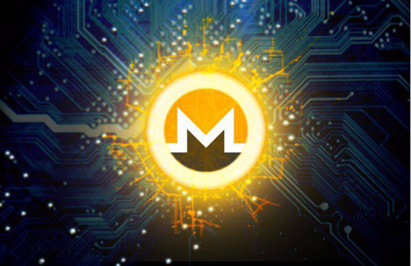

MoneroV (XMV) is an emerging cryptocurrency designed to enhance privacy and scalability in digital transactions. Its creation stems from the evolution and split from the well-known Monero network, with the intent to address certain limitations while maintaining robust privacy features. MoneroV's significance lies in its commitment to privacy, decentralization, and improved features that cater to the growing demand for secure and private financial transactions.

The underlying technology that makes MoneroV possible is blockchain. Blockchain has revolutionized financial transactions by providing a decentralized, immutable, and transparent ledger system. This technology allows for secure and anonymous transfers, minimizing the need for intermediaries like banks. By doing so, blockchain not only reduces transaction costs but also enhances the accessibility and integrity of financial exchanges. For MoneroV, blockchain ensures that user transactions remain confidential and untraceable, an aspect that is increasingly valued in a digital age where privacy concerns are paramount.



Algorithmic trading, a method of executing trades using automated and complex mathematical models, plays a crucial role in cryptocurrency markets. It enables traders to execute orders at speeds and frequencies that would be impossible for a human trader. This is particularly advantageous in the volatile cryptocurrency market, where prices can fluctuate rapidly. Algorithmic trading allows for precision and efficiency, optimizing strategies to capitalize on market movements. In the context of cryptocurrencies like MoneroV, these automated strategies help traders navigate the complexities of the market and potentially maximize returns.

The purpose of this article is to explore MoneroV, its technical features, and the potential advantages it offers to traders, specifically through algorithmic tactics. By understanding MoneroV's technology and how it intersects with market strategies, investors and enthusiasts can gain insights into its potential within the broader cryptocurrency ecosystem.

MoneroV holds significant potential in the trading ecosystem due to its advanced privacy features and improvements over its predecessor, Monero. While still gaining footing compared to more established cryptocurrencies, its unique attributes could make it an attractive option for those prioritizing security and privacy. As the demand for private transactions grows, so does the interest in cryptocurrencies like MoneroV, which aim to offer users greater safety and autonomy in their financial dealings.

## Table of Contents

## Understanding MoneroV

MoneroV (XMV) is a cryptocurrency that originated as a hard fork of the Monero blockchain, which occurred in April 2018. The primary motivation behind the creation of MoneroV was to address some of the perceived limitations and scalability issues inherent in Monero while maintaining a strong emphasis on privacy and decentralization—a signature trait of its progenitor, Monero.

### Technical Aspects and Differences from Monero

MoneroV distinguishes itself from Monero through several critical technical aspects. One of the most notable differences lies in its supply cap. MoneroV has a fixed supply limit of 256 million XMV coins, contrasting with Monero's infinite supply. This capped supply is designed to mitigate inflationary pressures over time, a common concern among [cryptocurrency](/wiki/cryptocurrency) investors.

Another technical divergence is the implementation of the CryptonightV7 algorithm, a modified version of the Cryptonight algorithm used by Monero before its subsequent upgrades. This was aimed to ensure better decentralization in mining efforts, preventing mining pool centralization that could potentially compromise network security.

### Privacy Features and Advantages

MoneroV upholds the confidentiality ethos of Monero, emphasizing privacy in transactions. It utilizes ring signatures, stealth addresses, and confidential transactions to obscure the details of the sender, recipient, and transaction amounts. These features collectively ensure that users enjoy a significant degree of anonymity, protecting them from transaction traceability.

The application of these privacy-enhancing technologies is crucial in maintaining user privacy against growing surveillance within financial ecosystems. This aspect makes MoneroV particularly appealing for users prioritizing anonymity and security.

### Challenges and Criticisms

Despite its advantages, MoneroV faces several challenges and criticisms. One notable issue pertains to its origin as a hard fork. The splitting from the Monero blockchain raised concerns over the ethical implications of creating new coins and posed philosophical questions regarding community fragmentation. Moreover, this split led to skepticism concerning the motives behind the fork, with some in the broader cryptocurrency community viewing it as an attempt to profit from existing Monero users.

Technically, the algorithmic choices, such as the use of the CryptonightV7 algorithm, face potential obsolescence with increasing technological advancements in quantum computing and subsequent cryptographic innovations. Moreover, privacy-centric cryptocurrencies like MoneroV often face regulatory scrutiny from governments concerned with money laundering and criminal activities, posing potential risks to broader adoption.

In summary, MoneroV's creation was rooted in the aspiration to diversify the privacy-focused cryptocurrency landscape by addressing some acknowledged limitations of Monero. However, its journey involves navigating both technical and ethical challenges within the rapidly evolving cryptocurrency domain.

## Blockchain Technology and MoneroV

Blockchain technology is the foundational structure that supports MoneroV (XMV), a cryptocurrency that aims to provide secure, private, and decentralized financial transactions. At its core, MoneroV employs a blockchain that is a distributed ledger recording all transactions across a network of computers, ensuring that the data is transparent, immutable, and resistant to tampering.

### Decentralization of MoneroV

Decentralization is a pivotal feature of blockchain technology and is crucial for enhancing both security and transparency in MoneroV. Unlike centralized networks, where a single entity controls the data, MoneroV's blockchain is maintained by a network of nodes distributed across the globe. This decentralization ensures no single point of failure and reduces the risk of data breaches or manipulation. Transparency is achieved as every transaction is recorded on the blockchain and can be audited by any network participant, though the identities involved remain anonymous due to MoneroV's privacy features.

### Scalability and Data Management

Scalability is an ongoing challenge in blockchain development, and MoneroV addresses this through various technical implementations. Efficient data management is crucial to maintain transaction speed and network performance as the blockchain grows. MoneroV employs techniques to keep the blockchain size manageable, ensuring that it remains accessible for nodes with varying bandwidth and storage capacities. While specific scalability solutions are not made public, these may include advanced encryption and compact transaction representation strategies.

### Comparisons with Other Cryptocurrencies

MoneroV’s approach can be compared to other cryptocurrencies that leverage blockchain technology, each with its own unique characteristics. Bitcoin, for instance, is often criticized for its scalability issues, as it struggles to handle a large number of transactions per second due to its fixed block size and 10-minute block interval. Ethereum, on the other hand, explores solutions like sharding and transitioning to a proof-of-stake consensus to improve scalability.

MoneroV distinguishes itself from peers by prioritizing privacy and efficient scaling without compromising decentralization. Unlike Monero, its precursor that emphasizes absolute privacy, MoneroV introduces certain differentiators in technical implementation while still upholding a core commitment to user anonymity.

Blockchain technology thus remains a crucial [factor](/wiki/factor-investing) in MoneroV's infrastructure, fostering a balance between decentralization, privacy, and scalability, which are fundamental to its function and appeal in the cryptocurrency market.

## The Rise of Algorithmic Trading

Algorithmic trading, often referred to as algo trading, is a method of executing orders using automated and pre-programmed trading instructions. These instructions account for variables such as time, price, and [volume](/wiki/volume-trading-strategy), and are based on complex mathematical models and algorithms. It's increasingly significant in financial markets due to its ability to process high volumes of data and execute trades at speeds far beyond human capacity, thereby capitalizing on minute market inefficiencies and trends.

The prominence of [algorithmic trading](/wiki/algorithmic-trading) in financial markets has surged due to several advantages. For cryptocurrencies, a highly volatile asset class, algorithmic trading offers enhanced [liquidity](/wiki/liquidity-risk-premium), as it enables rapid and efficient trading. It reduces market impact by splitting large orders into smaller, strategically timed executions. Algorithmic trading minimizes human error and emotional intervention, often resulting in more disciplined trading strategies. Additionally, it allows for the back-testing of trading strategies over historical data, enhancing the refinement and reliability of these strategies.

Algorithmic trading tools optimize trading strategies through the use of sophisticated software platforms and algorithms. These tools can analyze market data in real-time, execute trades across multiple exchanges simultaneously, and adapt strategies as market conditions evolve. Machine learning and [artificial intelligence](/wiki/ai-artificial-intelligence) (AI) further enhance these tools by enabling adaptive strategies that learn from past data to predict future trends. Python, with its robust libraries such as NumPy, pandas, and TensorFlow, is a popular language for developing these tools due to its ease of use and extensive community support.

Several case studies illustrate the successful application of algorithmic trading in cryptocurrencies. For instance, a notable example is the use of high-frequency trading ([HFT](/wiki/high-frequency-trading-strategies)) algorithms that exploit price discrepancies across different exchanges to secure profitable trades. Furthermore, [arbitrage](/wiki/arbitrage) strategies that focus on price inefficiencies between different trading pairs in the same exchange have shown considerable success. Quantitative hedge funds and trading firms often employ such strategies, leveraging vast amount of historical and live data to optimize their algorithms continuously.

In summary, the rise of algorithmic trading is transforming the landscape of cryptocurrency markets by providing enhanced efficiency, speed, and accuracy. Its continued evolution promises even more sophisticated and adaptive strategies, making it an indispensable tool for modern trading practices.

## Algorithmic Trading with MoneroV

MoneroV (XMV) is a cryptocurrency that has caught the attention of algorithmic traders due to its privacy features and unique blockchain attributes. Algorithmic trading involves executing trades on the basis of pre-programmed instructions accounting for variables such as time, price, and volume. Applying such strategies to MoneroV can offer several advantages, though it comes with distinct challenges as well.

### Algorithmic Trading Strategies for MoneroV

Algorithmic trading with MoneroV can utilize several strategies. Trend following is one method where algorithms detect patterns from historical data to predict future price movements. Statistical arbitrage, which involves using statistical models to identify price discrepancies and arbitrate the differences, can be another effective strategy given the [volatility](/wiki/volatility-trading-strategies) in MoneroV's market.

A common algorithm might be constructed using moving averages to signal buying and selling opportunities:

```python
import pandas as pd

# Load MoneroV data
data = pd.read_csv('moneroV_data.csv')
data['MA50'] = data['Close'].rolling(window=50).mean()
data['MA200'] = data['Close'].rolling(window=200).mean()

# Define a signal strategy
data['Signal'] = 0
data['Signal'][50:] = [1 if data['MA50'][i] > data['MA200'][i] else 0 for i in range(50, len(data))]
data['Position'] = data['Signal'].diff()

# strategy: Buy when MA50 > MA200, Sell otherwise
```

### Tools and Platforms

Several platforms support algorithmic trading for MoneroV, each offering varying features. Exchanges like Binance and Kraken provide APIs that allow traders to implement their own algorithms. Trading bots like 3commas and Cryptohopper enable strategies to run automatically, providing integrations with major exchanges. For custom development, developers might use Python libraries such as ccxt and Backtrader for analyzing market data and potential trades.

### Risks and Challenges

While the above strategies can optimize trading, certain risks are inherent to algorithmic trading with MoneroV. The primary challenge is MoneroV's relatively lower liquidity compared to more established cryptocurrencies like Bitcoin or Ethereum, which can lead to slippage and increased volatility. There is also the risk of algorithmic errors or bugs that could result in unintended trades.

Furthermore, MoneroV's decentralized nature and privacy features may make market insights and data collection more complex. Traders must consider these factors when developing and testing their algorithms. It's crucial for traders to incorporate robust risk management practices, such as setting stop-loss limits and conducting thorough [backtesting](/wiki/backtesting) under various market scenarios.

### Expert Insights

Expert traders emphasize the importance of continuous adaptation and learning. According to Jennifer Lin, a cryptocurrency trader specializing in privacy coins, "Understanding the nuances of MoneroV's market is vital. It’s not just about writing code; it's about anticipating how new regulations, technological changes, and market sentiment can impact your algorithms." Another expert, Daniel Kerr, suggests incorporating [machine learning](/wiki/machine-learning) techniques to adapt strategies as market conditions change, enhancing the adaptability of trading algorithms.

In summary, algorithmic trading offers potential benefits for MoneroV traders through efficient and timely decision-making. However, it requires careful strategy formulation, platform selection, and risk management to navigate the unique challenges posed by MoneroV.

## Benefits and Limitations of Algo Trading in MoneroV

Algorithmic trading has revolutionized the trading of cryptocurrencies, including MoneroV. By leveraging algorithms, traders can automate decisions, identify patterns, and execute trades at speeds unachievable by human traders. This section explores both the potential benefits and limitations of algorithmic trading applied to MoneroV while providing strategic insights into risk management.

### Potential Benefits

1. **Efficiency and Speed**:
   Algorithmic trading allows for the rapid execution of trades, capitalizing on market conditions instantly. This speed ensures that traders can take advantage of even the smallest price fluctuations in MoneroV.

2. **Consistent Execution**:
   Automation eliminates human errors, ensuring trades are executed accurately according to predefined criteria. Consistency in strategy execution can lead to more reliable outcomes over time.

3. **Market Analysis**:
   Algorithms can process vast amounts of data, providing insights into market trends and sentiment. This can be especially beneficial in the volatile cryptocurrency markets where quick adaptation is necessary.

4. **Reduced Emotional Bias**:
   Algorithmic trading systems operate based on logic and data, devoid of emotional biases that often plague human decision-making, such as fear or greed.

5. **24/7 Trading Capability**:
   Given that cryptocurrency markets operate nonstop, algorithmic systems can continuously monitor and trade MoneroV without interruption.

### Common Limitations and Pitfalls

1. **Over-Optimization**:
   There is a risk of configuring algorithms to perform perfectly on historical data without considering market changes. This "curve-fitting" can lead to poor performance in real-world trading.

2. **Market Liquidity**:
   While MoneroV may have advantages, market liquidity can be an issue, potentially leading to increased slippage and execution issues during high volatility periods.

3. **Technical Failures**:
   Algorithms are susceptible to software bugs or system failures, which can result in significant financial losses if not managed properly.

4. **Regulatory and Ethical Concerns**:
   Traders must navigate different regulatory environments that may affect the implementation of certain trading strategies.

### Risk Management Strategies

1. **Robust Backtesting**:
   Traders should conduct comprehensive backtesting of their strategies using historical data while factoring in slippage and transaction costs to ensure the viability of their systems.

2. **Diversity in Strategies**:
   Implementing a variety of trading algorithms can spread risk, reducing the impact of a single strategy's underperformance.

3. **Regular Monitoring**:
   Continuous monitoring of algorithm performance with real-time analytics allows for timely interventions if the algorithms deviate from expected performance.

4. **Stop-Loss Mechanisms**:
   Incorporate stop-loss orders to minimize potential losses, ensuring the trading system exits positions when market conditions move unfavorably.

### Future Prospects and Innovation Potential

The future of algorithmic trading in MoneroV and cryptocurrencies in general points towards increased sophistication with machine learning and artificial intelligence potentially playing vital roles. These technologies can enhance the adaptability and predictive accuracy of trading algorithms. Moreover, as blockchain technologies evolve, they may offer more secure and efficient platforms for algorithmic trading, reducing latency and enhancing transparency. Thus, traders and developers are encouraged to pursue innovation in both algorithm design and risk management practices, ensuring the sustained growth and reliability of algorithmic trading strategies for MoneroV.

## Conclusion

MoneroV (XMV) has emerged as a significant player in the cryptocurrency landscape, offering unique features that distinguish it from its predecessor, Monero (XMR). Key insights from the exploration of MoneroV reveal its pivotal role in providing enhanced privacy features and addressing scalability concerns often associated with cryptocurrencies. The emphasis on privacy is particularly critical in a world where digital transactions are increasingly scrutinized, making MoneroV an attractive option for users valuing anonymity.

Understanding both technical and practical aspects of MoneroV and algorithmic trading is paramount. Knowledge of MoneroV's underlying blockchain technology is crucial for comprehending how it ensures both security and transparency while maintaining decentralization. Similarly, grasping the mechanisms of algorithmic trading can offer traders a competitive edge in the fast-paced cryptocurrency markets. Algorithmic trading, characterized by its use of complex algorithms to execute trades swiftly, allows traders to optimize performance by minimizing human intervention and emotional biases.

Crypto investors are encouraged to continue learning about MoneroV, particularly in conjunction with algorithmic trading strategies. The dynamic nature of cryptocurrency markets necessitates ongoing education and adaptation to new tools and techniques. Investors who can adeptly integrate these strategies with MoneroV stand to benefit from improved trading outcomes and the ability to deploy more sophisticated trading models.

Looking ahead, the future of MoneroV, when combined with algorithmic trading, holds promising potential. Innovations in algorithmic solutions and advancements in blockchain technology may drive further adoption and integration of MoneroV into mainstream financial activities. As such technologies evolve, the opportunities for leveraging MoneroV within diversified trading strategies will likely expand, offering both traders and investors enhanced possibilities for profit and risk management.

## FAQs

### What is MoneroV and how is it different from Monero?

MoneroV (XMV) is a cryptocurrency derived from the Monero blockchain, created as a hard fork to address certain issues associated with Monero. While Monero is well-known for its focus on privacy and untraceable transactions through the use of ring signatures and stealth addresses, MoneroV aims to enhance these features while introducing a capped supply of coins. Monero has an unlimited coin supply, rewarding miners consistently over time, whereas MoneroV instituted a maximum supply limit, intending to create scarcity and potentially increase value over time.

### How does blockchain technology support MoneroV?

Blockchain technology is the backbone of MoneroV's operation, supporting its decentralized ledger system that records transactions across multiple computers so that any involved record cannot be altered retroactively. This decentralization ensures transparency and security by eliminating the risk of a single point of failure or central authority manipulation. MoneroV utilizes cryptographic techniques inherent in blockchain technology to provide secure, anonymous transactions, leveraging similar privacy protocols as Monero, including zero-knowledge proofs and stealth addresses.

### What are the advantages of trading MoneroV algorithmically?

Algorithmic trading provides several advantages for MoneroV, including increased speed and accuracy in order execution. Algorithms can analyze large datasets at speeds surpassing human capabilities, identifying trading opportunities with precision. This technology reduces emotional decision-making in trading, allowing for strategic adherence to predefined rules and risk parameters. For volatile assets like cryptocurrencies, algorithmic trading can rapidly respond to price fluctuations, optimizing market positions efficiently. Additionally, it enables backtesting of strategies using historical data to improve future trading performance.

### Are there any risks associated with algorithmic trading of MoneroV?

While algorithmic trading offers benefits, it also presents risks. Market liquidity can impact algorithm performance, as low liquidity markets, like those occasionally observed with MoneroV, can lead to slippage and unexpected price impacts. Systemic errors or bugs in algorithms can result in significant financial losses if not properly managed. High-frequency algorithms can exacerbate market volatility during turbulent periods, leading to flash crashes or trading halts. Lastly, the reliance on technology increases exposure to cybersecurity risks, making robust IT security measures essential.

### Where can I find tools for algorithmic trading in MoneroV?

Several platforms provide tools and frameworks for algorithmic trading involving MoneroV. Open-source platforms like Gekko and Freqtrade offer customizable environments for developing crypto trading algorithms. Advanced users can leverage Python libraries such as `ccxt` for exchange integration and `Pandas` or `NumPy` for data analysis and modeling. For those preferring cloud-based solutions, services like TradingView offer customizable bots with integration to popular exchanges. It's essential for users to ensure compatibility with MoneroV support when selecting any tool or platform.

## References & Further Reading

[1]: van Saberhagen, N. (2013). ["CryptoNote v 2.0"](https://www.semanticscholar.org/paper/CryptoNote-v-2.0-Saberhagen/5bafdd891c1459ddfd22d71412d5365de723fb23) Whitepaper on CryptoNote Technology.

[2]: Brands, S. (2000). ["Rethinking Public Key Infrastructures and Digital Certificates: Building in Privacy"](https://mitpress.mit.edu/9780262526302/rethinking-public-key-infrastructures-and-digital-certificates/) MIT Press.

[3]: Narayanan, A., Bonneau, J., Felten, E., Miller, A., & Goldfeder, S. (2016). ["Bitcoin and Cryptocurrency Technologies."](https://press.princeton.edu/books/hardcover/9780691171692/bitcoin-and-cryptocurrency-technologies) Princeton University Press.

[4]: Antonopoulos, A. M. (2017). ["Mastering Bitcoin: Unlocking Digital Cryptocurrencies"](https://books.google.com/books/about/Mastering_Bitcoin.html?id=IXmrBQAAQBAJ) O'Reilly Media.

[5]: Gandal, N., & Halaburda, H. (2014). ["Competition in the Cryptocurrency Market"](https://www.semanticscholar.org/paper/Competition-in-the-Cryptocurrency-Market-Halaburda-Gandal/bc9289eeabeb04437b5d9e469db132f28bb010ad) Bank of Canada Working Paper.