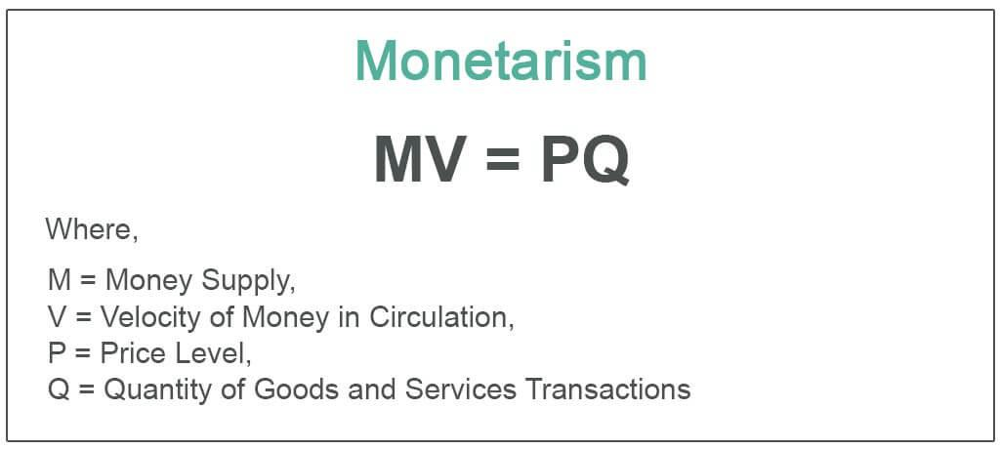

The dynamic interplay between economic policies and financial markets has long captivated economists, policymakers, and financial practitioners. This interplay not only influences national and global economies but also shapes how these entities navigate economic challenges. Monetarism, a prominent economic theory, underscores the importance of the money supply as a critical factor in achieving economic stability and growth. Its foundational principle is that variations in the money supply have direct and profound effects on output levels and price stability. Central to monetarist philosophy is the Quantity Theory of Money, articulated in the equation MV = PQ, where M represents the money supply, V is the velocity of money, P stands for the price level, and Q denotes the quantity of goods and services produced. This equation posits a strong link between money supply and macroeconomic outcomes.

Simultaneously, the evolution of algorithmic trading marks a transformative epoch in financial markets. Leveraging advanced technology, algorithmic trading executes trades at speeds and efficiencies surpassing human capabilities. This innovation has not merely enhanced the operational mechanics of trading but has also profoundly impacted liquidity, market efficiency, and price discovery processes across various asset classes.

This article investigates the intersections between monetarism, monetarist theory, economic policy, and algorithmic trading. In examining these intersections, we are better positioned to understand the ways in which economic theories provide a framework for interpreting the actions and impacts of technological advancements in financial markets. Through this exploration, insights emerge on how modern economic policies are influenced by and contribute to these dynamic interconnections, offering implications for both economic stability and growth in an increasingly complex financial landscape.

## Table of Contents

## Understanding Monetarism and Monetarist Theory

Monetarism is a prominent economic theory which posits that the money supply significantly influences a nation's economic performance. This theory underscores the importance of regulating the money supply to maintain economic stability and promote growth, positing that careful monetary control helps achieve price stability. Monetarists advocate for policies that prioritize the regulation of monetary factors over fiscal measures, presenting a clear departure from Keynesian economics, which emphasizes fiscal policy interventions.

At the heart of monetarist theory is the Quantity Theory of Money, encapsulated in the equation MV = PQ. According to this equation, where M stands for the money supply, V for the velocity of money, P for the price level, and Q for the quantity of goods and services produced, the overall price level in an economy is directly proportional to the money supply. Consequently, monetarists argue that managing the growth of the money supply can effectively control inflation.

Milton Friedman, a central figure in developing monetarist theory, challenged the Keynesian school of thought by highlighting monetary policy's critical role in managing economic activity. Friedman's argument is well-articulated in his seminal work, "A Monetary History of the United States, 1867–1960," which he co-authored with Anna Schwartz. His research emphasized the need for predictable, steady monetary supply increases to foster sustainable economic growth without triggering inflationary or deflationary pressures.

Friedman and his followers advocate that central banks should concentrate on maintaining stable money supply growth rates to mitigate economic fluctuations. By aligning money supply growth with the long-term growth rate of the real economy, monetarists believe it is possible to ensure stable economic environments that support expansive economic activities while controlling inflation.

In summary, monetarism stresses the fundamental role of money supply in shaping economic outcomes. By advocating for steady, controlled money supply growth, monetarists aim to achieve long-term economic stability and growth, a principle that diverges significantly from Keynesian reliance on fiscal policy interventions.

## The Role of Monetary Policy in Economic Policy

Monetarist theory emphasizes the primacy of monetary policy, often viewing it as more efficient than fiscal interventions in shaping economic outcomes. This perspective is founded on the belief that controlling the money supply is pivotal for achieving macroeconomic stability. Central banks are the primary institutions responsible for managing the money supply, employing a variety of tools such as the reserve ratio, discount rate, and open market operations.

The reserve ratio mandates the fraction of customer deposits that commercial banks must retain as reserves, ensuring that they have adequate funds to meet withdrawal demands. Adjustments to this ratio can influence the amount of money that banks can lend, directly impacting the money supply. The discount rate, the [interest rate](/wiki/interest-rate-trading-strategies) charged to commercial banks for borrowing funds from the central bank, serves as another lever to modulate economic activity. Altering the discount rate affects borrowing costs across the economy, influencing spending and investment decisions by businesses and consumers. Open market operations involve the buying and selling of government securities in the market, a strategic tool used to adjust the monetary base and control [liquidity](/wiki/liquidity-risk-premium) levels.

One of the key monetary policies influenced by monetarist thought is inflation targeting. This policy framework involves the central bank setting a specific inflation rate as the primary economic goal, guiding monetary policy decisions to achieve this target. Monetarists argue that by regulating the growth rate of the money supply, central banks can indirectly control inflation and foster long-term economic growth.

The prominence of monetarist principles rose significantly in the late 20th century with the implementation of such policies by central bankers like Paul Volcker, former Chairman of the Federal Reserve. Volcker's strategies during the late 1970s and early 1980s were emblematic of monetarist influence, focusing on tightening the money supply to combat high inflation rates, which led to eventual economic stabilization.

Effective monetary policy is crucial in balancing economic variables such as inflation and employment. By controlling the money supply, central banks can influence economic conditions, ensuring price stability and supporting employment levels. This approach, rooted in monetarist ideology, continues to shape modern economic policy, highlighting its enduring relevance in achieving economic stability.

## Algorithmic Trading: A Modern Financial Practice

Algorithmic trading employs sophisticated computer algorithms to execute trades at speeds and frequencies that surpass human capabilities. This methodology enhances both market efficiency and trading accuracy, and its widespread adoption spans various financial securities including equities, futures, options, and foreign exchange. The core of [algorithmic trading](/wiki/algorithmic-trading) involves the use of complex mathematical models and quantitative analyses to make high-speed trading decisions, thereby increasing the liquidity and depth of financial markets.

Significant advantages arise from algorithmic trading. By removing human emotional bias and implementing strategies with precision, algorithmic trading ensures consistency and efficiency, which are crucial for large-scale trading operations. This automation facilitates substantial improvements in transaction costs and order execution times, allowing for precise control over trading activities.

Despite its benefits, algorithmic trading introduces several complexities. Chief among these is market [volatility](/wiki/volatility-trading-strategies); automated trading algorithms can react to market events in milliseconds, leading to rapid price changes. This speed can exacerbate volatility, particularly in times of market instability. Moreover, the opacity of algorithmic strategies increases challenges in market transparency, making it difficult for regulators and market participants to understand the driving forces behind sudden market shifts.

High-frequency trading ([HFT](/wiki/high-frequency-trading-strategies)), a subset of algorithmic trading, involves executing a large number of orders at extremely high speeds. HFT has been both lauded and criticized. On one hand, it contributes to market liquidity and the efficiency of price discovery. On the other hand, it has attracted scrutiny for contributing to market instability and flash crashes—sudden, severe price movements that occur over brief intervals.

To address these challenges, regulatory measures are evolving. Authorities such as the U.S. Securities and Exchange Commission (SEC) and the Commodity Futures Trading Commission (CFTC) have intensified their oversight on algorithmic trading activities to safeguard market integrity and prevent systemic risks. Such measures include ensuring that algorithms are robust, implementing circuit breakers to temporarily halt trading during extreme volatility, and mandating firms to maintain appropriate risk management frameworks.

Overall, while algorithmic trading provides substantial benefits in terms of efficiency and speed, it also necessitates a careful balance between innovation and regulation to preserve market integrity and stability.

## Intersections Between Monetarism and Algorithmic Trading

Monetary policy decisions, central to monetarism, significantly impact algorithmic trading strategies. Algorithms are designed to process vast amounts of economic data swiftly, interpreting variables such as money supply, inflation rates, and interest rate changes, which are pivotal in monetarist theory. This rapid data processing allows algorithmic traders to respond almost instantaneously to monetary policy announcements, often resulting in quick market adjustments.

For instance, if a central bank announces a change in interest rates, algorithms can immediately adjust trading positions based on anticipated market movements. This ability to rapidly react is crucial as it creates new market opportunities, allowing traders to capitalize on the short-term inefficiencies that may arise following such announcements. Thus, there is a tangible synergy between algorithmic trading practices and the theoretical underpinnings of monetarism.

Understanding the principles of monetarism, such as the critical role of money supply in shaping economic outcomes, provides traders with valuable insights into broader market dynamics and macroeconomic trends. This knowledge enables traders to develop sophisticated trading algorithms that can anticipate the effects of monetary policy shifts on asset prices and trading volumes. 

Integrating monetarist insights into algorithmic strategies can optimize financial outcomes by allowing market participants to navigate the complexities of economic policy changes effectively. Traders can design algorithms that not only react to immediate data inputs but also [factor](/wiki/factor-investing) in the potential long-term effects of policy changes on economic conditions, offering a strategic advantage in fast-paced financial environments. 

Thus, the intersection of monetarism and algorithmic trading demonstrates a melding of economic theory and cutting-edge technology, allowing for enhanced strategic decision-making and more efficient financial markets.

## Implications for Economic Policy and Financial Markets

The convergence of monetarism and algorithmic trading presents substantial implications for economic policy and market dynamics. Their intersection necessitates a recalibration of traditional approaches to better handle the complexities introduced by modern financial technologies.

Central banks must now account for the rapid responses of algorithmic systems to monetary policy announcements. When central banks adjust interest rates or conduct open market operations, algorithmic trading platforms—capable of processing vast amounts of information instantaneously—react almost immediately. This swift reaction can amplify market movements, sometimes leading to increased volatility. As a result, central banks should incorporate anticipatory strategies in their planning processes, considering not only the intended economic consequences of their actions but also the potential immediate reactions from algorithmic trading activities.

The inherent market volatility induced by high-speed trading underlines the need for adaptive policy frameworks. Unlike traditional market dynamics, where human traders may interpret policy changes over a more extended period, algorithms respond instantaneously. This environment demands that economic policies remain fluid, capable of adjusting quickly to new market conditions to prevent excessive instability. Policymakers should explore models that incorporate algorithms' potential impacts, using predictive analytics to forecast and mitigate adverse outcomes.

Enhanced regulatory oversight becomes crucial in balancing the benefits and risks associated with algorithmic trading technologies. Regulation can help mitigate issues such as flash crashes and unfair advantages held by those with access to superior technology. Regulators must strive to create an equitable trading landscape, ensuring that advancements in technology do not lead to systemic risks. This could involve real-time monitoring of trading activities, employing advanced analytics to detect patterns indicative of market manipulation or excessive concentration of trading power.

Innovative strategies in both trading and economic policy must align to manage the intricacies of today's financial environment effectively. Such strategies could include developing new metrics for evaluating market health, integrating [machine learning](/wiki/machine-learning) algorithms to enhance trading oversight, and establishing public-private partnerships to address emerging challenges in financial technologies. By fostering collaboration between technology developers, financial market participants, and policymakers, a more holistic approach to economic management can be achieved, aligning monetarist principles with the capabilities and challenges posed by algorithmic trading.

## Conclusion

Monetarism and algorithmic trading are pivotal elements within the ever-evolving economic and financial landscapes. The integration of theoretical insights from monetarism with the advancements in algorithmic trading is reshaping contemporary market practices. Monetarism, with its focus on the influence of money supply on economic stability and growth, provides a fundamental framework for understanding macroeconomic trends. These principles are employed in algorithmic trading strategies, allowing traders to exploit opportunities arising from monetary policy decisions swiftly.

To ensure sustainable economic growth, it is crucial for policymakers and market participants to harness the strengths of both monetarism and algorithmic trading. The collaboration will enable the adaptation of financial systems to the rapid changes in technological capabilities and economic environments. As monetary policy continues to evolve, incorporating these insights into trading strategies will be key to maintaining market stability and optimising financial outcomes.

A continuous adaptation in policy and trading strategies is indispensable to address future economic challenges effectively. Just as monetarism advocates for steady and predictable changes in money supply to mitigate inflationary pressures, financial markets must adapt to new trading technologies and economic policies in a similar measured manner. 

Finally, adopting a holistic approach that encompasses both monetarism and algorithmic trading can contribute to developing robust and resilient financial markets. By integrating these fields, stakeholders can ensure that economic policies are both responsive to technological advancements and aligned with long-term growth objectives, thus fostering a stable and prosperous economic environment.

## References & Further Reading

Friedman, M. (1968). "The Role of Monetary Policy." The American Economic Review, 58(1), 1-17. This seminal work discusses the critical role of monetary policy and its implications for economic stability, offering a comprehensive insight into monetarist theory.

Volcker, P. A., & Gyohten, T. (1992). "Changing Fortunes: The World's Money and the Threat to American Leadership." Times Books. An exploration of the global monetary system, detailing the challenges and changes faced by American leadership, highlighting the influence of monetarist ideas in policy-making.

Chaboud, A. P., Chiquoine, B., Hjalmarsson, E., & Vega, C. (2014). "Rise of the Machines: Algorithmic Trading in the Foreign Exchange Market." The Review of Financial Studies, 27(7), 1931–1963. This study examines the impact of algorithmic trading in the foreign exchange markets, shedding light on the advancements in trading technologies and their effects on market dynamics.

Tsang, M. (2010). "The Impact of Algorithmic Trading Programs on Financial Markets." ABC-XYZ Research. Analyzes how algorithmic trading programs affect financial markets, focusing on market efficiency, volatility, and the need for regulatory frameworks.

Friedman, M., & Schwartz, A. J. (1963). "A Monetary History of the United States, 1867–1960." Princeton University Press. This comprehensive account discusses the role of money supply and monetary policy in shaping U.S. economic history, foundational to understanding monetarist perspectives.

