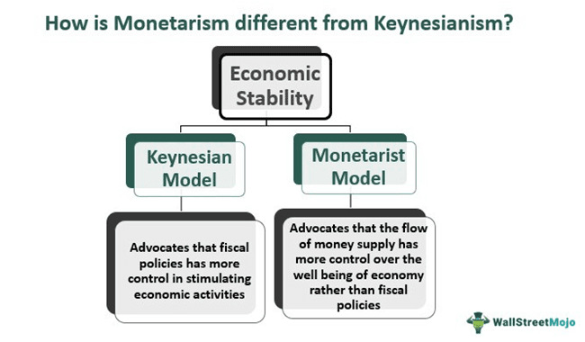

## Table of Contents

## What is monetarism?

Monetarism is an economic theory that focuses on the role of money supply in the economy. It suggests that controlling the amount of money in circulation is the best way to manage economic growth and keep prices stable. Monetarists believe that if there is too much money, it can lead to inflation, which means prices go up. On the other hand, if there isn't enough money, it can slow down the economy and cause unemployment.

The main idea behind monetarism is that the central bank, like the Federal Reserve in the United States, should control the money supply carefully. Monetarists, like the famous economist Milton Friedman, argue that the central bank should increase the money supply at a steady rate, rather than trying to fine-tune the economy with frequent changes. They believe that a stable and predictable money supply helps businesses and people plan better, leading to a healthier economy overall.

## Who is the key figure associated with monetarism?

The key figure associated with monetarism is Milton Friedman. He was an economist who believed strongly that controlling the amount of money in the economy was very important. Friedman thought that if the government managed the money supply well, it could help keep prices stable and the economy growing smoothly. He argued that too much money could cause inflation, making prices rise, while too little money could lead to unemployment and slow down the economy.

Friedman's ideas became very influential, especially in the 1970s and 1980s. He wrote many [books](/wiki/algo-trading-books) and articles, and his most famous work is called "A Monetary History of the United States, 1867-1960," which he co-wrote with Anna Schwartz. In this book, they showed how changes in the money supply had big effects on the economy. Friedman's work helped shape the policies of many central banks around the world, making them focus more on controlling the money supply to keep the economy stable.

## What are the main principles of monetarism?

Monetarism is all about how the amount of money in the economy affects things like prices and jobs. The main idea is that if there's too much money, prices go up, which is called inflation. But if there's not enough money, it can make it hard for businesses to grow and people to find jobs. So, monetarists think the best way to keep the economy stable is by carefully controlling how much money is out there. They believe that the central bank, like the Federal Reserve in the U.S., should be in charge of this.

A big part of monetarism is the idea that the central bank should increase the money supply at a steady rate, instead of changing it a lot. Milton Friedman, who is a key figure in monetarism, thought that if the money supply grew at a predictable pace, it would help businesses and people plan better. This would lead to a healthier economy. Monetarists also believe that other things, like government spending or taxes, are not as important for managing the economy as controlling the money supply. They think that if the money supply is managed well, the economy will take care of itself.

## How does monetarism differ from Keynesian economics?

Monetarism and Keynesian economics are two different ways of thinking about how to manage the economy. Monetarists, like Milton Friedman, believe that the most important thing is to control the amount of money in the economy. They think that if there's too much money, prices will go up, which is called inflation. And if there's not enough money, it can make it hard for businesses to grow and people to find jobs. So, monetarists say the central bank should increase the money supply at a steady rate to keep the economy stable. They don't think the government should spend a lot of money to try to fix the economy.

On the other hand, Keynesian economics, named after John Maynard Keynes, focuses more on government spending and taxes to manage the economy. Keynesians believe that when the economy is doing badly, like during a recession, the government should spend more money to help it recover. They think this can create jobs and get people spending again. Keynesians also believe that the government should raise taxes or cut spending when the economy is doing well to prevent it from overheating. Unlike monetarists, Keynesians don't think controlling the money supply is the most important thing for managing the economy.

## What role does the money supply play in monetarism?

In monetarism, the money supply is super important because it's seen as the main thing that affects the economy. Monetarists believe that if there's too much money floating around, it can make prices go up, which is called inflation. On the other hand, if there isn't enough money, it can slow down the economy and make it hard for businesses to grow and people to find jobs. So, monetarists think that the central bank should carefully control how much money is out there to keep the economy stable.

The central bank, like the Federal Reserve in the U.S., should increase the money supply at a steady and predictable rate, according to monetarists. They believe this helps businesses and people plan better because they know what to expect. If the money supply grows too fast or too slow, it can cause problems. But if it's managed well, monetarists think the economy will take care of itself without the government needing to do a lot of other things like changing taxes or spending a lot of money.

## Can you explain the concept of the quantity theory of money in relation to monetarism?

The quantity theory of money is a big part of monetarism. It says that the amount of money in the economy is directly related to the price levels. In simple terms, if there's more money, prices will go up, and if there's less money, prices will go down. Monetarists use this idea to argue that the central bank should control the money supply carefully. They believe that if the central bank keeps the money supply growing at a steady rate, it can help keep prices stable and the economy healthy.

This theory is often summed up in a simple equation: MV = PQ. Here, M is the money supply, V is the velocity of money (how fast money changes hands), P is the price level, and Q is the amount of goods and services produced. Monetarists think that V and Q are pretty stable over time, so changes in M directly affect P. This means that if the central bank increases the money supply too quickly, it can lead to inflation because there's more money chasing the same amount of goods and services. By keeping the money supply under control, monetarists believe the central bank can help prevent big swings in prices and keep the economy on an even keel.

## What are some historical examples where monetarist policies were implemented?

One big example of monetarist policies being used is in the United States during the 1980s. Back then, the country was dealing with high inflation, which means prices were going up a lot. The Federal Reserve, which is like the central bank of the U.S., decided to follow monetarist ideas. They did this by controlling how much money was in the economy. The Federal Reserve, led by Paul Volcker, started to slow down the growth of the money supply. This was tough because it made interest rates go up and caused a recession, but it helped bring inflation down. People started to see that controlling the money supply could be a good way to manage the economy.

Another example is in the United Kingdom in the early 1980s. The UK was also struggling with high inflation and a slow economy. The government, led by Prime Minister Margaret Thatcher, decided to use monetarist policies to fix things. They tried to control the money supply to bring inflation down. The Bank of England, which is the UK's central bank, worked to keep the money supply growing at a steady rate. This was part of a bigger plan to make the economy more stable. Even though it was hard at first, these policies helped lower inflation and set the stage for economic growth later on.

## How do monetarists view inflation and its causes?

Monetarists believe that inflation happens when there's too much money in the economy. They think that if the amount of money grows faster than the number of goods and services, prices will go up. This is because more money is chasing the same amount of stuff, so people have to pay more to get it. Monetarists use the quantity theory of money to explain this. They say that if you control how much money is out there, you can keep prices from going up too fast.

To stop inflation, monetarists think the central bank should carefully manage the money supply. They believe the central bank should make the money supply grow at a steady rate, not too fast and not too slow. This way, businesses and people can plan better because they know what to expect. If the central bank does this right, monetarists say, it can help keep prices stable and stop inflation from getting out of control.

## What are the criticisms of monetarism?

Some people don't agree with monetarism and think it has problems. One big criticism is that monetarists focus too much on the money supply and don't pay enough attention to other things that can affect the economy, like government spending or what people are doing. Critics say that just controlling the money supply might not be enough to keep the economy stable. They think that the economy is more complicated than just how much money is out there.

Another criticism is that it's hard to measure and control the money supply exactly. Monetarists say the central bank should increase the money supply at a steady rate, but it's tricky to know exactly how much money is in the economy at any time. Different ways of measuring money can give different results, and things like electronic payments and new types of money make it even harder. Critics worry that if the central bank tries to control the money supply too strictly, it might make the economy worse instead of better.

## How have monetarist theories evolved over time?

Monetarist theories have changed a bit over time, but they still focus on the idea that controlling the money supply is really important for the economy. When Milton Friedman first started talking about monetarism, he thought the central bank should increase the money supply at a steady rate to keep prices stable. But as time went on, people realized that measuring and controlling the money supply exactly was harder than they thought. New types of money and ways of paying for things made it tricky to know how much money was really out there. So, while the basic idea of monetarism stayed the same, people started to think more about how to apply it in the real world.

Even though monetarism has faced some challenges, it has influenced how central banks work today. Many central banks now pay close attention to the money supply, but they also look at other things like interest rates and unemployment. The idea that too much money can lead to inflation is still a big part of how central banks make decisions. Over time, monetarists have also started to think more about how the economy is connected around the world. They see that what happens in one country can affect others, so they think about global money supplies and how they can work together to keep the economy stable.

## What impact does monetarism have on fiscal policy?

Monetarism says that the most important thing for the economy is controlling how much money is out there. Because of this, monetarists think that fiscal policy, which is about how the government spends money and collects taxes, isn't as important as the money supply. They believe that if the central bank keeps the money supply growing at a steady rate, the economy will take care of itself. So, monetarists don't think the government should use fiscal policy to try to fix the economy. They think that if the government spends too much money or changes taxes a lot, it can mess things up and make it harder for the central bank to control the money supply.

Even though monetarists focus more on the money supply, their ideas have still affected how people think about fiscal policy. Some governments have tried to keep their spending and taxes more stable, following the monetarist idea that big changes can cause problems. But not everyone agrees with this. Some people think that fiscal policy can be really helpful, especially during tough times like a recession. They believe that if the government spends more money or cuts taxes, it can help the economy recover faster. So, while monetarism has made people think more about the money supply, it hasn't stopped everyone from using fiscal policy to manage the economy.

## Can you discuss a case study where monetarist policies significantly influenced an economy?

In the early 1980s, the United States was dealing with high inflation, which means prices were going up a lot. The Federal Reserve, led by Paul Volcker, decided to use monetarist ideas to fix this problem. They started to slow down the growth of the money supply. This was a tough decision because it made interest rates go up and caused a recession. But it worked to bring inflation down. By controlling the money supply, the Federal Reserve showed that monetarist policies could help manage the economy. This case showed that even though it was hard at first, controlling the money supply could be a good way to keep prices stable.

Another example is in the United Kingdom during the same time. The UK was also struggling with high inflation and a slow economy. Prime Minister Margaret Thatcher decided to use monetarist policies to try to fix things. The Bank of England, which is the UK's central bank, worked to keep the money supply growing at a steady rate. This was part of a bigger plan to make the economy more stable. Even though it was tough at first, these policies helped lower inflation and set the stage for economic growth later on. The UK case showed that monetarist ideas could be used to help an economy that was having problems with high prices and slow growth.

## References & Further Reading

Friedman, M. (1968). "The Role of Monetary Policy." The American Economic Review, 58(1), 1-17. This seminal work discusses the critical role of monetary policy and its implications for economic stability, offering a comprehensive insight into monetarist theory.

Volcker, P. A., & Gyohten, T. (1992). "Changing Fortunes: The World's Money and the Threat to American Leadership." Times Books. An exploration of the global monetary system, detailing the challenges and changes faced by American leadership, highlighting the influence of monetarist ideas in policy-making.

Chaboud, A. P., Chiquoine, B., Hjalmarsson, E., & Vega, C. (2014). "Rise of the Machines: Algorithmic Trading in the Foreign Exchange Market." The Review of Financial Studies, 27(7), 1931–1963. This study examines the impact of [algorithmic trading](/wiki/algorithmic-trading) in the foreign exchange markets, shedding light on the advancements in trading technologies and their effects on market dynamics.

Tsang, M. (2010). "The Impact of Algorithmic Trading Programs on Financial Markets." ABC-XYZ Research. Analyzes how algorithmic trading programs affect financial markets, focusing on market efficiency, [volatility](/wiki/volatility-trading-strategies), and the need for regulatory frameworks.

Friedman, M., & Schwartz, A. J. (1963). "A Monetary History of the United States, 1867–1960." Princeton University Press. This comprehensive account discusses the role of money supply and monetary policy in shaping U.S. economic history, foundational to understanding monetarist perspectives.

