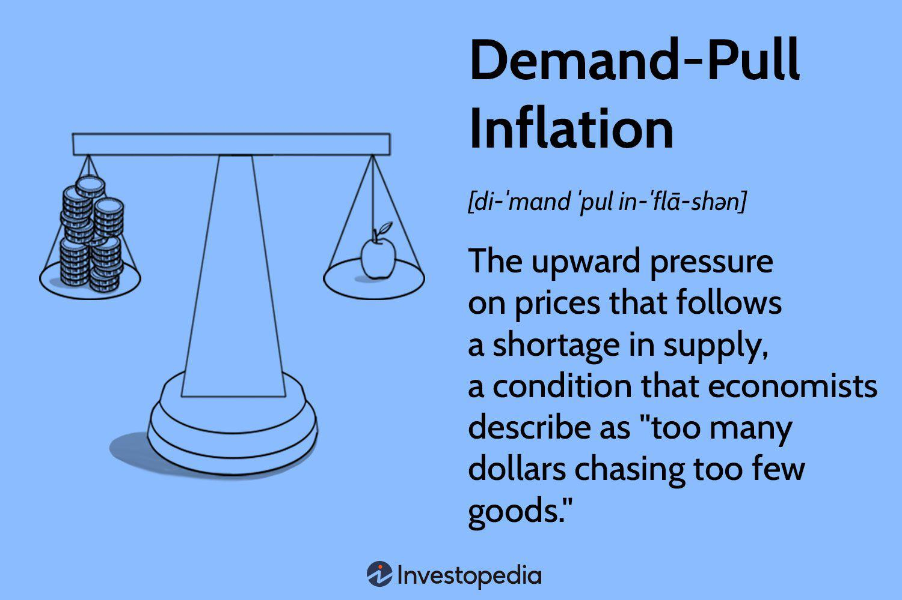

Monetarism has long been a dominant economic theory that emphasizes the control of the money supply as a technique for managing economic stability and growth. Championed by economist Milton Friedman, monetarism posits that variations in the money supply have major influences on national output in the short run and the price level over longer periods. This theory rests heavily on the Quantity Theory of Money, represented by the equation MV = PQ, where M is the money supply, V is the velocity of money, P is the price level, and Q represents the real output or GDP. Monetarists argue for a fixed annual increase in the money supply that aligns with the potential increase in GDP, aiming to control inflation while fostering economic growth.

In the past few decades, the rapid advancement of technology has transformed financial markets, with the rise of algorithmic trading bringing new complexities and capabilities. Algorithmic trading, which utilizes computer algorithms to execute orders, can process vast amounts of data at high speeds, thus allowing for rapid and efficient trading. This modern trading approach improves market efficiency but also introduces new challenges, such as increased market volatility and unforeseen systemic risks.



This article explores how monetarism and algorithmic trading intersect, particularly as they relate to inflation control and financial stability. With trading algorithms now capable of processing economic indicators and central bank announcements in real-time, the implications of monetary policy decisions on financial markets have become more instantaneous and pronounced. By comprehensively understanding these intersections, we can better appreciate how these dynamics influence contemporary economic policies and trading practices, ultimately contributing to a more profound grasp of financial market mechanisms in the digital age.

## Table of Contents

## Understanding Monetarism

Monetarism, a significant shift in economic thought primarily promoted by economist Milton Friedman, underscores the centrality of the money supply in determining economic outcomes. At its core, it is based on the Quantity Theory of Money, a fundamental concept encapsulated by the equation MV = PQ. Here, 'M' stands for the money supply, 'V' represents the velocity of money (the frequency at which one unit of currency circulates in the economy), 'P' denotes the price level, and 'Q' signifies the quantity of goods and services produced. This equation posits that a change in the money supply directly affects the price level and economic output, assuming velocity and quantity remain constant.

Friedman and other monetarists advocate for a steady and predictable increase in the money supply. Such growth is seen as a method to ensure consistent economic expansion while maintaining low inflation rates. By contrast to Keynesian economics, which often champions active fiscal policy and government intervention, monetarism places faith in the self-regulating nature of markets. Monetarists argue that erratic changes in the money supply can lead to instability, causing either inflationary spikes if the supply grows too quickly, or recessions if it slows abruptly.

The rise of monetarism in the mid-20th century marked a pivotal transition from the Keynesian dominance that had been prevalent post-World War II. This shift was largely a response to the stagflation of the 1970s, where high inflation and stagnating growth co-existed, challenging the efficacy of Keynesian strategies. Monetarists noted that excessive emphasis on fiscal policy ignored the critical role of monetary stability in fostering economic growth and curbing inflation.

In summary, monetarism has profoundly influenced contemporary economic policy by highlighting the importance of controlling the money supply. It posits that well-regulated monetary growth can mitigate inflation and encourage stable economic progress, relying on the market's inherent capacity to self-correct over time.

## The Role of Central Banks in Monetarism

Central banks are integral to monetarist theory, serving as the primary institutions responsible for managing the money supply to control inflation and spur economic growth. Monetarism itself, prominently advocated by economist Milton Friedman, emphasizes that variations in the money supply have significant short-term and long-term impacts on national economies. Central banks employ various instruments to regulate the money supply, including reserve ratios, discount rates, and open market operations.

**Reserve Ratios:** The reserve ratio refers to the portion of depositors' balances that banks must have on hand as reserves rather than lending out. By adjusting these ratios, central banks can directly influence the money supply. An increase in the reserve ratio reduces the funds available for banks to lend, thereby contracting the money supply, while a decrease has the opposite effect.

**Discount Rates:** Central banks set the discount rate, the interest rate charged to commercial banks for borrowing funds. Altering this rate affects the cost of borrowing for banks, which subsequently impacts the interest rates they offer to consumers and businesses. Lowering the discount rate tends to encourage borrowing and, thus, increases the money supply, while raising the rate typically restricts it.

**Open Market Operations:** This tool involves the buying and selling of government securities in the financial markets. When a central bank purchases securities, it injects liquidity into the banking system, thereby increasing the money supply. Conversely, selling securities withdraws liquidity, contracting the money supply. Open market operations are one of the most commonly used tools for short-term monetary policy adjustments.

A historical illustration of effective monetarist policy implementation is seen during Paul Volcker's tenure as Chairman of the Federal Reserve from 1979 to 1987. Facing rampant inflation in the late 1970s and early 1980s, Volcker implemented a series of aggressive monetary tightening measures. By significantly increasing interest rates, the Fed effectively curtailed inflation but also precipitated a recession, demonstrating the potent influence of central bank policies guided by monetarist principles. 

Today, central banks utilize monetarist principles to navigate the complexities of modern economies. They focus on inflation targeting, striving to maintain a stable inflation rate that aligns with broader economic goals. This involves predicting and counteracting inflationary pressures through informed adjustments to the money supply. Inflation targeting remains a cornerstone of monetary policy worldwide, underscoring the sustained relevance of monetarist thought in economic policymaking.

The role of central banks in monetarism underscores a crucial intersection between theory and practice, where deliberate control of the money supply underpins efforts to foster economic stability and growth. By maintaining a delicate balance between inflation and growth, central banks aim to support sustainable economic environments, a goal that remains as pertinent today as ever.

## Algorithmic Trading: A Modern Financial Practice

Algorithmic trading utilizes sophisticated computer-based algorithms to execute trades at exceptionally high speeds, thereby significantly enhancing market efficiency. These algorithms harness mathematical models to analyze data and predict market trends, allowing traders to automate decision-making processes and eliminate human errors. This automation facilitates the rapid execution of orders, capitalizing on market opportunities that may exist for only fractions of a second.

A notable subset of [algorithmic trading](/wiki/algorithmic-trading) is high-frequency trading ([HFT](/wiki/high-frequency-trading-strategies)), which leverages the fastest execution speeds to profit from minute price discrepancies across markets. HFT has been instrumental in increasing market [liquidity](/wiki/liquidity-risk-premium) and narrowing bid-ask spreads, but it has also introduced a level of [volatility](/wiki/volatility-trading-strategies) due to the sheer [volume](/wiki/volume-trading-strategy) and speed of trades executed. The algorithms used in HFT continuously scan multiple markets and can execute thousands of trades in an instant, aiming to outpace competitors and maximize gains.

Regulators face significant challenges in maintaining market stability amid the rapid technological advancements underpinning algorithmic trading. The speed and complexity of these algorithms mean that markets have become more interconnected and that disruptions can propagate quickly. While algorithmic trading enhances efficiency and can lead to more accurate pricing, it also poses systemic risks. Regulators must endeavor to balance the benefits of technological advancements with prudent oversight to mitigate potential risks like market manipulation or flash crashes.

The dynamic nature of algorithmic trading necessitates comprehensive regulatory frameworks to ensure robust risk management and the implementation of safeguards. This includes scrutinizing algorithms for unintended behaviors, enforcing rules that prevent unfair trading practices, and ensuring that market participants can respond effectively to unusual market conditions. Overall, the intersection of algorithmic trading with regulatory policy continues to shape the landscape of financial markets, necessitating ongoing adaptations to preserve equilibrium and integrity.

## Intersections Between Monetarism and Algorithmic Trading

Monetarist principles, which emphasize money supply control, can be effectively mirrored in the data-driven methodologies employed by algorithmic trading systems. These systems utilize advanced algorithms to interpret and respond to real-time market data, including information stemming from central bank announcements and key economic indicators. By rapidly adjusting their trading strategies based on this input, algorithmic systems reflect the responsiveness necessary to align with monetarist ideals.

Algorithmic trading systems often integrate monetarist insights to anticipate market movements driven by changes in monetary policy. For instance, when a central bank adjusts interest rates or signals a shift in monetary policy, these systems can recalibrate their strategies almost instantaneously, exploiting the opportunities presented by such policy changes. The speed and precision with which these adaptations occur are critical in navigating the complexities of modern financial markets, where information latency can significantly impact trading outcomes.

To understand the mathematical framework underpinning these adaptations, consider the equation provided by the Quantity Theory of Money: MV = PQ, where M is the money supply, V is the velocity of money, P is the price level, and Q is the output level. Algorithmic traders can use variations of this formula to forecast changes in P and Q, based on anticipated shifts in M and V due to monetary policy adjustments.

Below is an example of how one might use Python to simulate the impact of changing money supply on market prices:

```python
def price_change(money_supply_change, velocity, output):
    # Constants for initial conditions
    initial_money_supply = 1000  # Example value
    initial_velocity = 1.5
    initial_output = 500
    initial_price_level = (initial_money_supply * initial_velocity) / initial_output

    # Calculate new conditions
    new_money_supply = initial_money_supply + money_supply_change
    new_price_level = (new_money_supply * velocity) / output

    # Determine price change
    return new_price_level - initial_price_level

# Example calculation
money_supply_change = 50  # Central bank increases money supply by 50 units
velocity = 1.5  # Assumes constant velocity
output = 500  # Assumes constant output

price_delta = price_change(money_supply_change, velocity, output)
print(f"The change in price level due to increased money supply is: {price_delta}")
```

By leveraging such theoretical foundations and mathematical models, algorithmic trading systems not only incorporate monetarist principles but also enhance traders' capabilities to efficiently manage and predict market trends. This synthesis of economic theory and trading technology exemplifies how modern financial practices can be optimized to align with established economic theories, thereby improving market efficiency and stability.

## Implications for Economic Policy and Financial Markets

The integration of monetarist principles within algorithmic trading has profound implications for economic policy frameworks and market behaviors. As these automated systems increasingly respond to monetary policy changes, central banks must evaluate the effects of these rapid, algorithm-driven reactions on market volatility. The capacity of algorithms to respond instantaneously to economic indicators and central bank announcements can lead to swift shifts in market dynamics, amplifying movements and potentially increasing volatility. For instance, when central banks adjust interest rates or other monetary policy tools, algorithmic trading systems may quickly interpret and react to these signals, potentially leading to abrupt price changes that reflect both actual and anticipated economic scenarios.

Economic policies must evolve alongside trading technologies. Policymakers are tasked with ensuring that the integration of these technologies supports financial market stability without compromising the regulatory frameworks in place. This requires an understanding of how trading algorithms interpret economic data and macroeconomic indicators. Programs that predict and respond to market developments using monetarist insights must align with the broader economic objectives aimed at low inflation and sustainable growth. Therefore, economic policy must be adaptive, accounting for both the benefits and challenges presented by algorithmic trading.

The rise of algorithmic trading also necessitates innovative regulatory approaches to manage systemic risks. Regulators are challenged to devise and implement frameworks that keep pace with technological advancements while mitigating the potential for systemic disruptions. This includes ensuring transparency in algorithmic trades, implementing circuit breakers to prevent flash crashes, and establishing robust risk management protocols. The continuous evolution of algorithms and high-frequency trading systems demands that regulatory bodies are equipped to foresee and address vulnerabilities that may not be immediately apparent but could pose significant threats under certain market conditions.

In summary, the symbiosis of monetarist principles and algorithmic trading requires a proactive approach to economic policy and regulation. By addressing the impacts of these technologies on market behavior and volatility, central banks and regulators can ensure a stable and resilient financial environment.

## Conclusion

The intersection of monetarism and algorithmic trading highlights the dynamic interplay of established economic theories and cutting-edge technology in today's financial markets. By understanding and leveraging these concepts, policymakers and traders can significantly enhance market operations and promote economic stability. Monetarism's emphasis on the money supply and its influence on economic outcomes finds a modern ally in algorithmic trading, where data-driven strategies can swiftly respond to monetary policies.

Algorithmic trading systems, rooted in complex mathematical models, offer traders the ability to predict and respond to market movements influenced by changes in monetary policy. The capability of these systems to process information and execute trades rapidly means that financial markets are increasingly shaped by the real-time integration of economic principles and advanced technology. This fusion allows for more informed trading decisions, potentially reducing market inefficiencies and enhancing liquidity.

Looking forward, advancements in trading technology and the integration of economic theories like monetarism are set to further redefine the landscape of financial markets. The potential for [artificial intelligence](/wiki/ai-artificial-intelligence) and [machine learning](/wiki/machine-learning) to augment algorithmic trading strategies is vast, offering novel ways to interpret economic signals and forecasts. As these technologies evolve, they promise to not only refine the precision of trading strategies but also to provide deeper insights into economic trends and policy impacts.

Policymakers, recognizing the rapid pace of technological innovation in trading, are challenged to adapt regulatory frameworks to ensure that these advancements contribute positively to market stability and economic growth. The future of financial markets will likely depend on the collaborative efforts of economists, technologists, and regulators to harness the benefits of algorithmic trading while mitigating associated risks. By fostering an environment where economic theory and technology coalesce effectively, the potential for sustainable and resilient market operations significantly increases.

## References & Further Reading

[1]: Friedman, M. (1969). ["The Optimum Quantity of Money and Other Essays."](https://archive.org/details/optimumquantityo0000frie) Aldine Transaction.

[2]: Goodhart, C. (1986). ["Monetary Theory and Practice: The UK Experience."](https://archive.org/details/monetarytheorypr0000good) Macmillan Press.

[3]: "Algorithmic Trading: Winning Strategies and Their Rationale" by Ernie Chan. (2008). [Link](https://www.wiley.com/en-us/Algorithmic+Trading%3A+Winning+Strategies+and+Their+Rationale-p-9781118460146)

[4]: Hull, J. (2020). ["Options, Futures, and Other Derivatives"](https://elibrary.pearson.de/book/99.150005/9781292410623) 10th Edition. Pearson.

[5]: Pardo, R. (1992). ["Design, Testing, and Optimization of Trading Systems."](https://archive.org/details/designtestingopt0000pard) Wiley Trading Series.

[6]: Volcker, P. A., & Gyohten, T. (1992). ["Changing Fortunes: The World’s Money and the Threat to American Leadership."](https://archive.org/details/changingfortunes00paul) Crown Business. 

[7]: Tsang, A. (2010). ["Algorithmic and High-Frequency Trading."](https://assets.cambridge.org/97811070/91146/frontmatter/9781107091146_frontmatter.pdf) Palgrave Macmillan.