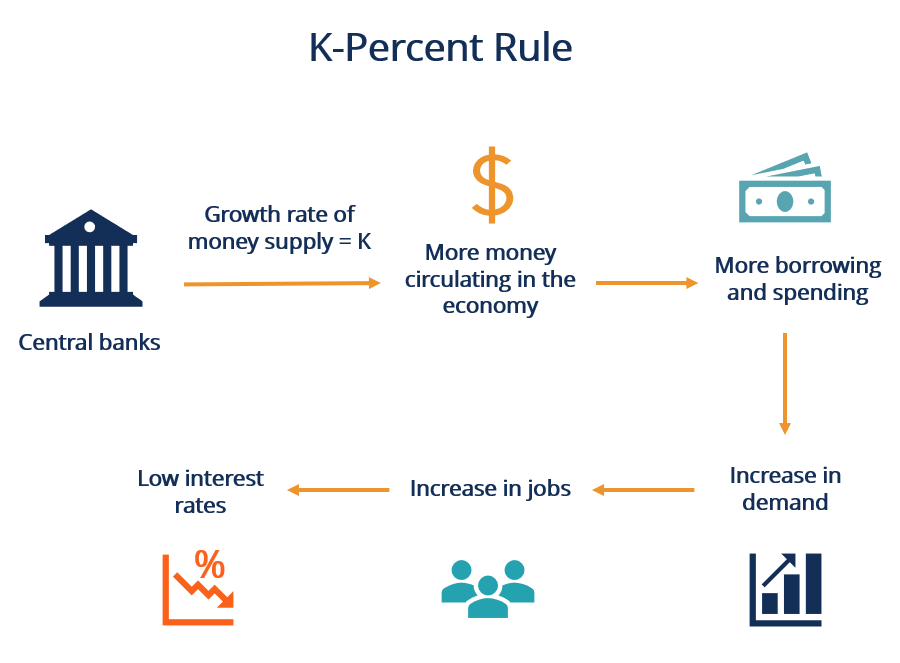

## Table of Contents

## What is monetarism?

Monetarism is an economic theory that focuses on the role of money supply in an economy. It suggests that controlling the amount of money in circulation is the best way to manage economic growth and keep prices stable. Monetarists believe that too much money can lead to inflation, while too little money can slow down the economy. They argue that the central bank should aim to increase the money supply at a steady, predictable rate to help the economy grow smoothly.

The main idea behind monetarism was developed by economist Milton Friedman. He believed that the economy works best when the money supply grows at a steady pace, rather than when the government tries to control it through spending and taxes. According to monetarists, if the money supply is managed well, it can help prevent big economic swings like recessions or high inflation. This theory became very popular in the 1970s and 1980s, and it influenced how many countries managed their economies.

## How does monetarism relate to inflation?

Monetarism says that inflation happens when there is too much money in the economy. If the amount of money grows faster than the things people can buy, prices go up. This is because more money is chasing the same amount of goods and services. Monetarists believe that the central bank should control the money supply to keep inflation in check. If the central bank keeps the money supply growing at a steady rate, it can help stop prices from rising too fast.

Milton Friedman, a famous economist, said that "inflation is always and everywhere a monetary phenomenon." This means that inflation comes from having too much money, not from other things like higher costs for businesses. Monetarists think that if the government tries to spend a lot of money to help the economy, it can lead to more inflation. They believe that a steady and predictable increase in the money supply is the best way to keep the economy stable and avoid big jumps in prices.

## What is money supply and how is it measured?

Money supply is the total amount of money in an economy at a certain time. It includes all the cash people have, the money in their bank accounts, and other types of money that can be used to buy things. Economists measure money supply to understand how much money is available for spending and how it might affect the economy.

There are different ways to measure money supply, and they are called M0, M1, M2, and sometimes M3. M0 is the most basic measure and includes only the physical money, like coins and paper money. M1 includes M0 plus the money in checking accounts, which people can use easily to buy things. M2 is a broader measure that includes M1 plus savings accounts and other types of accounts that are not as easy to spend but can still be turned into cash. M3 is even broader and might include things like large time deposits, but not all countries use M3. Each measure helps economists see different parts of the money supply and how it's being used.

## Can you explain the quantity theory of money?

The quantity theory of money is a simple idea that says the amount of money in an economy affects prices. It says that if the amount of money grows faster than the things people can buy, then prices will go up. This theory uses a formula called the equation of exchange, which is MV = PQ. In this formula, M is the money supply, V is the speed at which money moves around (velocity), P is the price level, and Q is the amount of goods and services (output). The theory assumes that V and Q stay pretty much the same, so if M goes up, P must go up too to keep the equation balanced.

This theory is important because it helps explain why inflation happens. If the government prints more money, but the economy doesn't grow to match it, then there's more money chasing the same amount of stuff. That makes prices rise. The quantity theory of money is a big part of monetarism, which says that controlling the money supply is the best way to manage the economy and keep prices stable. By understanding this theory, people can see how changes in the money supply can affect their everyday lives through changes in prices.

## How does controlling the money supply affect inflation?

Controlling the money supply is important for keeping inflation in check. When there's too much money floating around, people have more cash to spend, but the number of things they can buy stays the same. This means more money is chasing the same amount of goods, which pushes prices up. That's inflation. By controlling how fast the money supply grows, the central bank can stop prices from rising too fast. If they keep the money supply growing at a steady pace, it helps keep the economy balanced and prevents big jumps in prices.

On the other hand, if the central bank doesn't add enough money to the economy, it can slow things down. When there's not enough money, people might not spend as much, and businesses might not sell as many goods. This can lead to lower prices, but it can also make the economy weaker. So, the central bank has to find the right balance. By carefully managing the money supply, they can help keep inflation low and the economy growing smoothly.

## What tools do central banks use to manage money supply?

Central banks use a few main tools to manage the money supply. One tool is called open market operations. This is when the central bank buys or sells government bonds. If they want to increase the money supply, they buy bonds from banks, giving them more money to lend out. If they want to decrease the money supply, they sell bonds, taking money out of the economy. Another tool is the reserve requirement, which is the amount of money banks have to keep in reserve and not lend out. By changing this requirement, the central bank can control how much money banks can lend, which affects the money supply.

Another important tool is the discount rate, which is the [interest rate](/wiki/interest-rate-trading-strategies) the central bank charges when it lends money to other banks. If the central bank lowers the discount rate, it becomes cheaper for banks to borrow money, so they can lend more, increasing the money supply. If the central bank raises the discount rate, borrowing becomes more expensive, so banks lend less, decreasing the money supply. These tools help the central bank keep the economy stable by controlling how much money is available for people to spend.

## What are the historical examples where monetarism was used to control inflation?

One big example of monetarism being used to control inflation happened in the United States in the late 1970s and early 1980s. Back then, the U.S. was dealing with high inflation, which means prices were going up a lot. The Federal Reserve, which is like the central bank of the U.S., decided to use monetarism to fight this. They started controlling the money supply more tightly. The head of the Federal Reserve at the time, Paul Volcker, raised interest rates a lot to slow down the growth of money. This made borrowing more expensive, so people and businesses spent less money. It worked, but it also caused a recession, which is when the economy slows down a lot. After some time, though, inflation went down and the economy got better.

Another example is in the United Kingdom during the 1980s. The UK also had high inflation in the late 1970s. When Margaret Thatcher became the Prime Minister, she and her government decided to use monetarist ideas to fix the problem. They worked with the Bank of England to control the money supply. They did this by setting targets for how fast the money supply should grow and then using tools like interest rates to meet those targets. This helped bring inflation down over time. But, like in the U.S., it was tough at first because it led to higher unemployment and a slower economy. Eventually, though, the UK's economy got stronger and inflation stayed low.

## What are the criticisms of monetarism in controlling inflation?

Some people think monetarism doesn't always work well to control inflation. One big problem is that it's hard to measure the money supply exactly. There are different ways to count it, like M1 and M2, and they can give different answers. Also, the speed at which money moves around, called velocity, can change a lot. If it changes, then controlling the money supply might not stop inflation like monetarists think it will. Another criticism is that focusing too much on the money supply can make the economy go up and down a lot. For example, if the central bank tries to control money too tightly, it might slow down the economy too much and cause a recession.

Another issue with monetarism is that it doesn't look at other things that can affect inflation, like how much it costs for businesses to make things or how much people want to buy. If these things change, just controlling the money supply might not be enough. Some people also think that trying to keep the money supply growing at a steady rate can be too simple. The economy is complicated, and sometimes it needs different actions to keep things balanced. Critics say that instead of just focusing on the money supply, central banks should look at a lot of different things to manage inflation and keep the economy healthy.

## How do monetarists view the role of fiscal policy in inflation control?

Monetarists think that fiscal policy, which is about how the government spends money and collects taxes, doesn't do a good job at controlling inflation. They believe that if the government spends a lot of money to help the economy, it can actually make inflation worse. This is because more government spending means more money in the economy, which can push prices up. Monetarists say that the best way to control inflation is by managing the money supply, not by changing how much the government spends or taxes.

Instead of using fiscal policy, monetarists think the central bank should focus on keeping the money supply growing at a steady rate. They believe this helps keep prices stable without causing big swings in the economy. If the government tries to use fiscal policy to control inflation, it might not work well and could even make things worse. So, monetarists argue that the central bank's control over the money supply is more important for keeping inflation in check than what the government does with its spending and taxes.

## What are the challenges in accurately measuring and controlling money supply?

Measuring and controlling the money supply can be tricky. One big challenge is that money supply can be counted in different ways, like M1 and M2. M1 includes things like cash and checking accounts, while M2 adds in savings accounts and other stuff. These different ways of counting can give different answers, so it's hard to know which one to use. Also, the speed at which money moves around, called velocity, can change a lot. If velocity goes up or down, the same amount of money can have a different effect on the economy. This makes it hard to control inflation just by watching the money supply.

Another challenge is that controlling the money supply can affect the economy in ways that are hard to predict. If the central bank tries to slow down the money supply too much, it might make the economy weaker and cause a recession. On the other hand, if they let the money supply grow too fast, it can lead to higher inflation. It's a balancing act, and getting it right is not easy. Plus, other things like how much it costs to make things or how much people want to buy can also change prices, so just focusing on the money supply might not be enough to control inflation.

## How does monetarism compare to other economic theories in managing inflation?

Monetarism and other economic theories have different ways to manage inflation. Monetarism says the best way to control inflation is by managing the money supply. It believes that if the central bank keeps the money supply growing at a steady rate, it can stop prices from going up too fast. This theory focuses a lot on the amount of money in the economy and thinks that too much money can cause inflation. Other theories, like Keynesian economics, think that government spending and taxes, which is called fiscal policy, can also help control inflation. Keynesians believe that if the government spends more money when the economy is slow, it can help, but if it spends too much, it might cause inflation.

Another theory, called supply-side economics, says that making it easier for businesses to produce things can help control inflation. Supply-siders think that if businesses can make more stuff, there will be more things for people to buy, and that can keep prices down. This is different from monetarism, which doesn't focus as much on how much stuff is being made. Each theory has its own way of looking at inflation, and they all try to keep prices stable, but they use different tools and focus on different parts of the economy. Monetarism might work well in some situations, but other theories might be better in others.

## What are the latest research findings on the effectiveness of monetarism in modern economies?

Recent research on monetarism shows that it still has some good ideas, but it's not as simple as it used to be. In today's world, with digital money and online banking, it's harder to measure the money supply accurately. Some studies say that controlling the money supply can help keep inflation in check, but it's not the only thing that matters. Other things, like how much it costs to make things or how much people want to buy, also affect prices. So, while monetarism can be useful, it needs to be used along with other tools to manage the economy well.

New research also points out that the speed at which money moves around, called velocity, can change a lot. This makes it tricky to control inflation just by watching the money supply. Some economists think that central banks should focus more on interest rates and other tools to manage the economy. They believe that these tools can help keep prices stable without causing big swings in the economy. Overall, while monetarism has some good points, it's clear that managing modern economies needs a mix of different strategies.

## References & Further Reading

[1]: Friedman, M. (1969). ["The Optimum Quantity of Money and Other Essays."](https://archive.org/details/optimumquantityo0000frie) Aldine Transaction.

[2]: Goodhart, C. (1986). ["Monetary Theory and Practice: The UK Experience."](https://archive.org/details/monetarytheorypr0000good) Macmillan Press.

[3]: "Algorithmic Trading: Winning Strategies and Their Rationale" by Ernie Chan. (2008). [Link](https://www.wiley.com/en-us/Algorithmic+Trading%3A+Winning+Strategies+and+Their+Rationale-p-9781118460146)

[4]: Hull, J. (2020). ["Options, Futures, and Other Derivatives"](https://elibrary.pearson.de/book/99.150005/9781292410623) 10th Edition. Pearson.

[5]: Pardo, R. (1992). ["Design, Testing, and Optimization of Trading Systems."](https://archive.org/details/designtestingopt0000pard) Wiley Trading Series.

[6]: Volcker, P. A., & Gyohten, T. (1992). ["Changing Fortunes: The World’s Money and the Threat to American Leadership."](https://archive.org/details/changingfortunes00paul) Crown Business. 

[7]: Tsang, A. (2010). ["Algorithmic and High-Frequency Trading."](https://assets.cambridge.org/97811070/91146/frontmatter/9781107091146_frontmatter.pdf) Palgrave Macmillan.