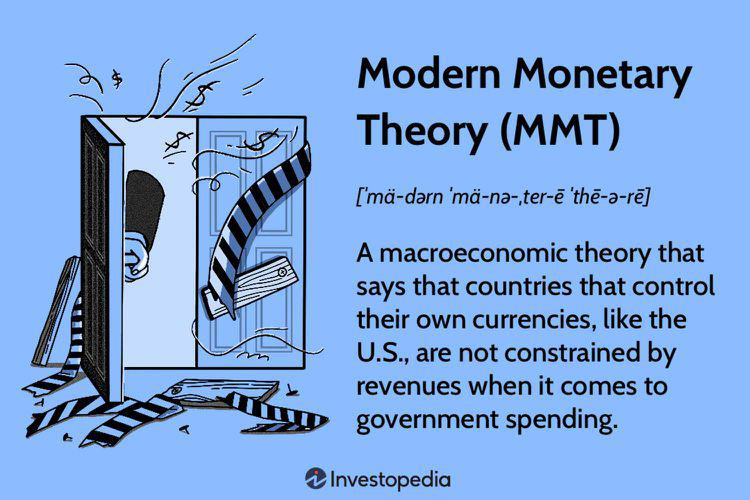

The interplay between economic theories and modern financial practices can significantly shape financial markets and economic policies. Monetarism, a prominent economic theory, focuses on the control of the money supply as a means to influence economic stability and growth. It posits that variations in the money supply have far-reaching impacts on national economies, directly affecting inflation rates and economic output. This theoretical framework continues to be pivotal in formulating central bank policies around the world, with many monetary authorities designing strategies based on the principles of monetarism to foster stable economic growth and prevent hyperinflation.

Concurrently, the financial sector has undergone a technological transformation, with algorithmic trading emerging as a core component of contemporary market operations. Algorithmic trading utilizes sophisticated computer algorithms to execute trades at speeds and frequencies that surpass human capabilities. This approach to trading not only enhances the efficiency of financial markets but also introduces new complexities such as increased market volatility and the need for regulatory oversight.

This article explores the intersection of monetarism and algorithmic trading, examining how money supply management and technological innovations collectively influence economic and financial landscapes. By analyzing how these elements interact, we gain insights into the underlying forces driving modern financial markets and the implications for economic policy.

## Table of Contents

## Understanding Monetarist Theory

Monetarist theory is a school of thought in economics that emphasizes the pivotal role of controlling the money supply to steer economic growth and manage inflation. This theory is intrinsically linked to the Quantity Theory of Money, a foundational concept that provides a clear formula: MV = PQ. In this equation, 'M' stands for the money supply, 'V' represents the velocity of money (the rate at which money circulates in the economy), 'P' denotes the price level, and 'Q' signifies the real output or quantity of goods and services produced.

The core assertion of monetarism is that variations in the money supply are the primary drivers of changes in national economic activity. By advocating for stable and predictable increases in the money supply, monetarists contend that it is possible to achieve consistent economic growth while maintaining low levels of inflation. This perspective was notably advanced by Milton Friedman, who argued against the then-dominant Keynesian focus on fiscal policy, asserting that monetary policy has more substantive and immediate impacts on economic activity.

Monetarists argue that erratic changes in the money supply can lead to periods of boom and bust in an economy. Therefore, they support the use of monetary policy rules, which are designed to provide predictable paths for monetary growth. This approach reduces uncertainty in financial markets and the broader economy, thereby fostering an environment conducive to investment and production.

Critics of monetarism point out that it can overly simplify the complexities of modern economies, where variables such as international trade, investment flows, and technological changes can also significantly impact economic outcomes. However, despite these criticisms, the influence of monetarist theory is evident in its clear guidance for central banking policies focused on inflation targeting and monetary stability.

## The Role of Central Banks in Monetarist Theory

Central banks, such as the Federal Reserve in the United States, are integral components of the monetarist framework, responsible for regulating a nation's money supply to influence economic conditions. Monetarist theory asserts that variations in the money supply are the primary determinants of changes in price levels, inflation, and overall economic growth. This perspective highlights the critical role central banks play in overseeing monetary policy.

The primary tools employed by central banks to control the money supply include the reserve ratio, discount rate, and open market operations:

1. **Reserve Ratio**: This tool dictates the fraction of customer deposits that commercial banks must hold as reserves rather than lend out. By altering the reserve ratio, central banks can directly influence the amount of money available for lending, thereby expanding or contracting the money supply as needed. A lower reserve ratio means banks can lend more, which increases the money supply, while a higher reserve ratio has the opposite effect.

2. **Discount Rate**: This is the interest rate charged to commercial banks for borrowing funds from the central bank. A lower discount rate reduces the cost of borrowing for banks, encouraging them to increase lending and thus expand the money supply. Conversely, a higher discount rate makes borrowing more expensive, leading to a contraction in the money supply.

3. **Open Market Operations (OMO)**: This involves the buying and selling of government securities in the market. When a central bank buys securities, it injects liquidity into the banking system, increasing the money supply. Selling securities withdraws liquidity, thus contracting the money supply.

A historical example of monetarist policies in practice is observed during Paul Volcker's tenure as Chairman of the Federal Reserve from 1979 to 1987. Volcker is notably recognized for his rigorous application of monetarist principles to combat the high inflation rates of the late 1970s and early 1980s. By significantly raising the federal funds rate, the [interest rate](/wiki/interest-rate-trading-strategies) at which banks lend to each other overnight, the Volcker-led Fed effectively curtailed inflationary pressures but at the cost of inducing a recession. This decisive action underscored the monetarist assertion that controlling the money supply was essential for maintaining economic stability.

In summary, central banks utilize a variety of tools to implement monetarist policies aimed at managing economic conditions through control of the money supply. Their actions have substantial implications for inflation rates and economic growth, as evidenced by historical precedents such as those set during Volcker's tenure at the Federal Reserve. Understanding these mechanisms is crucial for grasping the broader impacts of monetarism on economic policy.

## Algorithmic Trading: A Modern Financial Practice

Algorithmic trading utilizes computer-based algorithms to conduct trading decisions and execute trades at speeds and accuracies that far surpass human capabilities. It relies on complex mathematical models and formulas to decide the timing, price, and quantity of orders in financial markets. This trading method is prevalent in various financial securities, including stocks, bonds, options, and foreign exchange.

The primary advantage of [algorithmic trading](/wiki/algorithmic-trading) is its speed. Algorithms can scan and react to market conditions much faster than human traders. This speed is crucial in markets where prices can change in fractions of a second. Additionally, algorithmic trading enhances accuracy by eliminating human errors associated with emotional trading decisions and manual miscalculations.

Another significant benefit is the ability of algorithms to process vast amounts of data. They can analyze multiple markets and a plethora of variables simultaneously to identify trading opportunities, which would be infeasible for a human trader. This ability allows for the development and implementation of complex strategies that may incorporate a wide range of market conditions and economic indicators.

However, the rise of algorithmic trading introduces new dynamics and complexities in financial markets. The sheer [volume](/wiki/volume-trading-strategy) and speed of trades executed can contribute to market [volatility](/wiki/volatility-trading-strategies). High-frequency trading, a subset of algorithmic trading, has been scrutinized for exacerbating market fluctuations, particularly during periods of financial stress. Events such as the Flash Crash of 2010 exemplify the potential market disruptions caused by algorithmic strategies exploiting tiny inefficiencies at high speeds.

Moreover, algorithmic trading can reduce transparency in markets. Since decisions are based on proprietary algorithms, it can be challenging for regulators and other market participants to understand the reasoning behind certain trading activities. This opacity can complicate the assessment of risk and market behavior.

In response to the implications of algorithmic trading, regulatory bodies and financial institutions are developing measures to mitigate associated risks. These measures include implementing circuit breakers, which halt trading if prices move too quickly, and establishing rigorous testing standards for algorithms to ensure they behave as intended under extreme market conditions.

Overall, while algorithmic trading offers substantial efficiencies and opportunities, it requires a robust framework to address the risks it poses to financial markets. As technology continues to advance, ongoing adaptation in both trading strategies and regulatory oversight is essential to maintaining market integrity.

## Intersections Between Monetarism and Algorithmic Trading

Algorithmic trading, a technologically-driven practice, is profoundly affected by monetary policy and variations in the money supply, core components of monetarist theory. The strategic use of algorithms allows traders to respond swiftly to central bank announcements and crucial economic indicators, which directly influence market conditions.

Algorithmic trading systems are programmed to detect and interpret macroeconomic data such as interest rate changes, inflation reports, and money supply metrics. For instance, central banks like the Federal Reserve frequently adjust interest rates as part of their monetary policy to manage economic growth and inflation. Such adjustments can affect the money supply, resulting in fluctuations in foreign exchange rates, bond prices, and stock market trends. Algorithms, capable of processing these changes in real-time, enable market participants to make faster and more informed trading decisions.

One impactful formula from monetarist theory is the Quantity Theory of Money, expressed as MV = PQ. In this formula, M represents the money supply, V stands for the velocity of money, P is the price level, and Q signifies the output of the economy. Algorithmic traders may use data related to these variables to predict how monetary policy changes might shift economic conditions and alter asset prices. By integrating economic forecasts into algorithmic strategies, traders can execute trades that align with anticipated market movements driven by monetary policies.

Moreover, quantitative easing or tightening—decisions made by central banks to increase or decrease the money supply—can create opportunities for algorithmic traders to exploit market inefficiencies. Algorithms are designed to capture short-term price movements, providing an advantage in rapidly shifting markets. The ability to adapt strategies quickly in response to fresh economic data underscores the intersection of monetarism and algorithmic trading, emphasizing the importance of responsiveness to policy changes.

Understanding the principles of monetarism not only assists in interpreting market dynamics but also plays a crucial role in developing algorithmic strategies that leverage macroeconomic trends. As financial markets become increasingly complex, the integration of monetarist theory into algorithmic trading frameworks can offer traders a competitive edge, enabling them to capitalize on predictable patterns associated with monetary interventions.

## Implications for Economic Policy and Financial Markets

Monetarist policies and algorithmic trading play pivotal roles in shaping contemporary economic policy and financial market dynamics. At the heart of these roles is the reliance on data and information, which both domains leverage to influence and navigate the economic landscape. The monetarist focus on the money supply posits that controlling and monitoring this economic variable is crucial for achieving stable economic growth and managing inflation rates. However, the emergence of algorithmic trading has introduced new complexities, necessitating adaptive approaches from central banks.

Central banks must recognize and address the impacts of algorithmic trading on market volatility. Algorithmic trading strategies often react swiftly to monetary policy announcements, using vast amounts of data to execute trades automatically based on pre-defined criteria. This can lead to rapid changes in asset prices, increasing market volatility. For instance, during unexpected announcements or economic shifts, algorithms can amplify market reactions, moving beyond what might be expected from manual trading practices alone.

Consider a scenario where a central bank announces a sudden change in interest rates. Algorithms programmed to respond to such changes may cause a high volume of trades in a short timeframe, leading to significant fluctuations in market prices. The speed and scale of these automated reactions can surpass human capabilities, potentially destabilizing markets if not properly accounted for in monetary policy planning. Central banks, therefore, must integrate awareness of these algorithmic dynamics into their policy-making processes to predict and mitigate potential market disturbances.

Moreover, continuous innovation in trading technology imposes a requirement for adaptive monetary policies. As algorithmic trading systems become more sophisticated, they incorporate [artificial intelligence](/wiki/ai-artificial-intelligence) and [machine learning](/wiki/machine-learning) techniques to enhance predictive accuracy and execution efficiency. These advancements call for a re-evaluation of traditional policy tools and frameworks. Policymakers must remain vigilant and responsive to these technological evolutions to maintain effective control over money supply and financial stability.

Innovative trading algorithms, capable of analyzing economic indicators and monetary trends, present both opportunities and challenges for economic policy. While they can enhance market efficiency and [liquidity](/wiki/liquidity-risk-premium), they also test the resilience of existing regulatory structures. Therefore, contemporary economic policies must not only accommodate the advanced capabilities of algorithmic systems but also develop mechanisms to address their potential risks, such as systemic volatility and market manipulation.

In conclusion, the intertwining of monetarist policies and algorithmic trading underscores the critical importance of data and information in today's financial markets. Central banks must continually evolve their strategies to effectively manage these elements, ensuring that monetary policy adapts to the rapid technological advancements reshaping market dynamics.

## Conclusion

Monetarism and algorithmic trading are pivotal components in shaping the landscape of modern financial systems. The interplay between these elements underscores the necessity for a comprehensive understanding of both economic theories and technological innovations. Monetarism, with its emphasis on controlling the money supply to achieve macroeconomic stability, provides a theoretical framework that guides monetary policy decisions. On the other hand, algorithmic trading, driven by technological progress, enables market participants to execute trades with unprecedented speed and precision.

The integration of monetarist principles with algorithmic trading methodologies necessitates a nuanced approach. It involves leveraging economic theories to anticipate and react to macroeconomic conditions while utilizing technological advancements to optimize trading performance. For instance, an increase in the money supply, as suggested by monetarist theory, can lead to adjustments in inflation expectations. Algorithmic trading programs can be designed to detect such shifts and adapt trading strategies accordingly, enhancing the efficacy of market operations.

Future economic policies should focus on harnessing the benefits offered by algorithmic trading, such as improved liquidity and market efficiency, while simultaneously addressing its potential risks, including increased market volatility and systemic threats. Policymakers must consider adaptive regulations that allow for innovation in trading technologies while ensuring stability and fairness in financial markets. This might involve implementing more sophisticated risk management frameworks that integrate real-time data analytics and algorithm oversight mechanisms.

In conclusion, the convergence of monetarism and algorithmic trading highlights the dynamic nature of modern financial markets. Policymakers, economists, and market participants must work collaboratively to build frameworks that incorporate the strengths of both fields, ensuring robust and resilient financial systems capable of withstanding future economic challenges.

## References & Further Reading

[1]: Friedman, M. (1968). ["The Role of Monetary Policy."](https://www.aeaweb.org/aer/top20/58.1.1-17.pdf) The American Economic Review, 58(1), 1-17.

[2]: Volcker, P. A., & Gyohten, T. (1992). ["Changing Fortunes: The World's Money and the Threat to American Leadership."](https://archive.org/details/changingfortunes00paul) Times Books.

[3]: Chaboud, A. P., Chiquoine, B., Hjalmarsson, E., & Vega, C. (2014). ["Rise of the Machines: Algorithmic Trading in the Foreign Exchange Market."](https://www.jstor.org/stable/43612951) The Review of Financial Studies, 27(7), 1931–1963.

[4]: Tsang, M. (2010). ["The Impact of Algorithmic Trading Programs on Financial Markets."](https://www.researchgate.net/publication/378548435_Algorithmic_Trading_and_AI_A_Review_of_Strategies_and_Market_Impact) [PDF] ABC-XYZ Research. 

[5]: Friedman, M., & Schwartz, A. J. (1963). ["A Monetary History of the United States, 1867–1960."](https://www.jstor.org/stable/j.ctt7s1vp) Princeton University Press.

[6]: Narang, R. (2013). ["Inside the Black Box: A Simple Guide to Quantitative and High-Frequency Trading."](https://onlinelibrary.wiley.com/doi/book/10.1002/9781118662717) Wiley.