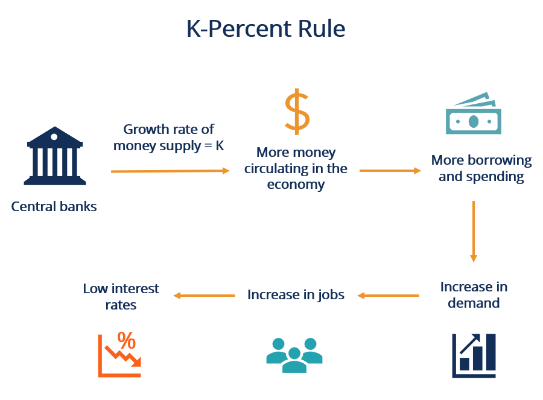

## Table of Contents

## What is monetarism?

Monetarism is an economic theory that focuses on the role of money supply in controlling inflation and influencing economic growth. It suggests that the amount of money circulating in an economy directly affects price levels and economic output. Monetarists believe that by managing the money supply, governments and central banks can stabilize the economy and keep inflation in check. The key idea is that too much money can lead to higher prices, while too little money can slow down economic activity.

A famous economist named Milton Friedman was a big supporter of monetarism. He argued that the central bank should aim for a steady growth rate of the money supply, rather than trying to fine-tune the economy with frequent policy changes. According to Friedman, if the money supply grows at a consistent rate, it helps to create a stable economic environment. This approach contrasts with other theories that focus more on government spending and taxes to manage the economy. Monetarism became very popular in the 1970s and 1980s, influencing the policies of many countries during that time.

## Who are the key figures associated with monetarism?

The main person linked to monetarism is Milton Friedman. He was an economist who believed that controlling the amount of money in an economy was very important. Friedman thought that if the money supply grew at a steady rate, it would help keep the economy stable. He wrote many books and articles about this idea, and his work made monetarism very popular, especially in the 1970s and 1980s.

Another important figure in monetarism is Anna Schwartz. She worked with Friedman on a famous book called "A Monetary History of the United States, 1867-1960." This book showed how changes in the money supply affected the economy over many years. Schwartz's research helped support the ideas of monetarism and made people take the theory more seriously. Together, Friedman and Schwartz had a big impact on how people think about money and the economy.

## How does monetarism differ from Keynesian economics?

Monetarism and Keynesian economics are two different ways of thinking about how to manage an economy. Monetarists, like Milton Friedman, believe that the key to a stable economy is controlling the amount of money in circulation. They think that if the money supply grows at a steady rate, it can help keep prices stable and the economy healthy. Monetarists argue that too much money can cause inflation, while too little money can slow down economic growth. They focus on the role of the central bank in managing the money supply and believe that government should not interfere too much with the economy.

On the other hand, Keynesian economics, named after John Maynard Keynes, focuses more on government spending and taxes to manage the economy. Keynesians believe that during tough economic times, the government should spend more money and cut taxes to boost demand and help the economy recover. They think that the government can play a big role in smoothing out the ups and downs of the economy. Unlike monetarists, Keynesians are less concerned about the money supply and more focused on using fiscal policy to influence economic activity. These two approaches often lead to different policy recommendations and debates about the best way to manage the economy.

## What is the money supply and how is it measured?

The money supply is the total amount of money available in an economy at a certain time. It includes cash, coins, and money in bank accounts that people can use easily. The money supply is important because it affects how much people can spend and how prices change. If there's too much money, prices might go up, which is called inflation. If there's not enough money, spending might slow down, which can hurt the economy.

The money supply is measured in different ways, which are called monetary aggregates. The most common measures are M0, M1, and M2. M0 is the most basic measure and includes only physical money like coins and notes. M1 includes M0 plus money in checking accounts that people can use right away. M2 is a broader measure that includes M1 plus money in savings accounts and other types of accounts that are a bit harder to use quickly. Each of these measures helps economists and policymakers understand how money is moving through the economy.

## What role does the money supply play in monetarist theory?

In monetarist theory, the money supply is very important. Monetarists believe that the amount of money in an economy directly affects prices and economic growth. If there is too much money, prices go up, which is called inflation. If there is too little money, people spend less, and the economy might slow down. Monetarists think that by controlling the money supply, the central bank can keep the economy stable and prevent big changes in prices.

Milton Friedman, a famous monetarist, said that the central bank should make the money supply grow at a steady rate. He believed that if the money supply grows slowly and predictably, it helps the economy stay healthy. This is different from other theories that focus more on government spending and taxes. Monetarists argue that managing the money supply is the best way to keep inflation low and help the economy grow smoothly.

## How do monetarists believe changes in the money supply affect the economy?

Monetarists believe that changes in the money supply have a big effect on the economy. If the money supply grows too quickly, there's more money chasing the same amount of goods and services. This can lead to higher prices, which is called inflation. On the other hand, if the money supply grows too slowly, there's less money for people to spend. This can make the economy slow down because people aren't buying as much.

To keep the economy stable, monetarists think the central bank should control the money supply carefully. They believe the money supply should grow at a steady, predictable rate. This helps keep prices stable and supports steady economic growth. By managing the money supply well, monetarists believe the central bank can prevent big swings in the economy and keep inflation under control.

## What is the quantity theory of money and how does it relate to monetarism?

The quantity theory of money is a simple idea that says the amount of money in an economy affects prices. It says that if you have more money, but the same amount of stuff to buy, prices will go up. This is because more money is chasing the same things. The theory can be summed up in a formula: MV = PQ. Here, M is the money supply, V is how often money changes hands (velocity), P is the price level, and Q is the amount of goods and services (output).

This theory is really important to monetarism. Monetarists, like Milton Friedman, believe that controlling the money supply (M) is the key to keeping the economy stable. They think that if the central bank makes sure the money supply grows at a steady rate, it can help keep prices from going up too fast (inflation) or going down (deflation). By focusing on the money supply, monetarists use the quantity theory of money to guide their ideas about how to manage the economy.

## Can you explain the concept of velocity of money in the context of monetarism?

The velocity of money is how fast money moves around in the economy. It's like counting how many times a dollar bill changes hands in a year. In monetarism, the velocity of money is important because it helps explain how the money supply affects the economy. If money moves quickly, it means people are spending it a lot, and this can make the economy grow faster. But if money moves slowly, it means people are holding onto it, and the economy might slow down.

Monetarists believe that even though the velocity of money can change, it's usually pretty stable over time. They use the quantity theory of money, which says MV = PQ, where V is the velocity. This theory helps them understand how changes in the money supply (M) can affect prices (P) and the amount of stuff produced (Q). By keeping an eye on the velocity, monetarists can better predict how their policies will work and keep the economy on track.

## What are the policy implications of monetarism for central banks?

Monetarism says that central banks should focus on controlling the amount of money in the economy. They should make sure the money supply grows at a steady rate. This helps keep prices stable and stops inflation from getting out of control. Monetarists believe that if the central bank does this well, it can help the economy grow smoothly without big ups and downs.

For central banks, this means they need to be careful about how much money they let into the economy. They can use tools like setting interest rates or buying and selling government bonds to manage the money supply. By doing this, they can keep the economy stable and make sure people's money keeps its value over time. Monetarism tells central banks to be less worried about other things like government spending and more focused on the money supply.

## How has the effectiveness of monetarist policies been debated in economic literature?

The effectiveness of monetarist policies has been debated a lot in economic literature. Some people think that monetarism works well because it focuses on controlling the money supply to keep the economy stable. They say that if the central bank makes sure the money supply grows at a steady rate, it can stop inflation from getting too high and help the economy grow smoothly. These people point to times when countries used monetarist ideas and saw good results, like lower inflation rates.

But others argue that monetarism doesn't always work as well as it should. They say that the economy is more complicated than just the money supply. Things like government spending, taxes, and even people's confidence in the economy can affect how well monetarist policies work. Critics also point out that it's hard for central banks to control the money supply perfectly, and sometimes other factors can mess up their plans. So, while monetarism has had some success, it's not seen as a perfect solution by everyone.

## What are some historical examples where monetarist policies were implemented?

In the 1980s, the United States used monetarist ideas under President Ronald Reagan. The Federal Reserve, led by Paul Volcker, focused on controlling the money supply to fight high inflation. They did this by raising interest rates a lot, which made borrowing more expensive and slowed down the economy. It was tough for a while, but it helped bring inflation down from over 10% to around 3%. This showed that monetarist policies could work to control inflation, even if it was hard on the economy at first.

Another example is the United Kingdom in the early 1980s under Prime Minister Margaret Thatcher. She also used monetarist ideas to fight inflation. The Bank of England tried to keep the money supply growing at a steady rate. They did this by controlling how much money banks could lend. Like in the US, it was a difficult time with high unemployment, but inflation went down. These examples show that monetarist policies can help control inflation, but they can also cause problems like slower economic growth and more people out of work.

## How do modern economic theories critique or build upon monetarist principles?

Modern economic theories have both critiqued and built upon monetarist principles. One big critique is that the economy is more complicated than just the money supply. Economists today think that things like government spending, taxes, and even how people feel about the economy can affect how well monetarist policies work. They also say that it's hard for central banks to control the money supply perfectly because other things can mess up their plans. For example, if people suddenly start saving more money instead of spending it, the economy might slow down even if the money supply is growing at a steady rate.

Despite these critiques, some modern theories have taken ideas from monetarism and added to them. For instance, the New Keynesian school of thought agrees with monetarists that the central bank should play a big role in managing the economy. But they also think that the government should use spending and taxes to help out, especially during tough economic times. Another example is the New Classical economics, which builds on monetarist ideas about how people make decisions based on what they expect to happen in the future. These modern theories show that while monetarism has its limits, its focus on the money supply and the role of the central bank has been important in shaping how we think about the economy today.

## References & Further Reading

[1]: Friedman, M. (1968). ["The Role of Monetary Policy."](https://www.aeaweb.org/aer/top20/58.1.1-17.pdf) The American Economic Review, 58(1), 1-17.

[2]: Volcker, P. A., & Gyohten, T. (1992). ["Changing Fortunes: The World's Money and the Threat to American Leadership."](https://archive.org/details/changingfortunes00paul) Times Books.

[3]: Chaboud, A. P., Chiquoine, B., Hjalmarsson, E., & Vega, C. (2014). ["Rise of the Machines: Algorithmic Trading in the Foreign Exchange Market."](https://www.jstor.org/stable/43612951) The Review of Financial Studies, 27(7), 1931–1963.

[4]: Tsang, M. (2010). ["The Impact of Algorithmic Trading Programs on Financial Markets."](https://www.researchgate.net/publication/378548435_Algorithmic_Trading_and_AI_A_Review_of_Strategies_and_Market_Impact) [PDF] ABC-XYZ Research. 

[5]: Friedman, M., & Schwartz, A. J. (1963). ["A Monetary History of the United States, 1867–1960."](https://www.jstor.org/stable/j.ctt7s1vp) Princeton University Press.

[6]: Narang, R. (2013). ["Inside the Black Box: A Simple Guide to Quantitative and High-Frequency Trading."](https://onlinelibrary.wiley.com/doi/book/10.1002/9781118662717) Wiley.