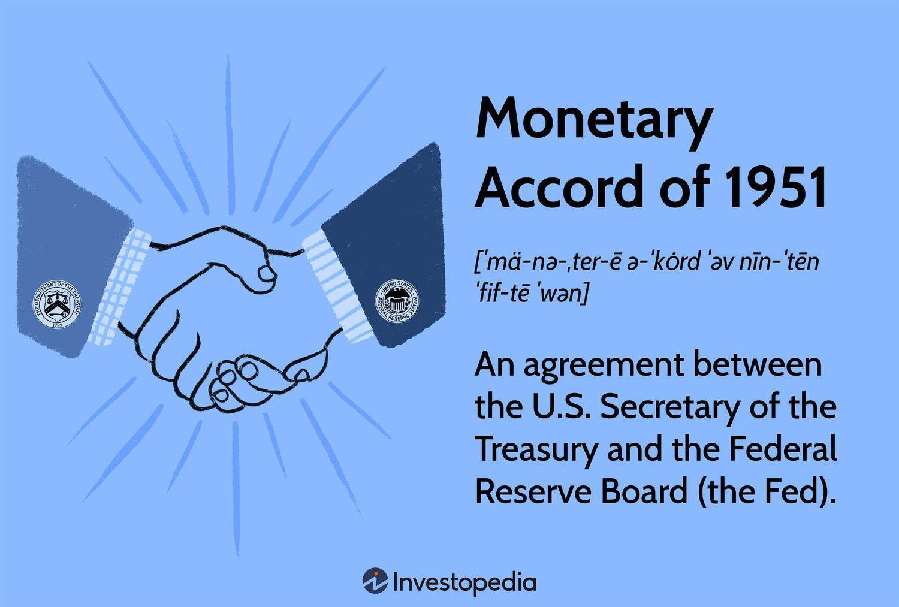

The Federal Reserve, often referred to as the Fed, plays a critical role in the U.S. economy by influencing monetary policy, regulating financial institutions, and ensuring financial system stability. Established in 1913, its primary objectives are to manage inflation, promote maximum employment, and stabilize interest rates. The Fed's actions are crucial in shaping economic performance, as its monetary policies influence lending rates, consumer spending, and overall economic growth.

Economic policy and monetary accords significantly impact economic performance. By setting interest rates and controlling the money supply, the Fed can either stimulate economic activity or cool down an overheating economy. Historical monetary accords, such as the 1951 Accord, are pivotal in defining the Fed's independence and its capacity to manage the nation's monetary policy without excessive political influence. The Accord marked a shift toward a more autonomous Federal Reserve, capable of independently pursuing its goals of stable prices and employment.



In recent decades, the emergence of algorithmic trading marks a new dynamic in economic policy and financial markets. Algorithmic trading uses mathematical models and high-speed data processing to transact in markets at speeds and frequencies human traders cannot match. This technological advancement has revolutionized trading by improving market liquidity and efficiency, yet it also poses challenges in terms of regulation and market stability.

This article aims to connect historical events to contemporary issues by examining the legacy of the 1951 Accord and its lasting influence on current economic policies. It also considers the revolutionary impacts of algorithmic trading, juxtaposing historical policy frameworks with modern technological advancements in financial markets. Key topics included are the 1951 Accord, which underscored the Fed's independence; post-Accord economic policies; and the transformative effects of algorithmic trading. Through this exploration, the article seeks to illuminate how historical decisions continue to shape today's economic landscape and how modern innovations like algorithmic trading require continuous adaptation in policy frameworks.

## Table of Contents

## The Federal Reserve: A Brief History

The Federal Reserve System, established in 1913, marked the United States' response to the frequent financial panics of the late 19th and early 20th centuries. The primary objectives were to create a central bank that could provide the nation with a safe, flexible, and stable monetary and financial system. The Panic of 1907 underscored the need for such an institution, following which the National Monetary Commission was tasked to explore solutions. This led to the Federal Reserve Act signed by President Woodrow Wilson, forming the Federal Reserve System as a decentralized central bank consisting of 12 regional Reserve Banks under a Board of Governors.

In the aftermath of its establishment, the Federal Reserve underwent several key historical milestones. One significant development occurred during the Great Depression of the 1930s, which illustrated the necessity for a stronger federal system to manage the economic crisis. The Banking Act of 1935 restructured the Federal Reserve, enhancing the Federal Open Market Committee's power, which became essential for managing the country's monetary policy. Additionally, World War II placed the Federal Reserve in a critical role of financing war production, with an effort to maintain stable interest rates throughout the war period.

Before 1951, the Federal Reserve encountered various economic events that shaped its operational role. The Great Depression was a crucial period where its initial inaction was criticized, leading to a more proactive stance in future crises. The Fed's response to World War II by pegging Treasury yields to support government borrowing also highlighted its expanded role. However, this pegging of rates eventually led to inflationary pressures, contributing to its need to reclaim monetary control, which would later materialize in the Monetary Accord of 1951.

Over time, there was an evolving perception of the Federal Reserve's responsibility in economic management. Initially seen as a passive entity, the Fed had to adapt and become more active in shaping macroeconomic outcomes. This included addressing economic fluctuations, inflation, and employment—an evolution largely driven by the economic turmoil of the Great Depression and the complex financing demands of World War II.

Pre-1951, the Fed faced significant transition periods and challenges, including balancing its independence with fiscal policies and addressing the post-war economic landscape. One key challenge was its limited ability to curb rising inflation due to its commitment to maintain low interest rates during the wartime and post-war periods, which constrained its policy maneuverability. This led to increased debates on the independence of the monetary policy, eventually culminating in the Federal Reserve-Treasury Accord of 1951, which set the stage for a more autonomous Federal Reserve, redefining its role in the U.S. economic policy framework.

## Monetary Accord of 1951: A Turning Point

The Monetary Accord of 1951 marked a pivotal moment in U.S. economic policy, fundamentally redefining the relationship between the Federal Reserve and the U.S. Treasury. The period leading up to this Accord was characterized by a tension between the necessity for monetary stability and the financing demands of the federal government, particularly in the context of post-World War II economic adjustments and the Korean War.

Initially, the U.S. Treasury requested the Federal Reserve to maintain a low-interest-rate environment to reduce the government's borrowing costs. This policy had been in force since the war to facilitate affordable war financing through debt issuance. However, this approach led to growing inflationary pressures, as the economy was unable to adjust interest rates in response to changing economic conditions.

The Accord, signed on March 4, 1951, effectively freed the Federal Reserve from its obligation to keep interest rates low to support Treasury borrowing. With this new independence, the Fed was able to use [interest rate](/wiki/interest-rate-trading-strategies) adjustments as a tool to control inflation rather than succumbing to fiscal pressures. This marked a significant shift from fiscal dominance, where government economic policies dictated monetary actions, to a more independent monetary policy framework.

The implications of the Accord were profound. By granting the Federal Reserve the autonomy to manage interest rates, the Accord established a precedent for central bank independence, which has become a cornerstone of modern monetary policy. This independence is crucial for maintaining price stability and fostering sustainable economic growth.

In terms of long-term consequences, the Accord laid the groundwork for the Federal Reserve's role in actively managing economic cycles through monetary policy. Without the constraints of fiscal policy, the Fed could focus on its dual mandate of promoting maximum employment and stable prices. This shift also influenced subsequent policy frameworks, including those that emphasize inflation targeting.

The significance of the 1951 Accord extends to modern economic policy frameworks. It underscored the importance of central bank independence in managing macroeconomic stability, a principle that is widely accepted today. By disentangling monetary policy from fiscal policy dependencies, the Accord provided a blueprint for future economic governance that prioritizes inflation control and macroeconomic stability.

## US Economic Policy in the Post-Accord Era

After the pivotal Monetary Accord of 1951, the Federal Reserve's approach to economic policy underwent significant transformations. This landmark agreement established the Federal Reserve's autonomy from the U.S. Treasury, allowing it to pursue a more independent monetary policy that focused on maintaining economic stability and controlling inflation.

In the post-1951 era, one of the most notable changes was the shift towards a more flexible interest rate policy. Prior to the Accord, the Fed had been obliged to keep interest rates low to help finance government expenditures, particularly after World War II. The newly gained independence enabled the Federal Reserve to adjust interest rates in response to changing economic conditions, a practice it continues today. By manipulating the Federal Funds Rate, the Fed could thus influence inflation and economic growth directly.

The era following the Accord also saw the Federal Reserve implementing crucial monetary policies, such as adopting more stringent measures to control inflation during the 1970s. The 1979 appointment of Paul Volcker as Chairman marked a decisive shift towards aggressively combating inflation through high interest rates. His policies, although initially unpopular due to the recession they induced, were instrumental in reducing the rampant inflation of the time.

Throughout the decades, the Federal Reserve faced numerous economic challenges. The oil crises of the 1970s, for example, resulted in stagflation, a perplexing mixture of stagnation and inflation. The Fed responded by focusing on economic indicators beyond just money supply, such as employment and output, to better calibrate its responses.

In assessing the Federal Reserve's strategies over time, it is evident that the institution has evolved to adopt a dual mandate: promoting maximum employment and ensuring price stability. This dual focus has become a hallmark of its policy decisions, adjusting monetary levers to balance these sometimes conflicting goals.

Global events have significantly impacted U.S. economic policy and the operations of the Federal Reserve. The globalization of financial markets has necessitated closer monitoring of international economic trends and necessitates coordination with other central banks. The 2008 financial crisis, originating from the collapse of the housing bubble and leading to a global recession, prompted unprecedented interventions by the Federal Reserve, including the use of quantitative easing to inject [liquidity](/wiki/liquidity-risk-premium) into the financial system.

In conclusion, the post-Accord era of the Federal Reserve is characterized by increased independence in policy-making, adaptive strategies to mitigate inflation, and responsiveness to both domestic and global economic developments. This adaptability remains crucial as the challenges of the modern economic landscape continue to evolve.

## Algorithmic Trading: Revolutionizing Markets

Algorithmic trading refers to the use of computer algorithms to automate the process of buying and selling financial instruments. This technology-driven approach to trading has experienced significant growth and transformation in financial markets. By leveraging advanced computational techniques and systems, [algorithmic trading](/wiki/algorithmic-trading) allows for the execution of complex trading strategies at speeds and frequencies that are unachievable by human traders.

Technological advancement, particularly in computing power and data analytics, has been instrumental in the rise of algorithmic trading. High-frequency trading ([HFT](/wiki/high-frequency-trading-strategies)), a subset of algorithmic trading, capitalizes on algorithms to place a large number of orders at very high speeds. Developments in [machine learning](/wiki/machine-learning) and [artificial intelligence](/wiki/ai-artificial-intelligence) further facilitate the processing and analysis of vast datasets to predict market trends and inform trading decisions.

The impact of algorithmic trading on market dynamics and liquidity is profound. It contributes to increased efficiency and tighter spreads by facilitating rapid execution and higher volumes of trades. However, the presence of algorithms can also lead to unintended consequences such as market [volatility](/wiki/volatility-trading-strategies). Flash crashes, where market prices fall sharply and recover quickly, can be exacerbated by the rapid execution and withdrawal of orders by algorithms.

Regulating algorithmic trading poses significant challenges and requires a delicate balance. Regulatory bodies must ensure market integrity and prevent manipulative practices such as spoofing—where traders place large orders with no intention of execution to influence prices—while promoting innovation and the benefits that algorithmic trading can bring to market efficiency. As a result, financial regulatory authorities worldwide are focusing on implementing safeguards, such as circuit breakers and minimum resting times for orders, to mitigate the risks associated with high-speed trading.

Traditional trading strategies are fundamentally different from algorithmic methods. Human traders rely on their expertise, intuition, and analysis of market indicators, often operating under slower execution times. In contrast, algorithmic trading strategies use pre-programmed instructions based on various parameters such as time, price, [volume](/wiki/volume-trading-strategy), or any mathematical model, enabling trades to occur without human intervention and at microsecond speed. Despite their efficiency and scalability, algorithmic strategies must contend with the complexity and unpredictability of financial markets, prompting continuous enhancements and oversight of their trading algorithms.

Algorithmic trading continues to revolutionize financial markets, fostering both challenges and opportunities. Its continued evolution is closely tied to technological innovations, regulatory developments, and ongoing research into more sophisticated trading models. Understanding the intricacies of algorithmic trading is crucial for market participants and regulators alike to navigate and harness its potential while mitigating associated risks.

## The Intersection of Historical Policy and Modern Trading

Historical monetary policies have played a crucial role in shaping the infrastructure of modern financial markets. The 1951 Treasury-Federal Reserve Accord exemplifies a significant turning point, establishing the Federal Reserve's independence in setting monetary policy and influencing contemporary financial systems.

### Influence of the 1951 Accord on Contemporary Market Structures

The 1951 Accord marked a paradigm shift by freeing the Federal Reserve from the obligation to maintain fixed interest rates for government securities. This newfound autonomy allowed the Fed to pursue policies focused on controlling inflation and stabilizing the economy, rather than financing government debt. The Accord laid the groundwork for developing an independent monetary policy, which is critical for modern financial markets that rely on central banks' credibility and decisiveness.

The Accord's long-lasting impact extends to the present day, as it empowered the Federal Reserve to implement monetary policy tools that directly affect money supply, interest rates, and overall economic activity. This independence is vital in the wake of financial crises, as witnessed in the 2008 financial turmoil, where decisive action by central banks became imperative.

### Role of Algorithmic Trading in Maintaining and Adjusting Economic Policies

Algorithmic trading, the use of computer programs to execute trades at high speed and volume, has transformed market dynamics significantly. Algorithms can rapidly assimilate vast amounts of financial data, allowing for swift adjustments to trade strategies based on economic indicators and policy changes. This capability provides a mechanism for markets to adjust in response to monetary policy shifts efficiently.

From an economic policy perspective, algorithmic trading enhances market liquidity and efficiency, although it also introduces challenges such as market volatility and flash crashes, which can complicate policy implementation. The Federal Reserve and other regulatory bodies are tasked with monitoring and possibly regulating these activities to ensure stable market operations.

### The Federal Reserve's Adjustment to Technological Advancements in Trading

To adapt to the technological evolution represented by algorithmic trading, the Federal Reserve employs sophisticated tools and analyses to comprehend and predict market movements. Enhanced data analytics and high-frequency trading models are key aspects of this adaptation. The Fed’s continuous engagement with these technological advancements ensures that their monetary policies remain effective in managing economic goals without being undermined by rapid and automated trading solutions.

Here's a simple Python code snippet to simulate the basic function of algorithmic trading responding to policy changes:

```python
import random

def simulate_market_reaction(policy_change):
    # Simulate algorithmic trading response to a policy change
    reaction = []
    for _ in range(100):  # Simulating 100 trades
        price_change = random.gauss(mu=policy_change, sigma=1)
        reaction.append(price_change)
    return sum(reaction) / len(reaction)  # Average market reaction

policy_change = 0.5  # Representing a small policy shift
market_reaction = simulate_market_reaction(policy_change)
print("Average Market Reaction:", market_reaction)
```
This code simulates random market reactions and helps understand how algorithms might respond to shifts in economic policy.

### Case Studies Illustrating the Intertwining of Past and Current Economic Frameworks

Several case studies reveal the intricate connections between historical policy directives and contemporary market behavior. For instance, the global financial crisis of 2008 demonstrated how historical central bank policies influenced market reactions to modern challenges. The Federal Reserve's intervention through interest rate adjustments and quantitative easing measures reflected strategies rooted in the historical framework established by the Accord.

Another example is the Covid-19 pandemic, where the Federal Reserve utilized unprecedented monetary policy tools to stabilize the economy. These responses and their impacts underscore the enduring relevance of the 1951 Accord's principles in guiding responses to contemporary crises.

In summary, understanding the interplay between historical monetary policies, such as the 1951 Accord, and modern trading technologies like algorithmic trading is crucial for comprehending today's financial markets. It highlights the Federal Reserve's ongoing efforts to adapt and guide economic policy amidst continually evolving financial landscapes.

## Conclusion

The historical significance of the Federal Reserve and the 1951 Accord lies in the profound transformation of the US monetary framework. Established in 1913, the Federal Reserve System was initially aimed at providing the nation with a safer and more flexible monetary and financial system. Over time, as the nation encountered various economic challenges, the role of the Federal Reserve evolved significantly. The 1951 Treasury-Federal Reserve Accord marked a pivotal moment by establishing the Federal Reserve's independence from the US Treasury, allowing the Fed to set monetary policy focused on economic stability rather than government financing. This independence is crucial for maintaining economic equilibrium and controlling inflation, thus underscoring the Accord's long-lasting influence on fiscal strategies.

Looking forward, the Federal Reserve faces new challenges and opportunities in an increasingly interconnected global economy. Economic policy must adapt to phenomena like globalization, digital currencies, and the impacts of unforeseen global events, such as pandemics. These challenges require a nuanced approach to monetary policy, balancing traditional economic levers with innovative solutions to foster growth and stability.

The evolution of trading technology, specifically algorithmic trading, further adds complexity to the financial landscape. As markets become more dependent on technology, the implications for policy are substantial, raising questions about regulation, market volatility, and systemic risk. Algorithmic trading can enhance market liquidity and efficiency but also presents risks of flash crashes and undue market manipulation, necessitating careful regulatory oversight and adaptive monetary strategies.

Potential areas for further research include the study of historical monetary policies in shaping modern economic systems and the role of technology in influencing these frameworks. By understanding the correlation between past accords and current market dynamics, policymakers and economists can better anticipate and manage future economic challenges.

In conclusion, the interaction between the historical agreements such as the 1951 Accord and contemporary market practices underscores a dynamic relationship that continues to influence and shape US economic and fiscal policies. This ongoing interplay highlights the necessity for ongoing research, adaptive policy-making, and the strategic integration of technological advancements to ensure a robust and resilient economic future.

## References & Further Reading

[1]: ["Inside the Fed: Monetary Policy and Its Management, Martin through Greenspan to Bernanke"](https://www.jstor.org/stable/j.ctt5hhccs.3) by Stephen H. Axilrod

[2]: Hetzel, R. L., & Leach, R. F. (2001). ["After the Accord: Reminiscences on the birth of the modern Fed."](https://www.richmondfed.org/publications/research/economic_quarterly/2001/winter/leachhetzela) Economic Quarterly, Federal Reserve Bank of Richmond.

[3]: ["A History of the Federal Reserve, Volume 1: 1913-1951"](https://www.amazon.com/History-Federal-Reserve-1913-1951/dp/0226520005) by Allan H. Meltzer

[4]: ["Narrative and the Making of US National Security"](https://www.cambridge.org/core/books/narrative-and-the-making-of-us-national-security/796250037A6394BB71A07D197BF5D636) by Ronald R. Krebs

[5]: Aldridge, I. (2009). ["High-Frequency Trading: A Practical Guide to Algorithmic Strategies and Trading Systems"](https://books.google.com/books/about/High_Frequency_Trading.html?id=8QpIsVUMhmEC) by Irene Aldridge

[6]: ["Algorithmic Trading: Winning Strategies and Their Rationale"](https://www.wiley.com/en-us/Algorithmic+Trading%3A+Winning+Strategies+and+Their+Rationale-p-9781118460146) by Ernie Chan