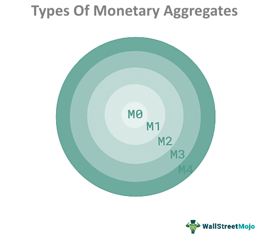

## Table of Contents

## What are monetary aggregates?

Monetary aggregates are measures used by economists and central banks to track the amount of money circulating in an economy. They help in understanding how much money people and businesses have access to, which can influence economic activities like spending and saving. The most common monetary aggregates are labeled as M0, M1, M2, and sometimes M3, each representing different levels of liquidity and types of money.

M0 and M1 are the most liquid forms of money. M0 includes physical currency, like coins and notes, and is the most basic measure of money supply. M1 adds to M0 by including demand deposits, which are the money in checking accounts that people can easily withdraw or use for transactions. M2 expands on M1 by including savings deposits, money market funds, and other time deposits, which are less liquid but still accessible. M3, where used, further includes larger and less liquid assets like institutional money market funds. Understanding these aggregates helps policymakers make decisions about interest rates and other monetary policies to manage economic growth and inflation.

## Why are monetary aggregates important in economics?

Monetary aggregates are important in economics because they help us understand how much money is available in an economy. This is useful for figuring out if people and businesses will spend more or save more. When there's a lot of money around, people might feel confident and spend more, which can help the economy grow. But if there's too much money, it can lead to higher prices, which is called inflation. By keeping an eye on these aggregates, economists and central banks can make better decisions to keep the economy stable.

Central banks use these aggregates to guide their monetary policy. For example, if they see that M2 is growing too fast, they might raise interest rates to slow down spending and control inflation. On the other hand, if money supply is too low and the economy is slowing down, they might lower interest rates to encourage more spending and investment. By adjusting these policies, central banks aim to balance economic growth and keep prices stable, making life easier for everyone in the economy.

## What is the difference between narrow and broad monetary aggregates?

Narrow and broad monetary aggregates are different ways to measure how much money is in an economy. Narrow aggregates, like M0 and M1, focus on money that people can use right away. M0 includes just the cash in people's pockets and wallets, while M1 adds money in checking accounts that you can easily spend. These are very liquid, meaning you can use them quickly for buying things or paying bills.

Broad aggregates, like M2 and sometimes M3, include the narrow aggregates but also add money that's a bit harder to spend right away. M2 includes savings accounts and money market funds, which you can still get to but might take a little more time or have some limits. M3, where used, adds even less liquid assets like larger money market funds. These broader measures give a fuller picture of all the money available in the economy, but they're less about immediate spending and more about overall money supply.

Understanding the difference between narrow and broad aggregates helps economists and central banks see how money is moving around in the economy. Narrow aggregates are good for understanding day-to-day spending, while broad aggregates help see longer-term trends and savings. This information is crucial for making decisions about interest rates and other policies to keep the economy stable and growing.

## Can you explain the components of M1?

M1 is a measure of money that includes the most liquid forms of money, which means it's the money people can use right away. The main part of M1 is physical cash, like the coins and dollar bills you [carry](/wiki/carry-trading) in your wallet. This is called currency in circulation. It's the money that's out there being used by people every day.

The other big part of M1 is called demand deposits. These are the funds you have in your checking account at the bank. You can use this money easily, like when you write a check, use a debit card, or do online banking to pay for things. Together, currency in circulation and demand deposits make up M1, which gives a good picture of the money that's immediately available for spending in the economy.

## How does M2 differ from M1, and what additional components does it include?

M2 is a bigger measure of money than M1. It includes everything in M1, like the cash in your wallet and the money in your checking account. But M2 adds more types of money that are a bit less easy to spend right away. Think of it like savings accounts and money market funds. These are places where you can keep your money, but it might take a little more time or have some rules to get it out.

So, M2 gives a fuller picture of the money in the economy because it includes savings and other types of accounts. While M1 is about the money you can use right now, M2 shows how much money people have saved up too. This helps economists and the people who run the central bank understand how much money is out there and how people are using it, which is important for making decisions about the economy.

## What role do monetary aggregates play in monetary policy?

Monetary aggregates help people who make decisions about money, like central bankers, understand how much money is in the economy. This is important because it tells them if people are likely to spend more or save more. If there's a lot of money, people might spend more, which can make the economy grow. But if there's too much money, it can make prices go up too fast, which we call inflation. By looking at these aggregates, central bankers can decide if they need to do something to control how much money is out there.

For example, if they see that the amount of money, like M2, is growing too fast, they might raise interest rates. This makes borrowing money more expensive, so people and businesses might spend less, which can help slow down inflation. On the other hand, if there's not enough money and the economy is slowing down, they might lower interest rates to make borrowing cheaper. This encourages people to spend more and businesses to invest, which can help the economy grow. By using monetary aggregates to guide their decisions, central bankers try to keep the economy stable and help everyone.

## How are monetary aggregates measured and reported?

Monetary aggregates are measured and reported by central banks and other financial institutions to keep track of how much money is in the economy. They collect data from banks and other places where people keep their money, like savings accounts and money market funds. This data is then added up to see how much money is in different categories, like M1 and M2. M1 includes things like cash and money in checking accounts, while M2 adds savings accounts and other types of money that are a bit harder to spend right away.

Once the data is collected, central banks report these numbers regularly, usually every month or every quarter. They share this information with the public and other economists so everyone can see how much money is out there. This helps people understand if the economy is growing or if prices might go up. By looking at these reports, central banks can decide if they need to change interest rates or do other things to keep the economy running smoothly.

## What are some criticisms of using monetary aggregates as economic indicators?

Some people think that using monetary aggregates to understand the economy can be tricky because these numbers don't always tell the whole story. For example, just because there's a lot of money in the economy doesn't mean people will spend it. They might save it instead, which means the economy might not grow as much as you'd expect. Also, the way people use money has changed over time, like with more electronic payments and online banking. This makes it harder to measure how much money is really out there and being used.

Another problem is that different parts of the economy can react differently to changes in the money supply. For instance, if the central bank adds more money, it might help some businesses grow, but it could also make prices go up too fast. This can be hard to predict and control. So, while monetary aggregates can give us some clues about what's happening in the economy, they're not perfect. Economists often need to look at other things too, like how much people are spending and how many jobs there are, to get a full picture.

## How have definitions of monetary aggregates evolved over time?

The way we measure money in the economy has changed over time. A long time ago, people mostly used cash, so the simplest measure of money, called M0, was just the coins and dollar bills people carried. But as banks and checking accounts became more common, economists started to include money in checking accounts too. This new measure, called M1, gave a better idea of the money people could spend right away. As more ways to save money, like savings accounts and money market funds, became popular, another measure called M2 was created to include these as well. M2 helped show not just the money people were spending but also the money they were saving.

Over the years, the definitions of these measures have been tweaked to better fit how people use money. For example, in some countries, they stopped using M3 because it was too broad and not very useful for making decisions about the economy. Also, as more people started using credit cards and online banking, economists had to think about how to include these new ways of moving money in their measures. This shows that the way we measure money has to keep changing to match how people use it in the real world. By updating these measures, economists can get a clearer picture of what's happening in the economy and make better decisions to help it grow and stay stable.

## What impact do changes in monetary aggregates have on inflation and economic growth?

Changes in monetary aggregates can have a big effect on inflation and economic growth. When the amount of money in the economy, like M1 or M2, goes up a lot, people might start spending more. This can help the economy grow because businesses sell more stuff and might hire more people. But if there's too much money, it can also make prices go up faster than usual, which we call inflation. So, if the central bank sees the money supply growing too fast, they might raise interest rates to slow down spending and keep prices from going up too much.

On the other hand, if the money supply grows too slowly, people might not spend as much. This can make the economy slow down because businesses don't sell as much and might even have to let people go. If the central bank sees this happening, they might lower interest rates to make borrowing money cheaper. This can encourage people to spend more and businesses to invest, which can help the economy start growing again. By watching the changes in monetary aggregates, central banks try to balance economic growth and keep inflation in check, making life easier for everyone.

## How do central banks use monetary aggregates to guide their policy decisions?

Central banks look at monetary aggregates, like M1 and M2, to understand how much money is in the economy. This helps them decide what to do to keep the economy running smoothly. If they see that the amount of money is growing too fast, they might worry about inflation. Inflation is when prices go up too quickly. To stop this, they might raise interest rates. When interest rates go up, borrowing money becomes more expensive, so people and businesses might spend less. This can slow down the economy a bit but also helps keep prices from going up too fast.

On the other hand, if the money supply is growing too slowly, the central bank might worry that the economy is not growing enough. They might lower interest rates to make borrowing cheaper. When borrowing is cheaper, people and businesses might spend more money. This can help the economy grow by getting more people to buy things and businesses to invest. By watching the changes in monetary aggregates, central banks try to find the right balance to keep the economy growing without letting prices get out of control.

## Can you discuss any alternative measures to traditional monetary aggregates used in modern economic analysis?

In modern economic analysis, people sometimes look at other ways to measure money instead of just using the traditional monetary aggregates like M1 and M2. One alternative is to focus on the Divisia monetary aggregates. These measures try to account for how much people value different types of money. For example, people might see money in a checking account as more useful for daily spending than money in a savings account. By giving different weights to different types of money, Divisia aggregates can give a more accurate picture of how much money is really available for spending in the economy.

Another alternative is to use financial indicators that are not directly about money supply but still tell us about the economy. For example, economists might look at credit growth, which shows how much people and businesses are borrowing. If credit is growing fast, it might mean the economy is doing well, but it could also lead to problems if people borrow too much. Another useful indicator is the velocity of money, which measures how quickly money changes hands. If money is moving fast, it can mean people are spending more, which can help the economy grow. By looking at these alternative measures, economists can get a fuller understanding of what's happening in the economy and make better decisions.

## What is the role of money supply in economics?

Money supply significantly impacts economic activity and stability by influencing various economic metrics, including inflation, GDP, and unemployment. The money supply refers to the total amount of monetary assets available in an economy at a specific time. This includes currency in circulation and demand deposits held by the public, among other components. The management and understanding of money supply are fundamental as they serve as key drivers for economic policy decisions, particularly by central banks, which use these measures to ensure economic growth and control inflation.

The relationship between money supply and inflation is of particular interest to economists and policymakers. Generally, an increase in the money supply tends to lead to higher inflation if it surpasses economic output growth. This relationship is grounded in the quantity theory of money, which can be succinctly expressed by the equation: 

$$
MV = PQ
$$

where $M$ is the money supply, $V$ is the velocity of money, $P$ is the price level, and $Q$ is the real GDP. According to this theory, for a given velocity of money, any increase in money supply $M$ will, over the long term, translate into an increase in the price level $P$, provided the economy is operating near full capacity.

The money supply also significantly affects GDP, which can be understood through the lens of the Keynesian economic theory. Changes in the money supply can influence the aggregate demand in the economy. For instance, an increase in money supply typically lowers interest rates, making borrowing cheaper, thus stimulating investment and consumer spending, leading to higher aggregate demand and, consequently, an increase in GDP.

Unemployment is another economic metric intricately linked with money supply. The Phillips Curve illustrates a historical inverse relationship between unemployment and inflation. In the short term, an increase in money supply can lower unemployment since more funds in the economy lead to higher demand for goods and services, resulting in increased production and the need for more workers. However, this relationship might not hold in the long run as inflation expectations adjust.

Central banks play a crucial role in managing money supply to balance these dynamics and achieve macroeconomic stability. They employ several tools, such as open market operations, adjusting interest rates, and changing reserve requirements, to regulate the money supply. For example, reducing interest rates can increase the money supply by making borrowing more attractive, stimulating economic activity. Conversely, increasing interest rates can help reduce inflation by curtailing spending and borrowing.

In summary, money supply is fundamental in shaping the economic landscape. Its careful management by central banks is crucial for maintaining economic stability, controlling inflation, and promoting growth, thus ensuring a well-balanced economy. Understanding these dynamics enables better forecasting of economic trends and more informed policymaking aimed at achieving sustainable economic objectives.

## References & Further Reading

[1]: ["The Economics of Money, Banking, and Financial Markets"](https://www.pearsonhighered.com/assets/preface/0/1/3/4/0134855388.pdf) by Frederic S. Mishkin

[2]: ["Modern Monetary Theory and Practice: An Introductory Text"](https://resources.caih.jhu.edu/textbooks/virtual-library/fetch.php/Modern_Monetary_Theory_And_Practice_An_Introductory_Text.pdf) by William Mitchell, L. Randall Wray, and Martin Watts

[3]: ["Algorithmic Trading and DMA: An Introduction to Direct Access Trading Strategies"](https://www.amazon.com/Algorithmic-Trading-DMA-introduction-strategies/dp/0956399207) by Barry Johnson

[4]: Friedman, B. M. (1988). ["Monetary policy without quantity variables."](https://www.jstor.org/stable/pdf/1818165.pdf) The American Economic Review, 78(2), 440-445.

[5]: Sarr, A., & Lybek, T. (2002). ["Measuring Liquidity in Financial Markets."](https://www.elibrary.imf.org/view/journals/001/2002/232/001.2002.issue-232-en.xml) IMF Working Paper.