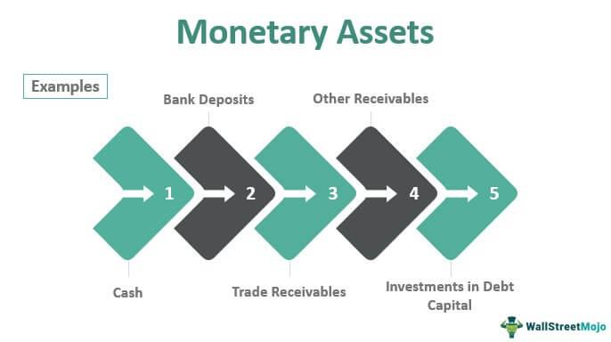

The financial landscape is constantly evolving, manifesting through the intricate dynamics of currency supply, central bank reserves, the monetary base, and algorithmic trading. Understanding these elements is crucial for comprehending the modern economic system's functionalities. Currency supply represents the total monetary assets circulating in an economy, influencing inflation, interest rates, and purchasing power. Central banks, through reserves, play a pivotal role in stabilizing currencies by managing these monetary assets.

Central banks' management of the monetary base, which includes currency in circulation and bank reserves, is foundational for executing monetary policy. These institutions influence economic activities and inflation rates by manipulating components like M0, M1, and M2 money supply aggregates. This regulation ensures economic stability and influences growth trajectories.

Meanwhile, algorithmic trading signifies a revolutionary shift in trading paradigms. By using computer programs to execute trades at exceptional speeds and precision, it has redefined how currencies are traded, presenting unique challenges and opportunities.

The interconnected nature of these elements underscores their influence on financial stability and growth. Central banks' monetary policies directly affect the conditions for algorithmic trading, influencing liquidity and volatility in currency markets. This interaction affects strategic decision-making among traders, reflecting the complex dynamics within financial ecosystems. As we explore these interactions, it becomes evident that understanding these processes is essential for policymakers, investors, and market participants to navigate and thrive in the ever-changing financial environment.

## Table of Contents

## Understanding Currency Supply and Central Bank Reserves

Currency supply is a crucial component of any economy, representing the total amount of monetary assets accessible at a specific time. It encompasses various forms of money, from physical currency like coins and banknotes to digital balances in bank accounts. The management of this supply is typically conducted by a nation's central bank, which plays a significant role in stabilizing the national currency and managing the money supply. 

Central bank reserves are a pivotal aspect of this system. These reserves, often held as foreign exchange reserves, gold reserves, and other assets, are essential for maintaining economic stability. They function as a buffer against financial fluctuations, ensuring that a country can manage exchange rate instabilities and fulfill international financial obligations. Such reserves also allow central banks to regulate the money supply by engaging in open market operations, adjusting interest rates, and setting reserve requirements for financial institutions.

The relationship between currency supply and central bank reserves is critical for sustaining economic balance. By monitoring and controlling these elements, central banks can mitigate economic risks and ensure the seamless execution of domestic and international transactions. This interplay often requires sophisticated strategies to address challenges such as inflation control, exchange rate stabilization, and fostering economic confidence. Central banks might adjust their reserve levels or alter their monetary policy tools to navigate these complexities, ensuring that the currency supply aligns with broader economic objectives.

## The Role of the Monetary Base in Economic Systems

The monetary base, often referred to as high-powered money, is a fundamental element of economic systems, comprising all currency in circulation alongside the reserves held by the central bank. It serves as the foundation upon which economic policies are built and is integral to controlling inflation and influencing economic activity. The monetary base can be broken down into components such as M0, M1, and M2, each representing different levels of [liquidity](/wiki/liquidity-risk-premium) and cash availability.

M0, the narrowest measure, includes only the most liquid assets, namely physical currency and coins in circulation, plus the central bank reserves. M1 expands on this by including demand deposits and other liquid assets like traveler's checks. M2 encompasses M1 while adding savings deposits, time deposits under $100,000, and retail money market mutual funds, offering a broader perspective on the money supply.

Central banks leverage the monetary base to implement monetary policy, which in turn influences the broader economic environment. By adjusting the monetary base, central banks can indirectly control interest rates, impacting the cost of borrowing and the level of economic activity. For instance, an increase in the monetary base typically lowers interest rates, encouraging borrowing and investment, hence stimulating economic growth. Conversely, decreasing the monetary base can help curb inflation by raising interest rates and restraining expenditure.

Through precise management of the monetary base, central banks aim to achieve macroeconomic stability, promoting sustainable economic growth and maintaining price stability. Tools such as open market operations, reserve requirements, and discount rates are employed to manipulate the monetary base effectively.

Understanding the dynamics of the monetary base allows economists and policymakers to forecast economic trends and devise strategies to address potential challenges, ensuring a stable and growth-oriented economic environment.

## Algorithmic Trading: A New Frontier in Currency Markets

Algorithmic trading involves executing trades using computer programs designed to follow predefined criteria. This method contrasts sharply with traditional trading that relies heavily on human intuition and manual execution. The enhancement of speed, cost-efficiency, and precision are among the prominent advantages of [algorithmic trading](/wiki/algorithmic-trading) over traditional methods. 

Algorithmic trading systems are configured to scan vast swaths of market data and execute orders at speeds unattainable by human traders. These systems reduce transaction costs through high-frequency trading and minimize the slippage that often occurs in manually executed trades. The precision with which these algorithms operate enables them to react instantaneously to market changes, optimizing entry and [exit](/wiki/exit-strategy) points based on quantitative data.

In the foreign exchange (Forex) markets, algorithmic trading has introduced significant shifts in how currencies are traded and priced. Forex markets are particularly suited to algorithmic trading due to their liquidity and the 24-hour nature of trading operations. Algorithms can continuously monitor multiple currency pairs, integrating vast amounts of economic indicators and statistical data to identify trading opportunities. 

The impact of algorithmic trading extends to market dynamics, influencing liquidity and pricing structures. By generating large volumes of trades through small orders, algorithms can enhance market liquidity. However, this can also introduce challenges such as increased [volatility](/wiki/volatility-trading-strategies), especially in scenarios where algorithms respond to each other in a feedback loop during market anomalies. 

The use of algorithmic trading in Forex [market making](/wiki/market-making) has also become prevalent. Market makers deploy algorithms to maintain liquidity by continuously offering bids and asks, narrowing spreads and facilitating smoother market functioning. These contributions, while beneficial, require robust risk management strategies to prevent scenarios like flash crashes, where automated trading systems can exacerbate rapid market sell-offs.

In summary, algorithmic trading has transformed traditional Forex trading practices, providing enhanced efficiency and influencing market structures. As the technology behind these algorithms continues to evolve, its role in shaping currency markets will likely expand, necessitating careful consideration of both its advantages and the potential risks it introduces.

## Interplay Between Monetary Policies and Algorithmic Trading

Monetary policies are pivotal in shaping the landscape within which algorithmic trading functions, particularly by influencing liquidity and volatility in currency markets. When central banks make decisions regarding interest rates and money supply, these actions can lead to significant strategic adjustments by traders employing algorithmic models. 

Central banks use [interest rate](/wiki/interest-rate-trading-strategies) policies to control inflation and stimulate economic growth. A change in interest rates affects the cost of borrowing and the incentive to save, which has direct implications for currency values. For instance, an increase in interest rates may lead to an appreciation of the national currency as higher rates attract foreign capital, which increases demand for the currency. Algorithmic trading systems, equipped with algorithms designed to respond instantly to economic indicators, will quickly react to these changes, modifying their trading strategies accordingly. This swift adaptation can amplify market movements, impacting liquidity as trades are executed in rapid succession and potentially increasing market volatility.

The monetary base, comprising currency in circulation and central bank reserves, is another lever through which monetary policy operates. Adjustments to the monetary base directly influence the money supply, altering economic conditions under which trading algorithms function. Central banks might alter the monetary base through open market operations, buying or selling government securities to either inject or withdraw liquidity from the banking system. Such actions can lead to immediate responses from algorithmic traders who have factored these policy shifts into their trading models.

Algorithmic trading changes how market information is processed and acted upon. Traders use complex statistical and [machine learning](/wiki/machine-learning) models to predict market trends based on historical data and anticipated economic policy shifts. For example, an algorithm might employ a regression model to predict the exchange rate $E$ based on changes in interest rates $r$ and money supply $M$:

$$
E = \alpha + \beta_1 r + \beta_2 M + \epsilon
$$

where $\alpha$ is the intercept, $\beta_1$ and $\beta_2$ are coefficients representing the sensitivity of the exchange rate to changes in interest rate and money supply, respectively, and $\epsilon$ is the error term. An instantaneous calculation and execution of trades based on this formula demonstrate the capability of algorithms to respond to central bank announcements and other market-moving information faster than human traders.

The interaction between monetary policies and algorithmic trading creates a multifaceted dynamic in modern financial ecosystems. Algorithmic trading contributes to market efficiency by narrowing bid-ask spreads and providing liquidity, yet it also brings risks such as heightened volatility or flash crashes, which occur when algorithms trigger massive sell-offs in a short time frame. As algorithms account for a substantial portion of trading activities, the regulatory environment must continuously evolve to manage the risks inherent in fast-paced, automated trading environments.

In conclusion, the relationship between monetary policies and algorithmic trading is complex and influential, highlighting the need for comprehensive understanding and strategic adaptability in both the implementation of monetary policies and the development of trading algorithms. These interactions represent the modern financial landscape, where technology and economic policy increasingly intersect.

## Challenges and Opportunities in Modern Economic Management

The convergence of technology and finance has transformed the landscape of modern economic management, presenting both substantial challenges and promising opportunities. One of the most prominent advancements, algorithmic trading, has significantly enhanced the efficiency of financial markets by allowing trades to be executed at speeds and volumes unattainable to human traders. It streamlines processes, reduces costs, and increases precision through the use of complex algorithms and vast data sets.

Despite its advantages, algorithmic trading introduces several risks that need careful management. One of the most notable risks is the potential for 'flash crashes', which are extremely rapid market crashes typically followed by a quick recovery. These events can be caused by algorithms executing trades based on erroneous signals or interactions leading to a cascade of automated selling. Such instances were highlighted by the 'Flash Crash' of May 6, 2010, when the Dow Jones Industrial Average plunged about 1,000 points in mere minutes before rebounding quickly [source: SEC.gov].

Moreover, systemic vulnerabilities become more pronounced as market dynamics are increasingly dominated by machines. Algorithms operating under similar parameters might react similarly to certain market stimuli, exacerbating volatility during periods of stress. This herding behavior can lead to market instability, where the entire system is susceptible to shocks due to homogeneous trading strategies.

Addressing these challenges requires a delicate balance between fostering innovation and implementing robust regulatory frameworks. Regulators and market participants need to understand and manage the risks associated with high-frequency trading and other automated strategies. Enhancing transparency and establishing circuit breakers—mechanisms that pause trading if a market index falls too significantly too quickly—are steps towards mitigating risks without stifling technological innovation.

The opportunities brought about by the integration of technology into finance are vast. Developments in [artificial intelligence](/wiki/ai-artificial-intelligence) and machine learning can improve predictive analytics for better market forecasts and risk assessments. Additionally, blockchain technology presents opportunities for increased transparency and reduced transaction times in financial markets, fundamentally altering how trades are settled and recorded.

Ultimately, the goal is to create a financial ecosystem that harnesses technological advancements to benefit all market participants while maintaining the systems' integrity and stability. Ongoing dialogue between regulators, financial institutions, and technology developers is crucial to ensure that innovation contributes positively to economic management and does not compromise market stability.

## Conclusion

The interconnectedness of currency supply, central bank reserves, the monetary base, and algorithmic trading underscores the complexity of modern economies. Each component plays a pivotal role in shaping the financial landscape. Currency supply, as the aggregate of monetary assets, directly influences inflation rates and purchasing power. Central bank reserves act as a stabilizing force, providing necessary liquidity and ensuring confidence in national currencies.

The monetary base, comprising elements such as M0, M1, and M2, lays the foundation for economic activity. Central banks adjust the monetary base to control inflation and stimulate growth through instruments like open market operations and interest rate adjustments. This manipulation is crucial for maintaining economic stability.

Algorithmic trading introduces a technological dimension to currency markets, enhancing trading efficiency and precision. By employing complex algorithms, financial institutions can execute trades at lightning speed while minimizing human error. However, this innovation does not come without risks. Events like flash crashes demonstrate the potential for systemic vulnerabilities within algorithmic systems.

Understanding these elements is vital for policymakers, investors, and market participants to navigate and thrive in a rapidly changing financial environment. Policymakers must anticipate the repercussions of their decisions on algorithmic trading dynamics, while investors need to comprehend the macroeconomic indicators influenced by currency supply and central bank policies.

As financial technologies continue to evolve, ongoing research and adaptive strategies will be essential in maintaining economic equilibrium. Innovation in trading technologies must be balanced with effective regulatory frameworks to mitigate risks and harness benefits. Data analytics, machine learning, and other technological advances will likely play an increasing role in economic management, prompting a need for continued vigilance and adaptation in policy formulation. This proactive approach will be critical to sustaining stable and resilient economic systems amidst ongoing change.

## References & Further Reading

[1]: Bergstra, J., Bardenet, R., Bengio, Y., & Kégl, B. (2011). ["Algorithms for Hyper-Parameter Optimization."](https://papers.nips.cc/paper/4443-algorithms-for-hyper-parameter-optimization) Advances in Neural Information Processing Systems 24.

[2]: ["Advances in Financial Machine Learning"](https://www.amazon.com/Advances-Financial-Machine-Learning-Marcos/dp/1119482089) by Marcos Lopez de Prado

[3]: ["Evidence-Based Technical Analysis: Applying the Scientific Method and Statistical Inference to Trading Signals"](https://onlinelibrary.wiley.com/doi/book/10.1002/9781118268315) by David Aronson

[4]: ["Machine Learning for Algorithmic Trading"](https://github.com/stefan-jansen/machine-learning-for-trading) by Stefan Jansen

[5]: ["Quantitative Trading: How to Build Your Own Algorithmic Trading Business"](https://www.amazon.com/Quantitative-Trading-Build-Algorithmic-Business/dp/1119800064) by Ernest P. Chan

[6]: Gsell, Markus. ["Algorithmic Trading Strategies"](https://www.econstor.eu/bitstream/10419/43250/1/606199632.pdf) (2010). Springer.  

[7]: Mishkin, Frederic S. ["The Economics of Money, Banking, and Financial Markets"](https://www.pearsonhighered.com/assets/preface/0/1/3/4/0134855388.pdf) (2023). Pearson Series in Economics.