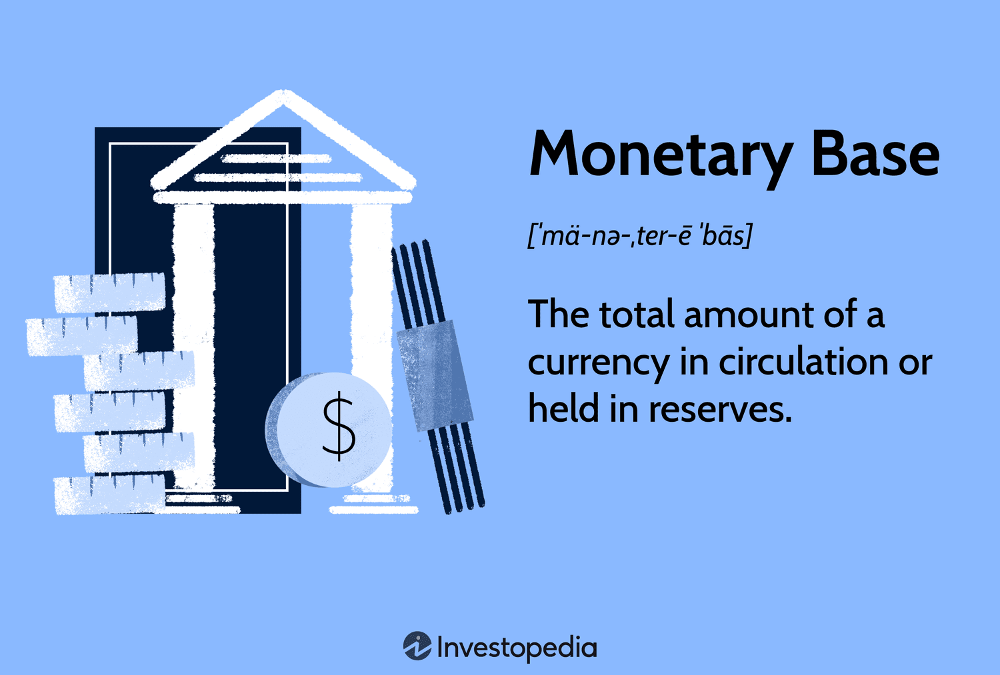

## Table of Contents

## What is the monetary base?

The monetary base is the total amount of a currency that is either in circulation in the hands of the public or in the form of reserves held by banks at the central bank. It includes physical money like coins and banknotes, as well as the reserves that banks keep at the central bank. Think of it as the foundation of a country's money supply, which the central bank can control to influence the economy.

When the central bank wants to increase the monetary base, it can do things like printing more money or buying government bonds. This is often done to stimulate the economy by making more money available for spending and investment. On the other hand, if the central bank wants to decrease the monetary base, it might take actions like raising interest rates or selling government bonds, which can help to slow down the economy and control inflation.

## What are the main components of the monetary base?

The monetary base is made up of two main parts: currency in circulation and bank reserves. Currency in circulation is all the physical money that people use every day, like coins and banknotes. This is the money that you can touch and use to buy things at stores or from other people.

Bank reserves are the money that banks keep at the central bank. Banks need to have some money at the central bank to meet their daily needs and to follow the rules set by the central bank. These reserves can be used by banks to settle transactions with each other or to withdraw cash for their customers. Together, these two parts make up the total amount of the monetary base, which is important for the overall money supply in the economy.

## How does the central bank influence the monetary base?

The central bank can change the monetary base in a few ways. One way is by printing more money or taking money out of circulation. When the central bank prints more money, it adds to the amount of currency that people can use every day. This can help make the economy grow because people have more money to spend. On the other hand, if the central bank takes money out of circulation, there's less money for people to use, which can slow down the economy.

Another way the central bank influences the monetary base is by changing the amount of reserves that banks have to keep at the central bank. If the central bank wants to increase the monetary base, it can buy things like government bonds from banks. When the central bank does this, it pays the banks with new money, which increases their reserves. This gives banks more money to lend to people and businesses. If the central bank wants to decrease the monetary base, it can sell government bonds to banks, which takes money out of the banks' reserves. This makes banks have less money to lend, which can help control inflation.

## What is the difference between the monetary base and money supply?

The monetary base and the money supply are related but different. The monetary base is like the foundation of money in an economy. It includes all the cash that people use every day, like coins and banknotes, plus the money that banks keep at the central bank. Think of it as the starting point of money in the economy.

The money supply, on the other hand, is much broader. It includes not only the monetary base but also other forms of money that people and businesses use. This can include money in checking and savings accounts, which people can use to make payments or withdrawals. The money supply is bigger than the monetary base because banks can lend out the money they have in their reserves, creating more money in the economy through a process called the money multiplier.

## Can you explain the role of currency in circulation within the monetary base?

Currency in circulation is a big part of the monetary base. It's all the physical money that people use every day, like coins and banknotes. When you go to a store and buy something with cash, you're using currency in circulation. This part of the monetary base is important because it's the money that people can touch and use directly. The central bank controls how much of this currency is out there by printing more money or taking some out of circulation.

The amount of currency in circulation can affect the economy. If there's more currency in circulation, people have more money to spend, which can help the economy grow. But if there's too much, it can lead to inflation, where prices go up because there's too much money chasing too few goods. On the other hand, if there's less currency in circulation, people might have less money to spend, which can slow down the economy. So, the central bank has to balance how much currency is out there to keep the economy stable.

## What are reserve balances and how do they contribute to the monetary base?

Reserve balances are the money that banks keep at the central bank. Banks need these reserves to do things like settle transactions with other banks and make sure they have enough money to give to their customers when they want to take out cash. The central bank sets rules about how much money banks need to keep in reserve, which helps control how much money is available in the economy.

These reserve balances are a big part of the monetary base because they add to the total amount of money that the central bank can control. When the central bank wants to increase the monetary base, it can buy things like government bonds from banks and pay them with new money, which adds to their reserve balances. If the central bank wants to decrease the monetary base, it can sell government bonds to banks, which takes money out of their reserves. So, reserve balances help the central bank manage the overall money supply and keep the economy stable.

## How do open market operations affect the monetary base?

Open market operations are when the central bank buys or sells government bonds to change the amount of money in the economy. When the central bank wants to increase the monetary base, it buys government bonds from banks. It pays for these bonds by adding new money to the banks' reserves at the central bank. This means there's more money in the system, and banks can lend more to people and businesses, which can help the economy grow.

On the other hand, if the central bank wants to decrease the monetary base, it sells government bonds to banks. When banks buy these bonds, they have to pay the central bank with money from their reserves. This takes money out of the system, so banks have less to lend. By doing this, the central bank can slow down the economy and help control inflation.

## What is the significance of the monetary base in monetary policy?

The monetary base is really important for the central bank when it's trying to control the economy. It's like the starting point of all the money in the economy. The central bank can change the monetary base by printing more money or taking some out of circulation, and by changing how much money banks have to keep at the central bank. When the central bank wants to help the economy grow, it can make the monetary base bigger. This gives people and businesses more money to spend and invest. But if the economy is growing too fast and prices are going up too much, the central bank can make the monetary base smaller to slow things down.

The way the central bank changes the monetary base is through things like open market operations. This is when the central bank buys or sells government bonds. If it buys bonds, it pays banks with new money, which makes the monetary base bigger. If it sells bonds, it takes money out of the banks' reserves, which makes the monetary base smaller. By doing this, the central bank can control how much money is in the economy and help keep things stable. So, the monetary base is a key tool for the central bank to manage the economy and keep it on track.

## How does quantitative easing impact the components of the monetary base?

Quantitative easing is when the central bank buys a lot of bonds and other financial stuff to put more money into the economy. When the central bank does this, it pays banks with new money, which goes into their reserves at the central bank. This makes the reserve balances part of the monetary base bigger. So, the main way quantitative easing affects the monetary base is by increasing the amount of money that banks have in their reserves.

This increase in reserve balances can help the economy because banks can lend more money to people and businesses. When banks lend more, it can help the economy grow because there's more money for people to spend and invest. But, quantitative easing doesn't usually change the amount of currency in circulation directly. That's the physical money like coins and banknotes that people use every day. So, while quantitative easing makes the monetary base bigger by adding to bank reserves, it doesn't usually affect the cash that people [carry](/wiki/carry-trading) around.

## Can you provide examples of how changes in the monetary base have historically influenced economies?

In the United States during the Great Recession of 2007-2009, the Federal Reserve used quantitative easing to increase the monetary base. They did this by buying a lot of government bonds and other financial stuff from banks. This put more money into the banks' reserves, which made the monetary base bigger. The goal was to help the economy recover by giving banks more money to lend to people and businesses. It worked to some extent, as it helped stop the economy from getting worse and eventually helped it start growing again, but it took time and other actions to fully recover.

Another example is Japan in the 1990s and early 2000s. Japan faced a long period of slow economic growth, known as the "Lost Decade." The Bank of Japan tried to help by increasing the monetary base. They did this by lowering interest rates and buying government bonds. The idea was to put more money into the economy so people would spend more and businesses would invest more. But, even though the monetary base grew, it didn't help the economy as much as hoped. This showed that just increasing the monetary base isn't always enough to fix big economic problems.

## What are the potential risks associated with expanding the monetary base?

Expanding the monetary base can lead to inflation. When the central bank puts more money into the economy, people have more money to spend. If there are too many dollars chasing the same amount of goods and services, prices can go up. This is called inflation, and if it gets too high, it can make life harder for people because their money doesn't go as far. It can also make it tough for the central bank to control the economy because once inflation starts, it can be hard to stop.

Another risk is that expanding the monetary base might not help the economy as much as hoped. If people and businesses don't want to spend or invest the extra money, it can just sit in bank accounts. This is called the "[liquidity](/wiki/liquidity-risk-premium) trap," where even though there's more money, it doesn't get used to help the economy grow. If the central bank keeps adding more money without seeing results, it can lead to problems down the road, like making it harder to control inflation later.

## How do different economic theories interpret the effects of changes in the monetary base?

Some economic theories, like monetarism, believe that changes in the monetary base have a big impact on the economy. Monetarists think that if the central bank increases the monetary base, it will lead to more spending and investment because people have more money. They believe this can help the economy grow, but if the central bank increases the monetary base too much, it can cause inflation. Monetarists argue that the central bank should control the growth of the monetary base carefully to keep the economy stable.

Other theories, like Keynesian economics, have a different view. Keynesians think that changes in the monetary base might not always help the economy as much as monetarists believe. They say that if people are worried about the future, they might not spend the extra money even if the central bank increases the monetary base. This can lead to a situation called a liquidity trap, where the economy doesn't grow even with more money. Keynesians believe that the central bank should use other tools, like government spending, along with changes in the monetary base to help the economy.

## What is the interplay between monetary policies and algorithmic trading?

Monetary policies are pivotal in shaping the landscape within which [algorithmic trading](/wiki/algorithmic-trading) functions, particularly by influencing liquidity and [volatility](/wiki/volatility-trading-strategies) in currency markets. When central banks make decisions regarding interest rates and money supply, these actions can lead to significant strategic adjustments by traders employing algorithmic models. 

Central banks use [interest rate](/wiki/interest-rate-trading-strategies) policies to control inflation and stimulate economic growth. A change in interest rates affects the cost of borrowing and the incentive to save, which has direct implications for currency values. For instance, an increase in interest rates may lead to an appreciation of the national currency as higher rates attract foreign capital, which increases demand for the currency. Algorithmic trading systems, equipped with algorithms designed to respond instantly to economic indicators, will quickly react to these changes, modifying their trading strategies accordingly. This swift adaptation can amplify market movements, impacting liquidity as trades are executed in rapid succession and potentially increasing market volatility.

The monetary base, comprising currency in circulation and central bank reserves, is another lever through which monetary policy operates. Adjustments to the monetary base directly influence the money supply, altering economic conditions under which trading algorithms function. Central banks might alter the monetary base through open market operations, buying or selling government securities to either inject or withdraw liquidity from the banking system. Such actions can lead to immediate responses from algorithmic traders who have factored these policy shifts into their trading models.

Algorithmic trading changes how market information is processed and acted upon. Traders use complex statistical and [machine learning](/wiki/machine-learning) models to predict market trends based on historical data and anticipated economic policy shifts. For example, an algorithm might employ a regression model to predict the exchange rate $E$ based on changes in interest rates $r$ and money supply $M$:

$$
E = \alpha + \beta_1 r + \beta_2 M + \epsilon
$$

where $\alpha$ is the intercept, $\beta_1$ and $\beta_2$ are coefficients representing the sensitivity of the exchange rate to changes in interest rate and money supply, respectively, and $\epsilon$ is the error term. An instantaneous calculation and execution of trades based on this formula demonstrate the capability of algorithms to respond to central bank announcements and other market-moving information faster than human traders.

The interaction between monetary policies and algorithmic trading creates a multifaceted dynamic in modern financial ecosystems. Algorithmic trading contributes to market efficiency by narrowing bid-ask spreads and providing liquidity, yet it also brings risks such as heightened volatility or flash crashes, which occur when algorithms trigger massive sell-offs in a short time frame. As algorithms account for a substantial portion of trading activities, the regulatory environment must continuously evolve to manage the risks inherent in fast-paced, automated trading environments.

In conclusion, the relationship between monetary policies and algorithmic trading is complex and influential, highlighting the need for comprehensive understanding and strategic adaptability in both the implementation of monetary policies and the development of trading algorithms. These interactions represent the modern financial landscape, where technology and economic policy increasingly intersect.

## References & Further Reading

[1]: Bergstra, J., Bardenet, R., Bengio, Y., & Kégl, B. (2011). ["Algorithms for Hyper-Parameter Optimization."](https://papers.nips.cc/paper/4443-algorithms-for-hyper-parameter-optimization) Advances in Neural Information Processing Systems 24.

[2]: ["Advances in Financial Machine Learning"](https://www.amazon.com/Advances-Financial-Machine-Learning-Marcos/dp/1119482089) by Marcos Lopez de Prado

[3]: ["Evidence-Based Technical Analysis: Applying the Scientific Method and Statistical Inference to Trading Signals"](https://onlinelibrary.wiley.com/doi/book/10.1002/9781118268315) by David Aronson

[4]: ["Machine Learning for Algorithmic Trading"](https://github.com/stefan-jansen/machine-learning-for-trading) by Stefan Jansen

[5]: ["Quantitative Trading: How to Build Your Own Algorithmic Trading Business"](https://www.amazon.com/Quantitative-Trading-Build-Algorithmic-Business/dp/1119800064) by Ernest P. Chan

[6]: Gsell, Markus. ["Algorithmic Trading Strategies"](https://www.econstor.eu/bitstream/10419/43250/1/606199632.pdf) (2010). Springer.  

[7]: Mishkin, Frederic S. ["The Economics of Money, Banking, and Financial Markets"](https://www.pearsonhighered.com/assets/preface/0/1/3/4/0134855388.pdf) (2023). Pearson Series in Economics.