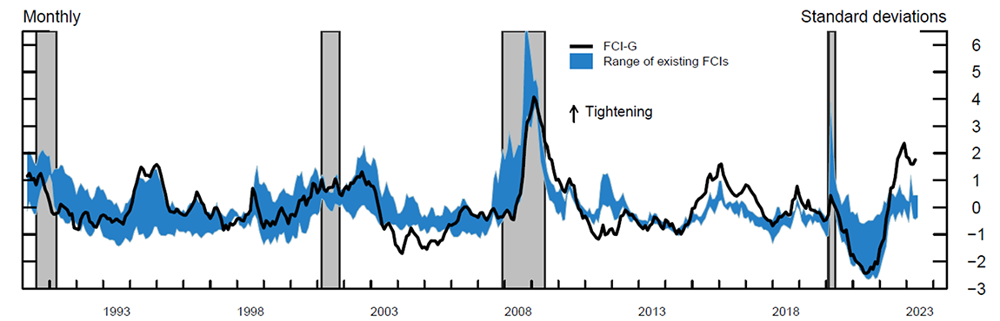

## Table of Contents

## What is the Monetary Conditions Index (MCI)?

The Monetary Conditions Index (MCI) is a tool used by economists and policymakers to measure the overall tightness or looseness of a country's monetary policy. It combines two main factors: interest rates and the exchange rate. By looking at these two elements together, the MCI gives a clearer picture of how monetary conditions are affecting the economy. If the MCI shows that conditions are tight, it means that borrowing costs are high and the currency is strong, which can slow down economic activity. On the other hand, if the MCI indicates loose conditions, borrowing is cheaper and the currency is weaker, which can stimulate the economy.

The MCI is useful because it helps central banks make better decisions about whether to raise or lower interest rates. For example, if the MCI shows that monetary conditions are too tight and might hurt economic growth, the central bank might decide to lower interest rates to make borrowing easier. Conversely, if the MCI suggests that conditions are too loose and might lead to inflation, the central bank might raise interest rates to cool down the economy. By using the MCI, policymakers can get a quick snapshot of the monetary environment and adjust their policies accordingly to keep the economy stable.

## Why was the Monetary Conditions Index developed?

The Monetary Conditions Index (MCI) was developed to help central banks and economists understand the overall impact of monetary policy on the economy more easily. Before the MCI, people mainly looked at interest rates to figure out if money was easy or hard to borrow. But interest rates alone don't tell the whole story because the value of a country's currency also affects how much things cost and how much people want to spend. The MCI was created to combine these two important factors - interest rates and the exchange rate - into one easy-to-understand number.

By using the MCI, policymakers can quickly see if their monetary policy is too tight, which might slow down the economy, or too loose, which might cause prices to rise too quickly. This helps them make better decisions about whether to raise or lower interest rates. The MCI was a big step forward because it gave a clearer and more complete picture of how monetary policy was working, making it easier for central banks to keep the economy stable and growing at a healthy pace.

## What are the main components of the MCI?

The Monetary Conditions Index (MCI) has two main parts: interest rates and the exchange rate. Interest rates show how much it costs to borrow money. When interest rates are high, borrowing money becomes more expensive, and people and businesses might spend less. When interest rates are low, borrowing is cheaper, and people might spend more. The exchange rate is about how much a country's money is worth compared to other countries' money. If a country's currency is strong, it can make things from other countries cheaper to buy, but it can also make the country's own products more expensive for others to buy.

By combining these two parts, the MCI gives a clear picture of how easy or hard it is to borrow and spend money in a country. If the MCI shows that conditions are tight, it means high interest rates and a strong currency, which can slow down the economy. If the MCI shows loose conditions, it means low interest rates and a weak currency, which can help the economy grow faster. This helps central banks decide if they need to change interest rates to keep the economy balanced.

## How does the MCI help in understanding economic conditions?

The Monetary Conditions Index (MCI) helps people understand how easy or hard it is to borrow and spend money in a country. It does this by looking at two important things: interest rates and the exchange rate. Interest rates tell us how much it costs to borrow money. If they are high, borrowing is expensive, and people might spend less. If they are low, borrowing is cheap, and people might spend more. The exchange rate shows how much a country's money is worth compared to other countries' money. A strong currency can make things from other countries cheaper but can make the country's own products more expensive for others to buy.

By combining these two pieces of information, the MCI gives a clear picture of the overall tightness or looseness of money in the economy. If the MCI shows that conditions are tight, it means high interest rates and a strong currency, which can slow down the economy. This might make central banks think about lowering interest rates to help the economy grow. If the MCI shows loose conditions, it means low interest rates and a weak currency, which can help the economy grow faster. This might make central banks think about raising interest rates to keep prices from rising too quickly. So, the MCI helps central banks make smart choices about interest rates to keep the economy stable and growing at a healthy pace.

## What is the formula used to calculate the MCI?

The formula for the Monetary Conditions Index (MCI) is pretty simple. It combines two things: the [interest rate](/wiki/interest-rate-trading-strategies) and the exchange rate. The basic idea is to show how changes in these two things affect the economy. The formula looks like this: MCI = Interest Rate + (Weight x Change in Exchange Rate). The weight part is there because changes in the exchange rate might not affect the economy as much as changes in interest rates. So, we use a number, called a weight, to make the exchange rate part of the formula match how much it really matters.

To use this formula, you start with the current interest rate. Then, you figure out how much the exchange rate has changed from a starting point. You multiply that change by the weight, and add it to the interest rate. The weight is usually a number between 0 and 1, decided by people who study the economy. They pick this number based on how much they think the exchange rate affects things like how much people spend and how much businesses invest. By using this formula, the MCI gives a quick and easy way to see if money is tight or loose in the economy.

## How do interest rates affect the MCI?

Interest rates are a big part of the Monetary Conditions Index (MCI). They show how much it costs to borrow money. When interest rates go up, borrowing money becomes more expensive. This can make people and businesses spend less because they have to pay more to borrow. When interest rates go down, borrowing money is cheaper, and people might spend more because it's easier to get loans. So, when you calculate the MCI, the interest rate part tells you if money is easy or hard to borrow.

In the MCI formula, the interest rate is added directly to the weighted change in the exchange rate. If the interest rate is high, it makes the MCI number bigger, which means money is tight. If the interest rate is low, it makes the MCI number smaller, which means money is loose. This helps people who make decisions about the economy know if they need to change interest rates to help the economy grow or to stop prices from going up too fast.

## How does the exchange rate influence the MCI?

The exchange rate is a key part of the Monetary Conditions Index (MCI). It shows how much a country's money is worth compared to other countries' money. When the exchange rate changes, it can affect how much people spend and how much businesses invest. If a country's currency gets stronger, things from other countries become cheaper, but the country's own products become more expensive for others to buy. This can slow down the economy because people might spend less on things made at home. On the other hand, if the currency gets weaker, things from other countries become more expensive, but the country's own products become cheaper for others to buy. This can help the economy grow because people might spend more on things made at home.

In the MCI formula, the change in the exchange rate is multiplied by a weight and then added to the interest rate. This weight is a number that shows how much the exchange rate affects the economy compared to the interest rate. If the exchange rate goes up a lot and the weight is high, it can make the MCI number bigger, which means money is tight. If the exchange rate goes down a lot and the weight is high, it can make the MCI number smaller, which means money is loose. This helps people who make decisions about the economy understand if they need to change interest rates to keep the economy balanced.

## Can the MCI be used to predict economic trends?

The Monetary Conditions Index (MCI) can help predict economic trends by giving a quick look at how tight or loose money is in the economy. It uses interest rates and the exchange rate to show if borrowing money is easy or hard. If the MCI shows that money is tight, it might mean the economy will slow down because people and businesses will spend less. If the MCI shows that money is loose, it might mean the economy will grow faster because borrowing is cheaper and people might spend more.

However, the MCI is not perfect for predicting economic trends. It's just one tool, and it doesn't look at everything that can affect the economy, like how much people want to spend or how much businesses want to invest. Also, the weight used in the MCI formula can change, and different countries might use different weights. So, while the MCI can give a good hint about what might happen next in the economy, it's best used with other tools and information to make the best guesses about future economic trends.

## What are the limitations of using the MCI?

The Monetary Conditions Index (MCI) has some limits that people need to know about. It only looks at two things: interest rates and the exchange rate. But the economy is affected by many other things too, like how much people want to spend, how much businesses want to invest, and what's happening in the world. So, the MCI can't tell the whole story about the economy. Also, the weight used in the MCI formula can be hard to decide. Different countries might use different weights, and even the same country might change the weight over time. This makes it tricky to compare the MCI between different countries or over long periods of time.

Another problem with the MCI is that it can be hard to predict how the economy will react to changes in interest rates and the exchange rate. Sometimes, the economy might not respond the way the MCI says it should. For example, even if the MCI shows that money is tight, the economy might still grow because people feel confident and want to spend more. Or, if the MCI shows that money is loose, the economy might not grow as much if people are worried and want to save their money. So, while the MCI can give a good hint about what might happen next in the economy, it's best used with other tools and information to make the best guesses about future economic trends.

## How do different countries adapt the MCI to their specific economic contexts?

Different countries adapt the Monetary Conditions Index (MCI) to fit their own economic situations by changing the weight they use in the formula. The weight shows how much the exchange rate matters compared to the interest rate. For example, a country that does a lot of trade with other countries might use a higher weight for the exchange rate because changes in the value of their money can really affect their economy. On the other hand, a country that doesn't trade much might use a lower weight for the exchange rate and focus more on interest rates.

Countries also look at other things that matter to their economy when using the MCI. For instance, some countries might pay more attention to how much people are spending or how much businesses are investing. They might use the MCI along with other tools to get a better picture of their economy. By tweaking the MCI to fit their own needs, countries can make better decisions about their monetary policy and help their economy grow in a healthy way.

## What are some alternative indices to the MCI and how do they compare?

One alternative to the Monetary Conditions Index (MCI) is the Taylor Rule. The Taylor Rule is a formula that helps central banks decide what interest rates should be. It looks at things like how much prices are going up (inflation) and how much the economy is growing. The Taylor Rule is different from the MCI because it doesn't use the exchange rate. It focuses more on keeping inflation at a good level and making sure the economy grows at a healthy pace. So, while the MCI gives a quick look at how tight or loose money is, the Taylor Rule helps set interest rates to meet specific goals.

Another alternative is the Financial Conditions Index (FCI). The FCI looks at a lot more things than just interest rates and the exchange rate. It includes things like stock prices, how easy it is to borrow money, and how much people are willing to take risks. The FCI tries to give a bigger picture of the economy by looking at all these different parts. Compared to the MCI, the FCI is more detailed but can also be more complicated to use. The MCI is simpler and easier to understand, but it might not show as much about the economy as the FCI does.

Both the Taylor Rule and the FCI have their own strengths and weaknesses. The Taylor Rule is good for setting interest rates based on clear goals, but it doesn't consider the exchange rate. The FCI gives a more complete picture of the economy, but it can be harder to use because it looks at so many things. The MCI is in the middle - it's easier to understand than the FCI and includes the exchange rate, which the Taylor Rule doesn't. So, depending on what a country needs, they might choose one of these tools or use them together to make the best decisions for their economy.

## How has the use of the MCI evolved in recent economic policy and research?

The use of the Monetary Conditions Index (MCI) has changed over time in how it's used in economic policy and research. At first, the MCI was a big help for central banks because it gave them a quick and easy way to see if money was tight or loose. But as time went on, people started to see that the MCI had some limits. It only looked at interest rates and the exchange rate, and didn't consider other important things like how much people were spending or what was happening in the world. So, central banks started using the MCI less as their main tool and more as one part of a bigger picture.

In recent years, researchers and policymakers have been looking at other tools along with the MCI to get a better understanding of the economy. They use things like the Taylor Rule, which helps set interest rates based on inflation and economic growth, and the Financial Conditions Index (FCI), which looks at a lot more things like stock prices and how easy it is to borrow money. These other tools give a more complete picture of the economy, but they can also be more complicated to use. So, while the MCI is still used, it's often part of a mix of tools that help central banks make the best decisions for their economy.

## How do you calculate the MCI?

The calculation of the Monetary Conditions Index (MCI) begins by selecting a base period, which serves as a reference point to measure changes in monetary conditions over time. This base period is crucial for monitoring the relative shifts in short-term interest rates and exchange rates, the core components of the MCI.

To construct the MCI, a weighted average of changes in these interest rates and exchange rates is charted from the base period. Specifically, the index can be expressed using the formula:

$$
\text{MCI} = \alpha (\Delta i) + \beta (\Delta e)
$$

where $\Delta i$ represents the change in the interest rate, $\Delta e$ denotes the change in the exchange rate, and $\alpha$ and $\beta$ are the respective weights assigned to these components. These weights capture the relative sensitivity of the economy to changes in interest rates and exchange rates.

In Canada, the original calculation of the MCI utilized the 90-day commercial paper rate as the interest rate metric and the C-6 exchange rate, which measured the Canadian dollar against a basket of six major currencies. However, the C-6 index has since shifted to more advanced measures. Initially evolving into the Canadian-dollar effective exchange rate index (CERI), it later transitioned to the nominal Canadian effective exchange rate (CEER). These changes reflect the continuous adaptation of the MCI to capture the complexities of international trade and currency fluctuations more accurately.

It is noteworthy that the precise calculation of the MCI may differ by country. This variation is due to differences in local economic conditions and trade patterns, which necessitate tailored approaches to accurately assess monetary conditions. Consequently, the MCI serves not only as a tool for domestic monetary policy assessment but also as an instrument for international economic comparison.

## References & Further Reading

[1]: Freedman, C. (1994). ["The use of indicators and of the monetary conditions index in Canada."](https://www.elibrary.imf.org/view/book/9781557754196/ch018.xml) Bank of Canada Review, Autumn 1994.

[2]: Duguay, P. (1994). ["Empirical evidence on the strength of the monetary transmission mechanism in Canada: An aggregate approach."](https://www.sciencedirect.com/science/article/pii/0304393294900132) Bank of Canada.

[3]: Mayes, D., & Virén, M. (2000). ["The monetary conditions index: Theoretical background."](https://www.semanticscholar.org/paper/Financial-Conditions-Indexes-Mayes-Vir%C3%A9n/85fd63c12b477bee0b6b2fbc1343058dcb7b0321) Bank of England.

[4]: ["Monetary conditions indices — tool of the past or indicator of the future?"](https://world-economics.org/663-monetary-conditions-index.html) BIS Working Papers No 130, Bank for International Settlements.

[5]: Bernanke, B. S., & Mihov, I. (1998). ["Measuring monetary policy."](https://www.jstor.org/stable/2586876) The Quarterly Journal of Economics, 113(3), 869-902.