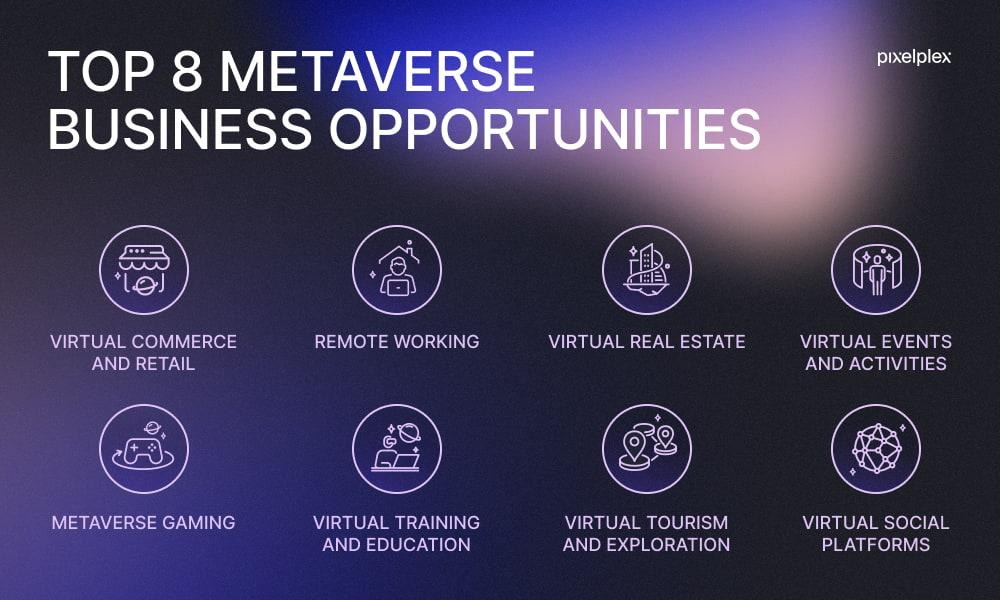

## Table of Contents

## What is the Metaverse and how does it relate to monetary opportunities?

The Metaverse is a virtual world where people can interact with each other and digital objects in a shared online space. It's like a big, immersive internet where you can do things like play games, go to concerts, or even work. Imagine putting on a special headset and suddenly you're in a different place, meeting friends or exploring new environments, all from your living room.

The Metaverse can create many money-making opportunities. Companies can sell virtual goods, like clothes or accessories for your avatar, or even virtual real estate. People can also make money by creating and selling their own digital content, like art or music, or by offering services like virtual event planning or teaching classes. As more people spend time in the Metaverse, the potential for earning money there will likely grow.

## What are the basic ways to earn money in the Metaverse?

One way to earn money in the Metaverse is by selling virtual goods. This means you can create and sell things like clothes, accessories, or even houses for other people's avatars. These items are often bought using special digital money, like cryptocurrencies. If you're good at designing things, you can make a lot of money by selling your creations to others who want to look cool or unique in the virtual world.

Another way is by offering services. You can teach classes, plan virtual events, or even perform as a musician or artist. People in the Metaverse might pay you to learn new skills, attend fun events, or enjoy your art. This is similar to real life, but everything happens online in the virtual world. As more people join the Metaverse, there will be more chances to earn money by helping others have a good time or learn something new.

## How can someone start investing in virtual real estate within the Metaverse?

To start investing in virtual real estate in the Metaverse, you first need to choose a platform where you can buy and sell virtual land. Some popular platforms include Decentraland, The Sandbox, and Voxels. Each platform has its own way of buying land, usually using a special kind of digital money called [cryptocurrency](/wiki/cryptocurrency), like Ethereum. You'll need to set up a digital wallet to hold your cryptocurrency and then use it to buy virtual land on the platform you choose. It's a bit like buying real land, but everything happens online.

Once you own a piece of virtual land, you can do many things with it to make money. You can build things on your land, like stores or houses, and then rent or sell them to other people in the Metaverse. You can also host events on your land, like concerts or art shows, and charge people to come. The more popular your land becomes, the more money you can make. Just like in the real world, the value of your virtual land can go up or down, so it's important to keep an eye on what's happening in the Metaverse and make smart choices about when to buy or sell.

## What are virtual goods and how can they be monetized in the Metaverse?

Virtual goods are digital items that you can use in the Metaverse. They can be things like clothes, accessories, or even houses for your avatar. These items make your avatar look special or help you do things in the virtual world. They are bought and sold using special digital money called cryptocurrency. 

You can make money from virtual goods by creating and selling them to other people in the Metaverse. If you're good at designing things, you can make clothes or accessories that other people want to buy. The more popular your items are, the more money you can make. People in the Metaverse often want to look cool or unique, so they'll pay for good virtual goods.

## What role do cryptocurrencies and NFTs play in the Metaverse economy?

Cryptocurrencies are like special digital money that people use to buy things in the Metaverse. They are important because they make it easy to pay for virtual goods and services. For example, if you want to buy a cool outfit for your avatar or a piece of virtual land, you can use cryptocurrencies like Ethereum. This digital money helps keep the economy of the Metaverse running smoothly because it's easy to use and can be sent anywhere in the world quickly.

NFTs, or non-fungible tokens, are another big part of the Metaverse economy. NFTs are unique digital items that you can own, like a special piece of art or a rare virtual item. Because each NFT is one-of-a-kind, people can buy, sell, and trade them just like real-world collectibles. In the Metaverse, NFTs can be used to show off your style or to make money by selling them to others. They add a lot of value and excitement to the virtual world because they let people own and trade unique digital things.

## How can businesses leverage the Metaverse for new revenue streams?

Businesses can use the Metaverse to make new money by selling virtual goods. They can create and sell things like clothes or accessories for people's avatars. These items can be bought using special digital money called cryptocurrencies. If a business makes popular virtual goods, they can make a lot of money because people in the Metaverse want to look cool or unique. It's like selling real clothes, but everything happens online in the virtual world.

Another way businesses can make money in the Metaverse is by offering services. They can host events like concerts or art shows on virtual land they own. People will pay to come to these events, just like they would in real life. Businesses can also offer classes or workshops, where people pay to learn new skills. As more people spend time in the Metaverse, there will be more chances for businesses to earn money by helping people have fun or learn something new.

## What are the risks associated with investing in the Metaverse?

Investing in the Metaverse can be risky because it's still new and not everyone knows how it will work in the future. The value of things like virtual land or goods can go up and down a lot. If you buy something and its value goes down, you might lose money. Also, the rules and technology of the Metaverse might change, which could affect what you own or how you make money. It's important to be careful and think about these risks before you invest.

Another risk is that the Metaverse might not become as popular as people think. If fewer people join the Metaverse, there will be less demand for virtual goods and land, which could make them worth less. Also, there can be problems with the digital money, like cryptocurrencies, that you use to buy things in the Metaverse. If the value of the cryptocurrency goes down, your investment could lose value too. It's a good idea to do a lot of research and maybe talk to someone who knows about investing before you put money into the Metaverse.

## How does the concept of virtual employment work in the Metaverse?

Virtual employment in the Metaverse means working in a digital world instead of the real one. People can have jobs like designing virtual goods, hosting events, or teaching classes. They use special tools and technology to do their work, and they get paid in digital money like cryptocurrencies. It's a bit like working from home, but everything happens in the Metaverse.

Just like in the real world, virtual jobs can be full-time or part-time. Some people might work for big companies that have offices in the Metaverse, while others might be freelancers who offer their services to anyone. The cool thing about virtual employment is that you can work with people from all over the world, and you don't have to leave your house to go to work. But it's important to be good at using the technology and to understand how the Metaverse works to do well in these jobs.

## What advanced strategies can be used to maximize profits in the Metaverse?

To make the most money in the Metaverse, you can start by investing in virtual land in popular areas. These spots are like busy streets or cool neighborhoods where lots of people want to hang out. If you buy land there, you can build things like shops or houses and then rent or sell them to others. The more people who visit your land, the more money you can make. It's also smart to keep an eye on what's happening in the Metaverse and buy land in places that are starting to get popular. This way, you can buy low and sell high, just like in the real world.

Another good strategy is to create and sell virtual goods that people really want. This could be cool clothes or special accessories for their avatars. If you're good at designing things, you can make items that stand out and become popular. The more unique and in-demand your goods are, the more money you can make. You can also work with other people in the Metaverse to make your goods even better. For example, you could team up with a popular virtual artist to create a special line of clothing that people will love. By staying creative and working with others, you can keep making more and more money.

## How do regulatory environments affect monetary opportunities in the Metaverse?

The rules made by governments can really change how people make money in the Metaverse. If the rules are strict, it might be harder to buy and sell things like virtual land or goods. For example, if a government says you can't use certain kinds of digital money, like cryptocurrencies, it could make it tough to do business in the Metaverse. On the other hand, if the rules are clear and easy to follow, more people might feel safe to invest and spend money there. This can help the Metaverse grow and create more ways for people to make money.

Different countries might have different rules about the Metaverse, which can make things tricky for people who want to work or invest across borders. If one country has very loose rules and another has tight ones, it can be hard to figure out where to put your money or how to sell your virtual goods. This can slow down the growth of the Metaverse and make it harder for people to find new ways to earn money. But if countries work together to make fair and clear rules, it could help the Metaverse become a big place for making money.

## What are the future trends that could impact the economy of the Metaverse?

One big trend that could change the Metaverse's economy is how much technology improves. As virtual reality and other tech get better, more people might want to spend time in the Metaverse. This could mean more people buying virtual goods and land, which would make the economy grow. Also, if the technology gets easier to use, even more people could join in, making the Metaverse a bigger place for making money. Companies might also start using the Metaverse more for work and meetings, which could create new jobs and ways to earn money.

Another trend to watch is how governments and rules change. If countries make clear and fair rules about using the Metaverse, it could help it grow and become a safe place to invest. But if the rules are too strict or different in each country, it might slow down the Metaverse's growth. Also, how people feel about digital money like cryptocurrencies will matter a lot. If more people trust and use them, it could make buying and selling in the Metaverse easier and help the economy grow.

## How can one develop a comprehensive investment strategy tailored for the Metaverse?

To develop a good investment strategy for the Metaverse, you need to start by learning a lot about it. Find out which platforms, like Decentraland or The Sandbox, are popular and growing. Look at what kinds of virtual goods and land are in demand. It's also important to understand how cryptocurrencies and NFTs work because they are used to buy and sell things in the Metaverse. Once you know these things, you can decide where to put your money. For example, you might want to buy virtual land in a busy area or create and sell popular virtual goods. It's a good idea to spread your money around a bit, so you're not putting all your eggs in one basket. This way, if one thing doesn't work out, you still have other investments that might do well.

Another part of your strategy should be keeping an eye on trends and changes in the Metaverse. The virtual world can change fast, so you need to stay updated. Watch for new technologies that make the Metaverse better or more popular. Also, pay attention to what governments are saying about rules for the Metaverse and digital money. These rules can affect how easy it is to make money there. It's smart to be ready to change your strategy if things in the Metaverse shift. Maybe you'll need to sell some land or start making different kinds of virtual goods. By staying flexible and informed, you can make the most of your investments in the Metaverse.

## References & Further Reading

[1]: Bergstra, J., Bardenet, R., Bengio, Y., & Kégl, B. (2011). ["Algorithms for Hyper-Parameter Optimization."](https://papers.nips.cc/paper/4443-algorithms-for-hyper-parameter-optimization) Advances in Neural Information Processing Systems 24.

[2]: ["Advances in Financial Machine Learning"](https://www.amazon.com/Advances-Financial-Machine-Learning-Marcos/dp/1119482089) by Marcos Lopez de Prado

[3]: ["Evidence-Based Technical Analysis: Applying the Scientific Method and Statistical Inference to Trading Signals"](https://www.amazon.com/Evidence-Based-Technical-Analysis-Scientific-Statistical/dp/0470008741) by David Aronson

[4]: ["Machine Learning for Algorithmic Trading"](https://github.com/stefan-jansen/machine-learning-for-trading) by Stefan Jansen

[5]: ["Quantitative Trading: How to Build Your Own Algorithmic Trading Business"](https://www.amazon.com/Quantitative-Trading-Build-Algorithmic-Business/dp/1119800064) by Ernest P. Chan