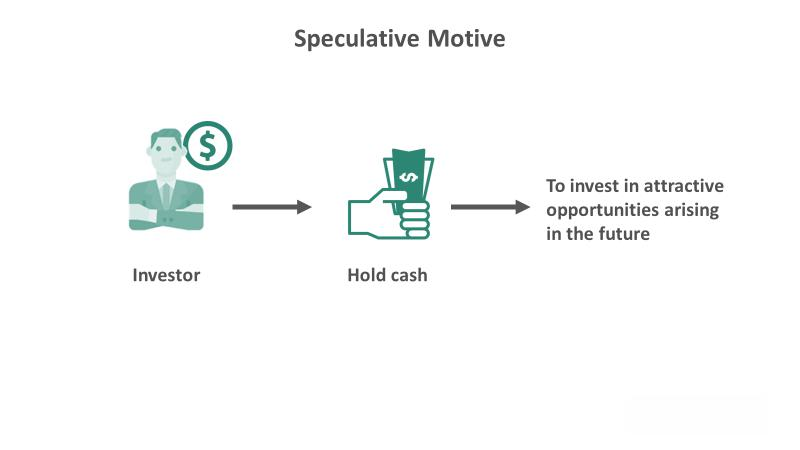

The digital economy is undergoing a notable transformation, largely propelled by advancements in cutting-edge technologies such as virtual reality (VR), the metaverse, and algorithmic trading. These technologies are not only reshaping existing sectors but are also creating entirely new paradigms of operation. By examining how they integrate, particularly within sectors like finance and entertainment, one can gain valuable insights into the upcoming economic landscapes defined by digital innovation.

Virtual reality and the metaverse are revolutionizing human interactions and digital interactions, offering immersive experiences that extend beyond traditional bounds. VR technology allows users to engage with interactive, sensory-rich environments, thereby opening the door to the metaverse—a complex, interconnected virtual world where digital actions mirror, and often transcend, real-world possibilities.



Algorithmic trading, on the other hand, utilizes sophisticated computer algorithms to execute trades with speed and precision in financial markets. It highlights the growing importance of data-driven decision-making processes in the economy, exploiting market patterns that may elude human investors. The interplay between these technologies and their adoption underlines a shift toward a more interconnected and automated economic ecosystem.

Understanding these pioneering innovations provides critical insights into the future. As they integrate into various sectors, they offer new opportunities and also present challenges that will shape the economic dynamics of tomorrow. This article endeavors to elucidate the convergence of virtual reality, the metaverse, and algorithmic trading, offering a thorough examination of their roles and impacts in the evolving digital economy. Through a comprehensive overview, readers will grasp these technological intersections and their potential to redefine economic and social structures.

## Table of Contents

## The Digital Economy: A New Era

The digital economy represents a transformative phase in global economic development, where digital computing technologies form the core framework for economic activities. This era signifies a shift from traditional economic structures to those imbued with digital processes and tools that enhance efficiency, innovation, and globalization. At its crux, the digital economy encompasses a broad range of digital transformations, affecting industries, businesses, and consumer interactions. Such transformations are fundamentally altering how value is created, shared, and sustained in the modern economic milieu.

A major component of the digital economy's evolution is the digital transformation of traditional business practices. Companies are integrating digital technologies into their operations to streamline processes, enhance customer experiences, and foster innovation. This digital transformation encompasses the adoption of technologies such as cloud computing, data analytics, and the Internet of Things (IoT), which enable businesses to optimize their operations and address changing consumer demands effectively.

The digital economy is propelled by several key technological advancements. The rapid development of internet technologies has exponentially increased connectivity, breaking down geographical barriers and facilitating real-time communication and transactions globally. Mobile communications have further enhanced this connectivity, providing ubiquitous access to digital resources and services, thus promoting the proliferation of mobile-based business platforms and applications. Additionally, the widespread adoption of digital platforms, such as e-commerce and social media, has redefined traditional business models, providing new avenues for revenue generation and marketing strategies.

In this context, novel business models and revenue streams are emerging, disrupting conventional industries. The digital economy fosters the growth of platform-based businesses, where value is generated through the creation and facilitation of digital markets. Companies such as Amazon and Alibaba exemplify platform-based models, capitalizing on network effects and data analytics to scale operations efficiently while customizing services for individual users. These digital-native enterprises challenge traditional businesses to innovate continually in order to remain competitive.

Moreover, the digital economy challenges traditional economic paradigms by prioritizing elements such as knowledge, connectivity, and digital transactions. In this digital age, knowledge and information have become pivotal assets, often surpassing physical capital in terms of value. Connectivity, enabled by digital networks, is essential for collaborative innovation and the expansion of digital marketplaces. Digital transactions, utilizing technologies such as blockchain and digital currencies, are redefining the nature of economic exchange, offering enhanced security, efficiency, and transparency in financial interactions.

In summary, the digital economy marks a significant shift in how economic activities are conducted and valued. By utilizing digital technologies, it introduces innovative business models, enhances connectivity, and prioritizes knowledge as a critical asset, thus paving the way for a new era of economic development. This transformation requires ongoing adaptation and forward-thinking strategies to harness the opportunities presented by this digital revolution.

## Virtual Reality and the Metaverse

Virtual reality (VR) technologies have revolutionized the digital landscape by affording users the ability to engage within fully interactive and sensory-rich environments. By replicating sensory experiences such as sight, sound, and touch, VR creates an immersive environment that transcends the physical limitations of the real world. These technologies are instrumental in bridging everyday reality with the digital universe, offering an unprecedented level of interaction and engagement.

The metaverse is conceptualized as an interconnected 3D virtual space where individuals can engage in activities such as interaction, work, and entertainment. This expansive digital ecosystem merges multiple virtual spaces, allowing users to move seamlessly between various environments. As a synthesis of virtual reality and digital social interaction, the metaverse expands beyond a single platform, representing a networked virtual reality environment reminiscent of the internet as we know it today.

VR technologies act as a critical gateway to the metaverse by providing tools essential for creating and experiencing enthralling, immersive virtual spaces. Through devices such as VR headsets and motion sensors, users can interact within these spaces as though they are physically present, enhancing the sense of realism and engagement.

Leading platforms like Decentraland and Roblox are at the forefront of pioneering the metaverse ecosystem. Decentraland, for example, is built on blockchain technology, enabling users to purchase, develop, and monetize virtual real estate. Users can explore, build, and engage with interactive environments and digital assets using [cryptocurrency](/wiki/cryptocurrency) [1]. Roblox, on the other hand, empowers its users to create their own 3D games and experiences, promoting a vibrant community-driven metaverse that encourages creativity and social interaction among millions of global users [2].

The applications of the metaverse are diverse and far-reaching. In real estate, virtual environments enable potential buyers to explore digital replicas of properties, providing a comprehensive viewing experience without geographical limitations. The same principle applies to gaming, where players can immerse themselves in expansive digital worlds with complex narratives and social dynamics. Social networking within the metaverse fosters novel forms of interaction, enabling users to meet and engage in lifelike virtual settings. Moreover, virtual workplaces facilitated by the metaverse allow for remote collaboration, meetings, and training sessions in a richly interactive environment, overcoming the limitations of traditional video conferencing.

As VR technologies and the metaverse continue to evolve, their synergy promises transformative impacts across various sectors, reshaping the way humans interact with digital spaces.

References:
1. Decentraland. "Decentraland – Create, explore and trade in the first-ever virtual world owned by its users." Accessed October 2023. https://decentraland.org
2. Roblox Corporation. "Roblox – Powering Imagination." Accessed October 2023. https://www.roblox.com

## Algorithmic Trading in the Digital Economy

Algorithmic trading utilizes computer programs to execute trading orders based on predefined criteria, drastically transforming how financial markets operate. This form of trading is particularly prevalent in stock exchanges, where speed and precision are paramount. By automating decision-making processes, [algorithmic trading](/wiki/algorithmic-trading) allows traders to capitalize on market trends and anomalies with efficiency that human traders cannot match. Algorithms can analyze massive datasets in milliseconds, identify patterns, and execute trades at speeds beyond human capacity, thus maximizing profit opportunities.

A significant aspect of algorithmic trading is its reliance on high-speed data processing and analytics. The systems involved require powerful hardware and sophisticated software to handle real-time market data, execute trades, and manage risk. The effectiveness of algorithmic trading hinges on the quality of data analytics, whereby historical and real-time data are used to backtest strategies and refine algorithms. This dependency underscores the importance of advancements in computing technologies within the digital economy.

Mathematically, the operations of algorithmic trading can be understood through various models and formulas used to predict price movements. One of the fundamental models is the Efficient Market Hypothesis (EMH), which assumes that prices reflect all available information. However, traders employ various strategies that challenge EMH, such as statistical [arbitrage](/wiki/arbitrage), where traders attempt to exploit temporary inefficiencies between correlated financial instruments.

In practice, algorithmic trading strategies often involve complex mathematical models and statistical techniques for decision-making. For example, a simple moving average crossover strategy can be implemented in Python as follows:

```python
def moving_average(prices, window_size):
    return np.convolve(prices, np.ones(window_size)/window_size, mode='valid')

def generate_signals(prices, short_window, long_window):
    signals = np.zeros(len(prices))
    short_mavg = moving_average(prices, short_window)
    long_mavg = moving_average(prices, long_window)
    signals[short_window:] = np.where(short_mavg > long_mavg, 1.0, -1.0)
    return signals
```

In this example, the crossing of short-term and long-term moving averages generates trading signals.

However, despite its advantages, algorithmic trading presents challenges, such as increased market [volatility](/wiki/volatility-trading-strategies). The rapid execution of trades can lead to significant fluctuations in asset prices, exacerbating volatility especially in thinly traded securities. Additionally, the flash crash of May 2010 highlighted the potential risks associated with algorithmic trading when automated systems inadvertently led to drastic market disruptions.

Moreover, the regulatory landscape for algorithmic trading is continually evolving to mitigate risks. Regulatory bodies worldwide are working to establish frameworks that ensure market stability and protect investors from market abuses and systemic risks posed by high-frequency trading activities. Compliance with these regulations is essential to maintaining the integrity and reliability of financial markets within the digital economy.

## The Convergence of Technologies

The convergence of virtual reality (VR), the metaverse, and algorithmic trading illustrates the complex and integrated nature of the digital economy. By combining these technologies, virtual financial markets can be facilitated, creating immersive trading environments that enhance user experience and operational efficiency. When VR and metaverse platforms, such as Decentraland and Roblox, integrate with algorithmic trading systems, they enable participants to visualize and interact with market data in new and engaging ways. This immersion offers traders a unique perspective on price movements and market trends, potentially leading to more informed decision-making.

The integration of these technologies results in the development of innovative financial products and services tailored for virtual environments. For instance, virtual assets and securities can be created and traded within the metaverse, providing users with unique opportunities to diversify their portfolios. Moreover, this digital transformation extends to virtual real estate and non-fungible tokens (NFTs), which serve as bridges between traditional finance and the emerging digital world. Through the employment of blockchain technology, these digital assets ensure transparency, security, and authenticity, further building trust within the ecosystem.

Economic growth and digital innovation are catalyzed by the synergy of VR, the metaverse, and algorithmic trading. These technologies drive the creation of new market segments and business models that were previously inconceivable. Such advancements promote the democratization of financial markets by enabling broader access and participation, irrespective of geographical constraints. The convergence not only enhances existing financial systems but also paves the way for the development of entirely novel markets and services that expand the digital economy's horizons.

## Potential Challenges and Risks

As with all rapidly advancing technologies, the digital economy is confronted with a variety of challenges and risks that need to be addressed to ensure sustainable growth and consumer protection.

A major concern is data privacy. As digital platforms collect and process vast amounts of personal information, ensuring the confidentiality and security of this data is paramount. Users' data is susceptible to breaches, misuse, and unauthorized access, which could lead to identity theft and other malicious activities. The implementation of robust data encryption and stringent data protection regulations, such as the General Data Protection Regulation (GDPR) in Europe, are essential to mitigate these risks.

Cybersecurity is another critical issue. The increasing interconnectedness of digital systems exposes them to various cyber threats, including hacking, ransomware, and phishing attacks. These threats can disrupt services, compromise sensitive information, and result in substantial economic losses. Developing sophisticated cybersecurity measures and employing [artificial intelligence](/wiki/ai-artificial-intelligence) for threat detection and prevention are vital strategies to safeguard digital infrastructure.

Regulatory compliance presents additional challenges. The rapid pace of technological innovation often outstrips the ability of regulatory bodies to formulate relevant and effective rules. This gap can lead to a lack of oversight, contributing to unfair practices and financial instability. Creating agile and adaptive regulatory frameworks that can evolve with technological advancements is necessary to provide a balance between fostering innovation and protecting stakeholders.

The volatility of digital assets, such as cryptocurrencies, adds further financial risks. The nascent state of the metaverse and virtual assets like non-fungible tokens (NFTs) contribute to unpredictable market dynamics. Price fluctuations, speculative trading, and lack of regulation can lead to significant financial exposure. Establishing transparent trading practices and informed investment strategies can mitigate these risks.

Governance frameworks are essential to promoting responsible innovation while ensuring consumer protection. These frameworks should encompass guidelines for ethical data usage, transparent business practices, and accountability mechanisms. International cooperation and alignment of standards can help in managing the complexities of cross-border digital transactions.

Finally, educational efforts are crucial to enhance digital literacy among users. The complexity of digital ecosystems requires individuals to be informed and capable of navigating these technologies safely and effectively. Educational initiatives should focus on equipping users with the skills to understand digital platforms, recognize potential risks, and adopt best practices for secure and responsible usage. These efforts will empower consumers and contribute to a more resilient and inclusive digital economy.

## Conclusion

The ongoing development of the digital economy is a testament to the transformative power of technology, as innovations such as virtual reality, the metaverse, and algorithmic trading increasingly reshape traditional economic frameworks. These technologies not only enhance efficiencies and drive growth across various sectors but also broaden the scope for new business models and consumer interactions.

Adopting these advancements requires adaptability and a forward-thinking approach from businesses and policymakers alike. Organizations must be prepared to integrate these technologies into their operations, exploring novel ways to engage with customers and optimize processes. Likewise, policymakers must create supportive environments that encourage innovation while ensuring safeguards are in place to protect consumers and ensure equitable access.

While challenges remain—particularly in terms of data privacy, regulatory compliance, and technological accessibility—the potential benefits of virtual reality, the metaverse, and algorithmic trading are vast. These innovations hold the potential to significantly enhance societal prosperity by unlocking new forms of revenue, creating jobs, and fostering global connectivity.

The future of the digital economy is promising, with limitless possibilities for innovation and advancement. As these technologies continue to evolve, their potential to redefine economic landscapes and improve quality of life becomes increasingly apparent. Embracing these changes will be crucial for harnessing the full potential of the digital economy and achieving sustainable growth and prosperity.

## References & Further Reading

[1]: Bergstra, J., Bardenet, R., Bengio, Y., & Kégl, B. (2011). ["Algorithms for Hyper-Parameter Optimization."](https://papers.nips.cc/paper/4443-algorithms-for-hyper-parameter-optimization) Advances in Neural Information Processing Systems 24.

[2]: ["Advances in Financial Machine Learning"](https://www.amazon.com/Advances-Financial-Machine-Learning-Marcos/dp/1119482089) by Marcos Lopez de Prado

[3]: ["Evidence-Based Technical Analysis: Applying the Scientific Method and Statistical Inference to Trading Signals"](https://www.amazon.com/Evidence-Based-Technical-Analysis-Scientific-Statistical/dp/0470008741) by David Aronson

[4]: ["Machine Learning for Algorithmic Trading"](https://github.com/stefan-jansen/machine-learning-for-trading) by Stefan Jansen

[5]: ["Quantitative Trading: How to Build Your Own Algorithmic Trading Business"](https://www.amazon.com/Quantitative-Trading-Build-Algorithmic-Business/dp/1119800064) by Ernest P. Chan