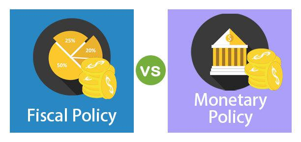

In an increasingly interconnected global economy, understanding the intricacies of economic policies is essential. As national economies become more intertwined, the actions taken in one region can ripple across the globe, affecting trade balances, financial markets, and economic stability. Policymakers deploy a range of strategies to navigate these challenges, integrating economic policy, fiscal policy, monetary policy, and the evolving realm of algorithmic trading.

Economic policy encompasses a broad spectrum of governmental actions aimed at influencing a country's economic performance. These actions often align closely with fiscal policies, which involve using government spending and taxation to modulate economic activity. Similarly, monetary policy, executed through central banking systems, controls money supply and interest rates to maintain economic stability.

Algorithmic trading, a product of technological advances in financial markets, has transformed how trades are executed. This automated trading approach, originally the domain of large institutional investors, has democratized access to rapid trading, enabling a wider array of market participants to engage in complex trading strategies. While this has benefits like enhanced market liquidity, it also introduces new challenges, such as increased market volatility.

Exploring these connections not only enriches our understanding but also equips policymakers and market participants with the insights needed to navigate the complexities of current economic challenges. Understanding how these elements interact is crucial in formulating robust strategies that can adapt to the ever-changing economic landscape, ensuring sustainable growth and stability in the modern economic ecosystem.

## Table of Contents

## Understanding Economic Policy

Economic policy encompasses a comprehensive set of actions taken by governments to influence the economic activity within their jurisdictions. At its core, these policies are tailored to guide the economy toward key objectives: controlling inflation, reducing unemployment, and fostering sustainable economic growth. The intricacies of economic policy are manifested through fiscal policy, monetary policy, and various regulatory strategies designed to adapt to changing economic conditions.

Fiscal policy involves government decisions on taxation and public spending. By adjusting these levers, governments aim to manage economic fluctuations. For example, increasing government spending or reducing taxes can stimulate demand during a downturn, while the opposite actions can help cool down an overheated economy showing signs of inflation. Through fiscal measures, a government can directly influence the aggregate demand, which, in turn, impacts employment and production levels.

Monetary policy, implemented by a nation's central bank, involves controlling the money supply and interest rates to maintain economic stability. By setting interest rates and modulating the money supply, central banks strive to achieve low and stable inflation, thereby creating an environment conducive to economic growth. This aspect of economic policy is critical as it directly affects borrowing costs, consumer spending, and business investment.

Regulatory strategies can include a wide range of interventions such as wage control, price regulation, or even trade policies that can affect the economic environment. The goal is to create a stable and predictable economic framework that encourages investment, innovation, and enterprise, ultimately driving growth.

Economic policies are multifaceted by nature and require careful consideration of timing and scale to balance short-term economic fluctuations with long-term growth objectives. Effective economic policy is pivotal in shaping the macroeconomic environment, determining how resources are allocated, influencing the level of economic output, and steering the nation toward a path of prosperity.

## Fiscal Policy: A Closer Look

Fiscal policy is a critical tool used by governments to steer economic development by adjusting the levels of taxation and public spending. The overarching objective is to achieve and maintain economic stability, foster growth, and enhance employment while managing inflation. At its core, fiscal policy operates through two principal mechanisms: taxation and government expenditure. Taxation influences disposable income and consumption by individuals and entities, whereas government spending is directed towards public goods, services, and infrastructure projects, directly impacting economic activity.

Expansionary fiscal policy is typically deployed during periods of economic recession or slowdown. By reducing taxes and increasing government expenditure, the policy aims to amplify aggregate demand. The formula often used to describe this effect is:

$$
\Delta GDP = \frac{\Delta G}{1 - MPC}
$$

where $\Delta GDP$ is the change in gross domestic product, $\Delta G$ is the change in government spending, and $MPC$ is the marginal propensity to consume. A higher MPC results in a larger multiplier effect, indicating that consumer spending significantly influences the effectiveness of fiscal policy.

Conversely, contractionary fiscal policy seeks to dampen overheating economies and control high inflation by reducing government expenditure or increasing taxes. This curtails aggregate demand, leading to slower economic growth and potential reductions in inflationary pressures. The balanced budget multiplier, considering tax increases, is less influential than spending changes due to its lesser effect on disposable income.

The implementation of fiscal policy requires precise timing and an understanding of economic cycles. Premature or excessive interventions can lead to suboptimal outcomes, such as stagflation or budget deficits. Fiscal policy must be coordinated with monetary policy to enhance overall effectiveness, balancing [liquidity](/wiki/liquidity-risk-premium) injections or withdrawals with [interest rate](/wiki/interest-rate-trading-strategies) adjustments.

Moreover, fiscal policy's impact on employment is multifaceted. Increased government spending can lead to job creation, especially in labor-intensive public projects. Conversely, higher taxation can reduce employers' and individuals' ability and incentive to spend, potentially impacting hiring and investment decisions.

In conclusion, fiscal policy is an indispensable instrument of economic governance. The careful modulation of fiscal levers—taxation and expenditure—provides governments with the means to mitigate economic fluctuations and pursue national economic objectives. Effective fiscal policy requires strategic deliberation regarding the scope and timing of its application, ensuring its harmonization with monetary policy initiatives.

## Monetary Policy: Tools and Impacts

Monetary policy, primarily executed by a nation's central bank, is a critical tool for controlling the money supply and modulating interest rates in order to maintain economic stability. At its core, the policy's objectives include stabilizing inflation and influencing employment levels. By achieving these goals, central banks aim to facilitate sustainable economic growth and mitigate economic [volatility](/wiki/volatility-trading-strategies).

Central banks utilize several tools to implement monetary policy effectively. Open market operations (OMOs) are one of the most frequently employed mechanisms. This involves the buying and selling of government securities in the open market. When a central bank purchases securities, it injects money into the economy, thereby lowering interest rates and encouraging borrowing and spending. Conversely, selling securities can help reduce the money supply, increasing interest rates and curbing inflationary pressures.

Reserve requirements are another tool at the disposal of central banks. Reserve requirements dictate the minimum amount of reserves that banks must hold against deposits. By adjusting these requirements, central banks can influence the amount of money available for lending. A lower reserve requirement increases the funds available for banks to lend, thereby expanding the money supply. Raising the reserve requirement, on the other hand, decreases the funds available, contracting the money supply.

Additionally, the discount rate serves as a critical tool in the central banking arsenal. This is the interest rate at which commercial banks can borrow from the central bank. A lower discount rate reduces the cost of borrowing for banks, encouraging them to lend more, which increases the money supply and can stimulate economic activity. Conversely, a higher discount rate makes borrowing more expensive, potentially dampening economic activity.

Monetary policy can be characterized as either contractionary or expansionary, depending on the prevailing economic conditions. Expansionary monetary policy is typically employed during periods of economic downturns or recession. It involves lowering interest rates and increasing the money supply to stimulate borrowing and investment. The intended outcome is to boost economic activity, reduce unemployment rates, and prevent deflation.

Conversely, contractionary monetary policy is used when the economy is overheating, and inflation is high. In such instances, increasing interest rates and reducing the money supply can help temper economic activity, bringing inflation back to target levels. This careful balancing act is essential to prevent both hyperinflation and deflation, which can have detrimental effects on the economy.

By strategically manipulating these monetary policy instruments, central banks play a pivotal role in steering the macroeconomic environment towards stability and growth. As the global economy continues to evolve, the adaptability and precision of monetary policy will remain essential tools in navigating economic challenges and opportunities.

## Algorithmic Trading: A Technological Evolution

Algorithmic trading, also known as algo trading, leverages sophisticated algorithms to execute trades in financial markets with remarkable speed and precision. This strategy employs computer programs to analyze market data, identify profitable trading opportunities, and execute buy or sell orders automatically. The rise of [algorithmic trading](/wiki/algorithmic-trading) can be traced back to its initial adoption by institutional investors, such as hedge funds and investment banks, which recognized its potential to enhance trading efficiency and reduce transaction costs.

In recent years, algorithmic trading has become increasingly accessible to a wider array of market participants, including individual investors, thanks to technological advancements and the proliferation of electronic trading platforms. This democratization enables more traders to benefit from the speed and accuracy that algorithms provide, bridging the gap between large institutional players and smaller investors.

One of the primary advantages of algorithmic trading is its ability to enhance market liquidity. By automating the execution of trades, algorithms can process large volumes of transactions in fractions of a second, increasing the availability of buy and sell orders in the market. Consequently, this can lead to tighter bid-ask spreads, reducing the cost of trading for all market participants.

However, algorithmic trading also introduces a new dimension of complexity, particularly in terms of market volatility. The speed at which algorithms can execute trades means that markets can react rapidly to new information, sometimes exacerbating price movements. This was notably observed during the "Flash Crash" of 2010, when automated trading programs contributed to a sudden and dramatic drop in U.S. stock prices. While measures have since been implemented to prevent such occurrences, the potential for algorithms to contribute to market instability remains a concern.

The widespread adoption of algorithmic trading necessitates a reevaluation of traditional economic strategies and regulatory frameworks. As market dynamics are altered by the increased participation of algorithmic traders, regulatory bodies and policymakers must adapt to ensure market integrity and stability. This involves monitoring algorithmic trading activities, implementing safeguards to prevent excessive volatility, and fostering a fair trading environment for all participants.

In conclusion, as algorithmic trading continues to evolve, it plays an increasingly pivotal role in shaping the financial markets. While it enhances efficiency and liquidity, its potential to influence market volatility and dynamics requires ongoing scrutiny and adaptation of economic policies and regulations.

## Interactions and Implications

The intersection of fiscal policy, monetary policy, and algorithmic trading creates a highly intricate and dynamic economic environment. Governments wield fiscal and monetary policies to influence economic conditions, which invariably impacts market expectations. These policies can trigger responses from algorithmic trading systems that operate on pre-defined criteria, often reacting faster than human traders to new information. 

Algorithmic trading, with its reliance on high-frequency, automated transactions, can amplify market reactions to policy announcements. For example, if a central bank decides to alter interest rates, algorithms may execute a large [volume](/wiki/volume-trading-strategy) of trades within milliseconds, adjusting portfolios based on expected changes in market conditions. This swift response can lead to significant shifts in asset prices and trading volumes, exerting immediate effects on financial markets.

Moreover, the rapid responses facilitated by algorithmic trading can create feedback loops where market reactions influence subsequent policy decisions. Policymakers might interpret the outcome of algorithm-driven market movements as a signal of broader economic sentiment or potential instability, prompting adjustments in policy stances. This interaction necessitates a deep understanding of both economic policy objectives and the mechanics of financial markets to manage potential volatility.

Feedback loops can be illustrated by scenarios such as a fiscal stimulus intending to boost economic growth, leading to heightened investor optimism. Algorithmic trading systems may interpret this optimism as a buy signal, further inflating asset prices and potentially creating unsustainable market bubbles. Conversely, contractionary monetary policies aimed at curbing inflation might trigger sell-offs through algorithmic trades, accentuating market downturns.

Acquiring a robust understanding of these interactions is crucial for formulating effective economic policies that can withstand technological advancements in trading. Policymakers must consider not only the direct implications of fiscal and monetary measures but also their potential to incite unforeseen algorithmic trading responses. Integrating technological insights into policy frameworks can enhance economic strategy resilience, ensuring that they contribute effectively to long-term economic stability.

## Conclusion

In the pursuit of economic stability, integrating economic policies with advancements in algorithmic trading holds significant importance. Modern economic landscapes are shaped by sophisticated policies that address both fiscal and monetary aspects, along with the technological evolution brought about by algorithmic trading. Effective policy planning requires a comprehensive approach that acknowledges the intricate interactions between these components. Such integration is pivotal to strategically navigating economic challenges while seizing emerging opportunities.

A key aspect of effective planning lies in understanding the intertwined nature of fiscal policy, monetary policy, and algorithmic trading. Fiscal policy, with its tools of taxation and government spending, influences economic growth and stability. When intelligently employed, these tools can either stimulate or restrain the economy based on prevailing conditions. Monetary policy, managed by central banks through instruments such as interest rates, further complements fiscal measures by managing inflation and promoting employment. Meanwhile, algorithmic trading introduces rapid, data-driven decision-making processes that shift market dynamics.

This complex interplay necessitates an adaptable policy framework that can accommodate the swift shifts in economic and market conditions introduced by algorithmic trading. For example, rapid algorithmic responses to economic policy changes can create feedback loops that amplify or diminish intended policy effects. Recognizing these dynamics helps policymakers anticipate and mitigate potential risks, ensuring that technological advancements contribute positively rather than destabilize.

Continued adaptation of policies, informed by strategic foresight, is fundamental to harnessing the benefits of these technological innovations. Policymakers must not only address immediate economic concerns but also anticipate future challenges stemming from advancements in trading technologies. This ongoing adaptability involves fostering collaboration between economic policymakers, technologists, and financial market participants to create robust regulatory frameworks that balance innovation with economic stability.

In conclusion, the integration of economic policies with algorithmic trading technologies is essential for sustained economic health. Through nuanced understanding and strategic adaptation, countries can leverage these advancements to navigate complex economic landscapes effectively, ensuring stability, growth, and resilience in an ever-evolving world.

## References & Further Reading

[1]: ["The Economics of Money, Banking, and Financial Markets"](https://www.pearsonhighered.com/assets/preface/0/1/3/4/0134855388.pdf) by Frederic S. Mishkin

[2]: Bernanke, Ben S., and Mihov, Ilian. (1998). "[Measuring Monetary Policy.](https://www.jstor.org/stable/2586876)" The Quarterly Journal of Economics, 113(3), 869-902.

[3]: ["Macroeconomics"](https://www.investopedia.com/terms/m/macroeconomics.asp) by N. Gregory Mankiw

[4]: Carney, Mark. (2013). "[The UK’s Economic Rebalancing Act.](https://www.bankofengland.co.uk/speech/2013/the-uk-at-the-heart-of-a-renewed-globalisation)" Speech at the World Economic Forum, Bank of England.

[5]: Barberis, Nicholas, and Thaler, Richard. (2003). "[A Survey of Behavioral Finance.](https://papers.ssrn.com/sol3/papers.cfm?abstract_id=327880)" In Handbook of the Economics of Finance, edited by G.M. Constantinides, M. Harris, and R. Stulz, 1053-1128.