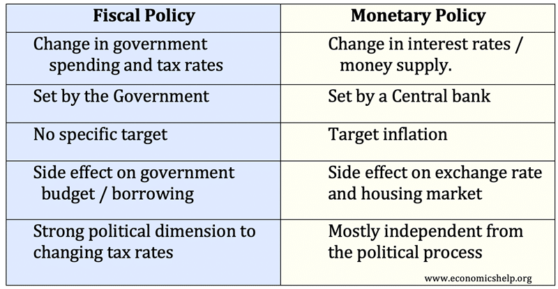

## Table of Contents

## What is monetary policy?

Monetary policy is the way a country's central bank controls the amount of money in the economy. It's like a tool that helps keep the economy stable. The central bank can increase or decrease the money supply to influence things like inflation and unemployment. For example, if there's too much money, prices might go up, so the central bank might take steps to reduce the money supply.

There are a few main ways the central bank can do this. One way is by changing the interest rate, which is the cost of borrowing money. When the interest rate goes up, borrowing becomes more expensive, and people might spend less. This can help slow down the economy and control inflation. Another way is by buying or selling government bonds, which can also affect how much money is circulating in the economy.

Overall, monetary policy is important because it helps manage the economy. By controlling the money supply, the central bank can try to keep prices stable and help the economy grow. It's a delicate balance, and the central bank has to be careful to make the right decisions.

## What is fiscal policy?

Fiscal policy is about how the government manages its spending and taxes to influence the economy. It's like the government's way of trying to keep the economy healthy. When the government spends more money or cuts taxes, it can help boost the economy by putting more money into people's pockets. On the other hand, if the government spends less or raises taxes, it can slow down the economy because people have less money to spend.

The main tools of fiscal policy are government spending and taxes. For example, during tough economic times, the government might increase spending on things like building roads or schools, which can create jobs and help the economy grow. Or, it might cut taxes so that people have more money to spend. But if the economy is growing too fast and causing inflation, the government might do the opposite by spending less or raising taxes to cool things down.

Fiscal policy works alongside monetary policy, which is controlled by the central bank. While monetary policy focuses on the money supply and interest rates, fiscal policy is more about direct spending and taxing decisions. Both are important for keeping the economy stable and helping it grow, but they are managed by different parts of the government.

## Who controls monetary policy in most countries?

In most countries, the central bank controls monetary policy. The central bank is like a special bank that looks after the whole country's money. It decides how much money should be in the economy by changing interest rates or buying and selling government bonds. This helps keep prices stable and the economy growing at a good pace.

The central bank is usually independent from the government. This means it can make decisions without being told what to do by politicians. Being independent helps the central bank focus on what's best for the economy, even if it's not popular. It's important because it helps keep the economy stable over the long term.

## Who is responsible for fiscal policy?

The government is in charge of fiscal policy. This means they decide how much money to spend and how much to collect in taxes. By changing these, the government can help the economy grow or slow down. For example, if the economy is not doing well, the government might spend more on things like building roads or schools to create jobs and help people.

The government's decisions on spending and taxes are important because they directly affect how much money people have to spend. If the government raises taxes, people have less money, which can slow down the economy. But if the government cuts taxes or spends more, people might have more money to spend, which can help the economy grow. Fiscal policy works together with monetary policy, which is controlled by the central bank, to keep the economy stable.

## What are the main tools of monetary policy?

The main tools of monetary policy are interest rates and open market operations. Interest rates are like the cost of borrowing money. When the central bank changes the interest rate, it can affect how much people and businesses want to borrow and spend. If the interest rate goes up, borrowing becomes more expensive, and people might spend less. This can help slow down the economy and control inflation. If the interest rate goes down, borrowing becomes cheaper, and people might spend more, which can help the economy grow.

Open market operations are when the central bank buys or sells government bonds. When the central bank buys bonds, it puts more money into the economy because it pays for the bonds with new money. This can help the economy grow. When the central bank sells bonds, it takes money out of the economy because people pay for the bonds with their money. This can help slow down the economy and control inflation.

These tools help the central bank manage the amount of money in the economy. By carefully using interest rates and open market operations, the central bank can try to keep prices stable and help the economy grow at a healthy pace. It's a delicate balance, and the central bank has to be careful to make the right decisions.

## What are the primary instruments of fiscal policy?

The main tools of fiscal policy are government spending and taxes. Government spending is when the government uses money to buy things or pay for services, like building roads or schools. When the government spends more, it can help the economy grow because it creates jobs and puts more money into people's pockets. But if the government spends less, it can slow down the economy because there's less money going around.

Taxes are another important tool. When the government changes taxes, it affects how much money people have to spend. If the government raises taxes, people have less money, which can slow down the economy. But if the government cuts taxes, people have more money to spend, which can help the economy grow. By carefully adjusting spending and taxes, the government can try to keep the economy stable and help it grow.

## How does monetary policy affect inflation and employment?

Monetary policy affects inflation and employment by controlling the amount of money in the economy. When the central bank wants to lower inflation, it might raise interest rates. This makes borrowing more expensive, so people and businesses spend less. With less money being spent, prices don't go up as fast, which helps control inflation. But if the central bank raises interest rates too much, it can also slow down the economy so much that it leads to higher unemployment because businesses might not want to hire as many people.

On the other hand, when the central bank wants to boost employment, it might lower interest rates. This makes borrowing cheaper, so people and businesses can spend more. With more money being spent, businesses might need to hire more workers, which can lower unemployment. But if the central bank lowers interest rates too much, it can lead to too much money in the economy, which can cause prices to rise faster, leading to higher inflation. So, the central bank has to find a balance to keep both inflation and employment at good levels.

## How does fiscal policy impact economic growth and income distribution?

Fiscal policy can help the economy grow by changing how much the government spends and how much it taxes. When the government spends more money, it can create jobs and help businesses. For example, if the government builds new roads or schools, it needs workers and materials, which puts money into the economy. If the government cuts taxes, people have more money to spend, which can also help the economy grow. But if the government spends too much or cuts taxes too much without enough money coming in, it can lead to problems like inflation or a big debt.

Fiscal policy can also affect how income is shared among people. When the government changes taxes, it can make a difference in who has more money. For example, if the government raises taxes on rich people and uses that money to help poorer people, it can make income more equal. But if the government cuts taxes for rich people and doesn't help poorer people as much, it can make income less equal. So, the choices the government makes about spending and taxes can change how fair the economy is for everyone.

## Can monetary and fiscal policy be used together to achieve economic goals?

Yes, monetary and fiscal policy can work together to help the economy. When the central bank and the government both make good choices about money and spending, they can help the economy grow and keep prices stable. For example, if the economy is not doing well, the central bank might lower interest rates to make borrowing cheaper, and at the same time, the government might spend more money on things like building roads or schools to create jobs. This can help the economy get better faster.

But it's important for the central bank and the government to work together carefully. If they don't, their actions might not help the economy as much as they could. For example, if the central bank is trying to control inflation by raising interest rates, but the government is spending a lot of money at the same time, it might make it harder to control inflation. So, they need to talk to each other and make sure their plans fit well together to reach their goals for the economy.

## What are the limitations of monetary policy in influencing the economy?

Monetary policy has some limits in how much it can help the economy. One big problem is that it can take a long time for changes in interest rates to affect things like spending and inflation. For example, if the central bank lowers interest rates to help the economy grow, it might take months or even years before people start borrowing more and spending more. This delay can make it hard for the central bank to fix problems quickly.

Another limit is that monetary policy might not work well if people are not borrowing or spending much, even when interest rates are low. This can happen if people are worried about the future and want to save their money instead of spending it. In these times, no matter how low the central bank makes interest rates, it might not be enough to get the economy moving. So, monetary policy has its challenges and can't always fix everything on its own.

## What challenges do policymakers face when implementing fiscal policy?

Policymakers face several challenges when implementing fiscal policy. One big challenge is timing. It can take a long time for changes in government spending or taxes to affect the economy. For example, if the government decides to spend more money on building roads to create jobs, it might take months or even years before the project starts and the jobs are created. This delay can make it hard for the government to help the economy when it needs it most.

Another challenge is balancing the budget. When the government spends more money or cuts taxes, it might not have enough money coming in to pay for everything. This can lead to a big debt, which can be a problem for the future. Policymakers have to be careful to make sure they don't spend too much or cut taxes too much, or they might make the economy worse in the long run.

Political disagreements can also make it hard to implement fiscal policy. Different people in the government might have different ideas about how to spend money or how much to tax. These disagreements can lead to delays or changes in plans, which can make it harder for the government to help the economy. So, policymakers have to work together and make tough decisions to make fiscal policy work well.

## How do monetary and fiscal policies interact during economic crises?

During economic crises, monetary and fiscal policies often work together to help the economy get better. The central bank might lower interest rates to make borrowing cheaper, which can encourage people and businesses to spend more money. At the same time, the government might increase its spending on things like building roads or schools to create jobs and put more money into the economy. By working together, these policies can help boost the economy faster than if they were used alone.

However, there can be challenges when using these policies together. If the government spends a lot of money while the central bank is trying to control inflation by raising interest rates, it might make it harder for the central bank to do its job. Also, if people are worried about the future and aren't spending or borrowing, even low interest rates might not be enough to help the economy. So, the central bank and the government need to talk to each other and make sure their plans fit well together to help the economy during a crisis.

## What is Fiscal Policy: A Closer Look?

Fiscal policy is a critical tool used by governments to steer economic development by adjusting the levels of taxation and public spending. The overarching objective is to achieve and maintain economic stability, foster growth, and enhance employment while managing inflation. At its core, fiscal policy operates through two principal mechanisms: taxation and government expenditure. Taxation influences disposable income and consumption by individuals and entities, whereas government spending is directed towards public goods, services, and infrastructure projects, directly impacting economic activity.

Expansionary fiscal policy is typically deployed during periods of economic recession or slowdown. By reducing taxes and increasing government expenditure, the policy aims to amplify aggregate demand. The formula often used to describe this effect is:

$$
\Delta GDP = \frac{\Delta G}{1 - MPC}
$$

where $\Delta GDP$ is the change in gross domestic product, $\Delta G$ is the change in government spending, and $MPC$ is the marginal propensity to consume. A higher MPC results in a larger multiplier effect, indicating that consumer spending significantly influences the effectiveness of fiscal policy.

Conversely, contractionary fiscal policy seeks to dampen overheating economies and control high inflation by reducing government expenditure or increasing taxes. This curtails aggregate demand, leading to slower economic growth and potential reductions in inflationary pressures. The balanced budget multiplier, considering tax increases, is less influential than spending changes due to its lesser effect on disposable income.

The implementation of fiscal policy requires precise timing and an understanding of economic cycles. Premature or excessive interventions can lead to suboptimal outcomes, such as stagflation or budget deficits. Fiscal policy must be coordinated with monetary policy to enhance overall effectiveness, balancing [liquidity](/wiki/liquidity-risk-premium) injections or withdrawals with [interest rate](/wiki/interest-rate-trading-strategies) adjustments.

Moreover, fiscal policy's impact on employment is multifaceted. Increased government spending can lead to job creation, especially in labor-intensive public projects. Conversely, higher taxation can reduce employers' and individuals' ability and incentive to spend, potentially impacting hiring and investment decisions.

In conclusion, fiscal policy is an indispensable instrument of economic governance. The careful modulation of fiscal levers—taxation and expenditure—provides governments with the means to mitigate economic fluctuations and pursue national economic objectives. Effective fiscal policy requires strategic deliberation regarding the scope and timing of its application, ensuring its harmonization with monetary policy initiatives.

## References & Further Reading

[1]: ["The Economics of Money, Banking, and Financial Markets"](https://www.pearsonhighered.com/assets/preface/0/1/3/4/0134855388.pdf) by Frederic S. Mishkin

[2]: Bernanke, Ben S., and Mihov, Ilian. (1998). "[Measuring Monetary Policy.](https://www.jstor.org/stable/2586876)" The Quarterly Journal of Economics, 113(3), 869-902.

[3]: ["Macroeconomics"](https://www.investopedia.com/terms/m/macroeconomics.asp) by N. Gregory Mankiw

[4]: Carney, Mark. (2013). "[The UK’s Economic Rebalancing Act.](https://www.bankofengland.co.uk/speech/2013/the-uk-at-the-heart-of-a-renewed-globalisation)" Speech at the World Economic Forum, Bank of England.

[5]: Barberis, Nicholas, and Thaler, Richard. (2003). "[A Survey of Behavioral Finance.](https://papers.ssrn.com/sol3/papers.cfm?abstract_id=327880)" In Handbook of the Economics of Finance, edited by G.M. Constantinides, M. Harris, and R. Stulz, 1053-1128.