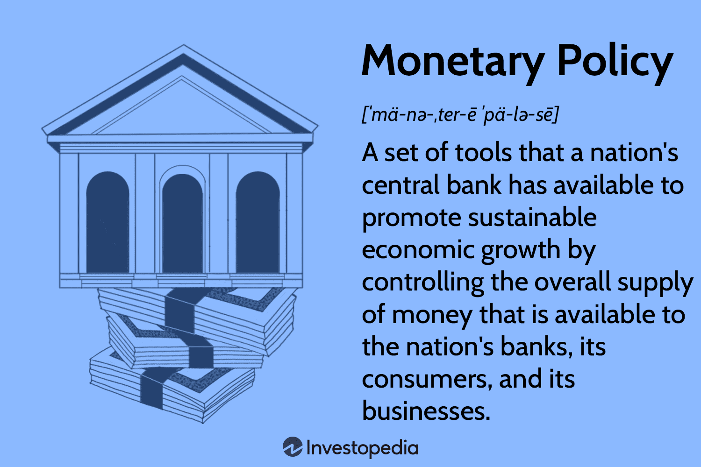

The intersection of money supply management, monetary policy, and algorithmic trading is becoming increasingly pivotal in shaping China's financial landscape. As a cornerstone in the Chinese economic architecture, monetary policy plays a crucial role by steering economic growth, stabilizing prices, and fostering employment. The People's Bank of China (PBoC), the nation's central bank, is the principal entity responsible for implementing these monetary policies to ensure economic balance and sustainability. Through a variety of tools like open market operations, interest rate adjustments, and reserve requirements, the PBoC adjusts the money supply to maintain economic stability.

Algorithmic trading, characterized by the use of complex algorithms to execute trades at rapid speeds, is an emerging force in financial markets worldwide, including China. Unlike traditional trading, algorithmic trading leverages computational power and advanced analytics to make trading decisions that optimize speed, efficiency, and precision. This evolution is reshaping the financial markets by increasing liquidity and reducing transaction costs. However, it also introduces risks like market volatility and potential systemic failures due to automated processes.



Navigating the current financial ecosystem involves understanding the delicate balance between regulatory landscapes and technological advancements. China's regulatory authorities are tasked with crafting rules that foster innovation while safeguarding market integrity and consumer protection. The increasing prevalence of algorithmic trading demands stronger regulatory frameworks to mitigate associated risks and ensure fair market practices.

This article aims to explore how China manages its money supply and monetary policies within the context of these technological innovations. By examining the synergies and tensions between regulatory measures and algorithmic strategies, we provide insights into how China is adapting its economic policies to harness technological advancements for economic growth without compromising financial stability.

## Table of Contents

## Understanding Money Supply Management

Money supply management is a critical aspect of economic policy, pivotal for ensuring economic stability and growth. It involves regulating the amount of money circulating in an economy to achieve macroeconomic objectives like controlling inflation, minimizing unemployment, and fostering economic growth.

The People's Bank of China (PBOC) plays a central role in controlling and adjusting the money supply within the Chinese economy. As the central bank, its responsibilities include formulating and implementing monetary policies that direct the money supply to desired economic outcomes. The primary tools leveraged by the PBOC for money supply management are open market operations, reserve requirements, and interest rate adjustments.

Open market operations involve the buying and selling of government securities in the open market. When the PBOC purchases securities, it injects [liquidity](/wiki/liquidity-risk-premium) into the banking system, increasing the money supply. Conversely, selling securities removes liquidity, decreasing the money supply. This method is flexible and can be adjusted daily based on the economic conditions.

Reserve requirements mandate the minimum fraction of deposits each bank must hold in reserves and not loan out. By altering these requirements, the PBOC can influence how much money banks have available to lend. Lowering reserve requirements means banks can lend more, thereby increasing the money supply. Increasing these requirements restricts lending, reducing the money supply.

Additionally, the PBOC can adjust benchmark interest rates—the rates at which banks borrow from each other or from the central bank. Lower interest rates make borrowing cheaper, encouraging spending and investment, thus increasing the money supply. Higher rates have the opposite effect, discouraging borrowing and contracting the money supply.

The impact of money supply on inflation, employment, and growth is profound. An appropriately managed money supply can keep inflation rates stable, support full employment, and maintain a steady trajectory of economic growth. However, an excessive increase in the money supply can lead to inflationary pressures, eroding purchasing power and potentially destabilizing the economy. Conversely, too restrictive a monetary stance might stifle growth and lead to higher unemployment rates.

In recent years, China's approach to money supply management has witnessed several trends. The PBOC has increasingly focused on more market-driven mechanisms, allowing for greater flexibility in monetary policy. This shift is in response to the complex global economic environment and the need for adaptive policy measures. Additionally, the PBOC has shown a growing reliance on new financial instruments and technological advancements to better gauge and manage monetary policy outcomes effectively.

In conclusion, money supply management, spearheaded by the PBOC, remains crucial in guiding China's economic stability and growth. The effective use of monetary policy tools, along with a strategic adaptation to global economic fluctuations, underscores the importance of robust money supply management in China's ongoing economic development.

## Monetary Policy in China

China's monetary policy framework is primarily shaped and executed by the People's Bank of China (PBoC), which is the nation's central bank. The primary objective of the PBoC's monetary policy is to maintain currency stability, promote economic growth, and stabilize the financial system. To achieve these goals, the PBoC employs a mix of direct and indirect instruments, adapting to the unique economic and financial landscape of China.

The People's Bank of China plays a crucial role in the implementation of monetary policies. It operates as the main authority that manages the liquidity in the banking system and regulates financial institutions in China. The central bank utilizes several tools to steer monetary conditions in the economy, such as [interest rate](/wiki/interest-rate-trading-strategies) adjustments, reserve requirements, and open market operations. By managing these levers effectively, the PBoC aims to influence monetary conditions, control inflation, and support economic objectives.

China practices two main types of monetary policies: expansionary and contractionary. Expansionary monetary policy is employed to inject liquidity into the economy, typically by lowering interest rates or reducing reserve requirements, thus encouraging borrowing and spending. Contractionary monetary policy, on the other hand, aims to withdraw liquidity from the market, often through increasing interest rates or raising reserve requirements, in order to curb inflation and prevent overheating in the economy.

In recent history, China has witnessed significant monetary policy interventions aimed at stabilizing economic fluctuations. For instance, during the 2008 global financial crisis, the PBoC adopted an expansionary policy stance by cutting interest rates and decreasing the reserve requirement ratio to stimulate growth. In contrast, in the period following the rapid economic expansion, the PBoC implemented contractionary measures to restrain rising inflation and asset bubbles.

Modernizing China's monetary policy poses both challenges and opportunities. One major challenge is the balancing act required to transition from a heavily controlled financial system to a more market-driven one, while maintaining stability. Furthermore, the integration of global financial markets means that external factors, such as U.S. Federal Reserve policies, have a growing influence on China's monetary landscape. On the opportunity side, advancements in financial technology, data analytics, and improved policy frameworks allow for more precise and responsive monetary interventions. The potential to leverage these innovations to enhance policy efficacy represents a promising avenue for the future of China's monetary policy.

Overall, monetary policy in China is characterized by a dynamic interplay between traditional policy tools and the evolving needs of a complex and globalized economic environment. The PBoC's strategic management of these elements remains vital to fostering a stable financial ecosystem while promoting sustainable economic growth.

## The Rise of Algorithmic Trading

Algorithmic trading refers to the use of computer algorithms to automate trading in financial markets. These algorithms make decisions on aspects such as timing, price, and quantity of trades, executing them at speeds and frequencies that are impossible for human traders. This form of trading relies on mathematical models and processors to minimize the [arbitrage](/wiki/arbitrage) opportunities and maximize efficiency and precision.

Globally, [algorithmic trading](/wiki/algorithmic-trading) has evolved significantly since its origins in the late 1970s and early 1980s. Initially, it was utilized within large investment banks and institutional investors to reduce transaction costs and enhance trading efficiency. By the 1990s, rapid advancements in computer technology and a broader acceptance of electronic trading platforms spurred widespread adoption. The growth was further accelerated by regulatory changes, such as the U.S. Securities and Exchange Commission's Regulation National Market System in 2007, which promoted fair competition among trading venues.

In China, the adoption of algorithmic trading has been relatively recent compared to Western markets but is expanding swiftly. Chinese financial markets witnessed a surge in the implementation of algorithmic trading strategies, partly due to the introduction of electronic trading platforms and increasing foreign investment through initiatives like the Stock Connect programs linking Shanghai, Shenzhen, and Hong Kong exchanges.

Algorithmic trading offers several benefits, primarily attributed to its speed, efficiency, and precision. Algorithms can evaluate market conditions and execute trades in microseconds, gaining a critical edge in temporal market dynamics. Efficiency is enhanced by minimizing the bid-ask spread, reducing transaction costs, and optimizing trade execution. Precision is improved by executing large orders in smaller, strategically timed quantities, thus minimizing market impact.

However, algorithmic trading carries inherent risks. It can exacerbate market [volatility](/wiki/volatility-trading-strategies), as seen in instances like the 2010 Flash Crash when the Dow Jones Industrial Average plummeted nearly 1,000 points within minutes, driven by algorithmic orders. Such systems, if not meticulously designed, can amplify errors, leading to substantial financial disruptions. Moreover, high-frequency trading, a subset of algorithmic trading, is often scrutinized for contributing to reduced transparency and increased systemic risk.

In China, regulatory oversight of algorithmic trading is crucial, given the potential for market disruptions. The China Securities Regulatory Commission (CSRC) has established various guidelines and rules to monitor and control algorithmic trading activities. Regulations mandate the registration and approval of algorithmic strategies, aiming to maintain market integrity and protect investors. These regulations are designed to ensure that trading algorithms adhere to established market norms and prevent practices that could threaten market stability.

As algorithmic trading continues to gain traction in China, balancing innovation and regulation is essential to leverage its advantages while safeguarding market stability.

## Integration: Money Supply, Policy, and Algorithmic Trading

Algorithmic trading has emerged as a significant force within China's financial markets, deeply intertwined with money supply management and monetary policy. As financial institutions increasingly deploy sophisticated algorithms to execute trades, their influence on these economic frameworks becomes ever more pertinent. 

### Influence of Algorithmic Trading on Money Supply Management

Algorithmic trading substantially impacts money supply management, primarily through its effect on market liquidity and volatility. By enabling high-speed execution of trades, algorithms enhance liquidity under typical market conditions, which, in turn, facilitates the smooth operation of monetary policies aimed at controlling the money supply. For instance, when the People’s Bank of China (PBOC) engages in open market operations to inject or withdraw liquidity, the presence of algorithmic trading ensures rapid absorption or release of these funds into the economy, thereby allowing for more effective regulation of money supply.

### Interactions Between Monetary Policy Decisions and Trading Algorithms

Algorithmic trading algorithms are designed to react quickly to monetary policy announcements and adjustments. This immediate response can sometimes amplify the intended effects of such policies. For example, an interest rate cut by the PBOC aimed at stimulating economic growth could be swiftly reinforced by algorithmic trading patterns that position themselves to take advantage of anticipated market movements. Conversely, these algorithms also have the potential to counteract monetary policy goals if misaligned with the policymakers' intentions, sometimes leading to increased market volatility.

### Role of Data Analytics and Machine Learning

Data analytics and [machine learning](/wiki/machine-learning) are increasingly pivotal in enhancing the efficacy of both monetary policy and algorithmic trading strategies. In the context of policy implementation, these technologies can analyze vast datasets to forecast economic trends and model the potential impacts of various policy decisions before they are enacted. When applied to algorithmic trading, machine learning can refine trading algorithms, making them more adaptive to market changes and better aligned with monetary policy intentions. For example, machine learning models could be developed to predict policy changes based on macroeconomic indicators or PBOC statements.

```python
import numpy as np
from sklearn.linear_model import LinearRegression

# Dummy data representing macroeconomic indicators
X = np.array([[1.0, 0.1], [2.0, 0.2], [3.0, 0.3], [4.0, 0.4]]) # e.g., inflation rate, GDP growth rate
y = np.array([0.25, 0.27, 0.30, 0.32])  # e.g., anticipated interest rate changes

# Simple linear regression model to predict policy changes
model = LinearRegression().fit(X, y)

# Predict the impact of new macroeconomic conditions
new_conditions = np.array([[5.0, 0.5]])
predicted_policy_change = model.predict(new_conditions)
print("Predicted Policy Change:", predicted_policy_change)
```

### Conflicts Between Traditional Policy Tools and High-Frequency Trading Strategies

There exist inherent tensions between traditional monetary policy tools and high-frequency trading ([HFT](/wiki/high-frequency-trading-strategies)) strategies. Traditional tools function over longer timescales and depend on relatively stable market conditions to be effective. In contrast, HFT strategies operate on extremely short timescales, often exploiting minute discrepancies for profit. This disparity can occasionally lead to conflicts, especially during market interventions where algorithms misinterpret policy intentions, leading to unintended market dynamics such as flash crashes—a sudden and severe drop in the value of certain securities.

### Alignment and Discord Between Monetary Policy and Algorithmic Trading Intentions

Examples of alignment occur when algorithmic trading supports the direction of monetary policies. For instance, during a government stimulus aimed at lowering borrowing costs, algorithmic trading can facilitate the quick dissemination of funds through efficiently priced credit instruments. Conversely, discord can manifest when trading algorithms, driven by short-term profit motives, exacerbate market conditions contrary to policy objectives, such as during unexpected geopolitical events or economic shocks. This discord underscores the necessity for continuous dialogue between policymakers and financial technologists to ensure alignment and mitigate adverse outcomes.

In summary, while algorithmic trading and monetary policy in China present both opportunities and challenges for money supply management, careful integration of these elements—supported by cutting-edge data analytics and machine learning—can enhance policy effectiveness and contribute to financial stability.

## Impact on Economic Stability and Growth

Effective money supply management is crucial for maintaining economic stability in China. By controlling the money supply, the People's Bank of China (PBOC) can influence inflation rates, employment levels, and overall economic growth. Proper management helps in stabilizing prices, ensuring full employment, and achieving sustainable economic growth. The instruments utilized, such as open market operations and adjusting reserve requirements, allow the PBOC to inject or withdraw liquidity from the economy, thereby stabilizing economic fluctuations.

Monetary policy management plays a significant role in tackling inflation and unemployment. When inflation rises, the central bank can implement contractionary policies, such as increasing interest rates or reserve requirements, which reduce the money supply and moderate inflation. Conversely, during periods of high unemployment, expansionary policies can boost economic activity by lowering interest rates and increasing the money supply, encouraging borrowing and investment.

Algorithmic trading is transforming financial markets by enhancing market liquidity and efficiency. By executing trades at high speed, algorithms enable markets to respond quickly to new information, which can tighten bid-ask spreads and increase market depth. This enhancement in liquidity supports a more stable market environment by reducing transaction costs and facilitating efficient price discovery.

However, algorithmic innovations also introduce certain risks to economic growth and stability. Algorithmic trading can, at times, contribute to market volatility, as evidenced by flash crashes where rapid selling or buying leads to sharp market price movements within a short period. Moreover, unregulated algorithmic strategies can exacerbate market distortions, potentially destabilizing the broader financial system.

Risks to economic stability are particularly pronounced with unregulated algorithms capable of executing large volumes of trades based on misinterpretations of market data. These can create feedback loops that amplify price movements and could potentially lead to systemic risks. To mitigate such threats, regulatory bodies may need to implement measures like circuit breakers to halt trading during extreme volatility and establish clear guidelines for algorithmic trading systems.

In conclusion, while the strategic management of money supply by China's central bank aids economic stability, the rise of algorithmic trading presents both opportunities and challenges. On the one hand, it promotes market efficiency and liquidity; on the other, it necessitates careful regulatory oversight to prevent destabilizing effects on the economy.

## Future Trends and Challenges

Predictions for the future direction of monetary policy and algorithmic trading in China indicate a complex interplay of technological advancements and regulatory adaptations. As China's financial markets increasingly embrace digital innovations, several issues arise that will require careful management to ensure economic stability.

**Technological Advancements in Financial Markets**

The continuous evolution of technology, notably in areas like [artificial intelligence](/wiki/ai-artificial-intelligence) (AI) and blockchain, is reshaping the landscape of financial markets. These advancements offer unprecedented opportunities for enhancing the efficiency and precision of trading systems. For instance, AI-driven algorithms enable faster data processing and more accurate predictions, potentially leading to better investment strategies.

However, this technological progress also presents challenges, such as the increased risk of cyber threats and the possibility of systemic disruptions due to technological failures. The sheer speed and [volume](/wiki/volume-trading-strategy) of transactions facilitated by algorithmic trading can exacerbate market volatility, posing a risk to financial stability.

**Expert Perspectives on Upcoming Challenges**

Policymakers, economists, and technology experts highlight several challenges anticipated in the future. Among these is the need for a regulatory framework that can keep pace with rapidly evolving technologies. Ensuring market transparency, protecting investor interests, and maintaining fair trading practices remain critical concerns.

Furthermore, experts stress the necessity of cross-sector collaboration to develop standards that support innovation without compromising market integrity. Insights from technology developers can provide valuable input into crafting effective regulations that address emerging threats while leveraging the benefits of technological advancements.

**Potential Regulatory Reforms**

To manage the rising influence of technology in finance, potential regulatory reforms could include more stringent oversight of algorithmic trading practices and enhanced cybersecurity measures. Regulations may also require firms to implement robust risk management systems to mitigate the impact of algorithm-induced market fluctuations.

Additionally, the introduction of sandbox environments could encourage innovation by allowing firms to test new technologies under regulatory supervision. This approach would enable regulators to better understand the implications of new financial technologies and devise informed policy responses.

**Global Economic Interconnectivity and China's Role**

As China's economy continues to integrate with global markets, the nation's approach to managing technological integration in finance will have significant international implications. China's evolving regulatory landscape can serve as a model for other emerging economies facing similar challenges.

Moreover, China's participation in global financial institutions and its role in shaping international standards will influence the direction of worldwide market practices. Collaborative international efforts are essential to address the cross-border nature of financial transactions and ensure the stability of interconnected markets.

In conclusion, the interplay of monetary policy and algorithmic trading in China is poised to significantly influence the global financial system. Addressing the dual challenges of technological advancement and regulatory adequacy will be critical in ensuring sustainable economic growth and stability. Continued research and dialogue among stakeholders will be essential to navigate this rapidly evolving landscape.

## Conclusion

The integration of monetary policy and algorithmic trading embodies a transformative shift in China’s financial landscape. The juxtaposition of traditional monetary mechanisms with cutting-edge algorithmic technologies presents a dual opportunity to reinforce economic policy tools and potentially disrupt existing frameworks. China stands poised to lead in pioneering innovative approaches in economic policy, given its vast technological capacity and willingness to embrace digital advancements. The potential resides in orchestrating a balance between fostering economic growth and ensuring financial market stability. This balance is crucial in light of the rapid evolution and adoption of algorithmic trading platforms, which offer enhanced speed and precision but also introduce new risks.

Ensuring that monetary policy effectively aligns with and regulates these technologies mandates ongoing research and a robust regulatory framework. Continuous surveillance of market dynamics paired with agile policy adjustments will be necessary to mitigate risks associated with high-frequency trading and market volatility. Given the implications of unregulated algorithmic strategies on economic stability, a vigilant approach must be maintained. It is essential for China to undertake proactive measures, ensuring that regulatory frameworks evolve in tandem with technological advancements.

Collaboration between policymakers and technology developers will be critical. Synergistic efforts can help design strategies that harness algorithmic trading's potential while safeguarding economic stability. By fostering a cooperative environment, informed by insights from both financial and technological sectors, China can develop comprehensive policies that are both forward-looking and adaptive. This approach not only promises to bolster China’s standing in global financial markets but also ensures a balanced progression that marries growth with stability. As these fields continue to advance, the need for collaboration will only intensify, demanding an ongoing dialogue between diverse stakeholders in the financial ecosystem.

## References & Further Reading

[1]: Brandt, L. L., Ma, D., & Rawski, T. G. (2014). ["From Divergence to Convergence: Reevaluating the History Behind China's Economic Boom"](https://sites.pitt.edu/~tgrawski/papers/Brandt-Ma-Rawski%20From%20Divergence%20to%20Convergence%20JEL%20v52%20no1.pdf). Cambridge University Press.

[2]: de Prado, M. L. (2018). ["Advances in Financial Machine Learning"](https://www.amazon.com/Advances-Financial-Machine-Learning-Marcos/dp/1119482089). Wiley.

[3]: China Securities Regulatory Commission (CSRC). ["Regulation of Algorithmic Trading."](https://www.simmons-simmons.com/en/publications/clv0p69v400oguatcgulu4gv9/new-regulations-on-program-trading-in-the-chinese-securities-market)

[4]: Tang, H., & Xia, L. (2018). ["China's Monetary Policy and Interest Rate Liberalization."](http://www.jryj.org.cn/EN/Y2021/V490/I4/1) Reserve Bank of Australia.

[5]: Zhang, C., & Elston, E. (2016). ["The Evolution of China's Monetary Policy Framework"](https://onlinelibrary.wiley.com/doi/full/10.1111/1475-4932.12576). International Monetary Fund Working Paper.