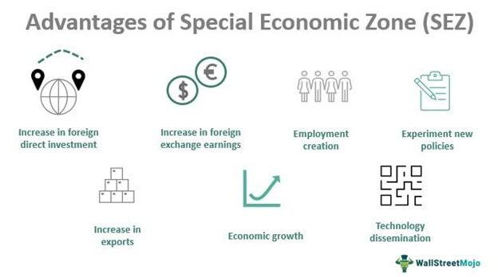

## Table of Contents

## What is monetary regulation?

Monetary regulation refers to the rules and actions that governments and central banks use to control the money supply and interest rates in an economy. The main goal is to keep the economy stable, control inflation, and help it grow. Central banks, like the Federal Reserve in the United States, use tools such as setting interest rates, buying or selling government bonds, and changing reserve requirements for banks to manage the amount of money circulating in the economy.

When there's too much money, prices can go up quickly, which is called inflation. To stop this, the central bank might raise interest rates to make borrowing more expensive, which slows down spending and cools the economy. On the other hand, if the economy is slow and people are not spending enough, the central bank might lower interest rates to make borrowing cheaper, encouraging people and businesses to spend more and boost the economy. This balancing act helps keep the economy running smoothly.

## Why is monetary regulation important for India?

Monetary regulation is very important for India because it helps keep the country's economy stable. The Reserve Bank of India (RBI) is in charge of this. They control how much money is in the economy and set interest rates. This is important because if there's too much money, prices can go up too fast, which is bad for people. If there's not enough money, businesses might not grow, and people might lose jobs. So, the RBI tries to find a good balance to keep prices stable and help the economy grow.

Another reason monetary regulation is important for India is that it helps the country deal with problems from other countries. For example, if the price of oil goes up a lot, it can make things more expensive in India. The RBI can use monetary policy to help control these effects. By changing interest rates or the amount of money in the economy, the RBI can help protect India from big changes happening around the world. This makes the economy stronger and more able to handle tough times.

## Who is responsible for monetary regulation in India?

The Reserve Bank of India (RBI) is the organization responsible for monetary regulation in India. The RBI controls how much money is in the economy and sets the interest rates. This is important because it helps keep prices stable and encourages the economy to grow. If there's too much money, prices can go up too fast, which is not good for people. If there's not enough money, businesses might struggle, and people might lose their jobs. So, the RBI works to find a good balance.

The RBI also helps protect India from problems that happen in other countries. For example, if the price of oil goes up a lot, it can make things more expensive in India. The RBI can use its powers to help control these effects. By changing interest rates or the amount of money in the economy, the RBI can help make sure that big changes happening around the world don't hurt India too much. This makes the economy stronger and better able to handle tough times.

## What are the main objectives of monetary policy in India?

The main objectives of monetary policy in India are to keep prices stable and help the economy grow. The Reserve Bank of India (RBI) tries to make sure that prices don't go up too fast. If prices rise too quickly, it can make life harder for people because they have to pay more for things they need. By controlling the amount of money in the economy and setting interest rates, the RBI can help keep prices steady.

Another important goal is to encourage the economy to grow. If the economy is not doing well, the RBI might lower interest rates to make borrowing cheaper. This can help businesses get loans to expand and create more jobs. When people and businesses spend more, it can boost the economy. The RBI tries to find a good balance between keeping prices stable and helping the economy grow.

The RBI also aims to manage risks from outside India. For example, if the price of oil goes up a lot, it can make things more expensive in India. The RBI can use its tools to help control these effects. By changing interest rates or the amount of money in the economy, the RBI can help protect India from big changes happening around the world. This makes the economy stronger and better able to handle tough times.

## How does the Reserve Bank of India (RBI) implement monetary policy?

The Reserve Bank of India (RBI) uses different tools to control the amount of money in the economy and set interest rates. One way they do this is by changing the repo rate, which is the rate at which banks can borrow money from the RBI. If the RBI wants to slow down the economy and stop prices from going up too fast, they might raise the repo rate. This makes borrowing more expensive for banks, and they might then charge higher interest rates to people and businesses. On the other hand, if the RBI wants to help the economy grow, they might lower the repo rate, making borrowing cheaper and encouraging more spending.

Another tool the RBI uses is the cash reserve ratio (CRR), which is the amount of money banks have to keep with the RBI. If the RBI increases the CRR, banks have less money to lend out, which can slow down the economy. If they lower the CRR, banks have more money to lend, which can help the economy grow. The RBI also buys and sells government bonds in what's called open market operations. When they buy bonds, they put more money into the economy, and when they sell bonds, they take money out. By using these tools, the RBI tries to keep prices stable and help the economy grow.

## What are the key tools used by the RBI for monetary regulation?

The Reserve Bank of India (RBI) uses several tools to control the amount of money in the economy and set interest rates. One important tool is the repo rate, which is the rate at which banks can borrow money from the RBI. If the RBI wants to slow down the economy and stop prices from going up too fast, they might raise the repo rate. This makes borrowing more expensive for banks, and they might then charge higher interest rates to people and businesses. On the other hand, if the RBI wants to help the economy grow, they might lower the repo rate, making borrowing cheaper and encouraging more spending.

Another tool the RBI uses is the cash reserve ratio (CRR), which is the amount of money banks have to keep with the RBI. If the RBI increases the CRR, banks have less money to lend out, which can slow down the economy. If they lower the CRR, banks have more money to lend, which can help the economy grow. The RBI also uses open market operations, where they buy and sell government bonds. When they buy bonds, they put more money into the economy, and when they sell bonds, they take money out. By using these tools, the RBI tries to keep prices stable and help the economy grow.

## How has monetary policy in India evolved over the years?

Over the years, the way the Reserve Bank of India (RBI) manages money has changed a lot. In the beginning, the RBI used to control the amount of money very strictly. They would tell banks how much money they could lend and what interest rates they could charge. This was called a 'regulated' system. But as time went on, the RBI started to let banks decide more for themselves. This is called a 'deregulated' system. Now, the RBI mostly uses tools like the repo rate, which is the rate at which banks borrow from the RBI, and the cash reserve ratio, which is how much money banks have to keep with the RBI, to control the economy.

More recently, the RBI has focused on keeping prices stable. They set a target for inflation, which is how fast prices are going up, and try to keep it within that range. This is called inflation targeting. The RBI also uses open market operations, where they buy and sell government bonds, to add or take away money from the economy. These changes have helped India's economy grow and become more stable. The RBI keeps adjusting its policies to make sure they work well with what's happening in the world and in India.

## What are the current challenges faced by the RBI in monetary regulation?

The Reserve Bank of India (RBI) faces many challenges in managing money and keeping the economy stable. One big challenge is dealing with inflation. Prices keep going up, and it's hard for the RBI to keep them under control. They have to find the right balance between making sure prices don't rise too fast and helping the economy grow. If they raise interest rates too much to stop inflation, it might slow down the economy too much. But if they don't do enough, prices could go up even more.

Another challenge is dealing with problems from other countries. Things like the price of oil or changes in the global economy can affect India. The RBI has to use its tools to protect the country from these effects. It's tricky because they need to keep the economy strong while also making sure it can handle tough times from outside. The RBI also has to watch out for risks in the banking system. If banks are not lending enough or if they are taking too many risks, it can hurt the economy. So, the RBI needs to keep a close eye on everything to make sure the economy stays healthy.

## How does monetary regulation impact inflation in India?

Monetary regulation in India helps control inflation by managing how much money is in the economy. The Reserve Bank of India (RBI) uses tools like the repo rate and cash reserve ratio to do this. If there's too much money, prices can go up too fast, which is called inflation. To stop this, the RBI might raise the repo rate, making borrowing more expensive for banks. When banks charge higher interest rates to people and businesses, it can slow down spending and help keep prices from going up too quickly.

On the other hand, if the economy is slow and prices are not going up enough, the RBI might lower the repo rate. This makes borrowing cheaper, which can encourage people and businesses to spend more. When spending goes up, it can help the economy grow, but the RBI has to be careful not to let prices rise too fast. By finding the right balance, the RBI tries to keep inflation at a level that is good for the economy. This means prices go up a little bit each year, but not so much that it makes life hard for people.

## What role does monetary regulation play in economic growth in India?

Monetary regulation helps the economy in India grow by controlling how much money is in the economy and setting interest rates. The Reserve Bank of India (RBI) uses tools like the repo rate to do this. If the economy is not doing well, the RBI might lower the repo rate to make borrowing cheaper. This encourages businesses to take loans and invest in new projects, which can create more jobs and help the economy grow. When people and businesses spend more, it boosts the economy and helps it get stronger.

The RBI also has to make sure that the economy doesn't grow too fast, which can make prices go up too quickly. If prices rise too fast, it can be bad for people because they have to pay more for things they need. To stop this, the RBI might raise the repo rate, making borrowing more expensive. This slows down spending and helps keep prices stable. By finding the right balance between encouraging growth and keeping prices under control, the RBI helps the economy in India stay healthy and grow in a steady way.

## How do international factors influence monetary regulation in India?

International factors can have a big impact on how the Reserve Bank of India (RBI) manages the economy. For example, if the price of oil goes up a lot, it can make things more expensive in India. This is because India has to buy a lot of oil from other countries. When the price of oil goes up, it can lead to higher prices for everything, which is called inflation. The RBI has to use its tools, like changing interest rates or the amount of money in the economy, to try to control these effects and keep prices stable.

Another way international factors influence monetary regulation is through changes in the global economy. If other countries are doing well, it can help India's economy grow too. But if there's a big problem in another country, like a financial crisis, it can hurt India's economy. The RBI has to be ready to adjust its policies to protect India from these ups and downs. By watching what's happening around the world, the RBI can make better decisions to keep the economy strong and stable.

## What are some advanced strategies used by the RBI to manage liquidity and interest rates?

The Reserve Bank of India (RBI) uses a few smart ways to control how much money is in the economy and set interest rates. One way is through something called the Liquidity Adjustment Facility (LAF). This lets banks borrow money from the RBI for a short time if they need it. The RBI can change the [interest rate](/wiki/interest-rate-trading-strategies) for this borrowing, which is called the repo rate. If they want to put more money into the economy, they might lower the repo rate so banks can borrow cheaper. If they want to take money out of the economy, they might raise the repo rate, making borrowing more expensive. This helps the RBI keep the right amount of money flowing in the economy.

Another strategy is using open market operations, where the RBI buys or sells government bonds. When the RBI buys bonds, they put more money into the economy because they pay for the bonds with cash. When they sell bonds, they take money out of the economy because people and banks have to pay for the bonds with cash. The RBI can also use something called the Marginal Standing Facility (MSF), which lets banks borrow extra money from the RBI at a higher interest rate if they really need it. This helps the RBI manage sudden changes in how much money banks need. By using these tools, the RBI can keep the economy stable and help it grow.

## References & Further Reading

[1]: ["Reserve Bank of India Act, 1934"](https://www.indiacode.nic.in/bitstream/123456789/9176/1/a1934-2reserve.pdf). Reserve Bank of India.

[2]: Sinha, A. A. (2018). ["An Overview of Algorithmic Trading Regulation in India."](http://editors.cis-india.org/internet-governance/blog/ai-in-india-a-policy-agenda) Madras School of Economics.

[3]: Balasubramanian, R., & Ramachandran, G. (2018). ["The Impact of Algorithmic Trading on Indian Capital Markets: A Case Study Approach."](https://pmc.ncbi.nlm.nih.gov/articles/PMC5958595/) Indian Institute of Management Ahmedabad.

[4]: ["SEBI Guidelines on Algorithmic Trading"](https://www.sebi.gov.in/legal/circulars/mar-2012/broad-guidelines-on-algorithmic-trading_22471.html). Securities and Exchange Board of India.

[5]: Gopinath, S., & Rajan, R. (Eds.). (2011). ["Indian Securities Market: A Review."](https://www.ijpsonline.com/articles/a-rphplc-method-for-simultaneous-estimation-of-paracetamol-and-aceclofenac-in-tablets.html) Securities and Exchange Board of India.

[6]: ["Demonetization and Black Money"](https://www.researchgate.net/publication/318010845_Black_Money_and_Demonetisation). NITI Aayog, Government of India.

[7]: Narain, U., & Sharma, D. (2016). ["High-Frequency Trading: Is SEBI Prepared?"](https://www.firstpost.com/business/explained-what-is-the-nse-co-location-scam-how-ravi-narain-and-chitra-ramkrishna-are-involved-in-it-10391841.html) Vikalpa: The Journal for Decision Makers.

