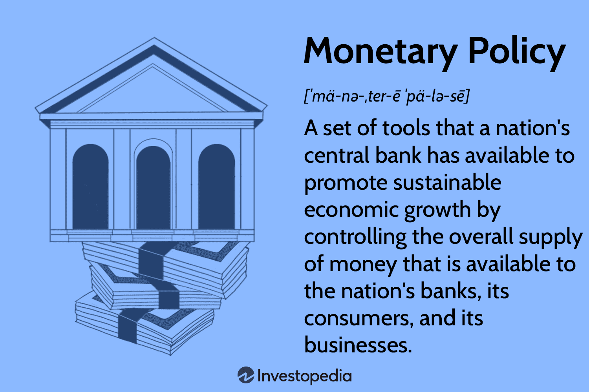

## Table of Contents

## What is a monetary reserve?

A monetary reserve is like a savings account for a country or a central bank. It's a stash of money and other assets that they keep to make sure they can handle their financial responsibilities. These reserves can include foreign currencies, gold, and other special drawing rights from international financial organizations.

Countries use their monetary reserves to keep their own currency stable and to help their economy run smoothly. For example, if a country's currency is getting too weak compared to other countries, they might use their reserves to buy their own currency and make it stronger. It's like having an emergency fund that helps a country manage its money and trade with other countries without too much trouble.

## Why are monetary reserves important for a country's economy?

Monetary reserves are really important for a country's economy because they act like a safety net. Imagine if a country suddenly needs a lot of money to pay for things like imports or to help its currency from getting too weak. That's where the reserves come in. They give the country a way to handle these situations without panicking. It's like having some money saved up for a rainy day, but on a much bigger scale.

Also, having good monetary reserves can make other countries and investors feel more confident about a country's economy. If people see that a country has a strong reserve, they might be more willing to do business with it or invest in it. This can help the country's economy grow and stay stable. So, in a way, monetary reserves are not just about having money saved up; they're also about showing the world that a country is financially responsible and ready for whatever comes its way.

## How do monetary reserves differ from foreign exchange reserves?

Monetary reserves and foreign exchange reserves are related but not exactly the same thing. Monetary reserves are a broader term that includes all the assets a country or central bank holds to manage its economy. This can include foreign currencies, gold, and special drawing rights from international financial organizations. So, monetary reserves are like a big savings account that helps a country handle its financial responsibilities and keep its economy stable.

Foreign exchange reserves, on the other hand, are a specific part of monetary reserves. They only include the foreign currencies that a country holds. These are used mainly to influence the country's currency value in the global market and to pay for international trade. So, while foreign exchange reserves are an important part of monetary reserves, they are just one piece of the puzzle. Think of foreign exchange reserves as the cash in different currencies that a country keeps handy, while monetary reserves are the whole financial safety net.

## What are the main functions of monetary reserves?

Monetary reserves help a country keep its economy stable. They act like a big savings account that a country can use when it needs money quickly. For example, if a country needs to buy things from other countries, it can use its reserves to pay for those imports. Also, if the country's own money starts to get too weak compared to other countries' money, it can use its reserves to buy its own currency and make it stronger. This helps keep the economy running smoothly and prevents big problems.

Another important job of monetary reserves is to make other countries and investors feel confident about a country's economy. When a country has a lot of reserves, it shows that it is ready for emergencies and can handle its money well. This can make other countries and businesses more willing to trade with it or invest in it. So, having good monetary reserves not only helps a country manage its own money but also helps it build trust with the rest of the world.

## How are monetary reserves managed by central banks?

Central banks manage monetary reserves by keeping a close eye on them and using them when needed. They make sure the reserves are big enough to handle any financial emergencies. If the country's currency starts to get too weak, the central bank might use some of the reserves to buy their own currency and make it stronger. They also use the reserves to pay for things the country needs to buy from other countries. It's like having a big savings account that the central bank can use to keep the economy running smoothly.

Central banks also have to be careful about how they use the reserves. They need to make sure they don't use too much at once, or they might run out when they really need it. They also have to keep track of how much money is coming in and going out of the country. This helps them decide when to use the reserves and how much to use. By managing the reserves well, central banks can help keep the country's economy stable and make sure it's ready for any financial surprises.

## What historical events have significantly impacted the development of monetary reserves?

One big event that changed how countries think about monetary reserves was the Great Depression in the 1930s. During this time, many countries saw their economies fall apart, and they realized they needed a way to protect themselves from such big problems. This led to countries starting to keep more money and gold as reserves. They wanted to make sure they had enough to help their economy if things got bad again. The Great Depression showed everyone that having a good amount of reserves could help a country get through tough times.

Another important event was the end of the Bretton Woods system in the early 1970s. Before this, countries had agreed to keep their currencies linked to the US dollar, which was linked to gold. But when the US stopped linking the dollar to gold, it changed everything. Countries had to start thinking about new ways to manage their money and keep their economies stable. This led to more focus on having strong monetary reserves, not just in gold but also in different currencies. The end of Bretton Woods made countries realize they needed to be ready for big changes in the world's money system.

## Can you explain the role of the International Monetary Fund (IMF) in relation to monetary reserves?

The International Monetary Fund (IMF) helps countries manage their monetary reserves. It does this by giving countries money when they need it, kind of like a global emergency fund. If a country is having money problems and doesn't have enough reserves, it can ask the IMF for help. The IMF will lend them money, but the country has to follow certain rules to get the loan. This helps the country keep its economy stable and build up its reserves again.

The IMF also keeps an eye on how countries are doing with their money. It gives advice and helps countries make plans to keep their economies strong. This includes making sure they have enough reserves. The IMF has something called Special Drawing Rights (SDRs), which are like a special kind of money that countries can use to add to their reserves. By doing all these things, the IMF helps make sure that countries can handle their money well and stay ready for any financial problems that might come up.

## How do monetary reserves influence a country's monetary policy?

Monetary reserves play a big role in a country's monetary policy, which is all about how a country manages its money. When a country has a lot of reserves, it can use them to help keep its currency stable. For example, if the currency starts to get too weak, the country can use its reserves to buy its own currency and make it stronger. This helps keep prices from going up too fast and keeps the economy running smoothly. Having good reserves also gives the country's central bank more options when it comes to setting interest rates and controlling how much money is in the economy.

On the other hand, if a country doesn't have enough reserves, it might have to be more careful with its monetary policy. It might not be able to help its currency as much if it starts to get weak. This can make the economy less stable and might cause problems like higher prices or less money for people to spend. So, having enough reserves is important for a country to have a strong and flexible monetary policy. It helps the country be ready for any money problems and keep its economy on track.

## What are the risks associated with holding large monetary reserves?

Holding large monetary reserves can be risky for a country. One big risk is that the money in the reserves might lose value over time. This can happen if the currencies or assets in the reserves go down in value. For example, if a country holds a lot of a certain currency and that currency becomes weaker, the reserves will be worth less. This can make it harder for the country to use the reserves when it needs them.

Another risk is that holding large reserves can make a country miss out on other ways to use that money. Instead of keeping the money in reserves, a country could use it to invest in things like schools, hospitals, or roads. If the reserves are too big, the country might not be using its money in the best way. It's like having too much money saved up and not spending it on things that could help the country grow and improve.

## How have strategies for managing monetary reserves evolved over time?

Over time, how countries manage their monetary reserves has changed a lot. In the past, countries mostly kept their reserves in gold because gold was seen as a safe and valuable asset. But after big events like the Great Depression and the end of the Bretton Woods system, countries started to think differently. They began to keep their reserves in different currencies and other assets, not just gold. This change helped countries be more flexible and ready for changes in the world's money system.

Today, countries use a mix of strategies to manage their reserves. They keep a close eye on their reserves and use them to keep their currency stable and their economy running smoothly. They also work with international organizations like the IMF to make sure they have enough reserves and can get help if they need it. Countries now think about the risks of holding too many reserves and try to balance having enough for emergencies with using the money for other important things like investments in their own country. This shows how strategies for managing reserves have become more complex and thoughtful over time.

## What are the current global trends in monetary reserve composition?

Right now, countries around the world are keeping their monetary reserves in a mix of different things. The US dollar is still the most popular currency for reserves, but its share is slowly going down a bit. More countries are starting to keep some of their reserves in other currencies like the euro, the Chinese yuan, and even the Japanese yen. This shows that countries want to spread out their risk and not keep all their eggs in one basket. They are also holding onto some gold, but not as much as they used to.

Another trend is that countries are thinking more about how to use their reserves wisely. They want to make sure they have enough for emergencies, but they also don't want to hold onto too much money that could be used for other important things. Some countries are using special drawing rights from the IMF to add to their reserves, which gives them more options. Overall, the way countries are managing their reserves is becoming more balanced and careful, as they try to keep their economies stable and ready for whatever might happen.

## How do advanced economic models predict the optimal level of monetary reserves for a country?

Advanced economic models help countries figure out how much money they should keep in their monetary reserves. These models look at a lot of things, like how much money the country uses for buying things from other countries, how stable its own currency is, and what might happen in the future. They use math to predict how much money the country might need in case of emergencies, like if the currency gets too weak or if there's a big financial problem. The goal is to find the right amount of reserves that will keep the economy safe without holding onto too much money that could be used for other important things.

These models also take into account how the world's money system is changing. They consider things like how other countries are doing with their money and what might happen if there are big changes in the global economy. By looking at all these factors, the models can give countries a good idea of the best amount of reserves to have. This helps countries make smart decisions about their money and keep their economies stable and ready for whatever might come up.

## References & Further Reading

[1]: Bordo, M. D., & Schwartz, A. J. (Eds.). (1984). ["A Retrospective on the Classical Gold Standard, 1821-1931."](https://press.uchicago.edu/ucp/books/book/chicago/R/bo3614501.html) University of Chicago Press.

[2]: Eichengreen, B. (2008). ["Globalizing Capital: A History of the International Monetary System."](https://www.jstor.org/stable/j.ctt7pfmc) Princeton University Press.

[3]: Friedman, M. (1962). ["The Case for Flexible Exchange Rates."](https://www.cato.org/sites/cato.org/files/serials/files/cato-journal/2018/4/cj-v38n2-3.pdf) In Essays in Positive Economics. University of Chicago Press.

[4]: Johnson, H. G., & Frenkel, J. A. (Eds.). (1976). ["The Monetary Approach to the Balance of Payments."](https://www.sciencedirect.com/science/article/pii/0022199677900393) Routledge.

[5]: Harris, L. (2003). ["Trading and Exchanges: Market Microstructure for Practitioners."](https://www.amazon.com/Trading-Exchanges-Market-Microstructure-Practitioners/dp/0195144708) Oxford University Press.