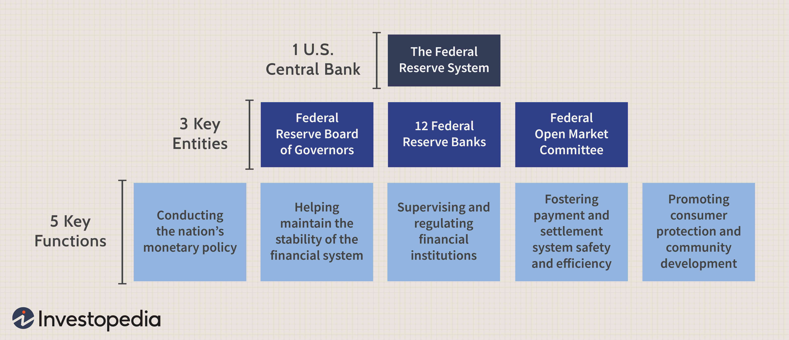

In this article, we explore the complexities of the financial system, focusing on monetary reserves, economic history, and algorithmic trading. Monetary reserves are essential for stabilizing currencies and economic systems, as they consist of key holdings like currencies, precious metals, and liquid assets maintained by central banks. These reserves support national currencies and stabilize the money supply, helping to regulate currency values and facilitate international trade.

The historical evolution of monetary reserves provides critical insights into the development of economic strategies. From the gold and silver standards to the modern reliance on paper currencies and commodities, the use of monetary reserves has undergone significant transformation. Key milestones, such as the Gold Standard era and the Bretton Woods Agreement post-World War II, highlight shifts in economic policies and the eventual move to currency and commodity-based reserves.

Algorithmic trading has revolutionized financial markets, offering both challenges and opportunities. By utilizing computer algorithms to automate trading processes, algorithmic trading has enhanced market efficiency and liquidity, although it also raises concerns about market stability and information asymmetry. As we unravel these components, we consider their implications for the modern economy, recognizing how they shape global financial systems. Understanding these elements is vital for navigating today's dynamic economic landscape, where monetary reserves remain a central pillar in maintaining currency value and economic fortitude.

## Table of Contents

## The Role of Monetary Reserves in the Financial System

Monetary reserves are critical holdings of assets such as foreign currencies, precious metals, and other liquid assets, primarily maintained by central banks. These reserves serve multiple essential functions that are vital for the stability and functionality of national and global economies.

Firstly, monetary reserves underpin national currencies, providing a financial buffer that builds confidence in a country's economic stability. By holding substantial reserves, a country assures foreign and domestic investors of its ability to meet economic obligations, thereby bolstering trust in its currency. This trust is crucial for stabilizing the money supply, as it directly influences inflation rates and overall economic health. 

Central banks employ monetary reserves as a tool to regulate currency values. By buying or selling foreign currencies, a central bank can influence exchange rates, making exports more competitive or imports less expensive, depending on economic needs. This manipulation of currency values through reserves is a form of monetary policy that aids in achieving macroeconomic objectives such as controlling inflation, fostering employment, and encouraging sustainable economic growth.

Moreover, reserves are pivotal in facilitating international trade. They enable countries to transact smoothly in the global market by ensuring that international payment obligations can be met without resorting to more disruptive measures. This role is particularly vital for developing countries, which may experience imbalances in trade and capital flows, requiring a stable reserve to manage such fluctuations.

Understanding the use of monetary reserves is essential for comprehending broader economic policies. These reserves are intertwined with various economic strategies, influencing decisions on interest rates, government borrowing, and fiscal policies. Consequently, a deep understanding of monetary reserves translates to a better grasp of the overall economic environment, aiding policymakers, investors, and scholars in navigating economic landscapes effectively.

In summary, monetary reserves are a cornerstone of economic stability. They stabilize national currencies, facilitate trade, and are instrumental in broader economic policy implementation. Central banks' strategic management of these reserves is crucial to maintaining both national and international economic equilibrium.

## Historical Evolution of Monetary Reserves

The concept of monetary reserves has undergone significant transformations throughout history, reflecting the changing dynamics of the global economic system. Initially, monetary reserves were closely linked to tangible assets like gold and silver, forming the basis for many early currency systems. The Gold Standard, a dominant monetary system in the 19th and early 20th centuries, tied the value of currency directly to a specific quantity of gold. Under this system, international exchange rates were fixed, as currencies were valued against their gold reserves.

The Gold Standard offered stability and predictability in international trade by minimizing currency fluctuations. However, it also imposed constraints on monetary policy, as the money supply was intrinsically linked to the availability of gold. This limitation often led to deflationary pressures during periods of economic downturn, as governments could not freely adjust the money supply to stimulate growth.

The Bretton Woods Agreement, established in 1944 near the end of World War II, marked a significant shift in monetary reserve policy. This agreement introduced a modified gold exchange standard whereby the U.S. dollar was pegged to gold, and other currencies were pegged to the U.S. dollar. This system aimed to provide the benefits of the Gold Standard’s stability while offering more flexibility in monetary policy.

The Bretton Woods system facilitated post-war economic recovery and growth by allowing countries to adjust their exchange rates within a fixed band, promoting trade and investment. However, over time, the fixed exchange rate system became unsustainable due to differing national economic policies and the United States' role as the main reserve currency issuer, leading to imbalances and tensions in global trade.

In 1971, the U.S. unilaterally terminated the convertibility of the dollar to gold, effectively ending the Bretton Woods system and marking the beginning of a new era characterized by floating exchange rates and diversified monetary reserves. Countries began to hold a mix of foreign currencies, securities, and other liquid assets as reserves, providing greater flexibility but also introducing new challenges, such as currency [volatility](/wiki/volatility-trading-strategies) and speculative attacks.

Today, the evolution towards currency and commodity-based reserves reflects the complexity and interconnectedness of the modern financial system. Central banks manage a diverse portfolio of assets to stabilize their currencies, influence exchange rates, and respond to economic crises, underscoring the strategic importance of monetary reserves in global finance.

## Understanding Algorithmic Trading and Its Impact

Algorithmic trading employs computer algorithms to automate and optimize trading processes and decision-making. This strategy leverages advanced mathematical models to execute large orders and manage financial portfolios with precision and speed, reducing human intervention in trading activities. By using predefined criteria and high-frequency data analysis, [algorithmic trading](/wiki/algorithmic-trading) has notably increased market efficiency and [liquidity](/wiki/liquidity-risk-premium).

One of the primary benefits of algorithmic trading is its ability to enhance liquidity in financial markets. By automatically executing trades, algorithms can respond faster to market conditions, providing a more efficient match between buyers and sellers. This increased liquidity often results in tighter bid-ask spreads, benefiting all market participants with lower trading costs. For instance, many studies have indicated a positive correlation between algorithmic trading and market liquidity across various asset classes, including equities and foreign exchange.

Additionally, algorithmic trading is linked to a reduction in market volatility, particularly in the foreign exchange sector. By rapidly assimilating and acting on market information, algorithms can dampen the effects of large orders on price movements, potentially minimizing the occurrence of flash crashes or sudden price spikes. Research supports that algorithm-generated trades tend to distribute buying and selling pressure more evenly over time, contributing to a more stable market environment.

However, while algorithmic trading offers increased liquidity and potentially lower volatility, it poses certain challenges that need careful attention. One major concern is the potential impact on market stability. Since algorithms operate at high speeds, malfunctioning code or erroneous data can lead to unintended market moves, famously evidenced by the 2010 Flash Crash. Moreover, the growing prevalence of algorithmic trading can lead to information asymmetry, where certain market participants, equipped with advanced algorithms and technology, have a pronounced advantage over those using traditional trading methods.

Furthermore, the reliance on sophisticated algorithms raises risks connected to transparency and fairness in markets. Ensuring that algorithms operate within legal and ethical frameworks remains a top priority for regulators, as improper use can exacerbate systemic risks and erode investor trust.

In conclusion, while algorithmic trading significantly elevates market efficiency and liquidity, addressing its inherent challenges is crucial for maintaining a stable and equitable financial system. As technologies evolve, continuous assessment and adaptation of regulatory measures are imperative to harness the full potential of algorithmic trading, ensuring it serves the broader goals of economic growth and market integrity.

## Monetary Policy and Its Influence on Financial Markets

Monetary policy plays a fundamental role in shaping economic stability and growth. Central banks, such as the Federal Reserve in the United States, employ a variety of tools to achieve their policy objectives. Two of the most prominent mechanisms are reserve requirements and open market operations.

Reserve requirements refer to the proportion of deposits that banks must hold either in their vaults or as deposits at the central bank. By adjusting these requirements, central banks can directly influence the amount of money available for lending, thereby impacting the broader money supply. A lower reserve requirement increases bank liquidity, potentially stimulating economic activity by enabling more extensive lending. Conversely, raising reserve requirements can act as a brake on excessive lending and inflation.

Open market operations involve the buying and selling of government securities in the open market to regulate the supply of money. When a central bank purchases securities, it injects liquidity into the banking system, lowering interest rates and encouraging borrowing and investment. Conversely, selling securities withdraws liquidity, increasing interest rates and potentially slowing economic activity.

Interest rates are a critical component of monetary policy. By manipulating interest rates, central banks can exert influence over economic factors such as consumer spending, business investment, and inflation. For instance, lowering interest rates reduces the cost of borrowing, which can lead to higher consumption and investment, promoting economic growth. On the other hand, increasing interest rates can help control inflation by discouraging borrowing and spending.

The Federal Reserve, tasked with maintaining economic stability and promoting maximum employment, adapts its monetary policy tools based on prevailing economic conditions. By analyzing data on GDP growth, unemployment rates, and inflation, the Fed can tailor its policy decisions to meet its dual mandate. The effectiveness of these policy tools is critical, as they have direct implications for market movements and investor expectations.

Understanding the intricacies of monetary policy is essential for anticipating future economic conditions and market trends. For investors and businesses, insight into potential shifts in policy can provide a strategic advantage in investment planning and risk management.

Monetary policy's influence on financial markets is profound. Shifts in policy can alter expectations, influence asset prices, and shape the economic landscape significantly. As central banks continue to evolve their strategies in response to new challenges, the role of monetary policy in guiding economic outcomes remains crucial.

## Conclusion

The interconnectedness of monetary reserves, economic policies, and current trading practices fundamentally influences global financial systems. Mastery of these elements is crucial for successfully navigating today's dynamic economic environment. Monetary reserves serve as a foundational element for currency value and economic strength. As central banks manage these reserves, they facilitate stability in the money supply and ensure consistent backing of national currencies, which is critical for international trade and economic policies. 

In recent years, the advent of algorithmic trading has gained prominence, posing both opportunities and challenges. Algorithmic trading can enhance market efficiency and liquidity; however, it may also introduce risks related to market stability and information asymmetry. As this form of trading continues to expand, its long-term effects on market volatility and economic growth need thorough evaluation.

Meanwhile, monetary policies remain an indispensable tool for central banks to influence interest rates and inflation, and to support economic growth, directly impacting financial markets. Effective understanding and application of these policies allow for anticipatory insights into potential market trends, helping stakeholders make informed decisions.

In conclusion, the synthesis of monetary reserves, economic policy frameworks, and trading innovations is essential for maintaining currency stability and fostering economic resilience. As global financial systems evolve, these components will continue to play a vital role in shaping economic outcomes.

## References & Further Reading

[1]: Bordo, M. D., & Schwartz, A. J. (Eds.). (1984). ["A Retrospective on the Classical Gold Standard, 1821-1931."](https://press.uchicago.edu/ucp/books/book/chicago/R/bo3614501.html) University of Chicago Press.

[2]: Eichengreen, B. (2008). ["Globalizing Capital: A History of the International Monetary System."](https://www.jstor.org/stable/j.ctt7pfmc) Princeton University Press.

[3]: Friedman, M. (1962). ["The Case for Flexible Exchange Rates."](https://www.cato.org/sites/cato.org/files/serials/files/cato-journal/2018/4/cj-v38n2-3.pdf) In Essays in Positive Economics. University of Chicago Press.

[4]: Johnson, H. G., & Frenkel, J. A. (Eds.). (1976). ["The Monetary Approach to the Balance of Payments."](https://www.sciencedirect.com/science/article/pii/0022199677900393) Routledge.

[5]: Harris, L. (2003). ["Trading and Exchanges: Market Microstructure for Practitioners."](https://www.amazon.com/Trading-Exchanges-Market-Microstructure-Practitioners/dp/0195144708) Oxford University Press.