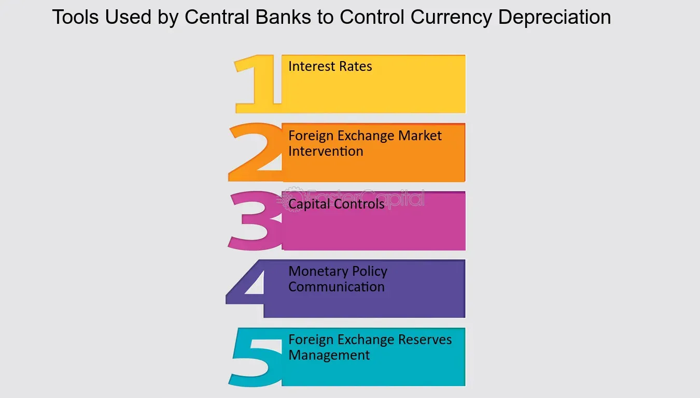

## Table of Contents

## What is monetary supply?

Monetary supply, often called money supply, is the total amount of money available in an economy at a specific time. This includes all the cash that people have in their wallets, the money in their bank accounts, and other types of money that can be easily used for spending or saving. It's important because it affects things like inflation, interest rates, and how the economy grows.

There are different ways to measure the money supply, usually labeled as M0, M1, M2, and sometimes M3. M0 includes only the most liquid forms of money, like coins and notes. M1 adds in money in checking accounts because it can be quickly turned into cash. M2 includes M1 plus savings accounts and other less liquid forms of money. Each measure helps economists understand different aspects of the economy and how money is being used.

## What is the role of a central bank in an economy?

A central bank is like the main bank for a whole country. Its big job is to keep the money system stable and help the economy grow in a healthy way. One thing it does is control the amount of money in the economy. If there's too much money, prices can go up a lot, which is called inflation. If there's too little, it can be hard for businesses to grow and people to buy things. The central bank tries to find a good balance by changing interest rates, which is like the cost of borrowing money. When interest rates are low, borrowing is cheaper, and people and businesses might spend more. When rates are high, borrowing costs more, and spending might slow down.

Another important job of the central bank is to make sure banks are safe and sound. It does this by setting rules that banks have to follow and by keeping an eye on them to make sure they're not taking too many risks. If a bank gets into trouble, the central bank can step in to help, which can stop problems from spreading to other banks and hurting the whole economy. The central bank also handles the country's money, like printing new bills and making sure old ones are taken out of use. By doing all these things, the central bank helps keep the economy running smoothly and protects people's money.

## How do central banks control the money supply?

Central banks control the money supply mainly by changing interest rates. When they want more money in the economy, they lower interest rates. This makes borrowing cheaper, so people and businesses borrow more and spend more. When they want less money in the economy, they raise interest rates. This makes borrowing more expensive, so people and businesses borrow less and spend less. By doing this, central banks can help control inflation and keep the economy stable.

Another way central banks control the money supply is through open market operations. This means they buy or sell government bonds. When they buy bonds, they put more money into the economy because they pay for the bonds with cash. When they sell bonds, they take money out of the economy because people pay for the bonds with cash. Central banks also set reserve requirements, which are rules about how much money banks have to keep in their vaults. If they lower the reserve requirement, banks can lend out more money, increasing the money supply. If they raise it, banks have to keep more money in reserve, decreasing the money supply.

## What are the main tools used by central banks to manage monetary supply?

Central banks use a few main tools to manage how much money is in the economy. One big tool is changing interest rates. When central banks want more money in the economy, they lower interest rates. This makes it cheaper for people and businesses to borrow money, so they borrow more and spend more. When they want less money in the economy, they raise interest rates. This makes borrowing more expensive, so people and businesses borrow less and spend less. By doing this, central banks can help control inflation and keep the economy stable.

Another tool is open market operations. This means the central bank buys or sells government bonds. When they buy bonds, they give money to the people or banks selling the bonds, which puts more money into the economy. When they sell bonds, they take money from the people or banks buying the bonds, which takes money out of the economy. Central banks also use reserve requirements, which are rules about how much money banks have to keep in their vaults. If the central bank lowers the reserve requirement, banks can lend out more money, which increases the money supply. If they raise it, banks have to keep more money in reserve, which decreases the money supply.

## What is the difference between monetary policy and fiscal policy?

Monetary policy is all about managing the money supply and interest rates. It's controlled by the central bank, like the Federal Reserve in the U.S. The central bank can change interest rates to make borrowing money cheaper or more expensive. This affects how much people and businesses spend. The central bank can also buy or sell government bonds to put more or less money into the economy. The goal is to keep the economy stable, control inflation, and help it grow in a healthy way.

Fiscal policy is about how the government spends money and collects taxes. It's controlled by the government, not the central bank. When the government wants to help the economy grow, it might spend more money on things like roads, schools, or health care. Or it might cut taxes so people have more money to spend. When it wants to slow down the economy to control inflation, it might spend less or raise taxes. Fiscal policy is a big tool for the government to influence the economy, but it can take time to see the effects because it involves big decisions about spending and taxes.

## How does changing the reserve requirement affect the money supply?

When a central bank changes the reserve requirement, it's like changing the rules for how much money banks have to keep in their vaults. If the central bank lowers the reserve requirement, banks don't have to keep as much money in reserve. This means they can lend out more money to people and businesses. When banks lend out more money, it increases the money supply because there's more money circulating in the economy.

On the other hand, if the central bank raises the reserve requirement, banks have to keep more money in their vaults. This means they can lend out less money. When banks lend out less money, it decreases the money supply because there's less money circulating in the economy. By changing the reserve requirement, the central bank can control how much money is available for people and businesses to use.

## What is open market operations and how does it influence money supply?

Open market operations are when a central bank buys or sells government bonds to control the amount of money in the economy. When the central bank buys bonds, it gives money to the people or banks selling the bonds. This puts more money into the economy because the sellers can then use that money to spend or invest. It's like the central bank is adding more water to a pool, making it deeper.

When the central bank sells bonds, it takes money out of the economy. People or banks buying the bonds pay with their money, which goes to the central bank. This reduces the amount of money people and businesses have to spend or invest. It's like the central bank is taking water out of the pool, making it shallower. By doing open market operations, the central bank can help control inflation and keep the economy stable.

## How does the interest rate set by the central bank impact the economy?

When the central bank changes the [interest rate](/wiki/interest-rate-trading-strategies), it affects how much it costs for people and businesses to borrow money. If the central bank lowers the interest rate, borrowing money becomes cheaper. This means people might take out more loans to buy things like houses or cars, and businesses might borrow more to grow or start new projects. When people and businesses spend more, it can help the economy grow because more money is moving around.

On the other hand, if the central bank raises the interest rate, borrowing money becomes more expensive. This can make people think twice about taking out loans, so they might spend less on big purchases. Businesses might also borrow less, which can slow down their growth. When spending goes down, it can help control inflation, but it might also slow down the economy. By changing the interest rate, the central bank tries to find a balance to keep the economy stable and growing in a healthy way.

## What are the potential effects of increasing the money supply on inflation?

When a central bank increases the money supply, it can lead to more money chasing the same amount of goods and services. This can cause prices to go up, which is what we call inflation. If there's too much money and not enough stuff to buy, people might be willing to pay more for things, and businesses might raise their prices because they can.

However, increasing the money supply doesn't always cause inflation right away. It depends on how fast the economy is growing and how much people are spending. If the economy is growing quickly and more goods and services are being produced, the extra money might not push prices up as much. But if the economy isn't growing fast enough to keep up with the new money, then inflation is more likely to happen.

## How do central banks use quantitative easing to control money supply?

Quantitative easing, or QE, is a tool that central banks use when they want to put more money into the economy. They do this by buying things like government bonds or other financial assets from banks and other big investors. When the central bank buys these assets, it pays with new money that it creates. This new money goes into the bank accounts of the sellers, which means there's more money in the economy. The idea is that with more money, banks will be more willing to lend to people and businesses, who will then spend more, helping the economy grow.

But QE isn't just about adding more money. It also helps to lower long-term interest rates. When the central bank buys a lot of bonds, it makes the price of those bonds go up. When bond prices go up, their interest rates, or yields, go down. Lower interest rates make it cheaper for people to borrow money for things like buying a house or starting a business. This can encourage more spending and investment, which can help the economy. But central banks have to be careful because if they add too much money, it can lead to inflation, where prices go up a lot.

## What are the challenges faced by central banks in managing money supply during economic crises?

During economic crises, central banks face big challenges in managing the money supply. One big challenge is figuring out how much money to add to the economy. If they add too little, the economy might not recover fast enough, and people might lose jobs. But if they add too much, it can cause inflation, where prices go up a lot. It's like trying to fill a bucket with water without spilling any or leaving it too empty. Central banks have to watch the economy closely and make quick decisions to get it right.

Another challenge is dealing with uncertainty. During a crisis, it's hard to know what will happen next. People might be scared to spend money, and businesses might be afraid to invest. Central banks have to guess how people will react to their actions. If they guess wrong, their plans might not work. They also have to work with the government, which uses different tools like spending and taxes to help the economy. It's like trying to dance with a partner who keeps changing the steps. Central banks need to be flexible and ready to change their plans if things don't go as expected.

## How do international considerations and foreign exchange rates affect a central bank's monetary supply control strategies?

When central banks manage the money supply, they also have to think about what's happening in other countries and how their currency compares to others. If their currency gets weaker compared to other countries' money, it can make things they import more expensive. This might cause prices to go up at home, which is a problem central banks want to avoid. To keep their currency strong, central banks might raise interest rates to make their money more attractive to investors from other countries. But this can make borrowing money at home more expensive, which might slow down the economy.

On the other hand, if a central bank's currency gets too strong, it can make their exports more expensive for other countries to buy. This can hurt businesses that sell things abroad. To fix this, the central bank might lower interest rates to make their currency less attractive to foreign investors. But this can lead to more money in the economy, which might cause inflation if not managed carefully. So, central banks have to balance what's happening at home with what's happening around the world to keep the economy stable.

## References & Further Reading

[1]: Bergstra, J., Bardenet, R., Bengio, Y., & Kégl, B. (2011). ["Algorithms for Hyper-Parameter Optimization."](https://dl.acm.org/doi/10.5555/2986459.2986743) Advances in Neural Information Processing Systems 24.

[2]: ["Advances in Financial Machine Learning"](https://www.amazon.com/Advances-Financial-Machine-Learning-Marcos/dp/1119482089) by Marcos Lopez de Prado

[3]: ["Evidence-Based Technical Analysis: Applying the Scientific Method and Statistical Inference to Trading Signals"](https://www.amazon.com/Evidence-Based-Technical-Analysis-Scientific-Statistical/dp/0470008741) by David Aronson

[4]: ["Machine Learning for Algorithmic Trading"](https://github.com/PacktPublishing/Machine-Learning-for-Algorithmic-Trading-Second-Edition) by Stefan Jansen

[5]: ["Quantitative Trading: How to Build Your Own Algorithmic Trading Business"](https://books.google.com/books/about/Quantitative_Trading.html?id=j70yEAAAQBAJ) by Ernest P. Chan

[6]: Carney, M. (2018). ["The Future of Money - Speech by Mark Carney."](https://www.bankofengland.co.uk/speech/2018/mark-carney-speech-to-the-inaugural-scottish-economics-conference) Bank of England.

[7]: Andrade, P., Breckenfelder, J., Fiore, F. D., Karadi, P., & Tristani, O. (2016). ["The ECB's asset purchase programme: an early assessment."](https://www.ecb.europa.eu/pub/pdf/scpwps/ecbwp1956.en.pdf) European Central Bank Working Paper Series.

[8]: Haldane, A. G. (2015). ["How valid is financial market volatility?"](https://www.pnas.org/doi/10.1073/pnas.2300959120) Bank of England.