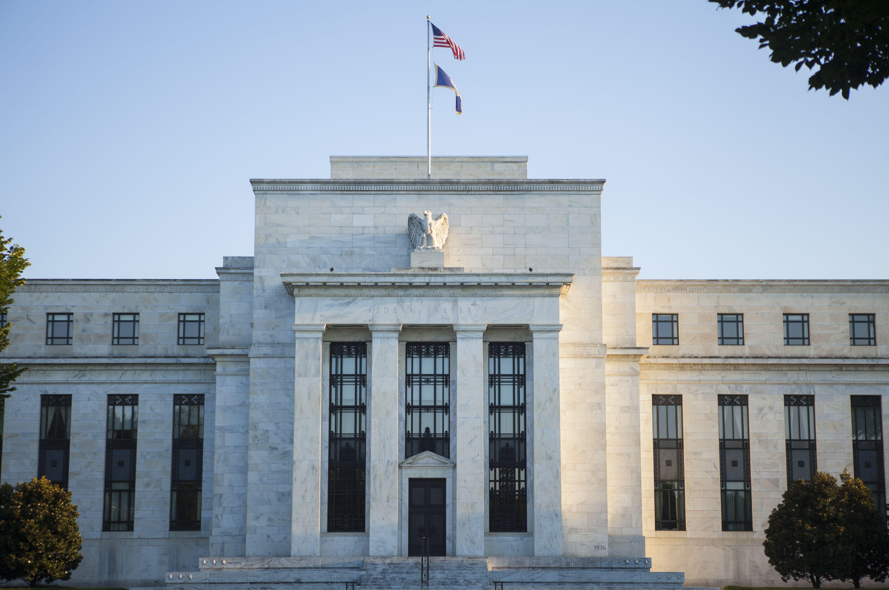

The global financial landscape is undergoing significant transformations driven by technological advancements and economic policy changes. Central bank policies, notably those concerning monetary supply, play a crucial role in shaping the economic environment. These policies are crafted to maintain economic stability, control inflation, and influence employment outcomes. The intricate balance central banks maintain through their monetary instruments, such as interest rates and quantitative easing, significantly impacts market dynamics.

Simultaneously, the financial sector is witnessing a surge in algorithmic trading, an approach that leverages complex algorithms to execute trades at speeds and volumes beyond human capability. This automated form of trading interacts dynamically with monetary policies. Algorithms instantaneously respond to policy changes and economic indicators, displaying the tight coupling between financial innovations and central banking strategies.



The intersection of central bank policies, money supply management, and algorithmic trading underscores a growing complexity within financial markets. Central bank announcements can trigger immediate responses from algorithmic trades, which, in turn, can influence market liquidity and volatility. This interaction highlights the need for a nuanced understanding by investors, policymakers, and economic analysts who aim to navigate these multifaceted dynamics effectively. 

The purpose of this article is to explore the interplay between these critical elements in modern financial ecosystems. By examining the mechanisms of monetary policy, the role of money supply in economic stability, and the impact of algorithmic trading, this discussion aims to illuminate how they collectively influence the broader financial landscape. Understanding these relationships is essential for comprehending the future trajectory of global financial markets and for recognizing opportunities and challenges within this rapidly evolving environment.

## Table of Contents

## Understanding Central Bank Monetary Policy

Central bank monetary policy is a crucial component in managing national and global economies, aiming to achieve sustainable economic growth, price stability, and full employment. The policy encompasses strategies that central banks use to control the supply of money, primarily through manipulating interest rates and employing other financial tools.

**Definition and Objectives**

Central bank monetary policy is the process by which the monetary authority of a country, typically the central bank, controls the supply and availability of money. The primary objectives of this policy include stabilizing prices (controlling inflation), reducing unemployment, and fostering economic growth. By carefully adjusting the money supply and influencing interest rates, central banks aim to manage economic variables, encouraging or curbing spending and investment as needed.

**Key Instruments**

1. **Interest Rates**: Central banks directly influence economic activity by setting benchmark interest rates, which affect the cost of borrowing and the return on savings. Lowering interest rates generally encourages borrowing and investment but can lead to inflation if overused. Conversely, raising rates can help curb inflation but may also slow economic growth and increase unemployment.

2. **Reserve Requirements**: This refers to the amount of funds that a bank must hold in reserve against deposits made by customers. By altering reserve requirements, central banks can influence how much money banks can lend, thus affecting the money supply. Increasing reserve requirements can restrict the money supply, while decreasing them can expand it.

3. **Quantitative Easing (QE)**: This is an unconventional monetary policy tool used when traditional methods become ineffective, particularly when interest rates are near zero. Through QE, central banks purchase government securities or other securities from the market to increase the money supply and encourage lending and investment.

**Case Studies**

- **Federal Reserve (Fed)**: In response to the 2008 financial crisis, the Federal Reserve significantly lowered interest rates and implemented several rounds of quantitative easing to stimulate the economy. These measures contributed to economic recovery by increasing liquidity in the financial system and encouraging investment and spending.

- **European Central Bank (ECB)**: The ECB has employed a variety of tools to manage the Eurozone's monetary policy, especially during the sovereign debt crisis. The ECB's policies have included lowering the main refinancing operations rate and using targeted longer-term refinancing operations (TLTROs) to stimulate bank lending.

- **Bank of Japan (BoJ)**: Known for its prolonged battle with deflation, the BoJ has adopted aggressive monetary policy measures, including setting negative interest rates and implementing extensive quantitative easing programs. These strategies aim to revitalize economic activity and reach the BoJ's inflation targets.

The careful design and execution of central bank monetary policies play a critical role in navigating economic challenges and fostering monetary stability. By understanding these mechanisms and their implications, stakeholders can better predict and respond to economic shifts.

## The Role of Money Supply in Economic Stability

Money supply represents the total amount of monetary assets available within an economy at a specific time. It is a crucial [factor](/wiki/factor-investing) that influences economic stability, affecting both microeconomic elements, like individual consumer behavior, and macroeconomic variables such as national inflation rates and employment levels. The money supply is traditionally classified into categories such as M1, M2, and sometimes M3, which categorize money based on its [liquidity](/wiki/liquidity-risk-premium).

**Components of Money Supply:**

1. **M1:** This is the narrowest measure of money supply, including the most liquid forms of money, namely currency in circulation (coins and notes) and demand deposits (checking accounts). These are readily accessible for spending.

2. **M2:** This encompasses M1 and adds near-money elements that are less liquid. These can include savings accounts, time deposits under $100,000, and retail money market mutual fund balances. M2 is often used as an indicator for predicting spending habits and inflation.

3. **M3:** Although less commonly used, M3 includes M2 in addition to large time deposits, institutional money market funds, and other larger liquid assets. This measure is more indicative of the money supply available for large-scale economic operations.

**Influence of Central Banks:**

Central banks, such as the Federal Reserve in the United States, use various monetary policy tools to regulate the money supply, thereby striving to stabilize the economy. Key instruments include:

- **Interest Rates:** By lowering or raising the benchmark interest rates, central banks influence borrowing costs. A decrease in rates makes borrowing cheaper, encouraging spending and investment, thereby increasing the money supply. Conversely, increasing rates aims to reduce money supply growth by discouraging borrowing.

- **Reserve Requirements:** This tool dictates the minimum fraction of customer deposits that commercial banks must hold as reserves rather than lending out. Lower reserve requirements increase the ability of banks to create money through loans, thus expanding the money supply. Increasing reserve requirements contracts it.

- **Quantitative Easing:** Central banks purchase large quantities of financial assets to inject liquidity into the economy, aiming to lower interest rates and increase money supply directly. This approach is usually employed when conventional monetary policy becomes ineffective, especially near the zero lower bound of interest rates.

**Economic Impact of Changes in Money Supply:**

Changes in the money supply have profound implications on both micro- and macroeconomic levels. On the macroeconomic scale, an increase in money supply typically lowers interest rates, facilitating higher levels of investment and consumer spending. This often results in economic expansion and can help reduce unemployment. However, excessive expansion of money supply risks triggering inflationary pressures, as too much money chases too few goods.

At the microeconomic level, changes in money supply can impact individual purchasing power and consumer confidence. For instance, perceptions of inflation associated with increased money supply can lead to higher consumer leverage as households anticipate future price rises, thereby impacting spending patterns. Similarly, adjustments in interest rates affect personal savings and borrowing decisions, influencing demand for goods and services.

In conclusion, understanding and controlling the money supply is pivotal for ensuring economic stability. Central banks use various strategies to adjust money supply to achieve desired economic outcomes like controlled inflation and lower unemployment. The complex interactions between the money supply and economic activities highlight the need for careful policy design and implementation.

## Algorithmic Trading: Mechanisms and Market Influence

Algorithmic trading, also known as algo trading or automated trading, involves the use of computer algorithms to execute trading orders with speed and precision that surpasses human capability. These algorithms, often developed by quantitative analysts, are based on semantic analysis, historical data, and mathematical models to identify profitable trading opportunities. As technology advances, the prevalence of [algorithmic trading](/wiki/algorithmic-trading) has grown substantially, now accounting for a significant portion of the trading [volume](/wiki/volume-trading-strategy) in global financial markets.

Algorithmic trading operates on predefined parameters that can include timing, price, and quantity, which are executed according to coded instructions without the need for human intervention. The increasing sophistication of these algorithms has allowed traders to analyze vast datasets rapidly and engage in high-frequency trading ([HFT](/wiki/high-frequency-trading-strategies)), where high-speed trades are executed within microseconds. The growing prevalence of algorithmic trading is attributed to its ability to reduce trading costs, enhance market efficiency, and optimize the execution of trades.

## How Algorithms Respond to Changes in Monetary Policy and Economic Data

The responsiveness of algorithmic trading systems to monetary policy changes and economic data is of great significance given their potential to affect market conditions. Central banks play a pivotal role in economic stabilization, and their policy decisions are critical inputs for algorithm-based trading strategies. Algorithms ingest and process a wide array of economic indicators, such as [interest rate](/wiki/interest-rate-trading-strategies) announcements, employment figures, inflation rates, and GDP growth [statistics](/wiki/bayesian-statistics), which can influence asset prices considerably.

A typical algorithm might look something like this in Python pseudocode:

```python
def trading_strategy(economic_data):
    decision_threshold = compute_threshold(economic_data)

    if economic_data['interest_rate_change'] > decision_threshold:
        execute_trade('buy')
    elif economic_data['market_volatility'] > decision_threshold:
        execute_trade('sell')
    else:
        hold_position()

def compute_threshold(data):
    # Placeholder function for threshold computation
    return some_complex_computation_based_on(data)
```

The algorithms can adjust positions swiftly in response to new monetary policy announcements, sometimes executing trades before human traders have even processed the same information. This rapid reaction is possible through the seamless integration of real-time data feeds and analytical computational power, enabling the systems to adjust trading strategies almost instantaneously.

## Impact of Algorithmic Trading on Market Volatility and Liquidity

While algorithmic trading offers distinct benefits, it also has profound implications for market [volatility](/wiki/volatility-trading-strategies) and liquidity. The high-speed nature of algorithmic trades can sometimes exacerbate volatility, particularly during times of market stress. For instance, algorithms that follow [momentum](/wiki/momentum)-based strategies might intensify price movements as they buy into upward trends and sell during downturns, thus contributing to market instability, commonly observed in "flash crashes."

Conversely, algorithmic trading can also enhance market liquidity by providing tighter bid-ask spreads and facilitating a greater number of trades within a given timeframe. The continuous operation of algo trading systems provides a consistent pool of buyers and sellers, reducing the cost of executing large orders and improving overall market efficiency.

However, the advantages provided by increased liquidity must be balanced against the potential risks of excessive market volatility. Regulatory scrutiny and the implementation of safeguards, such as circuit breakers, aim to mitigate the risks associated with algorithmic trading. These measures ensure that while trading algorithms continue to enhance market liquidity, they do not disrupt market integrity.

In summary, algorithmic trading serves as a double-edged sword: enhancing market efficiency and liquidity on one hand while posing challenges such as increased volatility on the other. Its interactions with monetary policy are dynamic and complex, necessitating continuous refinement and regulation to safeguard financial markets.

## Interactions Between Monetary Policy and Algo Trading

Central bank monetary policies significantly impact financial markets, influencing strategies employed in algorithmic trading. These policies, particularly changes in interest rates, quantitative easing, and forward guidance, directly affect asset prices and financial stability, altering the conditions under which algorithmic trading strategies operate.

A notable example is the Federal Reserve's decision-making on interest rates. When the Fed signals an increase in interest rates, algo trading systems often react by adjusting their trading algorithms to anticipate potential changes in asset prices. For instance, a rate hike may lead algos to short government bonds, expecting a rise in yields, while simultaneously going long on the U.S. dollar due to anticipated capital inflows seeking higher returns. The speed and volume of these algorithm-driven trades can significantly amplify market volatility shortly after such announcements.

Algorithmic trading also influences monetary policy outcomes by affecting the transmission mechanism of these policies. The efficiency and speed of these algorithms allow them to react to new data swiftly, impacting the liquidity and price discovery processes in various asset classes. When the European Central Bank launched its quantitative easing program, algorithmic strategies quickly adjusted to exploit [arbitrage](/wiki/arbitrage) opportunities created by the purchase of sovereign debt in the market. This immediate reaction can sometimes mitigate or enhance the intended effects of monetary policy through rapid changes in bond yields and risk premiums.

Market sentiment is another crucial factor that both central bank announcements and algorithmic trading influence. Announcements from central banks, such as the Bank of Japan's forward guidance, can trigger sharp shifts in market sentiment, leading to volatile market movements. Algorithmic traders, monitoring market sentiment indicators, often adjust their strategies in anticipation of or in reaction to these sentiment shifts. For example, a dovish statement may prompt algorithms to increase their positions in equities, anticipating a bullish market due to lower borrowing costs.

Furthermore, the interaction between central bank policies and algorithmic trading sometimes leads to unintended consequences. Sudden market shocks, like the "taper tantrum" following the Fed's hint at ending its bond-buying program in 2013, exemplify how rapid and widespread algo trading reactions can disrupt markets, complicating central bank efforts to maintain economic stability.

In summary, the interplay between central banks' monetary policies and algorithmic trading is a significant force in modern financial markets. These interactions influence trading dynamics and can have broader implications for economic policy and market stability, demonstrating the need for ongoing analysis of their complex relationships.

## Challenges and Opportunities in the Modern Financial System

In today's interconnected financial landscape, rapid-trading algorithms present both challenges and opportunities for central banks and investors. Algorithmic trading—characterized by the use of computer programs to execute trades at high speeds and volumes—has fundamentally altered market dynamics.

**Challenges for Central Banks**

Central banks face significant challenges due to the proliferation of algorithmic trading. One of the primary concerns is market stability. Algorithms can react to market data faster than human traders, leading to heightened volatility, particularly during times of economic uncertainty or unexpected monetary policy announcements. For example, flash crashes—sudden, dramatic drops in security prices—can be exacerbated by algorithmic trades. The 2010 Flash Crash, which saw the Dow Jones Industrial Average plunge nearly 1,000 points in minutes, was partly attributed to such automated trades. This introduces an additional layer of complexity for central banks attempting to maintain market stability.

Moreover, the interdependence between algorithmic trading strategies and central bank policies can create feedback loops that complicate monetary policy implementation. Algorithms often rely on signals from economic data releases, leading to market movements that might influence central banks’ perceptions of economic conditions. Consequently, central banks may struggle to accurately gauge the effectiveness of their policies, as traditional signals from financial markets, such as interest rates and asset prices, become more volatile and harder to interpret.

**Opportunities for Investors**

Despite these challenges, there are notable opportunities for investors. A deep understanding of the interactions between central banking decisions and algorithmic trading's mechanical responses can provide strategic advantages. Investors leveraging algorithmic trading techniques can capitalize on brief market inefficiencies that arise from central bank announcements or changes in policy. For instance, a well-timed algorithmic strategy could swiftly respond to an interest rate cut announcement by a central bank, strategically buying into sectors predicted to benefit from lower borrowing costs.

The integration of [machine learning](/wiki/machine-learning) and [artificial intelligence](/wiki/ai-artificial-intelligence) into trading algorithms further provides investors with enhanced tools for predicting market trends based on historical data and emerging economic indicators. By using predictive analytics, investors can better anticipate how markets might respond to forthcoming monetary policy decisions and adjust their strategies accordingly.

In summary, while rapid-trading algorithms pose challenges to central banks by potentially destabilizing markets and complicating policy implementation, they also offer investors unique opportunities. Understanding the nuanced interplay between monetary policy and algorithmic trading can serve as a powerful tool for investors seeking to navigate the complexities of modern financial systems.

## Strategies for Navigating Monetary Policy and Algo Trading

Traders and investors in modern financial markets face complex challenges due to the dynamic interactions between central bank policies and algorithmic trading strategies. Navigating this landscape requires a thorough understanding of these elements and the ability to leverage available resources effectively.

One critical strategy for traders is to develop a comprehensive understanding of central bank actions. Central banks, such as the Federal Reserve, the European Central Bank, and the Bank of Japan, periodically release statements and policy changes that significantly influence global financial markets. Monitors like the Federal Reserve Economic Data (FRED) database and Bloomberg Terminal provide crucial insights into monetary policy shifts. Utilizing these resources helps traders anticipate market movements and adjust their strategies accordingly.

Staying informed about economic indicators, such as GDP growth rates, unemployment figures, and inflation rates, is also essential. These indicators serve as vital inputs for both central bank decisions and algorithmic trading models. Services like Trading Economics offer real-time updates and forecasts that traders can use to evaluate market conditions.

Another vital element is understanding algorithmic trading systems, which respond swiftly to economic news and central bank announcements. Engaging with platforms that offer [backtesting](/wiki/backtesting) capabilities, such as QuantConnect or MetaTrader, allows traders to simulate how their strategies might perform under various scenarios, including potential central bank interventions.

To illustrate how traders can synthesize this information effectively, consider Python as a tool for data analysis and strategy development. By using Python libraries such as pandas for data manipulation and the yfinance library for acquiring financial data, traders can automate the collection and analysis of relevant market data. For example, a simple script could automatically retrieve the latest Treasury yield data and perform an analysis to predict interest rate changes:

```python
import yfinance as yf  # For more datasets, visit: https://paperswithbacktest.com/datasets
import pandas as pd

# Fetch historical data for US Treasury yields
tickers = ["^IRX", "^FVX", "^TNX", "^TYX"]  # 3-month, 5-year, 10-year, 30-year treasuries
data = yf.download(tickers, period="1y")

# Calculate percentage change for analysis
yield_changes = data['Close'].pct_change()

# Basic analysis to identify trends in yield data
rolling_avg = yield_changes.rolling(window=30).mean()

print(rolling_avg.tail())
```

This script provides insight into yield trends, allowing traders to anticipate policy shifts. Additionally, staying engaged with financial news sources like Reuters and The Financial Times ensures that traders and investors remain updated on any sudden changes that might impact markets.

Furthermore, collaboration with financial analysts and participation in financial forums, such as Seeking Alpha or financial subreddits, allow traders to exchange insights and strategies. This collaborative approach can enhance understanding of market sentiment, offering opportunities to refine trading strategies.

In summary, successfully navigating the interaction between monetary policy and algorithmic trading requires a well-rounded approach, leveraging diverse tools and resources to make informed trading decisions.

## Conclusion

In conclusion, the complex interplay between central bank monetary policy, money supply, and algorithmic trading significantly shapes the global financial landscape. Central banks utilize monetary policies, including interest rates, reserve requirements, and quantitative easing, to influence the money supply, thereby controlling economic stability parameters like inflation and unemployment. These monetary maneuvers create ripples across financial markets, prompting algorithmic trading systems to adjust their strategies accordingly. The mechanistic nature of algorithmic trading allows for swift responses to market fluctuations, impacting both volatility and liquidity.

Algorithmic trading machines absorb economic indicators and central bank decisions, altering their trading algorithms in real-time to optimize performance. This relationship creates a feedback loop, where algorithms not only adapt to monetary policy shifts but can also amplify or dampen the effects of such policy changes. Consequently, market sentiment and asset pricing can be heavily influenced by perceived future monetary policy actions communicated by central banks.

Looking to the future, the dynamics of financial markets are set to grow increasingly intricate with ongoing advancements in technology and shifting economic policies. The rapid evolution of algorithmic trading accentuates the need for enhanced regulatory frameworks and transparency to mitigate potential systemic risks. For market participants, understanding these interdependencies offers both challenges and opportunities in terms of investment strategy and risk management.

To thrive in this ever-evolving environment, continuous learning and adaptation are crucial. Staying informed about central bank announcements, economic indicators, and technological advancements in trading systems is imperative for traders and investors. Utilizing a combination of analytical tools and resources will better position them to anticipate and react to market changes, ensuring that they remain competitive in an increasingly complex financial ecosystem. The convergence of monetary policy, money supply, and algorithmic trading necessitates ongoing vigilance and strategic foresight to navigate the challenges and harness the opportunities in the modern financial system.

## References & Further Reading

[1]: Bergstra, J., Bardenet, R., Bengio, Y., & Kégl, B. (2011). ["Algorithms for Hyper-Parameter Optimization."](https://dl.acm.org/doi/10.5555/2986459.2986743) Advances in Neural Information Processing Systems 24.

[2]: ["Advances in Financial Machine Learning"](https://www.amazon.com/Advances-Financial-Machine-Learning-Marcos/dp/1119482089) by Marcos Lopez de Prado

[3]: ["Evidence-Based Technical Analysis: Applying the Scientific Method and Statistical Inference to Trading Signals"](https://www.amazon.com/Evidence-Based-Technical-Analysis-Scientific-Statistical/dp/0470008741) by David Aronson

[4]: ["Machine Learning for Algorithmic Trading"](https://github.com/PacktPublishing/Machine-Learning-for-Algorithmic-Trading-Second-Edition) by Stefan Jansen

[5]: ["Quantitative Trading: How to Build Your Own Algorithmic Trading Business"](https://books.google.com/books/about/Quantitative_Trading.html?id=j70yEAAAQBAJ) by Ernest P. Chan

[6]: Carney, M. (2018). ["The Future of Money - Speech by Mark Carney."](https://www.bankofengland.co.uk/speech/2018/mark-carney-speech-to-the-inaugural-scottish-economics-conference) Bank of England.

[7]: Andrade, P., Breckenfelder, J., Fiore, F. D., Karadi, P., & Tristani, O. (2016). ["The ECB's asset purchase programme: an early assessment."](https://www.ecb.europa.eu/pub/pdf/scpwps/ecbwp1956.en.pdf) European Central Bank Working Paper Series.

[8]: Haldane, A. G. (2015). ["How valid is financial market volatility?"](https://www.pnas.org/doi/10.1073/pnas.2300959120) Bank of England.