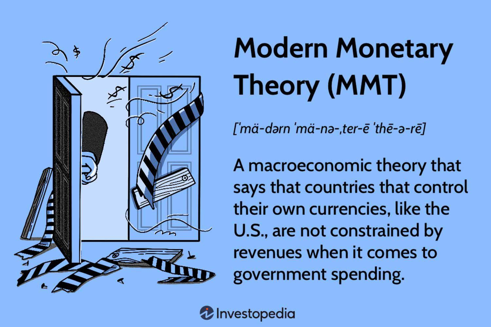

## Table of Contents

## What is monetary theory?

Monetary theory is a part of economics that looks at how money works in an economy. It tries to understand things like how much money should be in circulation, how money affects prices, and how changes in the money supply can influence economic growth and employment. Economists who study monetary theory are interested in figuring out the best ways for governments and central banks to manage money to keep the economy stable and growing.

One important idea in monetary theory is the quantity theory of money. This theory says that the amount of money in an economy is directly related to the price levels of goods and services. If there is more money, prices tend to go up, which is called inflation. If there is less money, prices can go down, which is called deflation. Central banks use this idea when they decide to increase or decrease the money supply to control inflation and help the economy.

Another key concept is the role of interest rates. Monetary theory looks at how interest rates, which are set by central banks, affect borrowing and spending. When interest rates are low, people and businesses are more likely to borrow money and spend it, which can help the economy grow. When interest rates are high, borrowing becomes more expensive, and people might save more and spend less, which can slow down the economy. Understanding these relationships helps policymakers make decisions that can lead to a healthier economy.

## What are the main components of monetary theory?

Monetary theory is all about understanding how money works in an economy. It looks at things like how much money there should be, how money affects prices, and how changing the amount of money can help or hurt the economy. One big idea in monetary theory is the quantity theory of money. This theory says that if there's more money, prices go up, which is called inflation. If there's less money, prices go down, which is called deflation. Central banks use this idea to decide if they should add more money or take some away to control prices and help the economy.

Another important part of monetary theory is interest rates. Interest rates are like the price of borrowing money, and they are set by central banks. When interest rates are low, borrowing money is cheaper, so people and businesses are more likely to borrow and spend, which can make the economy grow. When interest rates are high, borrowing is more expensive, so people might save more and spend less, which can slow down the economy. Understanding how interest rates work helps central banks make good decisions to keep the economy stable.

Overall, monetary theory helps us understand how to manage money in a way that keeps the economy healthy. It involves looking at the amount of money, how it affects prices, and how interest rates can be used to control borrowing and spending. By studying these things, economists and policymakers can make better choices to help the economy grow and stay stable.

## How does money supply affect the economy according to monetary theory?

Money supply is like the total amount of money available in an economy. According to monetary theory, when there's more money, people have more to spend, which can make prices go up. This is called inflation. If there's too much money, prices can rise too fast, making things more expensive for everyone. On the other hand, if there's less money, people might not have enough to spend, and prices can go down. This is called deflation. If there's too little money, it can slow down the economy because people aren't buying as much.

Central banks, like the Federal Reserve in the U.S., can change the money supply to help control the economy. If they think the economy needs a boost, they might add more money to encourage spending and growth. If they think the economy is growing too fast and causing too much inflation, they might take some money out to cool things down. By adjusting the money supply, central banks try to keep the economy stable, with steady growth and low inflation. This is a big part of what monetary theory is all about.

## What is the role of central banks in monetary theory?

Central banks play a big role in monetary theory. They are like the managers of a country's money. Their main job is to control the amount of money in the economy. This is important because having the right amount of money helps keep the economy stable. If there's too much money, prices can go up too fast, which is called inflation. If there's too little money, the economy might slow down, and prices can go down, which is called deflation. Central banks try to find a balance to keep prices steady and help the economy grow.

One way central banks control the money supply is by setting interest rates. Interest rates are like the price of borrowing money. When central banks lower interest rates, borrowing money becomes cheaper, so people and businesses are more likely to borrow and spend. This can help the economy grow. When they raise interest rates, borrowing becomes more expensive, so people might save more and spend less, which can slow down the economy. By changing interest rates, central banks can influence how much people spend and save, which helps them manage the economy.

## Can you explain the difference between monetarism and Keynesian economics?

Monetarism and Keynesian economics are two different ways of thinking about how to manage an economy. Monetarism, which was developed by Milton Friedman, focuses on the role of money supply in the economy. Monetarists believe that controlling the amount of money in circulation is the best way to keep the economy stable. They think that if the government or central bank keeps the money supply growing at a steady rate, it can help control inflation and promote economic growth. Monetarists also believe that the economy is naturally stable and that government intervention should be minimal, mainly limited to managing the money supply.

On the other hand, Keynesian economics, named after John Maynard Keynes, emphasizes the role of government spending and fiscal policy in managing the economy. Keynesians believe that the economy can get stuck in a rut, with high unemployment and low demand, and that the government needs to step in to fix it. They argue that during tough times, the government should increase spending and cut taxes to boost demand and get the economy moving again. Keynesians see the economy as less stable and believe that active government intervention, through fiscal policy, is necessary to smooth out economic cycles and prevent long periods of unemployment.

In summary, while monetarists focus on controlling the money supply to keep the economy stable, Keynesians focus on using government spending and fiscal policy to manage economic ups and downs. Both approaches have their own ideas about how best to keep the economy healthy, but they differ in their views on the role of government and the stability of the economy.

## What are the key monetary policy tools used by central banks?

Central banks use several tools to manage the economy. One of the main tools is setting interest rates. When central banks change interest rates, they can make borrowing money cheaper or more expensive. If they lower interest rates, people and businesses are more likely to borrow and spend, which can help the economy grow. If they raise interest rates, borrowing becomes more expensive, so people might save more and spend less, which can slow down the economy. This helps central banks control inflation and keep the economy stable.

Another important tool is open market operations. This is when central banks buy or sell government bonds to change the amount of money in the economy. If they want to increase the money supply, they buy bonds, which puts more money into circulation. If they want to decrease the money supply, they sell bonds, which takes money out of circulation. By doing this, central banks can influence how much money people have to spend and help control inflation.

Central banks also use reserve requirements as a tool. This means they can set rules about how much money banks need to keep in reserve and not lend out. If central banks lower reserve requirements, banks can lend out more money, which increases the money supply. If they raise reserve requirements, banks have to keep more money in reserve, so they can lend out less, which decreases the money supply. This tool helps central banks manage the amount of money in the economy and keep it stable.

## How do interest rates influence monetary policy?

Interest rates are a big part of how central banks control the economy. When central banks change interest rates, they are trying to make borrowing money cheaper or more expensive. If they lower interest rates, it means people and businesses can borrow money at a lower cost. This often makes them more likely to borrow and spend, which can help the economy grow. On the other hand, if central banks raise interest rates, borrowing money becomes more expensive. This can make people and businesses less likely to borrow and spend, which can slow down the economy. By changing interest rates, central banks can influence how much people spend and save, which helps them manage inflation and keep the economy stable.

Interest rates also affect how much money is in the economy. When interest rates are low, people might borrow more money from banks. This means there's more money in circulation, which can lead to higher spending and possibly higher prices, or inflation. When interest rates are high, people might be less likely to borrow and more likely to save their money. This can mean less money is circulating in the economy, which can help keep prices from rising too fast. By using interest rates to control the amount of money, central banks can help keep the economy balanced and prevent too much inflation or deflation.

## What is the quantity theory of money and how is it relevant to monetary theory?

The quantity theory of money is a big idea in economics that says the amount of money in an economy affects the prices of things. It's like saying if there's more money, prices go up, and if there's less money, prices go down. This theory uses a simple formula: the amount of money times how often it's spent equals the price of things times how much stuff is bought. In other words, if the amount of money or how often it's spent goes up, and the amount of stuff stays the same, prices will go up. This is called inflation. If the amount of money goes down, prices can go down, which is called deflation.

This theory is really important for monetary theory because it helps central banks decide how much money should be in the economy. If they see prices going up too fast, they might take some money out of circulation to slow down inflation. If they see the economy slowing down and prices not moving much, they might add more money to help things grow. By understanding the quantity theory of money, central banks can make better choices about how to manage the money supply to keep the economy stable and growing.

## How does inflation relate to monetary theory?

Inflation is when prices go up over time, and it's a big part of monetary theory. Monetary theory looks at how money works in the economy, and one of the main things it tries to understand is how the amount of money affects prices. If there's too much money, people have more to spend, which can make prices go up. This is what we call inflation. Central banks, like the Federal Reserve in the U.S., try to control inflation by changing the amount of money in the economy. They do this to keep prices from going up too fast, which can make things more expensive for everyone.

Understanding inflation is important for keeping the economy stable. If inflation is too high, it can hurt people because their money doesn't buy as much as it used to. But if there's no inflation or if prices are going down, which is called deflation, it can also be bad because people might stop spending, thinking prices will keep falling. That can slow down the economy. So, central banks use tools like interest rates and changing the money supply to find a balance. They want to keep inflation low and steady, which helps the economy grow in a healthy way.

## What are some historical examples of monetary policy failures?

One big example of a monetary policy failure happened in Germany in the 1920s. After World War I, Germany printed a lot of money to pay for the war and to help the economy. But printing too much money made prices go up really fast. This is called hyperinflation. People needed wheelbarrows full of money just to buy a loaf of bread. It made life very hard for everyone and helped cause a lot of problems in Germany, which led to more trouble later on.

Another example is the Great Depression in the United States in the 1930s. The Federal Reserve, which is like the central bank, made a mistake by not adding more money to the economy when it was needed. Banks were failing, and people were losing their jobs. If the Federal Reserve had put more money into the economy, it might have helped. But they didn't, and the economy got worse. This made the Great Depression last longer and be more painful for a lot of people.

A more recent example is the financial crisis in Zimbabwe in the late 2000s. The government printed a lot of money to pay for things, but this caused hyperinflation again. Prices went up so fast that money became almost worthless. At one point, Zimbabwe had to print a 100 trillion dollar bill, but it still wasn't enough to buy much. This made life very hard for people and showed how important it is for central banks to manage the money supply carefully.

## How do modern monetary theories, like Modern Monetary Theory (MMT), differ from traditional views?

Modern Monetary Theory (MMT) is different from traditional views because it says that countries with their own currency don't have to worry about running out of money the way people or businesses do. Traditional views think that governments should keep their budgets balanced, like not spending more than they earn, to avoid too much debt. But MMT says that as long as a country has its own currency, it can always print more money to pay for things. This means the government doesn't need to worry about running out of money; instead, it should focus on using money to help the economy grow and keep people employed.

MMT also looks at inflation differently. Traditional views think that if a government spends too much, it can cause prices to go up too fast, which is called inflation. To control inflation, traditional views say the government should cut spending or raise taxes. But MMT says that the real limit on government spending is not how much money it has, but how much the economy can produce without causing too much inflation. If the government spends too much and the economy can't keep up, then prices might go up. So, MMT suggests that instead of cutting spending, the government should use other ways to control inflation, like raising taxes or changing interest rates.

## What are the current debates and future directions in monetary theory?

One big debate in monetary theory right now is about how much control central banks should have over the economy. Some people think central banks should keep doing what they've been doing, like changing interest rates to control inflation and help the economy grow. But others think central banks should do more, like trying to help with unemployment or even climate change. This debate is important because it affects how central banks make decisions that impact everyone's lives. Some worry that if central banks do too much, they might make the economy unstable or cause inflation to get out of control.

Another big topic is the rise of digital currencies and how they might change monetary theory. Traditional money is controlled by governments and central banks, but digital currencies like Bitcoin are different. They don't have a central authority, and some people think they could change how money works in the economy. Central banks are looking into creating their own digital currencies, called central bank digital currencies (CBDCs), to stay in control. This could change how monetary policy works and how central banks manage the money supply. It's a new area, and economists are still figuring out what it all means for the future of money and the economy.

## References & Further Reading

[1]: [Bergstra, J., Bardenet, R., Bengio, Y., & Kégl, B. (2011). "Algorithms for Hyper-Parameter Optimization."](https://papers.nips.cc/paper/4443-algorithms-for-hyper-parameter-optimization) Advances in Neural Information Processing Systems 24.

[2]: [Marcos Lopez de Prado, "Advances in Financial Machine Learning"](https://www.amazon.com/Advances-Financial-Machine-Learning-Marcos/dp/1119482089)

[3]: [David Aronson, "Evidence-Based Technical Analysis: Applying the Scientific Method and Statistical Inference to Trading Signals"](https://www.amazon.com/Evidence-Based-Technical-Analysis-Scientific-Statistical/dp/0470008741)

[4]: [Stefan Jansen, "Machine Learning for Algorithmic Trading"](https://github.com/stefan-jansen/machine-learning-for-trading)

[5]: [Ernest P. Chan, "Quantitative Trading: How to Build Your Own Algorithmic Trading Business"](https://www.amazon.com/Quantitative-Trading-Build-Algorithmic-Business/dp/1119800064)