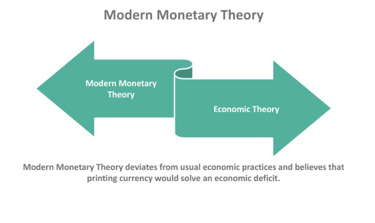

In today's rapidly evolving financial landscape, the confluence of economic theory, monetary policy, and technological innovation is fundamentally reshaping the paradigms of trading and finance. Economic and monetary theories provide the foundational frameworks for understanding how economies operate, making them indispensable for deciphering the complexities of modern financial systems. As the financial sector becomes increasingly sophisticated, these theories serve as a compass guiding policymakers and market participants alike.

Economic theory encompasses various branches, including microeconomics, which examines individual and firm-level decision-making, and macroeconomics, which focuses on aggregate economic indicators and their interrelations. These branches help elucidate the functioning of markets, the determination of prices, and the allocation of resources. Similarly, monetary theory provides insights into the role of money in the economy, emphasizing the influence of money supply on economic variables such as inflation, unemployment, and growth. The actions of central banks, such as the Federal Reserve, are often informed by these theoretical perspectives, allowing for the development of policies aimed at stabilizing economies and promoting sustainable growth.



Algorithmic trading, facilitated by advancements in technology, represents a practical application of these economic and monetary concepts. It involves the use of complex algorithms designed to execute trades based on a set of predetermined criteria, often leveraging historical data and real-time market signals. This technological innovation is not merely a tool for efficient trade execution but also a catalyst for influencing broader economic theories and monetary practices. Algorithms are designed to optimize trading strategies, thereby reducing human error and mitigating emotional biases, which enhances market liquidity and efficiency.

Understanding these core principles is essential for appreciating the nuanced interplay between theoretical constructs and technological applications. The integration of economic thought with algorithmic trading techniques illustrates a shift towards a more data-driven, analytical approach in financial markets. As technology continues to disrupt traditional financial models, it challenges existing theories and heralds new insights into economic phenomena. Consequently, the ongoing interplay between economic theory, monetary policy, and technology is pivotal in shaping the future trajectory of global markets.

## Table of Contents

## Understanding Economic and Monetary Theories

Economic theory provides a structured framework for analyzing how economies operate, encompassing multiple branches such as microeconomics, macroeconomics, and applied economics. Microeconomics examines individual agents and markets, focusing on supply and demand dynamics, price formation, and consumer behavior. Macroeconomics, on the other hand, considers the broader economic factors such as national income, total output, employment, inflation, and overall economic growth. Applied economics utilizes insights from these areas to address specific issues within different sectors or policies.

Monetary theory is a vital component of economic theory, emphasizing the impact of the money supply on economic activity. One of the foundational concepts is the Quantity Theory of Money, expressed by the equation $MV = PQ$, where $M$ stands for the money supply, $V$ is the velocity of money, $P$ denotes the price level, and $Q$ represents the output level. The theory suggests that changes in the money supply can influence the price level and economic output, assuming a stable velocity.

Another contemporary perspective is Modern Monetary Theory (MMT), which challenges traditional views by arguing that a sovereign government, with control over its currency, can sustain higher levels of spending without the fear of default. MMT posits that such governments can finance deficits through money creation, emphasizing the role of fiscal policy in achieving full employment and economic stability, relegating inflation control as a key constraint.

Central banks, like the Federal Reserve, utilize monetary theories to guide their policy decisions. Through monetary policy tools such as open market operations, discount rates, and reserve requirements, central banks aim to regulate the money supply, stabilize prices, and achieve sustainable economic growth. Adjustments in interest rates are a common strategy used by central banks to influence economic activity by affecting borrowing costs and consumption behavior.

These economic and monetary theories provide essential insights into the mechanisms of financial markets and the formulation of monetary policies. Understanding these frameworks is crucial for analyzing how economic variables interact and for forecasting the implications of monetary policy on the economy.

## The Relationship Between Monetary Policy and Financial Markets

Monetary policy plays a pivotal role in shaping financial markets, primarily by influencing key economic variables such as interest rates and stock prices. Central banks, such as the Federal Reserve in the United States, utilize a set of monetary tools to manage economic conditions, aiming to maintain stable inflation, full employment, and moderate long-term interest rates.

The primary instruments of monetary policy include the reserve ratio, discount rate, and open market operations. The reserve ratio mandates the proportion of deposits that banks must hold as reserves, directly impacting the money supply. A lower reserve ratio increases the supply of money by allowing banks to lend more, whereas a higher reserve ratio reduces it.

The discount rate is the [interest rate](/wiki/interest-rate-trading-strategies) at which commercial banks can borrow from the central bank. By lowering the discount rate, central banks make borrowing cheaper, encouraging lending and investment. Conversely, raising the discount rate curtails borrowing and spending. Changes in the discount rate can influence the broader interest rate environment, affecting everything from mortgage rates to personal loans.

Open market operations involve the buying and selling of government securities in the financial markets to regulate the money supply. When a central bank buys securities, it injects money into the system, lowering interest rates and stimulating economic activity. Selling securities has the opposite effect, withdrawing [liquidity](/wiki/liquidity-risk-premium) from the market and potentially raising interest rates.

Monetary policy does not operate in isolation; it often interacts with fiscal policy, which involves government spending and taxation decisions. Together, these policies influence economic growth, inflation, and the overall stability of the financial system. While fiscal policy can immediately impact public spending and aggregate demand, monetary policy influences the cost of borrowing and liquidity, often complementing fiscal measures.

Financial markets are highly sensitive to changes in monetary policy because they affect investor expectations and risk perceptions. For instance, an anticipated interest rate cut might lead to a rally in stock markets as lower rates reduce the cost of borrowing for companies and increase consumer spending. Conversely, fears of rising rates often lead investors to adjust their portfolios, sometimes triggering market [volatility](/wiki/volatility-trading-strategies).

Investor sentiment is greatly influenced by anticipatory moves regarding policy shifts. Market participants closely monitor statements from central bankers, economic indicators, and geopolitical developments to gauge potential policy changes. This forward-looking nature means that financial markets often react even before policy changes are formally enacted, reflecting expectations and adjusting valuations accordingly. 

In conclusion, understanding the relationship between monetary policy and financial markets is essential for grasping how central banks can influence broader economic variables. As policymakers navigate complex economic landscapes, their decisions reverberate through financial systems, impacting everything from asset prices to economic growth prospects.

## Algorithmic Trading: Bridging Theory and Practice

Algorithmic trading, commonly referred to as algo-trading, revolutionizes the execution of trades through the utilization of computer algorithms designed to follow pre-set criteria. This approach integrates key economic and monetary principles to enhance trading strategies by analyzing historical data and current market signals. By doing so, [algorithmic trading](/wiki/algorithmic-trading) aims to maximize efficiency and liquidity in financial markets while minimizing the influence of human error and emotional biases.

At the core of algorithmic trading is its capability to process vast amounts of data rapidly, allowing traders to execute orders at optimal prices and times. The sophistication of these algorithms allows them to identify potential trading opportunities that may not be immediately apparent to human traders. For instance, they can swiftly analyze price trends and market conditions to make informed trading decisions.

This method also supports the use of various strategies that overlap with economic and monetary theory. One such strategy is trend-following, which relies on identifying patterns in market data, such as moving averages or price breakouts, to determine potential trends and capitalize on them. Another prominent strategy is [arbitrage](/wiki/arbitrage), which seeks to exploit price discrepancies across different markets or instruments, aiming to achieve risk-free profits.

Index rebalancing algorithms adjust stock holdings to maintain specific portfolio allocations, typically around predefined indices. In contrast, market-making strategies provide liquidity to markets by simultaneously offering to buy and sell a given asset, capturing the bid-ask spread as profit while stabilizing prices.

Python is a popular language for developing and implementing such strategies due to its robust libraries and frameworks that facilitate data analysis and algorithm development. A basic Python implementation for a moving average crossover strategy might involve calculating short and long-term moving averages to generate buy or sell signals:

```python
import pandas as pd

# Assume `df` is a DataFrame with 'price' as one of its columns
df['short_mavg'] = df['price'].rolling(window=40).mean()
df['long_mavg'] = df['price'].rolling(window=100).mean()

df['signal'] = 0  # Default to no position
df['signal'][40:] = np.where(df['short_mavg'][40:] > df['long_mavg'][40:], 1, 0)

df['positions'] = df['signal'].diff()
```

This sample code calculates short and long-term moving averages to generate trading signals. Here, the 'signal' column indicates whether to position long (1) or not (0), based on the crossing of the moving averages.

In summary, algorithmic trading serves as a practical bridge between economic theories and their real-world application in financial markets. By leveraging sophisticated models and data-driven decision-making, it offers a modern approach to trading that aligns with the evolving dynamics of global markets.

## Advantages and Challenges of Algorithmic Trading

Algorithmic trading, often referred to as algo-trading, is characterized by its computational approach to financial markets, offering several advantages while also presenting unique challenges.

One of the primary advantages of algorithmic trading is the speed of execution. Algorithms can process and respond to market conditions much quicker than a human trader, making it possible to exploit fleeting opportunities in volatile markets. This rapid execution reduces the impact of market slippage and leads to better pricing for trades.

In addition to speed, algorithmic trading enhances decision-making by processing vast amounts of data to identify trading opportunities. Algorithms can evaluate historical data, current market conditions, and other variables to execute buy and sell orders. This data-driven approach minimizes human errors and biases, fostering efficient trading strategies. For instance, using libraries like NumPy and pandas in Python, traders can analyze large datasets to inform trading decisions:

```python
import pandas as pd
import numpy as np

# Sample code to demonstrate data processing
data = pd.read_csv("historical_data.csv")
moving_average = data['price'].rolling(window=20).mean()

# Sample decision logic
if data['price'].iloc[-1] > moving_average.iloc[-1]:
    print("Signal: Buy")
else:
    print("Signal: Sell")
```

Nevertheless, algorithmic trading poses significant challenges. The complexity involved in developing robust algorithms requires significant expertise in both finance and computer science. The algorithms must be continually updated and tested to ensure they respond appropriately to ever-changing market conditions. Furthermore, the dependence on technology introduces risks related to system failures and cyber-security threats.

Regulatory considerations also represent a challenge for algorithmic traders. Different jurisdictions impose various rules and restrictions on trading activities, demanding traders maintain compliance with local and international laws. This regulatory landscape can affect how algorithms are developed and deployed, necessitating a thorough understanding of the legal environment.

High-frequency trading ([HFT](/wiki/high-frequency-trading-strategies)), a subset of algorithmic trading, illustrates the potential risks involved, particularly in relation to financial stability. HFT involves executing a large number of orders at extremely high speeds, potentially leading to flash crashes—sudden and severe price drops within very short time frames. These occurrences underscore the need for robust risk management systems and the development of fail-safes to protect market integrity.

Despite these challenges, algorithmic trading is gaining increasing acceptance and integration into financial markets worldwide. It aligns with modern trends in technological innovation, trading efficiency, and the continual demand for improved market mechanisms. As a testament to its growing prominence, institutions and individual traders alike are investing in algorithmic capabilities, recognizing the substantial impact they have on enhancing trade execution and market participation.

## Algorithmic Trading Strategies and Techniques

Trend-following algorithms are a fundamental component of algorithmic trading, leveraging patterns like moving averages and breakouts to anticipate and act upon market trends. These algorithms analyze historical and real-time data to identify price directions and implement trades that align with detected trends. Moving averages, such as simple moving averages (SMA) and exponential moving averages (EMA), smooth out price data to reveal underlying trends. Breakouts occur when an asset's price moves beyond a defined support or resistance level, signaling potential [momentum](/wiki/momentum) in the direction of the [breakout](/wiki/breakout-trading).

Arbitrage strategies are designed to exploit price discrepancies between markets or financial instruments, aiming for risk-free profit. These strategies hinge on market efficiency, where discrepancies are typically short-lived. Classic arbitrage involves simultaneous purchasing and selling of an asset across different markets to exploit price differences. With algorithmic execution, traders can act within milliseconds to capture fleeting opportunities before prices converge.

Volume-weighted average price (VWAP) and time-weighted average price (TWAP) strategies focus on optimizing trade execution. VWAP calculates the average trading price of a security over a specific timeframe, weighted by [volume](/wiki/volume-trading-strategy). It helps traders execute large orders with minimal market impact, aiming to achieve or beat this benchmark. TWAP, on the other hand, evenly divides the trade order over a period to minimize price fluctuations and ensure consistent execution, irrespective of volume.

Advanced algorithmic trading strategies increasingly incorporate [machine learning](/wiki/machine-learning) and [artificial intelligence](/wiki/ai-artificial-intelligence) to enhance adaptability and predictive capabilities. By leveraging vast datasets, machine learning models can identify complex patterns and non-linear relationships in financial markets. These models use algorithms such as decision trees, neural networks, and [reinforcement learning](/wiki/reinforcement-learning) to refine predictions and optimize trading decisions. The continuous learning ability of AI algorithms enables them to adapt to evolving market conditions, offering a dynamic edge over static strategies.

Python is a popular choice for implementing these advanced strategies due to its rich ecosystem of libraries such as Pandas for data manipulation, NumPy for numerical computing, and Scikit-learn for machine learning. A simple example of a trend-following strategy in Python might utilize the EMA as a signal for trade entries:

```python
import pandas as pd
import talib

# Load your market data
data = pd.read_csv('market_data.csv')

# Calculate the Exponential Moving Average
data['EMA'] = talib.EMA(data['Close'], timeperiod=20)

# Define a simple trading signal
data['Signal'] = 0
data.loc[data['Close'] > data['EMA'], 'Signal'] = 1  # Buy signal
data.loc[data['Close'] < data['EMA'], 'Signal'] = -1 # Sell signal
```

This code snippet uses the `talib` library to compute the EMA of a stock's closing prices, with buy and sell signals generated based on the stock's position relative to its EMA. This foundational approach can be expanded with machine learning algorithms to further refine strategy performance in dynamic markets.

## The Future of Finance: Integrating Economic Theories with Technological Innovation

Algorithmic trading is emblematic of how the convergence of established economic theories with technological advancements is transforming the financial sector. This amalgamation not only streamlines trading processes but also presents opportunities to refine economic predictions and enhance market stability. As financial technology evolves, it enables the development of more complex models, which have significant implications for financial markets and economic understanding.

The increasing availability of data, coupled with advancements in processing power, allows for the construction of more sophisticated predictive models. These models incorporate vast datasets, leveraging the principles of big data analytics to identify trends and make informed trading decisions. For example, machine learning algorithms can process and interpret historical market data, enabling traders to predict future price movements with greater accuracy. This is achieved by using techniques like regression analysis, clustering, and neural networks, which can continuously learn and adapt from new data inputs.

In Python, a basic example of employing machine learning for predicting stock prices could involve using libraries such as `pandas` for data manipulation, `numpy` for mathematical operations, and `scikit-learn` for implementing machine learning algorithms. Here is a simplistic illustration:

```python
import pandas as pd
import numpy as np
from sklearn.model_selection import train_test_split
from sklearn.linear_model import LinearRegression
from sklearn.metrics import mean_squared_error

# Load your stock market data
data = pd.read_csv('stock_data.csv')

# Prepare the data
X = data[['feature1', 'feature2', 'feature3']]  # Independent variables
y = data['StockPrice']  # Dependent variable

# Split the dataset into training and testing sets
X_train, X_test, y_train, y_test = train_test_split(X, y, test_size=0.2, random_state=0)

# Create and train the model
model = LinearRegression()
model.fit(X_train, y_train)

# Predict and evaluate
predictions = model.predict(X_test)
mse = mean_squared_error(y_test, predictions)

print(f"Mean Squared Error: {mse}")
```

Continuous innovation in trading algorithms pushes the envelope further. It challenges existing economic theories by demonstrating how technological inputs can produce unanticipated market behaviors and insights. High-frequency trading mechanisms, for instance, exploit millisecond-level price movements, necessitating a reconsideration of certain market equilibriums posited by traditional theories.

Moreover, as these technologies progress, they offer the potential to enhance economic models. By accurately capturing real-time data and applying it to simulations, financial systems can test the impact of hypothetical scenarios, potentially increasing market resilience to unforeseen economic shocks.

Looking ahead, the symbiosis of economic theories with technological advancement in algorithmic trading will redefine the financial landscape. Prospective trends may involve increasingly autonomous trading systems capable of not only executing complex trades with minimal human intervention but also reshaping how market participants understand and react to economic phenomena. This ongoing integration suggests a future where economic insights are dynamically enhanced through continuous feedback loops facilitated by advanced technology, pushing the boundaries of both theoretical frameworks and practical applications in finance.

## Conclusion

Economic and monetary theories remain essential for comprehending the complexities of financial markets and guiding pivotal policy decisions. These theories provide a foundational understanding that is crucial for interpreting market dynamics and predicting future trends. As such, they are indispensable tools for policymakers and market analysts alike.

With the advent of rapid technological advancements, algorithmic trading has emerged as a tangible application of these economic theories. By harnessing sophisticated algorithms, traders can analyze vast datasets and execute trades at speeds that surpass human capability. This technological enhancement not only embodies the practical implementation of economic principles but also showcases how innovation can streamline and optimize trading practices.

The ongoing evolution of the financial industry suggests that the synergy between established economic principles and novel trading technologies will be instrumental in driving future growth and ensuring market stability. As new technologies emerge, there is potential for refining economic models, leading to more accurate predictions and more resilient financial markets. 

For market participants, staying informed about both traditional economic theories and advancements in trading technology is crucial. This dual awareness is necessary to effectively navigate the complexities of modern finance. As exemplified by algorithmic trading, the integration of classical economic insights with cutting-edge innovations will continue to shape the future of finance.

## References & Further Reading

[1]: [Bergstra, J., Bardenet, R., Bengio, Y., & Kégl, B. (2011). "Algorithms for Hyper-Parameter Optimization."](https://papers.nips.cc/paper/4443-algorithms-for-hyper-parameter-optimization) Advances in Neural Information Processing Systems 24.

[2]: [Marcos Lopez de Prado, "Advances in Financial Machine Learning"](https://www.amazon.com/Advances-Financial-Machine-Learning-Marcos/dp/1119482089)

[3]: [David Aronson, "Evidence-Based Technical Analysis: Applying the Scientific Method and Statistical Inference to Trading Signals"](https://www.amazon.com/Evidence-Based-Technical-Analysis-Scientific-Statistical/dp/0470008741)

[4]: [Stefan Jansen, "Machine Learning for Algorithmic Trading"](https://github.com/stefan-jansen/machine-learning-for-trading)

[5]: [Ernest P. Chan, "Quantitative Trading: How to Build Your Own Algorithmic Trading Business"](https://www.amazon.com/Quantitative-Trading-Build-Algorithmic-Business/dp/1119800064)