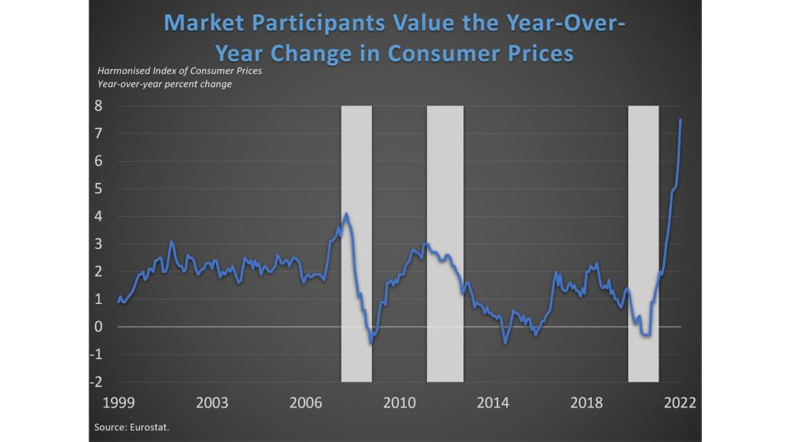

The landscape of consumer prices and inflation in Europe is largely governed by key indices such as the Monetary Union Index of Consumer Prices (MUICP), which provides crucial insights for policymakers and traders alike. As an essential metric, MUICP allows for a standardized measurement of inflation across the eurozone, helping in the formulation of consistent monetary policies. This index aggregates the Harmonized Indices of Consumer Prices (HICPs) from each euro-using country, providing a comprehensive view of consumer price trends.

The dynamic nature of economic patterns within the eurozone makes understanding the MUICP vital for those involved in monetary policy or algorithmic trading. By providing a macroeconomic perspective, MUICP serves as a focal point in assessing economic health and guiding economic decisions. Policymakers depend on its data to maintain price stability, aligning with the European Central Bank's inflation target. In algorithmic trading, MUICP data enables traders to integrate inflation trends into their trading algorithms, anticipating market movements and making informed decisions.



This article explores the MUICP, its components, its significance, and how algorithmic trading systems might leverage such economic indicators. By understanding the MUICP, stakeholders can better address the challenges and opportunities within the eurozone's economic landscape, ensuring more effective forecasting and decision-making.

## Table of Contents

## Understanding MUICP

The Monetary Union Index of Consumer Prices (MUICP) is a pivotal economic indicator that measures consumer price inflation within the eurozone. Developed as a weighted average of the country-specific Harmonized Indices of Consumer Prices (HICPs), MUICP facilitates a clear and standardized comparison of inflation measures across the member countries of the eurozone. 

Each participating country in the eurozone calculates its own HICP, which reflects the changes in prices of a specified basket of goods and services purchased by households. The MUICP aggregates these individual HICPs into a single index by applying a weighting system based on each country's share of total household consumption in the eurozone. This method ensures that the larger economies with higher consumption, such as Germany and France, have a more significant impact on the index than smaller economies. 

Mathematically, the MUICP can be represented as:

$$
MUICP_t = \frac{\sum_{i=1}^{n} (HICP_{i,t} \times W_i)}{\sum_{i=1}^{n} W_i}
$$

where $HICP_{i,t}$ is the Harmonized Index of Consumer Prices for country $i$ at time $t$, $W_i$ is the weight of country $i$ based on its household consumption, and $n$ is the number of eurozone countries.

Initially published by Eurostat, the MUICP served as a crucial economic indicator until its regular publication ceased in 2013. Despite the cessation of its monthly reporting, the MUICP remains calculable and relevant using the available HICP data from Eurostat. This provides economists, policymakers, and traders with reliable information about inflation trends within the eurozone, which can be instrumental in forming policy decisions and economic forecasts. 

The MUICP is particularly valuable because it harmonizes the inflation data across diverse economies, allowing for a coherent analysis of inflation trends in the monetary union. This harmonization is essential not only for economic modeling and predictions but also for maintaining the stability and consistency of the eurozone's monetary policy.

## How MUICP Works

The Monetary Union Index of Consumer Prices (MUICP) is a comprehensive metric representing consumer price inflation within the eurozone. It is derived from the Harmonized Index of Consumer Prices (HICP) data provided by each participating European Union country that uses the euro. This represents euro area-wide inflation and serves as a crucial tool for economic analysis and policy-making.

The calculation of the MUICP involves a standardized methodology designed to ensure accurate cross-country inflation comparisons. Each member country's HICP is a necessary component, capturing the price changes of a basket of goods and services consumed by households. Here's how the process works:

1. **Data Collection**: Each eurozone country prepares its HICP based on a standardized basket of goods and services intended to reflect the typical consumption patterns of households. These baskets are updated periodically to incorporate changes in consumer habits and preferences.

2. **Weighted Average**: The MUICP is a weighted average of these country-specific HICPs. The weight assigned to each country’s HICP reflects its proportion of total eurozone household consumption. This means larger economies with higher levels of consumption have a more significant influence on the overall MUICP. The formula used for computing the MUICP can be represented as follows:
$$
   \text{MUICP} = \frac{\sum_{i=1}^{n} (w_i \times \text{HICP}_i)}{\sum_{i=1}^{n} w_i}

$$

   where $w_i$ is the weighting factor for country $i$, $\text{HICP}_i$ is the Harmonized Index of Consumer Prices for country $i$, and $n$ is the number of eurozone countries.

3. **Harmonization**: By employing this standardized approach, the MUICP ensures consistency and comparability across different national contexts. This harmonization is essential for understanding inflation dynamics within the eurozone, as it provides a single, coherent measure of price changes, free from country-specific biases or anomalies.

Through this method, the MUICP allows for an aggregated view of inflation, suitable for effective economic policy formulation and comparison. It facilitates robust economic analysis and helps policymakers in making informed decisions regarding interest rates and monetary interventions. Moreover, this harmonized inflation measure offers insights into consumer price trends, which is pivotal for economic forecasting and the assessment of economic health across the eurozone.

## Relevance of MUICP in Monetary Policy

The Monetary Union Index of Consumer Prices (MUICP) is a key instrument in the European Central Bank's strategy for maintaining price stability within the eurozone. Its role is crucial in assessing inflation trends, which directly impact the monetary policy decisions crucial for economic stability and sustainability. The ECB aims for an inflation rate close to 2%, a benchmark that fosters an environment conducive to investment and economic planning. By providing a comprehensive view of consumer price movements, the MUICP enables policymakers to gauge inflationary pressures and adjust policy tools accordingly.

The MUICP serves as a harmonized measure, integrating the weighted Harmonized Indices of Consumer Prices (HICPs) from each eurozone member. This approach ensures consistent and comparable inflation insights across the monetary union. Although the monthly release of MUICP data was discontinued in 2013, its historical and calculable data remain valuable to economic analysis and forecasting models. Policymakers use these insights to anticipate inflation trends that can influence [interest rate](/wiki/interest-rate-trading-strategies) decisions and other macroeconomic parameters.

In the context of the ECB's operations, the MUICP's insights are leveraged in their economic models to foresee future economic conditions. These models incorporate various economic indicators, including historical inflation data provided by the MUICP, to project trends and adjust policies proactively. For instance, should the MUICP indicate rising inflation, the ECB might consider tightening monetary policy by increasing interest rates to temper inflationary pressures. Conversely, if the index signals deflationary risks, the ECB could implement measures to stimulate economic activity.

Thus, while no longer a monthly published measure, the MUICP's calculated insights continue to inform the ECB's forecasting and policy framework, emphasizing its enduring significance in ensuring the eurozone's economic health and stability.

## Algorithmic Trading and MUICP

Macroeconomic indicators such as the Monetary Union Index of Consumer Prices (MUICP) are pivotal in shaping [algorithmic trading](/wiki/algorithmic-trading) strategies. These indicators offer a comprehensive overview of consumer inflation trends, essential for anticipating market fluctuations. With the eurozone's diverse economic landscape, the MUICP integrates data across multiple member countries, providing traders with crucial insights into regional economic health.

Algorithmic trading strategies benefit from the MUICP's detailed and regular updates. This data encompasses broad consumer price movements, enabling traders to forecast market directions. By interpreting MUICP data, traders can preemptively adjust their algorithms to accommodate predicted shifts, thus optimizing their positions and minimizing risk. For instance, if the MUICP indicates a rising inflation trend, trading algorithms might be programmed to adjust portfolios, favoring assets that typically gain value during inflationary periods.

Incorporating MUICP data into algorithmic models involves real-time data processing and analytical capabilities. A Python-based algorithm might retrieve MUICP data, process it for statistical patterns, and dynamically adjust trading strategies. Below is a basic Python example outlining how MUICP data might be integrated into an algorithmic trading system:

```python
import pandas as pd
import numpy as np
from sklearn.linear_model import LinearRegression

# Sample data retrieval
data = pd.read_csv('muicp_data.csv')  # Placeholder for actual data source
data['Date'] = pd.to_datetime(data['Date'])
data.set_index('Date', inplace=True)

# Calculate moving average and standard deviation for trend analysis
data['MA'] = data['MUICP'].rolling(window=3).mean()
data['STD'] = data['MUICP'].rolling(window=3).std()

# Implement simple linear regression to forecast future inflation trends
model = LinearRegression()
X = np.arange(len(data)).reshape(-1, 1)
y = data['MUICP'].values
model.fit(X, y)
forecast = model.predict(np.array([[len(data) + i] for i in range(1, 4)]))

# Trade adjustment logic based on forecasted trends
def adjust_trading_strategy(current_muicp, forecast_muicp):
    if forecast_muicp > current_muicp:
        return "Increase holdings in inflation-proof assets"
    else:
        return "Rebalance portfolio towards low-risk assets"

# Usage
current_muicp = data['MUICP'].iloc[-1]
decision = adjust_trading_strategy(current_muicp, forecast[-1])
print("Trading Strategy Adjustment:", decision)
```

This example illustrates how algorithmic trading systems might utilize MUICP information to generate forecasts and make data-driven decisions. By leveraging such indicators, traders can maintain a competitive edge, ensuring their strategies are aligned with the economic trajectory of the eurozone. The use of MUICP data in trading algorithms thus aligns with the broader goal of achieving stability and profitability in dynamic financial markets.

## Comparisons and Future of MUICP

The Monetary Union Index of Consumer Prices (MUICP) serves as a cornerstone for analyzing inflation within the eurozone. Its comparability to other significant inflation indices, such as the Harmonized Index of Consumer Prices (HICP) and the United States Consumer Price Index (US CPI), fundamentally underscores its relevance. However, MUICP's unique positioning within the monetary union lends it distinct significance in economic analyses and policy formulation.

HICP, serving as the building block for MUICP, focuses on ensuring the comparability of inflation data across different nations by using a harmonized methodology. This forms the basis for MUICP, which aggregates these national figures to present a eurozone-wide inflation measure. In contrast, the US CPI tracks inflation by evaluating the price change of a basket of consumer goods and services within the United States. While both MUICP and US CPI provide insights into inflation trends, the MUICP remains indispensable for understanding price stability within the framework of the European Central Bank's (ECB) policy objectives.

Technological advancements are poised to revolutionize the ways in which MUICP influences finance, trade, and policy. As digital tools and big data analytics become more sophisticated, there is an increasing capability to process and analyze vast datasets, facilitating meticulously informed economic and financial decisions. For instance, algorithmic trading systems can integrate data from MUICP to sharpen trade execution strategies, allowing for real-time adjustments to meet evolving market conditions. Central banks and policymakers can also leverage advanced analytics to enhance economic forecasting and policy precision.

Building robust, data-driven economic models requires a deep, ongoing understanding of MUICP and its implications. In a digital economy, models can incorporate dynamic parameters influenced by MUICP data, fostering more flexible and responsive systems that can adapt to economic [volatility](/wiki/volatility-trading-strategies). For example, using Python:

```python
import numpy as np

# Hypothetical function to simulate inflation impact based on MUICP data
def inflation_impact(muicp_data, beta):
    return np.dot(muicp_data, beta)

# Example MUICP data and model parameters
muicp_data = np.array([1.5, 1.7, 1.6, 1.8])
beta = np.array([0.4, 0.3, 0.2, 0.1])

# Calculating the inflation impact
impact = inflation_impact(muicp_data, beta)
print("Inflation Impact on Economy: ", impact)
```

This exemplifies how MUICP data can be integrated into models to assess potential economic impacts, enhancing decision-making capabilities. As Europe continues to evolve, embedding MUICP insights into such models will be fundamental to maintaining economic resilience and fostering sustained growth within the eurozone.

## Conclusion

The Monetary Union Index of Consumer Prices remains a critical yet often underappreciated instrument for assessing inflation across the eurozone. While its direct publication ceased in 2013, the MUICP's significance persists, as it continues to offer valuable insights into the economic pulses of countries within the monetary union. By leveraging data aggregated from country-specific Harmonized Indices of Consumer Prices (HICPs), the MUICP provides a harmonized view that is crucial for maintaining consistency in inflation measurement across diverse economies. 

Understanding and utilizing the MUICP can enhance various economic functions. For policymakers, MUICP insights are essential for informed decision-making, especially in balancing monetary policies with the European Central Bank's inflation rate target of around 2%. This stability is key to fostering economic resilience within the eurozone, ensuring that strategies at governmental and institutional levels are both effective and aligned with the overarching economic goals.

For algorithmic traders, the MUICP provides a data-driven foundation upon which trading algorithms can be built or refined. By anticipating inflation trends and subsequent market shifts, traders can better position themselves to capitalize on economic fluctuations, resulting in optimized trading strategies that are reactive to real-time economic signals.

As Europe continues to face intricate economic challenges and opportunities, the MUICP's role in economic analysis and strategy formulation cannot be overstated. Whether influencing policy or refining algorithmic models, the insights derived from the MUICP will remain instrumental for both decision-makers and traders. Its ability to inform economic resilience will be pivotal in navigating the complex landscapes that lie ahead.

## References & Further Reading

[1]: ["Monthly Inflation Rates"](https://www.usinflationcalculator.com/inflation/current-inflation-rates/) by Eurostat

[2]: ["Harmonized Index of Consumer Prices (HICP)"](https://www.ecb.europa.eu/stats/macroeconomic_and_sectoral/hicp/html/index.en.html) - Eurostat

[3]: Fagan, Gabriel, & Morgan, Philip. (2005). ["Econometric Models of the Euro-area Central Banks"](https://www.academia.edu/87757425/Econometric_Models_of_the_Euro_area_Central_Banks) - European Central Bank Working Paper.

[4]: ["Monetary Policy and Inflation"](https://www.investopedia.com/ask/answers/122214/how-does-monetary-policy-influence-inflation.asp) - European Central Bank

[5]: Balke, Nathan S. & Wynne, Mark A. (2000). ["An Equilibrium Analysis of Relative Prices and Aggregate Inflation"](https://papers.ssrn.com/sol3/papers.cfm?abstract_id=252343) - Federal Reserve Bank of Dallas Working Paper.