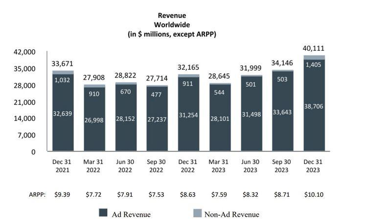

In the ever-evolving landscape of business and finance, the strategies companies employ to boost revenues are critical. Among these strategies, the utilization of advanced technology and financial intelligence, like algorithmic trading, is making significant waves. Algorithmic trading, often referred to as 'algo trading,' leverages computer algorithms to automatically execute trades based on predefined criteria. This technology allows for the processing of large volumes of data at speeds unattainable for human traders, thereby reducing human error and eliminating emotional biases.

Businesses are increasingly recognizing the potential of integrating algorithmic trading into their revenue models. These models, which serve as frameworks for generating income, can range from subscription services and freemium models to advertising revenue. By incorporating automated systems into trading and financial management, companies have the opportunity to optimize these models for higher returns, positioning themselves at the forefront of modern business strategy.



The synergy created between business strategies, revenue models, and algorithmic trading presents companies with unique monetization opportunities. Monetization involves transforming non-revenue-generating assets into profitable ones, a critical aspect for any algo trading-related initiative. For example, trading platforms can charge fees for premium features or provide API access, allowing users to harness advanced trading data and insights.

Understanding how these elements work in tandem provides a clear path for companies looking to leverage financial technology for increased profitability and growth. As we explore how businesses can capitalize on algorithmic trading and related practices, we uncover potential pathways to enhance revenue models and monetize more effectively, ultimately shaping the future of finance with increased integration of AI and trading algorithms. This modern frontier in business strategy demands continuous learning and adaptation to unlock new possibilities for growth.

## Table of Contents

## Understanding Algorithmic Trading

Algorithmic trading, also known as 'algo trading', utilizes computer algorithms to execute trades based on pre-established criteria automatically. This sophisticated method relies on algorithms that can analyze vast amounts of data swiftly and execute trades at a pace beyond human capability. The ability to process information quickly allows algo trading to capitalize on even the smallest market inefficiencies, providing a substantial advantage in the financial markets.

One of the key benefits of algorithmic trading is its capacity to minimize human error and remove emotional biases from the trading process. By employing algorithmic methods, traders can mitigate the impact of irrational decision-making, leading to more consistent and reliable performance. This characteristic has made algo trading a preferred choice in various financial institutions and among individual traders.

There are several distinct types of [algorithmic trading](/wiki/algorithmic-trading) strategies, each serving specific objectives in the market. Execution algorithms are designed to efficiently [carry](/wiki/carry-trading) out large orders without significantly impacting the market price. These algorithms use techniques such as slicing large orders into smaller, more manageable pieces and strategically executing them to minimize market impact.

Profit-seeking algorithms aim to identify and exploit pricing inefficiencies for profitable opportunities. These algorithms often rely on high-frequency trading ([HFT](/wiki/high-frequency-trading-strategies)) techniques to rapidly enter and [exit](/wiki/exit-strategy) positions within milliseconds, taking advantage of short-term price discrepancies.

Black-box algorithms are proprietary trading systems where the logic behind the trading decisions is not disclosed. These algorithms are typically developed by financial firms seeking a competitive edge. The lack of transparency, however, can pose risks, as developers need to continuously monitor and update these algorithms to adapt to changing market conditions.

Open-source algorithms are available for public use and modification, fostering collaboration among traders and developers. These algorithms provide a framework that can be customized and improved by the trading community, promoting innovation and shared learning.

In conclusion, algorithmic trading encompasses a range of strategies, each tailored to meet different trading objectives. Whether aimed at optimizing order executions, seeking profits through market inefficiencies, or employing proprietary logic, algo trading represents a significant evolution in financial technology, offering numerous possibilities for enhancing trading efficiency and profitability.

## Business Strategies and Revenue Models

To leverage algorithmic trading effectively, businesses require strategies that align closely with their specific revenue models. Revenue models, which are frameworks for generating income, vary widely and can include subscription services, freemium models, or advertising revenue. These models are crucial as they define the income streams and potential profitability of a business.

Revenue models in the financial sector benefit significantly from the integration of algorithmic trading. This technology can optimize trading operations, leading to increased efficiency and profitability. For instance, subscription services in the financial context might offer real-time trading signals or data analytics derived from algorithmic trading, providing ongoing value to subscribers and creating a steady income stream.

Freemium models are another area where algorithmic trading can be beneficial. Companies can offer basic trading services for free to attract a broad user base, while monetizing through premium features such as advanced algorithmic trading strategies or enhanced data analytics. This approach not only increases the user base but also incentivizes users to convert into paying customers for superior service levels, driving revenue growth.

Advertising revenue can also be enhanced through algorithmic trading. Companies can develop platforms that allow users to execute trades automatically, collecting valuable trading data. This data can be used to attract advertisers looking to target specific demographics, leading to additional revenue streams. The key here is to transform trading data and user interactions into meaningful insights that advertisers deem valuable.

Moreover, companies can monetize their trading data through strategic partnerships. Financial institutions or fintech companies can collaborate to provide traders with platforms rich in market insights, data, and tools derived from algorithmic trading. Such partnerships not only enhance the value proposition for end users but also create new revenue opportunities for both parties involved.

The synergy between algorithmic trading and business operations represents a significant driver of modern revenue streams. By combining advanced technology with strategic revenue models, businesses can reach new heights of profitability and innovation. Algorithmic trading not only streamlines operations but also opens the door to novel ways of monetizing digital assets and data, ensuring that companies remain competitive in an ever-evolving marketplace.

## Monetization Techniques in Algo Trading

Monetization involves transforming assets that do not directly generate revenue into profitable components, a key objective for many algorithmic trading strategies. In the financial sector, monetization is frequently associated with exploiting data assets or commercializing trading software licenses. 

Platforms that support algorithmic trading often engage in monetization by imposing fees for advanced features or API access. For instance, premium subscriptions may provide traders with exclusive insights derived from sophisticated analytics, contributing to enhanced decision-making capabilities. These platforms may also offer a tiered pricing model, where basic access is free, but users must pay for additional functionality, thereby creating a steady revenue pipeline.

To elucidate the significance of data in monetization, consider trading data as a resource that can be leveraged in partnerships or offered as a service to individual traders. Financial firms can create proprietary insights by processing enormous datasets, which they can sell to clients seeking to enhance their trading strategies. Moreover, the sale of algorithmic trading software itself, or licensing arrangements, allows firms to generate income from their technological innovations. This practice is particularly prevalent among firms that develop and maintain advanced trading solutions tailored to specific market needs.

Understanding the risks and potential income streams is pivotal for companies venturing into algorithmic trading. While the opportunities for monetization are diverse, they come with inherent risks such as market [volatility](/wiki/volatility-trading-strategies), regulatory challenges, and the necessity for maintaining robust technological infrastructure. Effective risk management involves continuously adapting algorithms to market changes and ensuring compliance with financial regulations, thereby safeguarding the monetization efforts.

In summary, monetizing algo trading requires strategic exploitation of data and software assets while balancing the encumbrances of regulatory frameworks and technological upkeep. As the intersection between financial technology and trading evolves, firms that successfully navigate these aspects can establish strong, sustainable revenue models.

## Case Studies: Successful Integration of Algo Trading

Successful integration of algorithmic trading has been demonstrated by various companies across different market sectors, showcasing the versatility and potential of this technology. These case studies highlight innovative monetization approaches and the importance of data-driven insights in achieving profitability.

### Case Study 1: Renaissance Technologies

Renaissance Technologies, known for its flagship Medallion Fund, is widely regarded as a pioneer in algorithmic trading. The firm utilizes complex mathematical models and sophisticated algorithms to analyze market patterns and identify profitable trading opportunities. By leveraging vast amounts of historical data, Renaissance Technologies has achieved impressive annual returns, often surpassing traditional hedge funds. A key [factor](/wiki/factor-investing) in their success is the continuous evolution and refinement of their algorithms, allowing them to maintain a competitive edge in the market.

### Case Study 2: Two Sigma Investments

Two Sigma Investments is a technology-driven [hedge fund](/wiki/hedge-fund-trading-strategies) that employs data science and [machine learning](/wiki/machine-learning) to guide its trading strategies. The firm focuses on collecting and analyzing large datasets to uncover patterns that can inform trading decisions. Two Sigma has successfully integrated algorithmic trading with its business strategy by monetizing insights gleaned from big data analysis. Their ability to leverage diverse datasets, ranging from financial reports to social media trends, enables them to anticipate market movements and optimize their trading models continuously.

### Case Study 3: AQR Capital Management

AQR Capital Management is another prominent entity that has effectively incorporated algorithmic trading into its investment strategies. The firm emphasizes research-driven decision-making, using quantitative techniques to analyze risk and return metrics. AQR employs systematic trading strategies across various asset classes, allowing for diversification and the exploitation of market inefficiencies. Their approach to monetization involves offering bespoke investment products and services that apply their algorithmic insights, thus attracting a wide range of institutional clients.

### Case Study 4: Citadel LLC

Citadel LLC is a global financial institution that utilizes algorithmic trading across its hedge fund and market-making divisions. The firm has invested heavily in technological infrastructure and employs a team of engineers and data scientists to develop and maintain its trading algorithms. Citadel's success in algorithmic trading stems from its ability to process and analyze real-time market data rapidly, allowing it to execute trades with precision. By integrating technology with strategic insights, Citadel has enhanced its revenue streams, reinforcing its position in the competitive financial arena.

### Case Study 5: Optiver

Optiver, a leading market maker, has capitalized on algorithmic trading to manage risk and ensure [liquidity](/wiki/liquidity-risk-premium) in financial markets. The firm’s strategy hinges on the development of proprietary trading software and algorithms that facilitate high-frequency trading. Optiver's business model focuses on providing fair, competitive prices in the marketplace, thereby generating profits through the bid-ask spread. Their integration of algorithmic trading has been instrumental in their ability to scale operations globally, adapting to different market conditions efficiently.

These examples underscore the transformative impact of algorithmic trading on business strategies. Companies leveraging this technology not only enhance their operational efficiencies but also unlock new revenue potentials by effectively harnessing data-driven insights. As the financial landscape continues to evolve, the successful integration of algorithmic trading will likely become a defining characteristic of leading market players.

## Challenges and Considerations

Algorithmic trading, while offering numerous advantages, also presents several significant challenges that businesses must carefully consider. One of the primary challenges is the requirement for a substantial technological infrastructure. High-frequency trading, a subset of algo trading, necessitates state-of-the-art hardware and software capable of processing vast amounts of data in real-time. This infrastructure can be both costly and complex to manage, often requiring specialized personnel to ensure smooth operation and maintenance.

Data security is another critical concern. As algorithmic trading heavily relies on data, protecting this data from breaches is paramount. Cyberattacks can not only lead to financial losses but also damage a company's reputation. To mitigate these risks, firms should invest in robust cybersecurity measures, such as regular vulnerability assessments, intrusion detection systems, and comprehensive encryption protocols.

Regulatory requirements also play a significant role in shaping the operational landscape of algorithmic trading. Different regions have varying regulatory frameworks that businesses must comply with. For example, firms operating in the European Union must adhere to the Markets in Financial Instruments Directive II (MiFID II), which mandates transparency and accountability in trading practices. Compliance often demands substantial resources to ensure that trading algorithms and data handling practices meet these legal standards.

Ethical considerations represent an additional layer of complexity. Algorithmic trading strategies can sometimes lead to market manipulation if not carefully monitored and controlled. Firms should establish strict ethical guidelines and employ oversight mechanisms to ensure that their trading activities do not inadvertently harm market integrity or fairness. 

Continuously updating algorithmic models is essential to remain competitive and manage potential risks. Regular updates help in adapting to market changes and reducing vulnerabilities associated with older, less flexible systems. Implementing machine learning techniques within algorithms can enhance their ability to learn from new data patterns, thereby improving their predictive accuracy and stability.

Managing these challenges requires a multifaceted approach, incorporating technological investments, regulatory compliance, and ethical frameworks. By addressing these areas proactively, businesses can harness the full potential of algorithmic trading while mitigating its associated risks.

## Conclusion

The integration of business strategies with algorithmic trading represents a transformative approach for generating revenue. By strategically aligning business goals with sophisticated algorithmic techniques, companies can create new avenues for income that were previously untapped. Algorithmic trading's ability to process and analyze vast amounts of data at unparalleled speeds provides businesses with a competitive advantage, enabling them to make more informed decisions and capitalize on market opportunities more efficiently.

As the financial industry looks ahead, the integration of [artificial intelligence](/wiki/ai-artificial-intelligence) (AI) and trading algorithms within business models is poised to grow exponentially. This evolution promises to enhance predictive analytics, leading to more accurate market forecasting and improved financial outcomes. For instance, machine learning models can be employed to continually refine trading strategies, adapting to new market conditions and optimizing revenue streams. Here is a simple example of a Python code using a basic trading algorithm with AI components:

```python
import numpy as np
from sklearn.ensemble import RandomForestClassifier
from sklearn.model_selection import train_test_split
from sklearn.metrics import accuracy_score

# Sample data for features (historical prices, indicators) and labels (buy/sell signals)
X = np.random.rand(1000, 10)  # features
y = np.random.randint(0, 2, 1000)  # labels

# Split data into training and test sets
X_train, X_test, y_train, y_test = train_test_split(X, y, test_size=0.2, random_state=42)

# Initialize a Random Forest model
model = RandomForestClassifier(n_estimators=100, random_state=42)

# Train the model
model.fit(X_train, y_train)

# Predict on test data
y_pred = model.predict(X_test)

# Calculate accuracy
accuracy = accuracy_score(y_test, y_pred)
print(f"Model Accuracy: {accuracy * 100:.2f}%")
```

Navigating this complex but rewarding landscape requires continuous learning and adaptation, as well as a commitment to innovation. Companies must invest in robust technical infrastructures, embrace cutting-edge technologies, and remain vigilant to regulatory changes and potential ethical implications. By doing so, they can not only survive but thrive in an increasingly competitive and technologically driven financial ecosystem. The commitment to integrating algorithmic trading into business strategies thus serves not only as a catalyst for enhanced revenue but also as a pivotal element in maintaining a strong market position in the future.

## References & Further Reading

[1]: Bergstra, J., Bardenet, R., Bengio, Y., & Kégl, B. (2011). ["Algorithms for Hyper-Parameter Optimization."](https://papers.nips.cc/paper/4443-algorithms-for-hyper-parameter-optimization) Advances in Neural Information Processing Systems 24.

[2]: ["Advances in Financial Machine Learning"](https://www.amazon.com/Advances-Financial-Machine-Learning-Marcos/dp/1119482089) by Marcos Lopez de Prado

[3]: ["Evidence-Based Technical Analysis: Applying the Scientific Method and Statistical Inference to Trading Signals"](https://www.amazon.com/Evidence-Based-Technical-Analysis-Scientific-Statistical/dp/0470008741) by David Aronson

[4]: ["Machine Learning for Algorithmic Trading"](https://github.com/stefan-jansen/machine-learning-for-trading) by Stefan Jansen

[5]: ["Quantitative Trading: How to Build Your Own Algorithmic Trading Business"](https://www.amazon.com/Quantitative-Trading-Build-Algorithmic-Business/dp/1119800064) by Ernest P. Chan