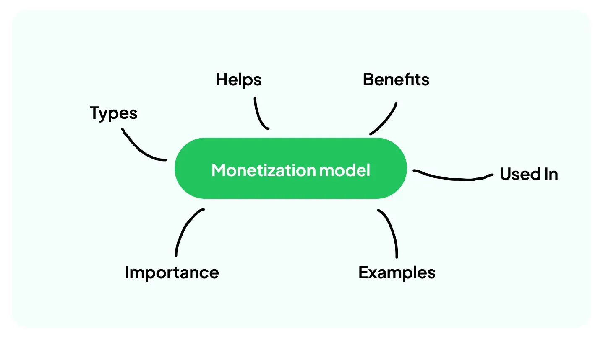

## Table of Contents

## What is monetization?

Monetization is the process of turning something into a source of money. It can be anything from a website, app, or even a hobby. For example, if you have a popular blog, you might add ads to it. When people click on those ads, you earn money. This is one way to monetize a blog.

There are many ways to monetize things. Some people sell products or services directly. Others use ads, like in the blog example. Another way is through subscriptions, where people pay a regular fee to access something. For instance, many apps and websites offer premium content for a monthly fee. The key is finding the right method that works for what you are trying to monetize.

## Why is monetization important for businesses?

Monetization is important for businesses because it helps them make money. Without making money, a business can't keep going. It's like when you earn money from a job to buy things you need. For a business, monetizing means they can pay for things like making their products, paying workers, and keeping the lights on.

Also, monetization helps businesses grow. When a business makes money, it can use that money to make more products, reach more people, or improve what they already do. This can make the business bigger and better. It's like saving up to buy something bigger or better for yourself. If a business can't monetize well, it might not be able to grow or even stay open.

## What are the basic mechanisms of monetization?

One basic way to monetize is by selling things. This can be products, like toys or clothes, or services, like haircuts or fixing computers. When people buy these things, the business makes money. Another way is through ads. If a business has a website or app, they can show ads on it. When people see or click on these ads, the business gets paid by the company that made the ad.

Another mechanism is through subscriptions. This is when people pay a regular fee, like every month, to use something. For example, a streaming service might charge a monthly fee for people to watch movies and shows. This gives the business a steady flow of money. Lastly, there's affiliate marketing. This is when a business promotes another company's products and gets a commission when people buy those products through their link. This way, the business makes money without having to make or sell the products themselves.

## How does advertising serve as a monetization strategy?

Advertising is a way for businesses to make money by showing ads on their websites, apps, or other platforms. When people see or click on these ads, the business gets paid by the company that made the ad. This can be a good way to make money, especially if the business has a lot of people visiting their site or using their app. The more people see the ads, the more money the business can make.

There are different ways to make money from ads. One way is through pay-per-click, where the business gets paid every time someone clicks on an ad. Another way is through pay-per-impression, where the business gets paid for every time the ad is shown, even if no one clicks on it. This can be a good way for businesses to make money without having to sell their own products or services directly.

## What are subscription models and how do they work?

Subscription models are a way for businesses to make money by charging people a regular fee, like every month or year, to use their product or service. This can be things like streaming services for movies and music, or even boxes of goodies that get sent to your home each month. The idea is that people pay a little bit regularly instead of a big amount all at once. This can be good for businesses because it gives them a steady flow of money, which helps them plan and grow.

For the people using the service, subscriptions can be a good deal because they get to use the product or service for a long time without having to pay a big amount upfront. It's like renting a movie instead of buying it. You pay a little bit each time you want to watch it. This can make it easier for people to try new things without spending a lot of money all at once. Plus, businesses often give special deals or extra stuff to people who subscribe, which can make it even more appealing.

## Can you explain the concept of freemium in monetization?

Freemium is a way for businesses to make money by offering a basic version of their product or service for free, while charging for extra features or benefits. It's like getting a free sample at a store, but if you want the full product, you have to pay for it. This can be good for businesses because it lets people try out what they offer without spending money right away. If people like the free version, they might decide to pay for the premium version to get more features.

For example, a music app might let you listen to songs for free, but if you want to listen without ads or download songs to play offline, you have to pay for a subscription. This way, the business can attract a lot of users with the free version and then make money from the ones who decide to upgrade. Freemium can be a smart way to grow a business because it gives people a taste of what you offer and encourages them to pay for more if they like it.

## What role do in-app purchases play in monetization?

In-app purchases are a way for businesses to make money from their apps. They let people buy things inside the app, like extra lives in a game, special features, or even virtual items. This can be good for businesses because it gives them another way to make money without charging everyone to use the app. People who really like the app might be willing to spend a little money to get more out of it.

For example, in a game, you might be able to buy coins or power-ups to help you play better. The game is free to download and play, but if you want to get ahead faster or have more fun, you can buy these extra things. This way, the business can make money from the people who want to spend more, while still letting everyone else enjoy the basic game for free.

## How can affiliate marketing be used for monetization?

Affiliate marketing is a way for businesses to make money by promoting other people's products. When someone buys a product through a special link on the business's website or app, the business gets a little bit of money from the sale. This is called a commission. It's like getting a reward for helping someone find a product they like. Businesses can put these special links in their blog posts, videos, or even emails to their customers.

This can be a good way for businesses to make money without having to make or sell their own products. They just need to find products that their customers might like and share them. If a lot of people buy the products through their links, the business can make a good amount of money. It's a win-win because the business makes money, and the customers get to find new products they might enjoy.

## What are some advanced monetization strategies for digital content?

One advanced way to make money from digital content is through dynamic pricing. This means changing the price of your content based on what people are willing to pay. For example, if you have a popular online [course](/wiki/best-algorithmic-trading-courses), you might charge more for it during times when a lot of people want to take it, like at the start of a new school year. This can help you make more money because you're charging what people are willing to pay at that moment.

Another strategy is using data to personalize what you offer. By looking at what people like and how they use your content, you can make special offers just for them. For example, if someone often watches cooking videos on your site, you could offer them a special deal on a cooking class or a recipe book. This can make people more likely to buy because the offer is just for them, and it can help you make more money by selling things that people really want.

A third advanced strategy is creating a community around your content. This can be done through forums, social media groups, or even live events. When people feel like they are part of a group, they are more likely to pay for things like special access or exclusive content. For example, if you have a blog about fitness, you could create a members-only area where people can get personalized workout plans or chat with other fitness fans. This can turn your content into something more valuable and help you make more money from it.

## How do licensing and merchandising contribute to monetization?

Licensing is when a business lets another company use their name, logo, or characters to make products. For example, a toy company might pay to make toys with characters from a popular movie. The movie company gets money every time the toy company sells one of these toys. This can be a good way to make money because the business doesn't have to make the products themselves. They just let other companies use their ideas and get paid for it.

Merchandising is when a business sells products with their brand on them. This can be things like t-shirts, hats, or even mugs. For example, if a band has a popular logo, they might sell t-shirts with that logo on it. When people buy these products, the business makes money. Merchandising can help a business make more money because it lets them sell things that their fans want to buy. It also helps spread the word about the business because people wearing the merchandise are like walking advertisements.

## What metrics should be monitored to evaluate the success of monetization strategies?

To know if your monetization strategies are working well, you need to keep an eye on a few key numbers. One important number is how much money you're making. This is called revenue. If your revenue is going up, that's a good sign that your strategies are working. Another number to watch is how many people are buying or using what you're selling. This can be things like the number of subscribers, the number of products sold, or the number of ads clicked on. If these numbers are going up, it means more people are interested in what you're offering.

Another important thing to look at is how much it costs you to make money. This is called the cost of goods sold or customer acquisition cost. If it costs you a lot to get people to buy your stuff, you might not be making as much money as you think. You should also look at how happy your customers are. If they're happy, they're more likely to keep buying from you or tell others about you. You can measure this with things like customer satisfaction surveys or how often people come back to buy more. By keeping an eye on these numbers, you can see if your monetization strategies are really helping you make more money.

## How can businesses adapt their monetization strategies in response to market changes?

Businesses need to keep an eye on what's happening in the market and be ready to change their monetization strategies if things shift. For example, if a new competitor comes in with lower prices, a business might need to lower their prices too or find another way to make money, like adding new features that people are willing to pay for. If people start using different kinds of devices, like switching from computers to phones, the business might need to make sure their products work well on these new devices and maybe even offer special deals for mobile users.

Another way businesses can adapt is by listening to what their customers want. If customers start asking for different kinds of products or services, the business can try to offer those things. For example, if a lot of people want to pay for a service monthly instead of all at once, the business might switch to a subscription model. By staying flexible and being willing to try new things, businesses can keep making money even when the market changes.

## References & Further Reading

[1]: Bergstra, J., Bardenet, R., Bengio, Y., & Kégl, B. (2011). ["Algorithms for Hyper-Parameter Optimization."](https://papers.nips.cc/paper/4443-algorithms-for-hyper-parameter-optimization) Advances in Neural Information Processing Systems 24.

[2]: ["Advances in Financial Machine Learning"](https://www.amazon.com/Advances-Financial-Machine-Learning-Marcos/dp/1119482089) by Marcos Lopez de Prado

[3]: ["Evidence-Based Technical Analysis: Applying the Scientific Method and Statistical Inference to Trading Signals"](https://www.amazon.com/Evidence-Based-Technical-Analysis-Scientific-Statistical/dp/0470008741) by David Aronson

[4]: ["Machine Learning for Algorithmic Trading"](https://github.com/stefan-jansen/machine-learning-for-trading) by Stefan Jansen

[5]: ["Quantitative Trading: How to Build Your Own Algorithmic Trading Business"](https://www.amazon.com/Quantitative-Trading-Build-Algorithmic-Business/dp/1119800064) by Ernest P. Chan