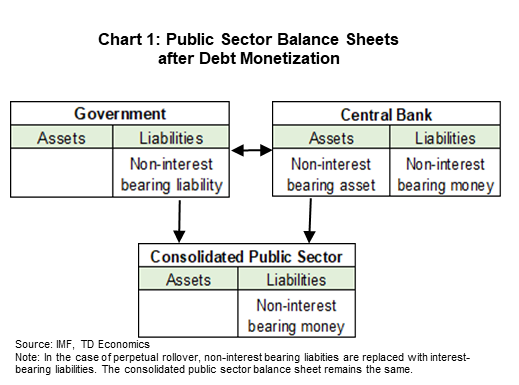

## Table of Contents

## What is government debt?

Government debt is the total amount of money that a government owes to others. This debt can come from borrowing money by selling bonds or taking loans from other countries or international organizations. Governments often borrow money to pay for things like building roads, schools, and hospitals, or to help during tough economic times. Just like when a person borrows money, the government has to pay back what it borrowed, usually with interest.

If a government borrows too much money, it can become hard to pay back the debt. This can lead to problems like higher taxes or less money for public services. On the other hand, some people think that government debt is not always bad. They say it can help the economy grow by funding important projects and helping people during tough times. It's a tricky balance that governments have to manage carefully.

## What does it mean to monetize government debt?

To monetize government debt means that a country's central bank buys the government's bonds or securities. When the central bank does this, it is basically creating new money to pay for the government's debt. This is different from when other people or countries buy the government's bonds because the central bank can just print more money to buy them.

Monetizing debt can help the government because it makes it easier to borrow money. It can also help the economy by putting more money into circulation, which can make people spend more and help businesses grow. But, if too much money is created this way, it can lead to inflation, which means prices go up and the value of money goes down. So, governments and central banks need to be careful about how much they do this.

## How do central banks typically monetize government debt?

Central banks usually monetize government debt by buying government bonds. When the government needs money, it sells these bonds to people, banks, or other countries. But sometimes, the central bank steps in and buys these bonds directly from the government or from the people who first bought them. By doing this, the central bank is basically creating new money because it can just print more money to pay for the bonds.

This process can help the government because it makes it easier for them to borrow money. It can also help the economy by putting more money into circulation, which can encourage people to spend more and help businesses grow. But, if the central bank creates too much money this way, it can lead to inflation. Inflation means that prices go up and the value of money goes down. So, central banks have to be careful about how much they monetize government debt to keep the economy stable.

## What are the economic implications of monetizing government debt?

When a central bank monetizes government debt, it can have both good and bad effects on the economy. On the good side, it can help the government when it needs money. Instead of borrowing from other countries or people, the central bank can just buy the government's bonds with new money. This can also help the economy by putting more money into people's hands, which can make them spend more and help businesses grow. This is especially helpful during tough economic times when the government needs to spend more to help people and businesses.

However, there are also risks. If the central bank creates too much money by buying government bonds, it can lead to inflation. Inflation means that prices go up and the value of money goes down. If prices keep going up, it can make life harder for people because their money doesn't buy as much as it used to. Also, if people think the government is borrowing too much money and the central bank is just printing more to pay for it, they might lose trust in the government and the money. This can make the economy unstable. So, the central bank has to be careful about how much it monetizes government debt to keep the economy balanced.

## Can you explain the relationship between government debt monetization and inflation?

When a central bank monetizes government debt, it buys government bonds by creating new money. This means there's more money in the economy. If there's more money, people might spend more, which can help businesses and make the economy grow. This can be good, especially during tough times when the government needs to help people and businesses.

But if the central bank creates too much money this way, it can cause inflation. Inflation means prices go up and the value of money goes down. If there's too much money chasing the same amount of goods, prices will rise. This can make life harder for people because their money doesn't buy as much as it used to. So, the central bank has to be careful about how much it monetizes government debt to avoid making prices go up too much.

## What are the historical examples of government debt monetization by central banks?

One famous example of government debt monetization is what happened in the United States during World War II. The Federal Reserve bought a lot of government bonds to help pay for the war. This meant the government could borrow money more easily. It helped the country during a very tough time, but it also led to some inflation after the war was over. The Federal Reserve had to be careful to manage the money supply to keep prices from going up too much.

Another example is Japan in the 1990s and 2000s. Japan's economy was struggling, so the Bank of Japan started buying government bonds to put more money into the economy. This was meant to help businesses and encourage people to spend more. But even with all this money, Japan still had a hard time growing its economy and dealing with inflation. It shows how tricky it can be to use debt monetization to help the economy without causing too many problems.

## How does monetizing government debt affect interest rates?

When a central bank monetizes government debt, it buys government bonds with new money. This can help keep interest rates low. When the central bank buys a lot of bonds, it means there's more demand for them. This can make the price of the bonds go up and the interest rates on new bonds go down. Low interest rates can make it easier for the government to borrow more money because it doesn't have to pay as much interest.

However, if the central bank keeps buying more and more bonds, it can lead to too much money in the economy. This can cause inflation, which means prices go up. If people expect inflation to keep going up, they might want higher interest rates to make up for the money losing value. So, the central bank has to be careful. If it buys too many bonds and causes inflation, it might have to raise interest rates later to control the inflation, which can make borrowing more expensive for everyone.

## What are the potential risks associated with central banks monetizing government debt?

When a central bank monetizes government debt, it can lead to inflation. This happens because the central bank creates new money to buy the government's bonds. If there's too much money in the economy, prices can go up and the value of money can go down. This can make life harder for people because their money doesn't buy as much as it used to. Also, if people think the government is borrowing too much and the central bank is just printing more money to pay for it, they might lose trust in the government and the money. This can make the economy unstable.

Another risk is that it can affect interest rates. When the central bank buys a lot of government bonds, it can push interest rates down because there's more demand for the bonds. This makes it easier for the government to borrow money. But if the central bank keeps doing this and causes inflation, it might have to raise interest rates later to control the inflation. Higher interest rates can make borrowing more expensive for everyone, not just the government. So, the central bank has to be careful about how much it monetizes government debt to keep the economy balanced.

## How does government debt monetization impact the independence of central banks?

When a central bank monetizes government debt, it can make people worry about the bank's independence. The central bank is supposed to make decisions about money and interest rates without being told what to do by the government. But if it keeps buying the government's bonds, some people might think the central bank is just doing what the government wants. This can make people lose trust in the central bank and think it's not making decisions based on what's best for the economy.

If the central bank loses its independence, it can cause problems. For example, the government might want the central bank to keep buying its bonds even if it's not good for the economy. This can lead to too much money being created, which can cause inflation. People might also think the government is borrowing too much and not managing money well. So, it's important for the central bank to stay independent to keep the economy stable and keep people's trust.

## What are the alternatives to monetizing government debt?

One way to handle government debt without monetizing it is by raising taxes. When the government collects more money from taxes, it can use that money to pay off its debt instead of borrowing more. This can help keep the amount of money in the economy from growing too fast, which can stop inflation. But raising taxes can be hard because people might not like it, and it can make the economy slower if people have less money to spend.

Another option is for the government to cut spending. If the government spends less money, it doesn't need to borrow as much. This can help lower the debt without printing more money. But cutting spending can also be tough because it might mean less money for important things like schools, hospitals, and roads. So, the government has to find a balance between spending enough to help people and keeping the debt under control.

A third way is to encourage more economic growth. If the economy grows, the government can collect more taxes without raising rates because there's more money being made. This extra money can help pay down the debt. To boost the economy, the government might invest in things that help businesses grow, like better infrastructure or education. But this takes time and planning, and it's not always easy to make the economy grow faster.

## How do different economic theories view the practice of monetizing government debt?

Different economic theories have different views on monetizing government debt. Some economists, like those who follow Keynesian economics, think it can be a good thing, especially during tough economic times. They believe that if the government borrows money and the central bank buys the debt, it can help put more money into the economy. This can make people spend more, which can help businesses and make the economy grow. They see it as a way to help during a recession or when the economy is not doing well.

On the other hand, economists who follow more classical or monetarist theories are often more worried about monetizing government debt. They think it can lead to big problems like inflation. If the central bank keeps creating new money to buy government bonds, there can be too much money in the economy. This can make prices go up and the value of money go down. They worry that it can also make people lose trust in the government and the money, which can make the economy unstable. So, they usually think it's better to find other ways to manage government debt, like raising taxes or cutting spending.

## What are the current global trends and policies regarding the monetization of government debt by central banks?

In recent years, many central banks around the world have been using debt monetization more often, especially after big events like the 2008 financial crisis and the COVID-19 pandemic. Countries like the United States, the European Union, and Japan have seen their central banks buying a lot of government bonds to help their economies. This has been a way to keep interest rates low and make it easier for governments to borrow money when they need it. For example, the U.S. Federal Reserve and the European Central Bank have been buying bonds to support their economies and help them recover from tough times.

However, not all countries are doing the same thing. Some countries, especially in developing parts of the world, are more careful about monetizing government debt because they worry about inflation. They might use other ways to manage their debt, like raising taxes or cutting spending. Also, some central banks are starting to think about how to pull back from buying so many bonds, to avoid causing too much inflation or making people worry about their independence. So, while debt monetization is a common tool now, how much it's used and how it's managed can be different from one country to another.

## What is Debt Monetization?

Debt monetization is a process where a central bank purchases government bonds with the aim of increasing the monetary base permanently. This financial strategy enables governments to fund their expenditures without resorting to raising taxes or seeking loans from external entities. By doing so, the central bank injects liquidity directly into the economy, which can stimulate economic activity but also carries the risk of producing inflation if not managed properly.

The essential mechanism behind debt monetization involves the central bank exchanging newly created money for government bonds. This transaction effectively translates the government's debt into liquid assets, increasing the amount of money circulating in the economy. The formula to represent the relationship between money supply, velocity of money, price level, and real output is given by the equation of exchange: 

$$
MV = PQ
$$

Where:
- $M$ is the money supply,
- $V$ is the velocity of money,
- $P$ is the price level,
- $Q$ is the real output.

An increase in $M$ without corresponding changes in $Q$ or $V$ could lead to an increase in $P$, showing how an increase in the money supply might cause inflation. This underscores the importance of careful management when monetizing debt, as an unchecked expansion of the money base can diminish the currency's purchasing power.

Unlike quantitative easing (QE), which is a temporary measure aimed at boosting [liquidity](/wiki/liquidity-risk-premium) in the financial system during periods of economic distress, debt monetization implies a more lasting adjustment of the monetary base. QE involves the central bank buying government securities or other securities from the market to lower interest rates and increase the money supply temporarily. In contrast, debt monetization reflects a structural change intended to address persistent fiscal challenges.

The rationale for preferring debt monetization over other fiscal strategies depends on the economic context and policy goals. In economies experiencing economic stagnation and deflationary pressures, debt monetization might be considered a tool for stimulating growth. However, in environments where inflation is already a concern, the risks of pursuing such a strategy might outweigh the benefits.

Thus, while debt monetization provides a government with flexibility in managing its fiscal needs, balancing this with the need to maintain economic stability and avoid inflation is crucial. Central banks must consider various economic indicators and adjust their monetary policies accordingly to ensure that the long-term impacts of debt monetization do not overshadow its immediate advantages.

## References & Further Reading

[1]: Blanchard, O., Dell'Ariccia, G., & Mauro, P. (2010). ["Rethinking Macroeconomic Policy"](https://www.imf.org/external/pubs/ft/spn/2010/spn1003.pdf). International Monetary Fund.

[2]: Bernanke, B. S., Laubach, T., Mishkin, F. S., & Posen, A. S. (2001). ["Inflation Targeting: Lessons from the International Experience"](https://www.nber.org/papers/w5893) Princeton University Press.

[3]: Hull, J. (2018). ["Options, Futures, and Other Derivatives"](https://www.amazon.com/Options-Futures-Other-Derivatives-10th/dp/013447208X) (9th ed.). Pearson Education.

[4]: Gomber, P., Arndt, B., Lutat, M., & Uhle, T. (2011). ["High-Frequency Trading"](https://papers.ssrn.com/sol3/papers.cfm?abstract_id=1858626). University of Frankfurt.

[5]: Reinhart, C. M., & Rogoff, K. S. (2011). ["This Time Is Different: Eight Centuries of Financial Folly"](https://www.nber.org/system/files/working_papers/w13882/w13882.pdf) Princeton University Press.